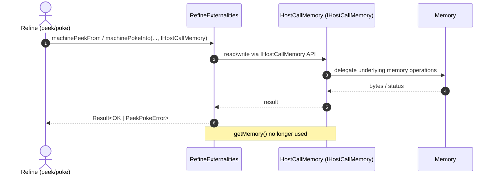

# Remove `IHostCallMemory.getMemory`

## Pull Request by @tomusdrw

The method was redundant and wrong.

## Comment by @coderabbitai[bot]

<!-- This is an auto-generated comment: summarize by coderabbit.ai -->
<!-- walkthrough_start -->

📝 Walkthrough

<!-- This is an auto-generated comment: release notes by coderabbit.ai -->

## Summary by CodeRabbit

- Refactor
  - Streamlined memory handling across host call operations by standardizing on a unified memory wrapper.
  - Updated externalities to accept the unified memory interface for peek/poke operations, reducing coupling and improving consistency.
- Tests
  - Updated tests to use the new memory wrapper and adjusted method signatures accordingly.
  - Removed an obsolete test tied to the previous memory access pattern.

No user-facing behavior changes; these updates improve internal consistency and maintainability.

<!-- end of auto-generated comment: release notes by coderabbit.ai -->
## Walkthrough
Removed HostCallMemory.getMemory() and updated externalities and refine callers/tests to use IHostCallMemory directly. Adjusted method signatures in RefineExternalities and related tests. Call sites now pass HostCallMemory instances rather than underlying Memory.

## Changes
| Cohort / File(s) | Summary |
|---|---|
| **HostCallMemory API removal** `packages/core/pvm-host-calls/host-call-memory.ts`, `packages/core/pvm-host-calls/host-call-memory.test.ts` | Removed IHostCallMemory.getMemory() and its HostCallMemory implementation; deleted corresponding test. |
| **Externalities signatures** `packages/jam/jam-host-calls/externalities/refine-externalities.ts`, `packages/jam/jam-host-calls/externalities/refine-externalities.test.ts` | Replaced Memory parameters with IHostCallMemory in machinePeekFrom and machinePokeInto; updated imports. |
| **Refine peek callers** `packages/jam/jam-host-calls/refine/peek.ts`, `packages/jam/jam-host-calls/refine/peek.test.ts` | Callers now pass HostCallMemory directly (no .getMemory()); tests wrap mocks with new HostCallMemory(...). |
| **Refine poke callers** `packages/jam/jam-host-calls/refine/poke.ts`, `packages/jam/jam-host-calls/refine/poke.test.ts` | Updated machinePokeInto call sites/data to use IHostCallMemory object instead of underlying Memory. |

## Sequence Diagram(s)

## Estimated code review effort
🎯 2 (Simple) | ⏱️ ~10 minutes

## Possibly related PRs
- FluffyLabs/typeberry#375 — Adjusts exports for HostCallMemory/IHostCallMemory; ties into this PR’s API surface change.
- FluffyLabs/typeberry#390 — Defines Fetch.execute to accept IHostCallMemory; aligns with this PR’s parameter updates.
- FluffyLabs/typeberry#369 — Modifies HostCallMemory/IHostCallMemory API; directly related to removing getMemory and updating call sites.

## Suggested reviewers
- skoszuta
- DrEverr
- mateuszsikora

## Poem
> A nibble, a peek, a poke with glee,  
> I hop through bytes, unwrapped and free.  
> No secret doors to memory’s sea—  
> IHostCall keys are all I need.  
> Thump-thump logs, and tests agree:  
> One hop closer to API harmony. 🐇✨

<!-- walkthrough_end -->

<!-- pre_merge_checks_walkthrough_start -->

## Pre-merge checks and finishing touches

❌ Failed checks (1 warning)

|     Check name     | Status     | Explanation                                                                          | Resolution                                                                     |
| :----------------: | :--------- | :----------------------------------------------------------------------------------- | :----------------------------------------------------------------------------- |
| Docstring Coverage | ⚠️ Warning | Docstring coverage is 0.00% which is insufficient. The required threshold is 80.00%. | You can run `@coderabbitai generate docstrings` to improve docstring coverage. |

✅ Passed checks (2 passed)

|     Check name    | Status   | Explanation                                                                                                                                                                                                                          |
| :---------------: | :------- | :----------------------------------------------------------------------------------------------------------------------------------------------------------------------------------------------------------------------------------- |
|    Title Check    | ✅ Passed | The title succinctly identifies the removal of the getMemory method from IHostCallMemory, which is the primary change of this pull request. It uses clear and specific wording to convey the main change without extraneous details. |
| Description Check | ✅ Passed | The description states that the method was redundant and incorrect, directly relating to the removal of getMemory in this changeset. Although brief, it provides context for why the method was deleted and remains on-topic.        |

<!-- pre_merge_checks_walkthrough_end -->

<!-- finishing_touch_checkbox_start -->

✨ Finishing touches

- [ ] <!-- {"checkboxId": "7962f53c-55bc-4827-bfbf-6a18da830691"} --> 📝 Generate docstrings

🧪 Generate unit tests (beta)

- [ ] <!-- {"checkboxId": "f47ac10b-58cc-4372-a567-0e02b2c3d479", "radioGroupId": "utg-output-choice-group-unknown_comment_id"} -->   Create PR with unit tests
- [ ] <!-- {"checkboxId": "07f1e7d6-8a8e-4e23-9900-8731c2c87f58", "radioGroupId": "utg-output-choice-group-unknown_comment_id"} -->   Post copyable unit tests in a comment
- [ ] <!-- {"checkboxId": "6ba7b810-9dad-11d1-80b4-00c04fd430c8", "radioGroupId": "utg-output-choice-group-unknown_comment_id"} -->   Commit unit tests in branch `td-host-call-mem`

<!-- finishing_touch_checkbox_end -->

---

📜 Recent review details

**Configuration used**: Path: .coderabbit.yaml

**Review profile**: CHILL

**Plan**: Pro

📥 Commits

Reviewing files that changed from the base of the PR and between b6667ce85e6f29e2da39d403cd0cf7bd37942df8 and 688456bcb0666f11a14170113e1d6441da7b2407.

📒 Files selected for processing (8)

* `packages/core/pvm-host-calls/host-call-memory.test.ts` (0 hunks)
* `packages/core/pvm-host-calls/host-call-memory.ts` (0 hunks)
* `packages/jam/jam-host-calls/externalities/refine-externalities.test.ts` (3 hunks)
* `packages/jam/jam-host-calls/externalities/refine-externalities.ts` (3 hunks)
* `packages/jam/jam-host-calls/refine/peek.test.ts` (2 hunks)
* `packages/jam/jam-host-calls/refine/peek.ts` (1 hunks)
* `packages/jam/jam-host-calls/refine/poke.test.ts` (1 hunks)
* `packages/jam/jam-host-calls/refine/poke.ts` (1 hunks)

💤 Files with no reviewable changes (2)

* packages/core/pvm-host-calls/host-call-memory.test.ts
* packages/core/pvm-host-calls/host-call-memory.ts

🧰 Additional context used

📓 Path-based instructions (1)

**/*.ts

**⚙️ CodeRabbit configuration file**

> `**/*.ts`: rules from `./CODESTYLE.md` should be adhered to.
> 
> 
> `**/*.ts`: Any function whose documentation mention it must not be used in production code,
> can be safely used in `*.test.ts` files. Other usage should be carefuly reviewed
> and the comment must explain why it's safe to use there.
> 
> 
> `**/*.ts`: `as` conversions must not be used. Suggest using `tryAs` conversion methods.
> 
> 
> `**/*.ts`: Classes with `static Codec` field must have private constructor and static `create` method.
> 
> 
> `**/*.ts`: Casting a `bigint` (or `U64`) using `Number(x)` must have an explanation comment why
> it is safe.
> 
> 
> `**/*.ts`: When making changes to code with comments containing links (in classes, constants, methods, etc.)
> to graypaper.fluffylabs.dev, ensure those links point to the current version for this update.
> 

Files:
- `packages/jam/jam-host-calls/refine/peek.ts`
- `packages/jam/jam-host-calls/refine/peek.test.ts`
- `packages/jam/jam-host-calls/externalities/refine-externalities.ts`
- `packages/jam/jam-host-calls/refine/poke.test.ts`
- `packages/jam/jam-host-calls/externalities/refine-externalities.test.ts`
- `packages/jam/jam-host-calls/refine/poke.ts`

🧬 Code graph analysis (3)

packages/jam/jam-host-calls/refine/peek.test.ts (1)
<blockquote>

packages/core/pvm-host-calls/host-call-memory.ts (1)

* `HostCallMemory` (12-38)

</blockquote>

packages/jam/jam-host-calls/externalities/refine-externalities.ts (1)
<blockquote>

packages/core/pvm-host-calls/host-call-memory.ts (1)

* `IHostCallMemory` (7-10)

</blockquote>

packages/jam/jam-host-calls/externalities/refine-externalities.test.ts (1)
<blockquote>

packages/core/pvm-host-calls/host-call-memory.ts (1)

* `IHostCallMemory` (7-10)

</blockquote>

⏰ Context from checks skipped due to timeout of 90000ms. You can increase the timeout in your CodeRabbit configuration to a maximum of 15 minutes (900000ms). (5)

* GitHub Check: run (22.x)
* GitHub Check: benchmarks (22.x)
* GitHub Check: test (22.x)
* GitHub Check: run (22.x)
* GitHub Check: e2e (22.x)

🔇 Additional comments (11)
<blockquote>

packages/jam/jam-host-calls/refine/poke.ts (1)
<blockquote>

`45-45`: **LGTM! Correctly passes IHostCallMemory directly.**

The change correctly passes the `memory` object directly to `machinePokeInto` instead of calling `getMemory()`, aligning with the interface update in `refine-externalities.ts` where the parameter type changed from `Memory` to `IHostCallMemory`.

</blockquote>

packages/jam/jam-host-calls/refine/poke.test.ts (1)
<blockquote>

`54-54`: **LGTM! Test correctly uses IHostCallMemory.**

The change correctly passes the `memory` object (which is a `HostCallMemory` instance from line 35) to `machinePokeData.set`, matching the updated test implementation signature in `refine-externalities.test.ts`.

</blockquote>

packages/jam/jam-host-calls/refine/peek.ts (1)
<blockquote>

`45-45`: **LGTM! Correctly passes IHostCallMemory directly.**

The change correctly passes the `memory` object directly to `machinePeekFrom` instead of calling `getMemory()`, aligning with the interface update in `refine-externalities.ts` where the parameter type changed from `Memory` to `IHostCallMemory`.

</blockquote>

packages/jam/jam-host-calls/refine/peek.test.ts (2)
<blockquote>

`35-35`: **LGTM! Test correctly wraps memory with HostCallMemory.**

The change correctly wraps the raw memory with `HostCallMemory` to provide an `IHostCallMemory` instance, aligning with the updated interface signatures that now expect `IHostCallMemory` instead of `Memory`.

---

`60-60`: **LGTM! Consistent memory handling in test setup.**

Returning the wrapped `memory` object maintains consistency with the earlier wrapping on line 35, ensuring the test uses `IHostCallMemory` throughout.

</blockquote>

packages/jam/jam-host-calls/externalities/refine-externalities.test.ts (3)
<blockquote>

`6-7`: **LGTM! Import changes align with interface update.**

The import changes correctly add `IHostCallMemory` from `@typeberry/pvm-host-calls` and remove the now-unused `Memory` import, while retaining `BigGas` and `Registers` from `@typeberry/pvm-interpreter`. This aligns with the interface signature changes in `refine-externalities.ts`.

---

`107-107`: **LGTM! Method signature matches interface update.**

The parameter type change from `Memory` to `IHostCallMemory` for `machinePeekFrom` correctly matches the interface signature update in `refine-externalities.ts` (line 126).

---

`123-123`: **LGTM! Method signature matches interface update.**

The parameter type change from `Memory` to `IHostCallMemory` for `machinePokeInto` correctly matches the interface signature update in `refine-externalities.ts` (line 135).

</blockquote>

packages/jam/jam-host-calls/externalities/refine-externalities.ts (3)
<blockquote>

`5-6`: **LGTM! Import changes support interface abstraction.**

The import changes correctly add `IHostCallMemory` from `@typeberry/pvm-host-calls` and remove the `Memory` import, while retaining `BigGas` and `Registers` from `@typeberry/pvm-interpreter`. This supports the improved abstraction where the interface now works with `IHostCallMemory` rather than exposing the internal `Memory` type.

---

`126-126`: **LGTM! Interface signature improves abstraction.**

The parameter type change from `Memory` to `IHostCallMemory` for the `destination` parameter in `machinePeekFrom` improves the interface abstraction by not exposing the internal `Memory` type. All call sites in `peek.ts` and tests have been updated consistently.

---

`135-135`: **LGTM! Interface signature improves abstraction.**

The parameter type change from `Memory` to `IHostCallMemory` for the `source` parameter in `machinePokeInto` improves the interface abstraction by not exposing the internal `Memory` type. All call sites in `poke.ts` and tests have been updated consistently.

</blockquote>

</blockquote>

<!-- tips_start -->

---

Comment `@coderabbitai help` to get the list of available commands and usage tips.

<!-- tips_end -->

<!-- internal state start -->

<!-- DwQgtGAEAqAWCWBnSTIEMB26CuAXA9mAOYCmGJATmriQCaQDG+Ats2bgFyQAOFk+AIwBWJBrngA3EsgEBPRvlqU0AgfFwA6NPEgQAfACgjoCEejqANiS4AlEs3xTIASQAS+RLgDCaCxYCy9vgUshqkuIEOIQYActjMApRcAOwAjACcBgCqNgAyXLC4uNyIHAD0ZUTqsNgCGkzMZQBiFtgAZm2yuSqIZbiy3CSJFCFl3Nh+ZWmZWYhJkATM2Ii0FADuBgDK+NgUDCSQAlQYDLBcuLRgsB64YAy+FmBszAbQaBThh8enXMzaGFtcNRllx8IMAXYJPASGtKKVIAZuokLPCDF4KCRqHR0JxIAAmAAMeIArGBUgSyQAWaAE5Iccn0ykALSM+mM4CgZHo+DaOAIxDIyho9AabAwuN4/GEonEUhk8iYSioqnUWh0bJMUDgqFQmD5hFI5CowoUrHYXCoa0giHifxChwVimUKs02l0YEM7NMBm4aAYAGs0KRekwMWMJMwrjc7g9etdPDG/E8giENDRPGnSgYAES5gwAYnzkAAgs4BUasfQbax3vIeYxYJhg0Y7A4pPRcLADuncIcLPgA5A2sEFl3IOFIsF5GxO4p+Fh3J4fH5J6nIJtBgx4G14Pc/LIADSj7vSXud6joRBzCgmicp2QACgAlJAMbhduQO2PsBglRZZPAGBEJAzxTigGCeJg+woMgShWMKGiQDE+D8J2lCHCQjZQiOI49sg7wHGgHQynQGhGEYhYlhYNDGvA+AQQsKFoZASgMBY7zUHRDH1iQAAe3DBCaI7jAIFi7pA7DqNCiBGMh5BGAAop48B/CaioHBiUIwhJHSCVwgS0PA8Q5nmBgQGARi+gGQbSGUoYkOGkbxrce4omUzmJo8oGprgWa5tmBZFqW5ZCti1Z2nWvKnE20ispAraONiIliQwIEkLO9B3lEj5Pvp95DhQLDHi4i7eA8q7yIBNFtH6JBkVACXtgoIzSAJv6AcBWVTs+eXZSgzDcFYYpAuI9EFUVzGlcuAT5WxaBXkegFsdghlAcVb4fvwvLMVVlAYL4aV9YBkEnHVSEofgaF8IkWF0XwI5MOKhUWEO/ZWtFQHSGRgUImZkCBBlr5BO2XAAAZdSEPX/feoPgYw7FXpAoNTeVMOQA+mD0OosGiOxtFjYB4HVbVL6E6DVmBsGdnBA53ARlGCauXG0aucm2WZqDinKap2LqUDWlWiQuk3nlhnGf5rLehTNm9EIaCNHLTks7GZR8TR+1ieItkYju5BgGre2+FJX09pmHAmQFlHBYaoVVratZbQ2MUyX9diDbVX4HBVPAcTO6H9IMyCE9Ap52LrJAKbxvYztcVbwEQ+3vhiyBrNUJU3NN3vDtdl2wCBfoIOQAAKJAkP6TSFcw6NKMpidcS+mP56cgEkEX+D+iQzjiihD6IDsewkE+iF/Vk3C0JW/UCTeyAEF8HVw24Geo31bSV5AAACAdDJQox00rjOxugv5A222JZ2vzF72Au0ULw6XoSpU+4EeQttDKkgkP+1qDeo4hrY/gkZ4oTmL6Y0BxF5LmXmBZYNlIBrAQFYSAHcSDcHngAIXjgAcXmkfegdgqieDhONKuV8b53xot9IwVEaKcXokA4qrE8a0O4ryPiT9sTCVqClCS4pjYuygADWO1p46J12AcbAY9Kxgz+M3Yupdy6V1hoTOaiNQYh08GHFukdcBKKwOTP0lNbKKzKIrBmLkVYGwoBrPhZQdYt31lHQ2mtpJplPBzSAgAkwh9lQP2fBQY1z/sw3qU5YYfVIB2FC/jTyASCenSBK4YZ/UEXORAIjgQYkgBI8ewppEFxbm3DuXcCC6PhvNZAajQ5Cy0VHEp+jrJU2MaYjyTNVaOKsUbLWvQ7F60sdYzpriMy+Vhl40B8t75+L7rsfYwSQihMbJ9CJSNJkDy4BAsqCTsqcwMEpcQPMRROn5tCQWwtcQGSMi8CWZkpYGJliY+Wdz97mL8L0XpHTpK2KqT0tpfSXG+XNhLK2ZYbZgLtjWe09YwmxT+sWWgSh6BoEgOQK0yVxJb0noJOJ6yZp9Ubhid2+x6AwODI7b2qdOyYszvlQmuA1goU0eQbRTi+FpQylmSAugm6F1bvIiuLAuABJiaNLAozfFOwWcQ6GfVZ5rMpezAw7KoAyK5QUzu3cuDLOgiK8ZYrwkSu9tKlGGypz1RcANDFWSsTwiqoVWg2B9jIBlVA+0q8iqbwGNvEYshHJmM8vhY+GJT7IHPhNMcwR44xJegAm8kAxKeCPGSvOGCiDYL9XgkgBCaLIA7twXsLqq5usGMMXe9MyFvkoJQn6xZqJCi4vQ5ijCOJCuQDxfigkOF8BRalSSnS4rJLjgndJ4jJE5KRvSiO3y3lfSVfknlii4Z1MMbLe5TTlbPNaerSdXTPkkAcRu5xJtEDDKRtOuRZdeXMAfCe1VSheL6TyeQZwtAjwCrrvRTYQIRaQCyAANkpEeDVJB33vFxD+v9MayBEE7FwUDz7omvowKsw12Kpy5UgEXSuSASDADsDaaiwAADyABpI8Jcy4qoUiMYIeg9CcwEelIRqSB1JyHdkugYMx2MvafuxAGgr0qqKfgWp0sGnLvlj6lprzuMfPDrupl/ShmeOPfe1u7dVUEEvcpruN672yM7k+60/d9hAc/TBlicHmHGZA7+o8VggJQa/dZgzUzrAUqdbIVD6GWCYew9ICYuACPEbQ/I8jlGKDUa2TslSE8+aaSOTpbOpy6DnItpLCyPobkiYVmJ5pKtum03kQMzQfyUuApCiC609twVRXmc2AwAB1KgJRireTrNKMQcC05Ie9tS2lPB2L2vNlALuPA8UEXwYgYsv4KpHmYhtKxHC2u4EAJgEyAWswURfgK0SLIBdfvJe+8pMII0DQNybaY5LSHWNX9Ybd9QEkHUc/da6UPwLZEGIFbl37SoAwJtxF2ldvZX29lQ7hCTuO1m2gK0LXvramQJCmeY4t5lAkL4bABxfRXmxLPVyRC83oD6/8T704Bz+kYvjtYjXBj0AB2BY6QJTrxoQd2McN8NaZMQLA+sa2E2Ezy2AHsJ9/jNquqnOYxUOdsArVbat+MGKz3rbjRttbHZsLbdyDtXDxLduknFOSJAua7Oiwc2L2lX56WhmLC5plzKWQy0Y0TjzfXSZbmMArxWAVBSBYKcr4UHYQpq1ChqKD+tY7HK5MnfHZ0TRQhjhHBw1uCDe72QyGIxBfzp5iU7ROwjpQqs+RCsOdXSGKm0H8YguLgQkAOZhwimNiJxMVVmqSaAddnHgdAMv542koz+VawFHq4Geq9TbNn8BECqEBI8I4d4jnmbQMSa1fSdh4zAc7p5wdjj4qIPAFf+xVFSgGoX4uxkFExgv4C7cjzIX8Mpo82xnNFxsk0NAfmjwABFzNCsf6QZ/r/cGXmvD/gvywB/H9B+zWCwBnwoB43IkrRl2YTrTHAbVl2bVYVbRvHbR4E1y7V4R7TMgNyizUmNxIAFni3NzOXFmt2uXqXtyy0dxaTyzGFU0KzNhK09zKwnl9yqyL34RcGFVGwxAexmzHHeCIHiHYB9kx0WT41Uzf2oDQA0DmF7EhXoDx2hwhhygj3vCPF8BonnmYhR1aAOE8BplUJHGh1X1QHhwYXkKBjfgxFOhG0cHgDhTJ1m23QkgnW41b2uHbyIjfnLzWlznQi1UzX4D4AHyHzaDeilyCngKbTcKQMVxQJV3QKEg11Ei11wJ1wMAfD1yfAIL2QUCUEOVNxOVFmS0uRt3SxoKXToPE1y23SYI7lYI9xLC9wrBNC4Mih4LilHlY09jQ1U08O3xbyXzzmxweDsJbl42U3427h8KJ3RmYgT0WxB2Oyz3UNzz2xfAfGYl70oH/HnjW2yTQCHnOlQi7D4D33EgenokH3wBemiN+3hwAG5xddhCpe95498J9gJG4oDIA59z9BdqUxwJc6pYDpcaEEj5cki5oUiW12F1csDMicDxA8C0tIsiiYsSC4szdP0KCrcAorlPRNQeEs8X9+RgUjczRxQLRIcKswV5A5BijnQ1BXR1QPQDByTRR1AAB9FwxAfkk3WEWgfkyCaNNkHkjkSAb9AADnlMpGJG/QEAYAEAJG/S1LaFSFSDQFSEpFSGSAJF1IAGYSBUhaBf1DTx5kgBA8RKRaR3QyTZS+TcBBTaBhTRS6B+SuRnSZSIARsSB+S2APhgzThRB/RhTJTexpSABveVSAbMJAIuGwNBfsAMOgLwFgYaNuQhWgbMLgGqFEEgA8RM7MRAXwiwWgdMknVMwsocXwOYMs9lZMxAfDKQEYFwpQDABs4s5s8swyWgGwH8N/Acd9CgDqRALwLsAMBswfNHFspMockcjAcwXAKwGcyM+cigRcwclw1cj/RABgScnNLiLcuc84Xc0s8shfDuWgZwK8NHRACchs3MJc7MBGbwWc/0HDPzRABsgAbUTPZQTPZXAqTIjIDBiDGTfPXMQQvP9GzCXIgorJGmWB3L3IgtbLYXYngzgsR0sGMLtS3BOA3Mqh7PEB3GL3cLbAOnrGYg0JZSETx0dSNRCEZ13DzlQEvknIiiLw31QHGD8CBgAEdnzNAXBexlhi82JMQ+BG5EBNxtxxJaUKA+8ydHopB5AVjCdIUfCdhew1ZjgSAdgcYgR4AUQNBkKQLwLsxk5Hid96I3zkIeC/s6BSIbLsKkyHAlA3y1h3gMAOovLsL7LRB6IdwxCMQ+ymybzvLsww0J9fBEKYK2A3yMSrAAoIKABfFCyAMC0KqC/0VKkgN8o8k8+AM8saRCkK1CyCd8ACq8rC0K3CzAZhAig4GuCqqqrAeqmixsM8McGOOcAK5ADEW1X8TAXsRuJaYIVPR7FPGUL+DEdiIAxIjSYGei3kJisEqwgPJQxCKtNvIgPOI4aENoRaXsXgZwmuBQcUNWIcEceBHSoa+jEanBOCe+eFf1ewI/eifnMEXcayvK1shy1oIVFylCaw8gDy2gYG2y1s3y0qrgbMAKqxYKkGpM1PCK+OMRGKkszGhKycpKiwFK2ClGrq08iG2y3K2ygq1CoqkqsqgcTwSctabMzsmyWquy+qjCos2Kwm1q/ClGschgVm+eJgTm0gdbAkDQAkAkAAUjgQQFOHW2OnaB3C3HYALzX3EvgHGtHGTmuGrPW3lNlvloVvhvirBqct7JRoAE0dhGA9Rdy9F151JlQOS3QaSW9aAWbB8pzYZZ5H5ConA/axaA61pJblBSArbQqkb/LAqMaEakzEqI0ya0qKb/a2aiAAKabEyABdD8r81M8qqmriN85IdIPEeUjIWgU0tAeUlUhU79fYdIWgDU2gZIBgWgI07ugkYkEgLU0079TU1IAQO0hgeUoiFQbugQBUkgeUvEZekgEe4kWgAkEKz8+aXAVM+C5GpM5IGqSkPEbuoiYkBgBu1INoX9P0Y0wkeW1Utoae00toYkce9IGqAQU0+U5IPEdIOe5IX+n+ykSkVe001+00y0v0AKbKr0KAO+EMygUgfkoq4Uv0/QIAA== -->

<!-- internal state end -->

## Comment by @github-actions[bot]

View all

| File | Benchmark | Ops |  |
|------|-----------|-----|--|
| [bytes/hex-to.ts[0]](../blob/8a5785a9dfee58266f28ce33086781290743393e//_work/typeberry-runner-2/typeberry/typeberry/benchmarks/bytes/hex-to.ts) | number toString + padding | 306181.39 ±0.52% | fastest ✅ |
| [bytes/hex-to.ts[1]](../blob/8a5785a9dfee58266f28ce33086781290743393e//_work/typeberry-runner-2/typeberry/typeberry/benchmarks/bytes/hex-to.ts) | manual | 16503.5 ±0.41% | 94.61% slower |
| [bytes/hex-from.ts[0]](../blob/8a5785a9dfee58266f28ce33086781290743393e//_work/typeberry-runner-2/typeberry/typeberry/benchmarks/bytes/hex-from.ts) | parse hex using `Number` with NaN checking | 134661.01 ±0.25% | 83.66% slower |
| [bytes/hex-from.ts[1]](../blob/8a5785a9dfee58266f28ce33086781290743393e//_work/typeberry-runner-2/typeberry/typeberry/benchmarks/bytes/hex-from.ts) | parse hex from char codes | 824239.95 ±0.83% | fastest ✅ |
| [bytes/hex-from.ts[2]](../blob/8a5785a9dfee58266f28ce33086781290743393e//_work/typeberry-runner-2/typeberry/typeberry/benchmarks/bytes/hex-from.ts) | parse hex from string nibbles | 535727.57 ±0.58% | 35% slower |
| [math/count-bits-u64.ts[0]](../blob/8a5785a9dfee58266f28ce33086781290743393e//_work/typeberry-runner-2/typeberry/typeberry/benchmarks/math/count-bits-u64.ts) | standard method | 1196302.58 ±1.21% | 89.45% slower |
| [math/count-bits-u64.ts[1]](../blob/8a5785a9dfee58266f28ce33086781290743393e//_work/typeberry-runner-2/typeberry/typeberry/benchmarks/math/count-bits-u64.ts) | magic | 11343795.3 ±3.58% | fastest ✅ |
| [math/mul_overflow.ts[0]](../blob/8a5785a9dfee58266f28ce33086781290743393e//_work/typeberry-runner-2/typeberry/typeberry/benchmarks/math/mul_overflow.ts) | multiply and bring back to u32 | 257949015.84 ±7.02% | 0.85% slower |
| [math/mul_overflow.ts[1]](../blob/8a5785a9dfee58266f28ce33086781290743393e//_work/typeberry-runner-2/typeberry/typeberry/benchmarks/math/mul_overflow.ts) | multiply and take modulus | 260169722.38 ±6.96% | fastest ✅ |
| [math/switch.ts[0]](../blob/8a5785a9dfee58266f28ce33086781290743393e//_work/typeberry-runner-2/typeberry/typeberry/benchmarks/math/switch.ts) | switch | 271551898.99 ±5.45% | fastest ✅ |
| [math/switch.ts[1]](../blob/8a5785a9dfee58266f28ce33086781290743393e//_work/typeberry-runner-2/typeberry/typeberry/benchmarks/math/switch.ts) | if | 256473650.69 ±5.98% | 5.55% slower |
| [hash/index.ts[0]](../blob/8a5785a9dfee58266f28ce33086781290743393e//_work/typeberry-runner-2/typeberry/typeberry/benchmarks/hash/index.ts) | hash with numeric representation | 189.19 ±0.73% | 25.75% slower |
| [hash/index.ts[1]](../blob/8a5785a9dfee58266f28ce33086781290743393e//_work/typeberry-runner-2/typeberry/typeberry/benchmarks/hash/index.ts) | hash with string representation | 112.45 ±2.93% | 55.87% slower |
| [hash/index.ts[2]](../blob/8a5785a9dfee58266f28ce33086781290743393e//_work/typeberry-runner-2/typeberry/typeberry/benchmarks/hash/index.ts) | hash with symbol representation | 176.48 ±0.4% | 30.74% slower |
| [hash/index.ts[3]](../blob/8a5785a9dfee58266f28ce33086781290743393e//_work/typeberry-runner-2/typeberry/typeberry/benchmarks/hash/index.ts) | hash with uint8 representation | 155.69 ±0.37% | 38.9% slower |
| [hash/index.ts[4]](../blob/8a5785a9dfee58266f28ce33086781290743393e//_work/typeberry-runner-2/typeberry/typeberry/benchmarks/hash/index.ts) | hash with packed representation | 254.81 ±0.46% | fastest ✅ |
| [hash/index.ts[5]](../blob/8a5785a9dfee58266f28ce33086781290743393e//_work/typeberry-runner-2/typeberry/typeberry/benchmarks/hash/index.ts) | hash with bigint representation | 179.31 ±0.63% | 29.63% slower |
| [hash/index.ts[6]](../blob/8a5785a9dfee58266f28ce33086781290743393e//_work/typeberry-runner-2/typeberry/typeberry/benchmarks/hash/index.ts) | hash with uint32 representation | 189.3 ±0.3% | 25.71% slower |
| [math/add_one_overflow.ts[0]](../blob/8a5785a9dfee58266f28ce33086781290743393e//_work/typeberry-runner-2/typeberry/typeberry/benchmarks/math/add_one_overflow.ts) | add and take modulus | 233002150.58 ±6.65% | fastest ✅ |
| [math/add_one_overflow.ts[1]](../blob/8a5785a9dfee58266f28ce33086781290743393e//_work/typeberry-runner-2/typeberry/typeberry/benchmarks/math/add_one_overflow.ts) | condition before calculation | 203619435.54 ±7.51% | 12.61% slower |
| [math/count-bits-u32.ts[0]](../blob/8a5785a9dfee58266f28ce33086781290743393e//_work/typeberry-runner-2/typeberry/typeberry/benchmarks/math/count-bits-u32.ts) | standard method | 67054379.19 ±1.5% | 71.06% slower |
| [math/count-bits-u32.ts[1]](../blob/8a5785a9dfee58266f28ce33086781290743393e//_work/typeberry-runner-2/typeberry/typeberry/benchmarks/math/count-bits-u32.ts) | magic | 231680065.71 ±5.71% | fastest ✅ |
| [codec/bigint.compare.ts[0]](../blob/8a5785a9dfee58266f28ce33086781290743393e//_work/typeberry-runner-2/typeberry/typeberry/benchmarks/codec/bigint.compare.ts) | compare custom | 234182164.5 ±6.74% | fastest ✅ |
| [codec/bigint.compare.ts[1]](../blob/8a5785a9dfee58266f28ce33086781290743393e//_work/typeberry-runner-2/typeberry/typeberry/benchmarks/codec/bigint.compare.ts) | compare bigint | 230459503.61 ±6.73% | 1.59% slower |
| [codec/bigint.decode.ts[0]](../blob/8a5785a9dfee58266f28ce33086781290743393e//_work/typeberry-runner-2/typeberry/typeberry/benchmarks/codec/bigint.decode.ts) | decode custom | 176455111.71 ±2.93% | fastest ✅ |
| [codec/bigint.decode.ts[1]](../blob/8a5785a9dfee58266f28ce33086781290743393e//_work/typeberry-runner-2/typeberry/typeberry/benchmarks/codec/bigint.decode.ts) | decode bigint | 92877510.93 ±3.53% | 47.36% slower |
| [collections/map-set.ts[0]](../blob/8a5785a9dfee58266f28ce33086781290743393e//_work/typeberry-runner-2/typeberry/typeberry/benchmarks/collections/map-set.ts) | 2 gets + conditional set | 95336.16 ±1.35% | fastest ✅ |
| [collections/map-set.ts[1]](../blob/8a5785a9dfee58266f28ce33086781290743393e//_work/typeberry-runner-2/typeberry/typeberry/benchmarks/collections/map-set.ts) | 1 get 1 set | 50649.63 ±2.41% | 46.87% slower |
| [logger/index.ts[0]](../blob/8a5785a9dfee58266f28ce33086781290743393e//_work/typeberry-runner-2/typeberry/typeberry/benchmarks/logger/index.ts) | console.log with string concat | 5729162.43 ±51.84% | fastest ✅ |
| [logger/index.ts[1]](../blob/8a5785a9dfee58266f28ce33086781290743393e//_work/typeberry-runner-2/typeberry/typeberry/benchmarks/logger/index.ts) | console.log with args | 1493143.38 ±61.77% | 73.94% slower |
| [codec/decoding.ts[0]](../blob/8a5785a9dfee58266f28ce33086781290743393e//_work/typeberry-runner-2/typeberry/typeberry/benchmarks/codec/decoding.ts) | manual decode | 10559119.08 ±2% | 93.89% slower |
| [codec/decoding.ts[1]](../blob/8a5785a9dfee58266f28ce33086781290743393e//_work/typeberry-runner-2/typeberry/typeberry/benchmarks/codec/decoding.ts) | int32array decode | 172677047.43 ±4.9% | fastest ✅ |
| [codec/decoding.ts[2]](../blob/8a5785a9dfee58266f28ce33086781290743393e//_work/typeberry-runner-2/typeberry/typeberry/benchmarks/codec/decoding.ts) | dataview decode | 163458621.13 ±4.77% | 5.34% slower |
| [codec/encoding.ts[0]](../blob/8a5785a9dfee58266f28ce33086781290743393e//_work/typeberry-runner-2/typeberry/typeberry/benchmarks/codec/encoding.ts) | manual encode | 1861360.94 ±2.11% | 24.45% slower |
| [codec/encoding.ts[1]](../blob/8a5785a9dfee58266f28ce33086781290743393e//_work/typeberry-runner-2/typeberry/typeberry/benchmarks/codec/encoding.ts) | int32array encode | 2463833.72 ±1.67% | fastest ✅ |
| [codec/encoding.ts[2]](../blob/8a5785a9dfee58266f28ce33086781290743393e//_work/typeberry-runner-2/typeberry/typeberry/benchmarks/codec/encoding.ts) | dataview encode | 2306072.77 ±1.51% | 6.4% slower |
| [codec/view_vs_collection.ts[0]](../blob/8a5785a9dfee58266f28ce33086781290743393e//_work/typeberry-runner-2/typeberry/typeberry/benchmarks/codec/view_vs_collection.ts) | Get first element from Decoded | 22970.48 ±1.97% | 54.83% slower |
| [codec/view_vs_collection.ts[1]](../blob/8a5785a9dfee58266f28ce33086781290743393e//_work/typeberry-runner-2/typeberry/typeberry/benchmarks/codec/view_vs_collection.ts) | Get first element from View | 50857.45 ±1.36% | fastest ✅ |
| [codec/view_vs_collection.ts[2]](../blob/8a5785a9dfee58266f28ce33086781290743393e//_work/typeberry-runner-2/typeberry/typeberry/benchmarks/codec/view_vs_collection.ts) | Get 50th element from Decoded | 22060.19 ±1.33% | 56.62% slower |
| [codec/view_vs_collection.ts[3]](../blob/8a5785a9dfee58266f28ce33086781290743393e//_work/typeberry-runner-2/typeberry/typeberry/benchmarks/codec/view_vs_collection.ts) | Get 50th element from View | 27847.76 ±1.53% | 45.24% slower |
| [codec/view_vs_collection.ts[4]](../blob/8a5785a9dfee58266f28ce33086781290743393e//_work/typeberry-runner-2/typeberry/typeberry/benchmarks/codec/view_vs_collection.ts) | Get last element from Decoded | 20589.81 ±1.9% | 59.51% slower |
| [codec/view_vs_collection.ts[5]](../blob/8a5785a9dfee58266f28ce33086781290743393e//_work/typeberry-runner-2/typeberry/typeberry/benchmarks/codec/view_vs_collection.ts) | Get last element from View | 14199.86 ±2.36% | 72.08% slower |
| [codec/view_vs_object.ts[0]](../blob/8a5785a9dfee58266f28ce33086781290743393e//_work/typeberry-runner-2/typeberry/typeberry/benchmarks/codec/view_vs_object.ts) | Get the first field from Decoded | 363109.09 ±1.89% | 10.02% slower |
| [codec/view_vs_object.ts[1]](../blob/8a5785a9dfee58266f28ce33086781290743393e//_work/typeberry-runner-2/typeberry/typeberry/benchmarks/codec/view_vs_object.ts) | Get the first field from View | 68074.55 ±2.58% | 83.13% slower |
| [codec/view_vs_object.ts[2]](../blob/8a5785a9dfee58266f28ce33086781290743393e//_work/typeberry-runner-2/typeberry/typeberry/benchmarks/codec/view_vs_object.ts) | Get the first field as view from View | 73630.57 ±1.16% | 81.75% slower |
| [codec/view_vs_object.ts[3]](../blob/8a5785a9dfee58266f28ce33086781290743393e//_work/typeberry-runner-2/typeberry/typeberry/benchmarks/codec/view_vs_object.ts) | Get two fields from Decoded | 369614.75 ±2.9% | 8.41% slower |
| [codec/view_vs_object.ts[4]](../blob/8a5785a9dfee58266f28ce33086781290743393e//_work/typeberry-runner-2/typeberry/typeberry/benchmarks/codec/view_vs_object.ts) | Get two fields from View | 66807.58 ±0.74% | 83.45% slower |
| [codec/view_vs_object.ts[5]](../blob/8a5785a9dfee58266f28ce33086781290743393e//_work/typeberry-runner-2/typeberry/typeberry/benchmarks/codec/view_vs_object.ts) | Get two fields from materialized from View | 138920.62 ±0.69% | 65.58% slower |
| [codec/view_vs_object.ts[6]](../blob/8a5785a9dfee58266f28ce33086781290743393e//_work/typeberry-runner-2/typeberry/typeberry/benchmarks/codec/view_vs_object.ts) | Get two fields as views from View | 65648.42 ±0.68% | 83.73% slower |
| [codec/view_vs_object.ts[7]](../blob/8a5785a9dfee58266f28ce33086781290743393e//_work/typeberry-runner-2/typeberry/typeberry/benchmarks/codec/view_vs_object.ts) | Get only third field from Decoded | 403562.07 ±1.1% | fastest ✅ |
| [codec/view_vs_object.ts[8]](../blob/8a5785a9dfee58266f28ce33086781290743393e//_work/typeberry-runner-2/typeberry/typeberry/benchmarks/codec/view_vs_object.ts) | Get only third field from View | 79166.47 ±1.29% | 80.38% slower |
| [codec/view_vs_object.ts[9]](../blob/8a5785a9dfee58266f28ce33086781290743393e//_work/typeberry-runner-2/typeberry/typeberry/benchmarks/codec/view_vs_object.ts) | Get only third field as view from View | 79146.34 ±1.14% | 80.39% slower |
| [bytes/compare.ts[0]](../blob/8a5785a9dfee58266f28ce33086781290743393e//_work/typeberry-runner-2/typeberry/typeberry/benchmarks/bytes/compare.ts) | Comparing Uint32 bytes | 18581.62 ±1.42% | 5.86% slower |
| [bytes/compare.ts[1]](../blob/8a5785a9dfee58266f28ce33086781290743393e//_work/typeberry-runner-2/typeberry/typeberry/benchmarks/bytes/compare.ts) | Comparing raw bytes | 19738.92 ±1.08% | fastest ✅ |
| [collections/map_vs_sorted.ts[0]](../blob/8a5785a9dfee58266f28ce33086781290743393e//_work/typeberry-runner-2/typeberry/typeberry/benchmarks/collections/map_vs_sorted.ts) | Map | 303899.16 ±0.22% | fastest ✅ |
| [collections/map_vs_sorted.ts[1]](../blob/8a5785a9dfee58266f28ce33086781290743393e//_work/typeberry-runner-2/typeberry/typeberry/benchmarks/collections/map_vs_sorted.ts) | Map-array | 99503.42 ±0.31% | 67.26% slower |
| [collections/map_vs_sorted.ts[2]](../blob/8a5785a9dfee58266f28ce33086781290743393e//_work/typeberry-runner-2/typeberry/typeberry/benchmarks/collections/map_vs_sorted.ts) | Array | 52695.38 ±7.85% | 82.66% slower |
| [collections/map_vs_sorted.ts[3]](../blob/8a5785a9dfee58266f28ce33086781290743393e//_work/typeberry-runner-2/typeberry/typeberry/benchmarks/collections/map_vs_sorted.ts) | SortedArray | 191661.2 ±0.54% | 36.93% slower |
| [hash/blake2b.ts[0]](../blob/8a5785a9dfee58266f28ce33086781290743393e//_work/typeberry-runner-2/typeberry/typeberry/benchmarks/hash/blake2b.ts) | our hasher | 1.94 ±2.16% | fastest ✅ |
| [hash/blake2b.ts[1]](../blob/8a5785a9dfee58266f28ce33086781290743393e//_work/typeberry-runner-2/typeberry/typeberry/benchmarks/hash/blake2b.ts) | blake2b js | 0.05 ±1.79% | 97.42% slower |
| [crypto/ed25519.ts[0]](../blob/8a5785a9dfee58266f28ce33086781290743393e//_work/typeberry-runner-2/typeberry/typeberry/benchmarks/crypto/ed25519.ts) | native crypto | 5.7 ±17.58% | 81.03% slower |
| [crypto/ed25519.ts[1]](../blob/8a5785a9dfee58266f28ce33086781290743393e//_work/typeberry-runner-2/typeberry/typeberry/benchmarks/crypto/ed25519.ts) | wasm lib | 10.45 ±0.44% | 65.22% slower |
| [crypto/ed25519.ts[2]](../blob/8a5785a9dfee58266f28ce33086781290743393e//_work/typeberry-runner-2/typeberry/typeberry/benchmarks/crypto/ed25519.ts) | wasm lib batch | 30.05 ±0.69% | fastest ✅ |

### Benchmarks summary: 63/63 OK ✅

<!-- thollander/actions-comment-pull-request "benchmarks" -->
