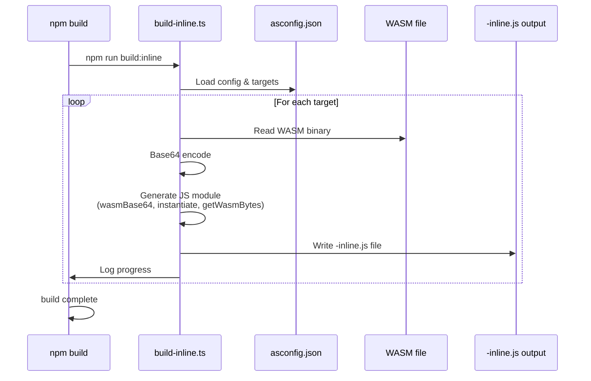

# Inline WASM exports

## Pull Request by @tomusdrw

Resolves #99 

<!-- This is an auto-generated comment: release notes by coderabbit.ai -->

## Summary by CodeRabbit

* **New Features**
  * Introduced inline WASM variants for all build targets, enabling self-contained module distribution with WebAssembly embedded directly in JavaScript without separate binary files
  * Expanded public module exports to include four new inline build variants (debug-inline, release-inline, release-mini-inline, and release-stub-inline) for enhanced portability and simplified deployment

<!-- end of auto-generated comment: release notes by coderabbit.ai -->

## Comment by @coderabbitai[bot]

<!-- This is an auto-generated comment: summarize by coderabbit.ai -->
<!-- walkthrough_start -->

## Walkthrough

A new TypeScript build script processes AssemblyScript targets from asconfig.json, reads WASM binaries, base64-encodes them, and generates ES modules with inline WASM data and instantiation helpers. Package.json integrates the script into the build pipeline and exports the generated inline modules.

## Changes

| Cohort / File(s) | Change Summary |
|---|---|
| **Build Script for Inline WASM**   `bin/build-inline.ts` | New TypeScript script that loads asconfig.json, iterates over targets, reads corresponding WASM files, base64-encodes contents, and writes inline JS files with suffix -inline.js. Each generated module exports `wasmBase64` (string), async `instantiate(imports)` function, and `getWasmBytes()` helper; includes per-target progress logging and error handling. |
| **Build Configuration**   `package.json` | Added `build:inline` script entry and integrated it into main `build` script pipeline. Expanded `exports` map to include four new inline module entry points: `./debug-inline.js`, `./release-inline.js`, `./release-mini-inline.js`, and `./release-stub-inline.js`, each mapped to corresponding build output files. |

## Sequence Diagram

## Estimated code review effort

🎯 2 (Simple) | ⏱️ ~12 minutes

- Single new utility script with focused, straightforward functionality (file I/O, base64 encoding, code generation)
- Package.json changes are configuration-only (script addition and export mapping)
- Logic is self-contained with no complex inter-dependencies visible
- Error handling appears minimal; verify per-target error messages are adequate

## Poem

> 🐰 *A rabbit's ode to bundled bits...*
> 
> Twas WASM in files, now nestled in strings,
> Base64 encoded with JavaScript wings,
> Inline we bundle, no network delays,
> A build-time magic in modular ways! ✨

<!-- walkthrough_end -->

<!-- pre_merge_checks_walkthrough_start -->

## Pre-merge checks and finishing touches

❌ Failed checks (1 warning)

|     Check name     | Status     | Explanation                                                                          | Resolution                                                                     |
| :----------------: | :--------- | :----------------------------------------------------------------------------------- | :----------------------------------------------------------------------------- |
| Docstring Coverage | ⚠️ Warning | Docstring coverage is 0.00% which is insufficient. The required threshold is 80.00%. | You can run `@coderabbitai generate docstrings` to improve docstring coverage. |

✅ Passed checks (4 passed)

|         Check name         | Status   | Explanation                                                                                                                                                                                                                                                                                                                                                                                                                                                                                                                                                          |
| :------------------------: | :------- | :------------------------------------------------------------------------------------------------------------------------------------------------------------------------------------------------------------------------------------------------------------------------------------------------------------------------------------------------------------------------------------------------------------------------------------------------------------------------------------------------------------------------------------------------------------------- |
|      Description Check     | ✅ Passed | Check skipped - CodeRabbit’s high-level summary is enabled.                                                                                                                                                                                                                                                                                                                                                                                                                                                                                                          |
|         Title Check        | ✅ Passed | The PR title "Inline WASM exports" directly reflects the main changes introduced in this changeset. The pull request adds a new build script (bin/build-inline.ts) that converts WASM files to inline JavaScript modules and expands package.json with corresponding export mappings for these inline variants. The title is concise, specific, and clearly communicates the primary purpose of the change without unnecessary noise or vagueness.                                                                                                                   |
|     Linked Issues Check    | ✅ Passed | The changes directly fulfill the requirement from issue #99 to convert WASM files to ESM modules for inline importing. The new bin/build-inline.ts script reads WASM files, base64-encodes their contents, and generates JavaScript modules that export wasmBase64, instantiate(), and getWasmBytes() functions, enabling inline WASM imports. The package.json updates add the build:inline script and new exports (debug-inline.js, release-inline.js, release-mini-inline.js, release-stub-inline.js) that expose these inline modules as part of the public API. |
| Out of Scope Changes Check | ✅ Passed | All changes in this pull request are directly related to the objective of converting WASM files to ESM modules for inline importing. The new bin/build-inline.ts script is the core implementation that performs the conversion, the build:inline script integration ensures it runs as part of the build process, and the package.json exports expose the generated inline modules to consumers. There are no unrelated modifications or tangential changes present in this changeset.                                                                              |

<!-- pre_merge_checks_walkthrough_end -->

<!-- finishing_touch_checkbox_start -->

✨ Finishing touches

- [ ] <!-- {"checkboxId": "7962f53c-55bc-4827-bfbf-6a18da830691"} --> 📝 Generate docstrings

🧪 Generate unit tests (beta)

- [ ] <!-- {"checkboxId": "f47ac10b-58cc-4372-a567-0e02b2c3d479", "radioGroupId": "utg-output-choice-group-unknown_comment_id"} -->   Create PR with unit tests
- [ ] <!-- {"checkboxId": "07f1e7d6-8a8e-4e23-9900-8731c2c87f58", "radioGroupId": "utg-output-choice-group-unknown_comment_id"} -->   Post copyable unit tests in a comment
- [ ] <!-- {"checkboxId": "6ba7b810-9dad-11d1-80b4-00c04fd430c8", "radioGroupId": "utg-output-choice-group-unknown_comment_id"} -->   Commit unit tests in branch `td-buil`

<!-- finishing_touch_checkbox_end -->

<!-- tips_start -->

---

Thanks for using [CodeRabbit](https://coderabbit.ai?utm_source=oss&utm_medium=github&utm_campaign=tomusdrw/anan-as&utm_content=103)! It's free for OSS, and your support helps us grow. If you like it, consider giving us a shout-out.

❤️ Share

- [X](https://twitter.com/intent/tweet?text=I%20just%20used%20%40coderabbitai%20for%20my%20code%20review%2C%20and%20it%27s%20fantastic%21%20It%27s%20free%20for%20OSS%20and%20offers%20a%20free%20trial%20for%20the%20proprietary%20code.%20Check%20it%20out%3A&url=https%3A//coderabbit.ai)
- [Mastodon](https://mastodon.social/share?text=I%20just%20used%20%40coderabbitai%20for%20my%20code%20review%2C%20and%20it%27s%20fantastic%21%20It%27s%20free%20for%20OSS%20and%20offers%20a%20free%20trial%20for%20the%20proprietary%20code.%20Check%20it%20out%3A%20https%3A%2F%2Fcoderabbit.ai)
- [Reddit](https://www.reddit.com/submit?title=Great%20tool%20for%20code%20review%20-%20CodeRabbit&text=I%20just%20used%20CodeRabbit%20for%20my%20code%20review%2C%20and%20it%27s%20fantastic%21%20It%27s%20free%20for%20OSS%20and%20offers%20a%20free%20trial%20for%20proprietary%20code.%20Check%20it%20out%3A%20https%3A//coderabbit.ai)
- [LinkedIn](https://www.linkedin.com/sharing/share-offsite/?url=https%3A%2F%2Fcoderabbit.ai&mini=true&title=Great%20tool%20for%20code%20review%20-%20CodeRabbit&summary=I%20just%20used%20CodeRabbit%20for%20my%20code%20review%2C%20and%20it%27s%20fantastic%21%20It%27s%20free%20for%20OSS%20and%20offers%20a%20free%20trial%20for%20proprietary%20code)

Comment `@coderabbitai help` to get the list of available commands and usage tips.

<!-- tips_end -->

<!-- internal state start -->

<!-- DwQgtGAEAqAWCWBnSTIEMB26CuAXA9mAOYCmGJATmriQCaQDG+Ats2bgFyQAOFk+AIwBWJBrngA3EsgEBPRvlqU0AgfFwA6NPEgQAfACgjoCEYDEZyAAUASpETZWaCrKPR1AGxJcAkhg/w5JAA6gCCAMoAspAkAB7c+BS4iAYAco4ClFwAjAAMAMwGAKo2ADJcsLi43IgcAPR1ROqw2AIaTMx1BMzYiLQUAO51mJhgaIh13NgeHnV5hUWIWZDdvf0DBuH42BQMJJACVBgMsFy4tGAC2PAeBtDOpLgHRydczNoYm7jUvVz43GQDABhCgkah0dCcSAAJly0IArGA8mBoQBOaDZAAsHHhuQ4+WyAC0DAARaQMCjwbjifAYLg2aT4DxSZBmVGo8yWADywlE4hZkAAZhQWJAAhgANYQpAOaRGHyIWWQNmoyCAFAJIEDaVIkiEItFBTdpCt8JAAKJRSDMRTTY2CxIofyBfbwZgJJKBIgaIz6YzgKBkej4QU4AjEMjKGj0DpsDBQ3j8XliSTGuQKJRUVTqLQ6X0mKBwVCoTChwikchUKMKVjsLhUAb2RzvFwHeRMDMqNSabS6MCGP2mAxqDB1K43C6BcUkDTJDgGABEi4MFkgoR84Yr4PoDicLeDjFgmFIKQMflwIto2D2yDQkHIDdSimnQmQ0FkAPCFKpT0QX+pkIOQJR2uDwJydcgZ2QXBDyeMdQOQSdnT1S1QV4aR2GoeBaWQYVRXGJgMENL0X1pDRIB8J4PHwNBaBvX9aSIjQSIwAAaFAaErY18B1GI0BOFYHhIXA2NBGioNgfYmAoUFEASDBaE9ZCDSNNiBHGEgADZMTAMh22NdRkAImg40QNjMHoAZKRoG8BIoR4wFk0R4ENBhHSnSAAClwiFI1IAACkQNA2EgBTQTERJ5AGZpdEQiCX0bQVDViABKMi4H2ctIwhLyYniRJZwMKABnGZgACF1K0rhEHPRSjI+RToP2NSli0kLqDQQrHWqzBxHBPzXXdZJkq4cZZGOWARQwbZEA8eQlD08SmoqzE2u+E1W2s9B5K67443gcFFqtG0vEgKLoJCEgBFCRUSGYARZo0QJur28FOseYIStK2RrL84bIFBXAdgwQ75qfegikCXAAA5QmktB5Dkay3Ak+w/0o/AiGQXgMZkrHKFsx4tvoQ95K8PGKDAb47KEmJpMSZAztgBRjiQfZKBFPg2EVNBjzIiieBkygBUa/hKSaDA0A8AmaYl4LzPsbZdn2Q0TsCatY2SU7mjVkXMs4oM8CmTQjAAbSleQpnu+BXJOI9pAAXU61ISAbFXvEAkc4LAqdIM6s08qSCECOeqFisQMrlqqmqMCIP2A6rQVsGOGk6R2nr9pofq3XyxBkt0PRrBFZhWeAYJLuupY7oevwQ4zugth2PYC780bjmSuPBohRPk6w1P3s+77pF+/PIAhuMYbh1wjE5VcPA4zDsPWkX5o8ZwF+B/gQziTugz4S2Alc9h1HgOUnZd3Kd+ZkOuDDiOWuxexo6IR0jsvE7h2A8cwFi6dkjPhtt75S7knZMtIuBPV2r1TOA0c55zVtaN+TUgJe2/uBX+KQoDOwAfHYBPcwGQH7uHL6P04FYAQbaD2n9QKoJ9n/AwZpqqui3OmfYoIJAnwAYlfKXBIh0HgI4BcS5CqDm4HxCUPNnyIDAYI+cy5LBrg3FlbcTZnDyH3LbGOp8oChFoEoegt57wHBAt7JCv5KT/nlpDEgRB9bsUdAQFYKN3hqy9jwKkJApxnBRq4sx347z4AbBQJOMhjEcB/i/GiCkU7rXGF7DgksPBmUQHE6ywkiYrGScY70UAzwXivBCAx5997WwvvlIUDolBXCIDQ50TEbzbVBF4dSNS4qmXQAzDxUtxgKGktIOSCkY5uSQhIZw+0TLlL4I0sESwwDFwwDoeWUzmnVVaGxbe5kGpOOOvsBwFBBR8X2EnDMji2bx2QO8bg2TzTxHMhCEWgCkhQVNIEBgHhsBKBCpdbA1Sf51JEh46ZJAWmSP+U0mZcz4DAr+ekpZMyVkCChfFSWtJMbwA+XEJA4hBm3zqPFB5yRvTTygLw6Cih0C6LoFVNGMQ4wtgAAZxJ/nSl+dLfHUkQMy/cdLREMHEaQOptJmV+TdlwHlfLJG0nbsSoSsAyWIHgEQCWgNQSQGwNwWgW4uAMuMcytlTw1asrRhyzekBuViIkQKjAzLABJhP4hsLy3lKGQHSjA3BmD/STkY8cYS0F0s6lYVoB9Sm6kiZS01Gg6iVO+Yi41FyAT0AcXSiNXtI1fJ+WgupzKDX4o5f6wNJT8Xkr0VqiNsKgW/JfMyuNdzTRJqobQOoZaY1ZqwHSnNfqoABqtofeORaw11qbRC5tVo0DcHjetOtKbB2BEhRW412azkdusPmntg0+20BLY2gFyzAYIrnVW0d47E3JuMVusFQL4XDoXYNXN9DGHvCrHpf6JB2HnxIFwpIPC+ECMXLI4R/Z8w0qDCGNAeAywRlsTGWs/00ANh3M2BGbYnyZi7DmXshhAMxnUAAfTRYgbDbCOF0Gw91XUvoDCAZIJiBg2R8i5AEBpNAqISB5AEFieE0IADs2Qoa5E43xTECIlCClhPkBgDA0AsdcuRzDLBi64Fw7RAjL6iO0Gw4GdDFH/QCxINhtg1NsMnFEBKfDpGnjkYAN4GEgJAecSBbClSoryugWoaxxisPgaqdB5xcH2R4JYLFrO2cQLK6YtBHP4F5bYHzQpJYBaC3ZxAXIdSUgpRgGLfn4s2fnApWgNgk4kki+EJ+iAgQSV5TF882ASCBey7l/LGB3C4C8GV4zlWgk1YS/Vgr5JzEp1axV3zcXOvZfFFKWgCpZSIGKxQGL84AA6GBFvzdwCttbq2NvADG8RmU1W9DLY2+t9bFhLAqi4FqDAOonhhEtG7J55pLTkLJhMoZQQYEehjhoZbS3Du/ZWyuJrXhvsXau0pHyz2HEWmiE9u0DpwnvaxV6A7R3fvADqNttTu2SB6HnLV2zq9qoDYlAyBwc9EAxZNkFmzVmbO09s0Z3lqQgokDm2SPVvdNTlYlLjqntP5zdUBuTs4HW8d0/nNvVeSre5zaJ/YCUVJx1QC1EoGwnZ1CAEwCZACAiCwDAF4KQUt4OqJQMgMgKgvC0A0Dzun2WEEs64POYqFB5kx2tzb+ciQFWBElkTpnbA5tOrRtL3nABfUXkAafu4ZxKP39vbOA/2ETt3YuBe9Ha9V8P2WJcjBTnN9K1g7DiGa/seb84/DuRu9EHNpeQrwDCs1+QoJBReDEIdZxWANHHnsXkvY9AdYIEMiTY8Qk0ooymDMZ9ABHar1Ui02UMT46lfkP4oN+UNRx1BmZXeQJX8HxoHHhI8mgEZn4+uv1tPU+g6z5JY3Nfy5iWtzpSRkv0xSha42ehwg6RqSxXv7BGZSD1IgKPvsEXqrIZLSAwKzGxI5FAS5GZNtK8mCBQLNOrEnNbAdCcgLEwi2FMBQAkL/vuCLJ3vsIzNsE8EnOQNeIFC2FNKzKLJACMkQNVuQIqFbpnrZjJEyHgNLg7snnznbnNk7i7kQPwdlmFAxAqjsHHpliNu7p7uLD7lzrHnNmASzqHuHpHmLtHioQ7qUIEONuRIqDPpzm1hwfzt8ILunnIWLtnlLrSHnijCQcgKFHyKgYnB4CrFLCLKCNPnXrdOwEKEXCbkqCqOtARKDrvndutFDufs9vaHwPDtnB9l6DACjAvsgsYlCprHqs+mJGDndqpMtDpMcE+ItHXszMZMkAgfQHrJgUfiftSjDuJJvoWrfOVPfGxBAunH1MlDUQQkJB9EQoPIgMPN3KAsDGshLFbIMuErvgjsAWkfsGKhag/mqhqptJElgYymgqjGfvLIYjmv5FGumj7C+KCoCjGhcc0kOnOtcXCrujGnnNBK0XlL/j/i6Lsc0e0jwM4E8EQWPiuquFYD4OwbzuIYyG8rnnweYYIQ7sIZ6GIZwaIJIcwaCBlsNuYQod7h4L7sznNhjpNjPhXNIOHOwLInTmHrzloXzjofiQ7lyHgCap+P8InkPsaEnuYankLisCLuCbZnYevHNqEBPs4S/NBKgOPlLL4TPk8M4PsK4WIKgY0swg4iLIICIMmFICahEZQIjgUUaPdrEd8QkX/igMkYjiAXeOfCvlkWvsgLkagMQYkC6G6F4BrOvBvk8ACHsokMwIdLqRQPKrSGxCLDse5I6XGNYpWBzmQLsvpE8EEhvN0qIrqACU1MYgLJFqSf0SLCsfflIlgEcYAu8SjHUVWOEt8Q4sHI4JQIselCqvKf4qqhgCqVWAgs5BgSnMgN/nbC9FLGKWhEsHGOKQPgeHbEsJoEifOFwVCbwbZtOXCbZgia7uYRIYRFIeiUNv5jYXztiRLLicofSbZuQVyIKCyQCGVhOSSYqBrBSbTlSXTjSdlnSf7g7oVgwNVJSIMlqDqBItOdyRiTueYYKdCbZh+V+bVNxMoKQCbpALkBoLkLkAAKSnQID8RFjAzYCJTWwnxxhWkyn+EJoTTSCyqgRwW8aIUoVgk27IlSJzkOEO4ACa2wjAJYSZpqAAAnpChuoD2OWQqZFpBTHMagfm6CKNqbQEJU/AoH+fyouU+EIc4CIdOfuUocZrobZlJZ+SVveTZiHkFvbHjvOATrgLYGzkHoxbZrkLxtkLQJiCoKiGgBpBqtCIKPkLQIKLQKiBpPCJxiQP5RpPxrQJxvkHRqiPCJJu5ZiKiFiNkPCAwHRgILkDRKiN5fkNCM5dCPkPCBpG7iZeMGZTYAnnNgxtkNCLQPkCQPkIKLFfkJxgIAwIKCQCQLxgwJxhpFpIKBpFDFxolX5dxvkKiOJtkAIJiO5VDAwN5TFQIGiNkIKAIENfkGgLCCzsZdpcJUQL+TBSQGeJQAecVuCDFhZgZQZVphADpnppQKQIZlzvhhpvoEAA= -->

<!-- internal state end -->
