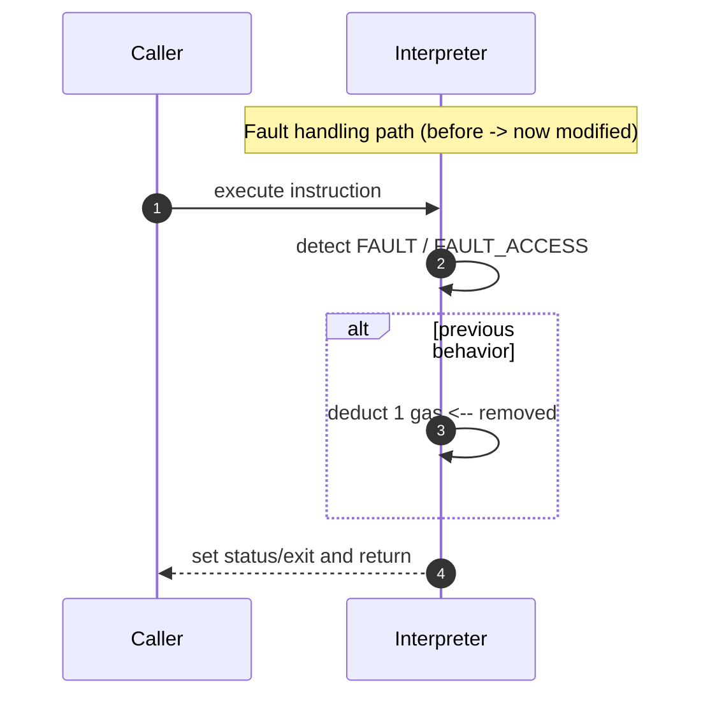
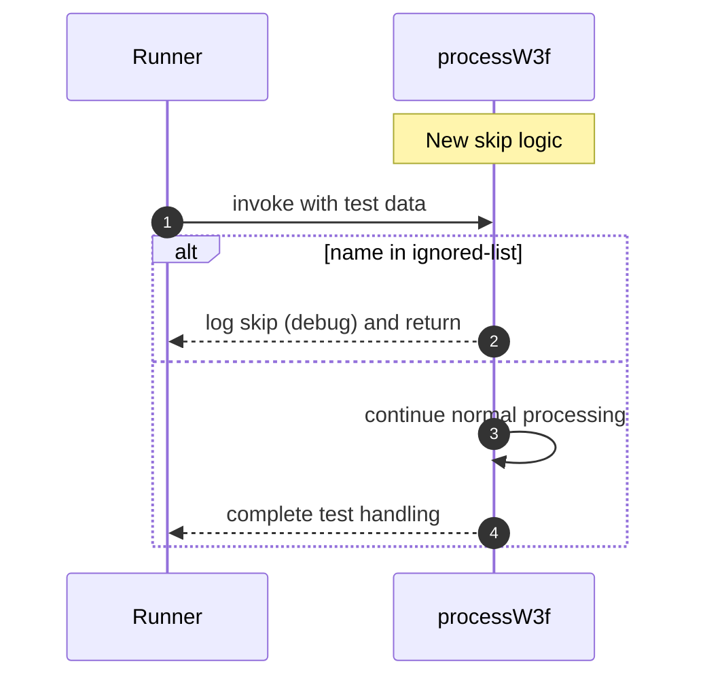

# Remove unnecessary gas charging in case of faults.

## Pull Request by @tomusdrw

Matching: https://github.com/FluffyLabs/typeberry/pull/597

Becasue of that change some of the test vectors are failing, but this is expected. We have them ignored in typeberry as well.

<!-- This is an auto-generated comment: release notes by coderabbit.ai -->
## Summary by CodeRabbit

* **Bug Fixes**
  * Adjusted gas deduction for fault scenarios so gas is no longer consumed before returning in those paths.

* **Tests**
  * Added support to skip specified tests at runtime with a debug message when a test is ignored.
<!-- end of auto-generated comment: release notes by coderabbit.ai -->

## Comment by @coderabbitai[bot]

<!-- This is an auto-generated comment: summarize by coderabbit.ai -->
<!-- walkthrough_start -->

## Walkthrough

Removed a single-gas deduction from two interpreter fault branches and added a skip-for-ignored-tests shortcut to the W3F test processor that logs and returns early for specified test names.

## Changes

| Cohort / File(s) | Summary |
|---|---|
| **Interpreter fault gas fix**   `assembly/interpreter.ts` | Removed a one-gas deduction from the branches handling `Outcome.Result == FAULT` and `Outcome.Result == FAULT_ACCESS`; these branches now return without consuming gas while preserving status/exit behavior. |
| **W3F test skip list**   `bin/test-w3f.ts` | Added an ignored-list of test names and early-return logic in `processW3f` that logs a skip (debug) and skips processing when a test name is in the ignored list. |

## Sequence Diagram(s)

## Estimated code review effort

🎯 2 (Simple) | ⏱️ ~10 minutes

- Inspect `assembly/interpreter.ts` for gas-accounting invariants and callers that may assume the previous decrement.
- Verify `bin/test-w3f.ts` ignored-list scope, ensure test names are exact matches and logging level is appropriate.

## Possibly related PRs

- tomusdrw/anan-as#93 — Modifies `bin/test-w3f.ts` and `processW3f` behaviour; likely related due to overlapping changes to test processing.

## Poem

> 🐇 I hopped through bytecode, soft and spry,  
> Took one small charge from error's sigh,  
> Skipped a test with a curious twitch,  
> Quiet fixes, lighter stitch. ✨

<!-- walkthrough_end -->

<!-- pre_merge_checks_walkthrough_start -->

## Pre-merge checks and finishing touches

❌ Failed checks (1 warning)

|     Check name     | Status     | Explanation                                                                          | Resolution                                                                     |
| :----------------: | :--------- | :----------------------------------------------------------------------------------- | :----------------------------------------------------------------------------- |
| Docstring Coverage | ⚠️ Warning | Docstring coverage is 0.00% which is insufficient. The required threshold is 80.00%. | You can run `@coderabbitai generate docstrings` to improve docstring coverage. |

✅ Passed checks (2 passed)

|     Check name    | Status   | Explanation                                                                                                                                                                                                                                                                                                                                                                                                                                                                                                                                                                                                                                                             |
| :---------------: | :------- | :---------------------------------------------------------------------------------------------------------------------------------------------------------------------------------------------------------------------------------------------------------------------------------------------------------------------------------------------------------------------------------------------------------------------------------------------------------------------------------------------------------------------------------------------------------------------------------------------------------------------------------------------------------------------- |
| Description Check | ✅ Passed | Check skipped - CodeRabbit’s high-level summary is enabled.                                                                                                                                                                                                                                                                                                                                                                                                                                                                                                                                                                                                             |
|    Title Check    | ✅ Passed | The pull request title "Remove unnecessary gas charging in case of faults" directly and accurately describes the main functional change in `assembly/interpreter.ts`, where single-gas deductions are removed from two fault paths. The title is clear, concise, and specific enough for a teammate to understand the primary purpose of the changeset. The secondary change in `bin/test-w3f.ts` (adding test skipping logic) is a supporting modification to handle expected test failures resulting from the main change, which aligns with the PR description noting that test vectors are intentionally ignored as they are in the reference typeberry repository. |

<!-- pre_merge_checks_walkthrough_end -->

<!-- finishing_touch_checkbox_start -->

✨ Finishing touches

- [ ] <!-- {"checkboxId": "7962f53c-55bc-4827-bfbf-6a18da830691"} --> 📝 Generate docstrings

🧪 Generate unit tests (beta)

- [ ] <!-- {"checkboxId": "f47ac10b-58cc-4372-a567-0e02b2c3d479", "radioGroupId": "utg-output-choice-group-unknown_comment_id"} -->   Create PR with unit tests
- [ ] <!-- {"checkboxId": "07f1e7d6-8a8e-4e23-9900-8731c2c87f58", "radioGroupId": "utg-output-choice-group-unknown_comment_id"} -->   Post copyable unit tests in a comment
- [ ] <!-- {"checkboxId": "6ba7b810-9dad-11d1-80b4-00c04fd430c8", "radioGroupId": "utg-output-choice-group-unknown_comment_id"} -->   Commit unit tests in branch `td-extragas`

<!-- finishing_touch_checkbox_end -->

<!-- tips_start -->

---

Thanks for using [CodeRabbit](https://coderabbit.ai?utm_source=oss&utm_medium=github&utm_campaign=tomusdrw/anan-as&utm_content=104)! It's free for OSS, and your support helps us grow. If you like it, consider giving us a shout-out.

❤️ Share

- [X](https://twitter.com/intent/tweet?text=I%20just%20used%20%40coderabbitai%20for%20my%20code%20review%2C%20and%20it%27s%20fantastic%21%20It%27s%20free%20for%20OSS%20and%20offers%20a%20free%20trial%20for%20the%20proprietary%20code.%20Check%20it%20out%3A&url=https%3A//coderabbit.ai)
- [Mastodon](https://mastodon.social/share?text=I%20just%20used%20%40coderabbitai%20for%20my%20code%20review%2C%20and%20it%27s%20fantastic%21%20It%27s%20free%20for%20OSS%20and%20offers%20a%20free%20trial%20for%20the%20proprietary%20code.%20Check%20it%20out%3A%20https%3A%2F%2Fcoderabbit.ai)
- [Reddit](https://www.reddit.com/submit?title=Great%20tool%20for%20code%20review%20-%20CodeRabbit&text=I%20just%20used%20CodeRabbit%20for%20my%20code%20review%2C%20and%20it%27s%20fantastic%21%20It%27s%20free%20for%20OSS%20and%20offers%20a%20free%20trial%20for%20proprietary%20code.%20Check%20it%20out%3A%20https%3A//coderabbit.ai)
- [LinkedIn](https://www.linkedin.com/sharing/share-offsite/?url=https%3A%2F%2Fcoderabbit.ai&mini=true&title=Great%20tool%20for%20code%20review%20-%20CodeRabbit&summary=I%20just%20used%20CodeRabbit%20for%20my%20code%20review%2C%20and%20it%27s%20fantastic%21%20It%27s%20free%20for%20OSS%20and%20offers%20a%20free%20trial%20for%20proprietary%20code)

Comment `@coderabbitai help` to get the list of available commands and usage tips.

<!-- tips_end -->

<!-- internal state start -->

<!-- DwQgtGAEAqAWCWBnSTIEMB26CuAXA9mAOYCmGJATmriQCaQDG+Ats2bgFyQAOFk+AIwBWJBrngA3EsgEBPRvlqU0AgfFwA6NPEgQAfACgjoCEYDEZyAAUASpETZWaCrKPR1AGxJcbJZvilIbAxyBmlEZ3kiNGQGWGcieAwiFCwGGJJ+ADNILLRsD1xEDUhIAwA5RwFKLgBGAAYAFlKDAFUbABkuWFxcbkQOAHpBxNxYbAENJmZBgmZsRFoKAHdBzEwwGMHuAo9Bhuay1sQayDmFpeWWgGV8bAowyAEqDDiuXFowEgAPXCpo5CAJMIYAkSLgni83pBmNosGVrrhqAsuPhuGQWgBhCgkah0dCcSAAJnqhIArGAGmBCQBOaC1RocUm1Rm1ABaRgAItIGBR4NxxPgMFwALLUOLSSA9PoDYajcaTaaDABiHmwWSysg6KkQs1kaOqFBc212g1J1IA7CUAEKifInbJneLguKYUj2FiZfA5MaZGiIcFSMT4CjIZyZPLwDxJIgAbkdqFQPzRYjxmHoY3w9sDBBD6GxKCIGGDeKSZz1JANLnQyGWJA8Hg05ksrW4tFx9EEIjEkglDicLjcnm8kF8/kCwVC4UikABjHiFESyVSjAyDryBSKJTKlWYBrqTRa7S6kt6/SGI3U8qmLFmLAuKzWGA2Wx29f2B6OJwo7zvixWNzuB5MmeTAoQ+L5fn+GIWmgUFwRA15YC4GFS3hRFcGRfg0ThAxfAkeASFrEMuDKLVqg8AZMWxdt8S4YkyQpeoqVpekWRZVkWnKfA/RFMVYAlFU1Q1MidVwctK3kWxIDNc040QD0zmkANRBzZAIw8atICTFTUwwegwwLItsXoUsxP1SgXEbAx9GMcAoDIDscnyAhiDIZQaHoaY2AwAleH4YQVJ7GR5CYJQqFUdQtB0GyTCgOAE1DLBnMIUhyCoDyFFYdguCoK4+xhKs5AUMKVDUTRtF0MBDFs0wDBiE5dw8WRBiSGgKF4MFKA0IoOAMAAiAaDAsSAAEEAElXLSmj8unL051daQjCgUcAlTexoy8YhoKUWhsG7QVl1wZZ8FyfJCh4ahYEo5Z+KwAB5PBphIDRfAcc6SAAR2wNAKMgJURtaDpoHQPTIBu9EHtwJ6XukDctK+n7kH+wHoAAfRGjEMQAUWua4SjgTJsX9B0fUlNMoyXAAKf0kWQbBW1xRL6B+dQMUUYCSHifDgwASkgbEUIwOnEIW2gSjZnyKHwDSsg8fArm4S61ODU64fiPSKZSIsrloE6i2dQU+0yWdeHgFWCH5sF7gwaMrKbUbCncs2hbOE7SaUBgPGcahneQOak2DDKVZ2AQowYLSfPUAjECWyAuPm5IJQtgOKA841Q/gcP2HUeQPa99LfcgJQaBTMX7dFG2siUv7I0yEanyagAvSgjCx/14BhDLQsJkh8MIrT1UDkU6HgRx+sG6zarUDBZiUsBlgAZiybqBnHvqhsscbJvcvEZqrOaXUTmPrNG2gdvQBQhcRHzDOLego2Jua/XBJ82CZi/EAAaz5CFQNgZdeD4DCIgRAAB1JeXB4A5DbIiDQr9MgJiwPAQsd8AA0WlmDqAvkoAQ2AUhyxSGmS2GEKBYBxBQJq6Cv58m4NGRSxMfiiDwM7KycV+L2G/twSABDM4oD9hgJq6BuyBHBlgGBaA4FoDYNCPiEpMARz+PIUy7DkFGVTIaNAsg4zcX4isJAHMuZmz4ALWEwtD6kDLkYDeDs2o+0Nq7R0mQ87ewFC7f23xuCBzxMHCYYcFFR0WifSm8dzFJxOinNOIc/HZzEutQsSIiYaB5q3dunc8Td0tn3K4JBB6p2HrQUezA15LSqjVeyoM5rJW3uldJLBvIElyvYRwBV5BFW7uFMqUVKqGFiplTBuBUbwFoIgVG2Isl0FRjTVO3SymQEaAveoAA2NAdBFkkFWWgak9QGDmjQEyekAgGBNAABwCGOZshgjRFnXJxCQBeMzemklJMcheC8BB7NqGgBeXysikhIFs6k1JFkMFqNSUkuySCLNoI0ektAGBZHOVkRZDy7KQHqLUAQTysi7IEIspo1JjmNByTs0kuLaiEheRWM05zjnkqyAwRZhJagzIML0ry6hBnDNGb3AitZaCowciiiAPBsSozYAuEgqNxQME/iMqZ4IbIGAAN4GFKH1JAtgrRyxlXQNmWUfJWEzB5PqXA8gURIKg1VkA+qIFgHcDwtAtVAM/rYE1p1zWWrVUgO6UhDRDKUBgN1ZqTieutQU2gNhggciAQiXkyREAYn4jKt1fxsAWqtX1cNkaMDuFwF4RNohP4pooGm0NmahnZq5IgHkfJXEFuTaaxG6a1UU0/nQMaIC02IFjW6gaZavb+nrZ/V6G5EBuoANpWtKCq0os7rXSs/uUKRJBe1VprfyZ2kAh19VDXOm16EFjFtLVO2dfUkxeyfK43tQ6OE0LxFANmSgbClXUIATAJkAICILAMAXgpAaT3ko5AZAVBeDFjuk9ar/BKF7csZwNtkjgbnWq4MyCkg/SHUutgvalDVt5BuwU6850AF9d2QBnUhvqC7MMrq4H1XNXgt1JqLaRtVNMMJjveCW5tFHz3rCvbRgmPBdiWy+tXcQebMgAB0+orXHCEUQU4qyzhdAuOhpZ0j2jmuuQoiBpNF3gNiMQgiiFoAYAwe4uJBE4ZrdUZApNBa5GCPtBuCc3SlgAAb1T8KHZqrVKAdTaivdz6Dwb5kQBtEgW1kA7T2q40M+YBarXoFkKWzAzjHVVudRWYxigwHYeJhjqBPbkPQUwV4+j0FEMQMmKBvCyB3C/bkFWaBFJSLSQ44IYUaag1JqbFpQn2qZk9N6dhoSTiaDy5kE4ZW2xVlCcudz09Z7+nnkvILkBKZoDPnQ5+t7uC0KXDwhgfNUAtYcPtwOdCoO1fSK4hx6taAMe0qXeh4J1L3AlETDcdCUssEcTI9T6tSAhYQHEdAUZCw1kvP9qS1m8N3f1jtp0r3IDZmDPFhBPls6Ch+oI1Rd9NI+nkAZZRPcq7YleL6cSFl5DYk8eFnMsgNCIYo0TaWzCCO0ZZ3uqDNHrWwdIdGbnp7DOCiyMgj7Qam0setShxc6GmPUd7QVldJ6SMnvI3uqjy7V1AP9HGlIbNfVoFIML1jB6OPupDRB61vHL3O11wwfXdCmDG7c8geoGh6j1AAKRg1B//RBDh1SZwIj5fG7DsRfQM3iMYRM7UOr4ZAY5nvvc++ZzLvqbPVT8etQATTuCuLAJasDuYAALtJfYiHQqUd5Fz138aMiB3MOI7oAwIusneN6XK75QpAM8276rzmDcGheZ7l2hjwGGde0c787+NhHZ1EatQAXX7TEXAtg13w4d7R+Z6LzQLwtOaWg5oGDHOpOqCs5ozQMAXoSPIWRaACDBcC059QVlMjPgIWghJzRZGpHv1JDQEJH+T2QEDyEv1+RZz6gHU3xsHoz5z6lqEfwYEJEWSeQXmOSyDJEWVpWeXqHNFqFoFJEuSeUWSrgXlJHpWpFoCyEIJUBxGwIwMZWAIECZXYLoL+VxUWRgLn27yICNz7xIDGix1IR+gRFxDdU12tSW2flW2XiKGkMHwIERA8CVCczizdVqEzyyE0N9lAUvGjS7wN0t3qDVytWX2X1ZVRQ6jFUoFIClSYxGUFX0CAA== -->

<!-- internal state end -->
