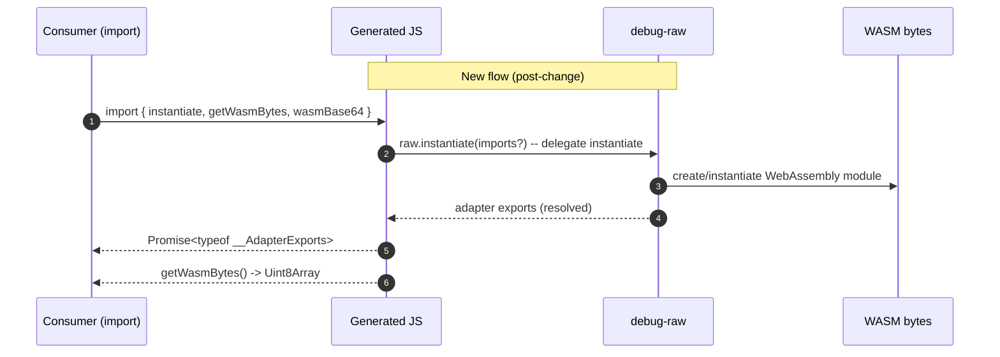

# Add types to inline wasm files.

## Pull Request by @tomusdrw


<!-- This is an auto-generated comment: release notes by coderabbit.ai -->
## Summary by CodeRabbit

* **New Features**
  * Added TypeScript declarations for inline WASM builds, exposing wasmBase64, instantiate(imports?) and getWasmBytes().
  * Inline JS outputs now reference a shared raw module for WASM integration and include matching .d.ts files.

* **Chores**
  * Bumped package version to 1.1.1.
  * Standardized package export entries for inline WASM modules (removed explicit .js suffixes).
<!-- end of auto-generated comment: release notes by coderabbit.ai -->


## Comment by @coderabbitai[bot]

<!-- This is an auto-generated comment: summarize by coderabbit.ai -->
<!-- walkthrough_start -->

## Walkthrough

The build script now emits `.d.ts` files alongside generated JS for inline WASM, imports `./debug-raw.js` and delegates instantiation to `raw.instantiate`; `package.json` version bumped to 1.1.1 and exports entries for inline builds were added without `.js` suffixes.

## Changes

| Cohort / File(s) | Summary |
|---|---|
| **Build script / generated outputs** <br> `bin/build-inline.ts`, `./build/*.js`, `./build/*.d.ts` | `bin/build-inline.ts` now generates JS that imports `./debug-raw.js`, replaces direct `WebAssembly.instantiate` calls with `raw.instantiate`, preserves `wasmBase64` and `getWasmBytes()` exports, and emits corresponding `.d.ts` files declaring `wasmBase64: string`, `instantiate(imports?: { env?: any }): Promise<typeof __AdapterExports>`, `getWasmBytes(): Uint8Array`, and `import { __AdapterExports } from "./debug-raw"`. |
| **Package metadata** <br> `package.json` | Bumps `version` from `1.1.0` to `1.1.1` and updates `exports` to add entries `./debug-inline`, `./release-inline`, `./release-mini-inline`, `./release-stub-inline` (pointing to `./build/*.js` and `./build/*.d.ts`), removing the old `.js`-suffixed export keys. |

## Sequence Diagram(s)



## Estimated code review effort

🎯 2 (Simple) | ⏱️ ~10 minutes

- Verify `.d.ts` correctness and that `__AdapterExports` name matches `debug-raw` export.
- Confirm `raw.instantiate` call shape and runtime behavior.
- Validate `package.json` export entries and mapping to `./build/*.d.ts`/`.js`.

## Possibly related PRs

- tomusdrw/anan-as#103 — Touches `bin/build-inline.ts` and the inline-WASM export surface; likely the most closely related change.

## Poem

> 🐰  
> I nibbled bytes and stitched a line,  
> Imported raw and made instantiate mine.  
> Types declared neat, the bytes in tow,  
> Hop—compile—export—ready to go!

<!-- walkthrough_end -->


<!-- pre_merge_checks_walkthrough_start -->

## Pre-merge checks and finishing touches
<details>
<summary>❌ Failed checks (1 warning)</summary>

|     Check name     | Status     | Explanation                                                                          | Resolution                                                                     |
| :----------------: | :--------- | :----------------------------------------------------------------------------------- | :----------------------------------------------------------------------------- |
| Docstring Coverage | ⚠️ Warning | Docstring coverage is 0.00% which is insufficient. The required threshold is 80.00%. | You can run `@coderabbitai generate docstrings` to improve docstring coverage. |

</details>
<details>
<summary>✅ Passed checks (2 passed)</summary>

|     Check name    | Status   | Explanation                                                                                                                                                                                                                                                                                                                                                                                                                                                                                                     |
| :---------------: | :------- | :-------------------------------------------------------------------------------------------------------------------------------------------------------------------------------------------------------------------------------------------------------------------------------------------------------------------------------------------------------------------------------------------------------------------------------------------------------------------------------------------------------------- |
| Description Check | ✅ Passed | Check skipped - CodeRabbit’s high-level summary is enabled.                                                                                                                                                                                                                                                                                                                                                                                                                                                     |
|    Title Check    | ✅ Passed | The PR title "Add types to inline wasm files" directly corresponds to the main changes in the changeset. The modifications to `bin/build-inline.ts` introduce generation of `.d.ts` type definition files alongside the JavaScript output, and the changes to `package.json` update the exports mapping to include `types` entries pointing to these new TypeScript declarations. The title is concise, specific, and accurately captures the primary objective of the pull request without unnecessary detail. |

</details>

<!-- pre_merge_checks_walkthrough_end -->

<!-- finishing_touch_checkbox_start -->

<details>
<summary>✨ Finishing touches</summary>

<details>
<summary>🧪 Generate unit tests (beta)</summary>

- [ ] <!-- {"checkboxId": "f47ac10b-58cc-4372-a567-0e02b2c3d479", "radioGroupId": "utg-output-choice-group-unknown_comment_id"} -->   Create PR with unit tests
- [ ] <!-- {"checkboxId": "07f1e7d6-8a8e-4e23-9900-8731c2c87f58", "radioGroupId": "utg-output-choice-group-unknown_comment_id"} -->   Post copyable unit tests in a comment
- [ ] <!-- {"checkboxId": "6ba7b810-9dad-11d1-80b4-00c04fd430c8", "radioGroupId": "utg-output-choice-group-unknown_comment_id"} -->   Commit unit tests in branch `td-inline`

</details>

</details>

<!-- finishing_touch_checkbox_end -->


---

<details>
<summary>📜 Recent review details</summary>

**Configuration used**: CodeRabbit UI

**Review profile**: CHILL

**Plan**: Pro

<details>
<summary>📥 Commits</summary>

Reviewing files that changed from the base of the PR and between 13a5d3e1389058250f2d33a04010f83ef2cdbea7 and f89308e4ccccbc902302b4df849da0a5b7f5df20.

</details>

<details>
<summary>📒 Files selected for processing (1)</summary>

* `package.json` (2 hunks)

</details>

<details>
<summary>🔇 Additional comments (2)</summary><blockquote>

<details>
<summary>package.json (2)</summary><blockquote>

`4-4`: **Version bump is appropriate.**

The version bump from 1.1.0 to 1.1.1 correctly reflects a patch-level change (addition of type declarations for inline builds).

---

`81-96`: **✅ Exports correctly configured with generated TypeScript declarations.**

The four inline exports now properly include both `import` and `types` fields, enabling TypeScript resolution. Verification confirms that `build-inline.ts` generates corresponding `.d.ts` files for all four variants (`debug`, `release`, `release-mini`, `release-stub`) defined in `asconfig.json`, matching the exports added in `package.json` lines 81–96.

</blockquote></details>

</blockquote></details>

</details>

<!-- tips_start -->

---

Thanks for using [CodeRabbit](https://coderabbit.ai?utm_source=oss&utm_medium=github&utm_campaign=tomusdrw/anan-as&utm_content=106)! It's free for OSS, and your support helps us grow. If you like it, consider giving us a shout-out.

<details>
<summary>❤️ Share</summary>

- [X](https://twitter.com/intent/tweet?text=I%20just%20used%20%40coderabbitai%20for%20my%20code%20review%2C%20and%20it%27s%20fantastic%21%20It%27s%20free%20for%20OSS%20and%20offers%20a%20free%20trial%20for%20the%20proprietary%20code.%20Check%20it%20out%3A&url=https%3A//coderabbit.ai)
- [Mastodon](https://mastodon.social/share?text=I%20just%20used%20%40coderabbitai%20for%20my%20code%20review%2C%20and%20it%27s%20fantastic%21%20It%27s%20free%20for%20OSS%20and%20offers%20a%20free%20trial%20for%20the%20proprietary%20code.%20Check%20it%20out%3A%20https%3A%2F%2Fcoderabbit.ai)
- [Reddit](https://www.reddit.com/submit?title=Great%20tool%20for%20code%20review%20-%20CodeRabbit&text=I%20just%20used%20CodeRabbit%20for%20my%20code%20review%2C%20and%20it%27s%20fantastic%21%20It%27s%20free%20for%20OSS%20and%20offers%20a%20free%20trial%20for%20proprietary%20code.%20Check%20it%20out%3A%20https%3A//coderabbit.ai)
- [LinkedIn](https://www.linkedin.com/sharing/share-offsite/?url=https%3A%2F%2Fcoderabbit.ai&mini=true&title=Great%20tool%20for%20code%20review%20-%20CodeRabbit&summary=I%20just%20used%20CodeRabbit%20for%20my%20code%20review%2C%20and%20it%27s%20fantastic%21%20It%27s%20free%20for%20OSS%20and%20offers%20a%20free%20trial%20for%20proprietary%20code)

</details>

<sub>Comment `@coderabbitai help` to get the list of available commands and usage tips.</sub>

<!-- tips_end -->

<!-- internal state start -->


<!-- DwQgtGAEAqAWCWBnSTIEMB26CuAXA9mAOYCmGJATmriQCaQDG+Ats2bgFyQAOFk+AIwBWJBrngA3EsgEBPRvlqU0AgfFwA6NPEgQAfACgjoCEejqANiS4BBWvVyzu0yARQYL8cpADuaRMyQAGbwVogaBgBy2MwClFwAjAAMAGwGAKoASgAyXLC4uNyIHAD0JUTqsNgCGkzMJQTM2Ii0FD4lmJhg/iXc2BYWJclp6YjxrizNrT4GAMr42BQMJJACVBgMsFy4tGBenuQG0GgUpLir65tczNoYc7jUzVz4zneZJBLwJD6UxZAG2RUJAsfwMAGEKCRqHR0JxIAAmJLwgCsYGSYAAzEloAkEhwMQAWDgEpIALSM+mM4CgZHo+CCOAIxDIyho9DqbAwcN4/GEonEUhk8iYSioqnUWh0lJMUDgqFQmEZhFI5CobIUrHYXCoPkgiBiNwo8jkClFKjUmm0ujAhippgMagwJQE2FCu32XhIGlwxQMACIAwYAMRByA2ACSzNV0Po+tYJ3k9MYsEwpEQFMg4a5FEU2GWyHgzG4+Ao5yTOuCOcCAHINCUlC6iGAdRohIhq+5XLAVirWTCAFKzfh4PqaAxQd7cCxofOQWjwSFiSAAdRIAhsiDGsQssg0XkQDy58GhjDQA18lUgLf3h/EJ68XZWN8wd5oAAoAJSQbsWZwUCJQHYtDIL2arwPgWBJmgkDkLqGi0N6yAhFY6AWBBRCIPASiQFCmyQIOw6FHgHAGJAuiQJO06zrg3aQK2yA+Je0FMBQkKIMWGDzhgRB0QhPoKFytxeDxfQCJ4DCuE4KxKAw05gRB4SkeRAAiohyS4fgBAAQv4JApAS6DINBB4UMJERkVAqmyScLjPke0JvoWxalogAD8XAAN44RgEjuegGDyAAvh+XAAApVkgJDAI4zhJgA+nFdhoNwNAUAAogAHs5Pp6OZKlqTZIEkLgy7+MwWmyDQiCflw6ReLgAAcNisWgu5KYB9gFkWJbnB5CVJSllCZdliCBZWLCQH6dYNtgTY6n6F40Q+NErPBiEAZAADSJAkEUOEZUg4jcZAZyldplXSJ+/n0Jp5W6fp+0jZ2K34UOCxEbgAA0i2wI+epoGwqz3QZiALEsKyMZCDj4H9sG8et46QAAsrcDz7pAbAPLQ1DMSwnL8cttFrfxQQlq4JxnNdepg8sERGMGoY2BYqXUOBGDIG4L0yXJrMKfwDIkFlPUwmTonid54jiNIGaRN8PDVOL3MnLz7MnSyaowoTq18cgLFsRxXE8ZztEEe9o4kRZj09QJB6+GVOljPpXAmcJADc7VW6WwTYBs4gQe4B4vse75OT1bmed5vlcJgQUhZA4UsJF0VSfFiXY4N6VCy5eju5bgvZd7vts2rJX2xd1Vx3VXJNS1sju1Asu6mL8ASaHXv6hQQQzk+2a5ss9Ba/DPoW+Rbe9f16epcNYdjUEVaTdNa6zc2aA+H67sM8jmDwEE0jnAAYqEKw2BgZ6yAAXpQ/qBuO9rcDOADWaCkPREEkQGfqbxGUZ9rGBoJvzZMqZpaIwAGq/GLi6IsXA/RSAoJhCCC054TQSBoVBSQJiQFQdgja08XIY2StwYS0d7Awjhs3CS+drbsFMi4Ka9Yl5Ng9OQP0316GQisLpPYHhPSsIXiUDhUIxhgGYF4eA3CDgkD4Zgeg7DgRCJIGAA81QJG8JwjOX6xZ6rCUwStBcV5pDODEJIFY9CXRuhKBoKxC1+xoAkGgWYDBTIpSptAKSjjnHnBitJEgIQMDqDZopKAeD+I3G4EQ7i2oSDMHwFIdkJZ9YQUNvwCw9AKGe3ODQr4yB6EzSYTw8g9E+FyM4cI5hXo2zFLrIIrhoj/GqMKZU76Mj+E1OEcogQDSKmIAWm+F69ElHYCCCEDKMIH4kFkIgD831GI0UfPoh4pxirIAwDDNC3FKA8DYuwDaAB5FafAqH4MhDcT09AfabGAfQN8XoiAaDYYvRsGhbpVIEfI3SzyyqvLaYoup8BPkBFeXklea8HkCNXnw4qDANAfjpkYEMYZmaskCbo2iSt5KqyTEc9UosFYtwlgEkBUAE5/kcJAbA3BsZsi4AAAzgQgjANLOw0vvgwJ+L82wQSZcgwINKcFJCZW4PlaC0E0twVnUJhCdEUqpZrLALLH7P26VykewTszyDQKQ2gtLHnL3KUy2Zv0aVjxpTq50rpUkMMbF0+iNLvo0u8YgU1kAxXmoscC8pxMnUezSuq9AWqzU/K6Qay8xruqlmda68xlqg2erbHal1jrI11mjbQN5pTFGep1jSn1frNVKG1S66p7zhF/ODT9F1JqzWpvTQokRYibXxvtUm6tFq01BrLVmxCObLa+twEaf1BbA0lsUR08thrK3htwMmt1MaR1KNwCouNTrm1SSda2ixQax1dp9D28ifaB0nNiXQM1HqCndKZYAJMJyZLPOEeuJub+3yHvSeottauHLqvTeymL7aCPsPdE49hbXUdobZ+yA17Fk/sAw+3tfrf3DozQupd57bUQe/cVAxMSH2bxRv43ettD4oRPmfS+FBr6f1vraGU3k6QMjQHgZU6sYwanxtqVeep/4DpNCKZQ4pLRShtAYGjHJ1BxSwogOKkJPjfDoHFQOXtKTCepJADEGIBAYjQPCBIKQUgkAag1AAnLQAA7AZhgDAgjIhSIZhgyJDMkHhCZwzDVfFJDQIZzzBJDPWkMDRhImnkS0AxCQALRmkjIgaiiJIQR4TBc00kEkyQggNRC7FhgtA4hoBM755TEBghGaxK5gkFmLMCAYIZpEWJ4QCAJLQFL3nsbueRAIEzVn6uIly3lqAoncDieAlJj4Xwfi0DirSXLNHeAkDimwJZcVNiiAfpJhT5wlMeSUn6JAoVMhaTQmyugYI8bsFCvgA8dA/RcC7iCEgn0NuIFgAsVJu38Bsu2xd4IZ4xi3bIptxAuy4GmVIRgd7V2vsbfnLQTIPtlIvdmP24SiAwTdjZe9/t2Abvg6wlDjA5hcBWCR4t1HFB0ffcmhD7HqlEBOPgClNmBOUeXc+xjn7Bxxm0HDJudHiA4cUHewGUnfppwHnpw/d4+pmY9K4AAbSUmRdbZEFeTQW2yyIAMpEwMp9T2n/sResNlwrv0gdF2S9cMT5nivJr52nKfP2wOYEi71A/Gnzh6BQEO0oTI5p1CAEwCZACAiCwDAFYKQFhOPxgHagMgKgrAIT1xbyaMSlB878BQfx3E48W79CWeAFRT4WBF6rtgfOlBU88WzT+ivAqk7l/rn7yuH6F/V5NXHKFdfV4N0b5oROSe18t1la3Ks+dwBWNt1wlgVgAB0/RAUks4DmMNyl2wCMEI+iAp9zgXPyHcChWKGKSfPv6pysCXI2QWLAL0T9pmKhoGAtFE87xbirA/NLHSzvdKh3d7h+19x7Mx23gCxVs1Z8fE/EAl/ZkIXAzx0JMJsIXpbF7EPEacywRw8BmlOI/pL8XAhVWV2VlVGVyVKUTwXpsVkAwkIkjYF8NgLBsBsIHU10mUskXAtEjxjpjZpAVg4Y3FnBECXF0Un8b9h8x88cnxdYIIGBIpvp2JRAH8GA0D6AZwGBFhoRt8GBkpF02I/peBCwAFBARBjEpBAEXo+hzxIQABHLnc4Q1d6clDAcgfMRAABJQNGCwDQDPRXP0NifAag23PnNwg3RPJvP0FPNPIgPwn7RcCCEIIgRYJvUHc3dw7PXPM8AvNXPnSWKwCvBXKvfXeXTPevRvPnGHBgF2Y6Q7OBJVMIyaTvE3OI9vH7K3ToHwjXF7EoniJgco0gFAZAJIDQJIJIAAUl8AQDwnlHZiGRCHEJ2VvxWDMNdChi7DYge1SS6MgAah6L6P6NcLqMmk8O8PLxgQAE0FhTwsBid5UAABXjMUC0K0UCE8WgFo+HbiJ1TBJyHMAwh44op4to49KgF+Sov0AI5PE4EIgExIrwZI5HBvVImBT41onpfXQKJSAAXQFyF1wG2xb0CM0zQAagYAECcwSAYBSASDxPhDQGRAq3JKSFoBiyUFSw0wJASBMxSGRFxDQBpISGxhSCixMzsxJCSAEHcxSFoAJGcxSCCAJAzz9DhO+LKOUFICzFSjzzh2hHew8iRKRO6y2Wm1m1IHmyhMk3G30CAA= -->

<!-- internal state end -->


## Comment by @coderabbitai[bot]

_⚠️ Potential issue_ | _🟠 Major_

**Hard-coded import path may cause type mismatches across targets.**

The import path is hard-coded to `"./debug-raw"` for all generated `.d.ts` files, regardless of which target is being built. This means `release-inline.d.ts`, `release-mini-inline.d.ts`, and `release-stub-inline.d.ts` will all import types from `debug-raw` rather than their corresponding raw builds.


Consider making the import path dynamic based on the target name:

```diff
-import {__AdapterExports} from "./debug-raw";
+import {__AdapterExports} from "./${wasmFileName}-raw";
```

Alternatively, if all targets intentionally share the same type definitions from `debug-raw`, add a comment explaining this decision.


> Committable suggestion skipped: line range outside the PR's diff.

<details>
<summary>🤖 Prompt for AI Agents</summary>

```
In bin/build-inline.ts around line 72, the import path is hard-coded to
"./debug-raw" which causes all generated .d.ts files to reference debug-raw
regardless of build target; update the generation logic to compute the import
path from the current target (e.g., derive a filename like `./debug-${target}`
or use a target→rawName map) and inject that dynamic path into the emitted .d.ts
content so each release-inline, release-mini-inline, and release-stub-inline
imports the correct raw build; if instead the intent is to share debug-raw
across all targets, add a clear code comment on line 72 explaining the
deliberate choice.
```

</details>

<!-- This is an auto-generated comment by CodeRabbit -->


## Comment by @coderabbitai[bot]

_⚠️ Potential issue_ | _🟠 Major_

**Return type doesn't match actual WebAssembly.instantiate result.**

The declared return type is `Promise<typeof __AdapterExports>`, but `WebAssembly.instantiate()` actually returns `Promise<WebAssemblyInstantiatedSource>` which has the shape `{ instance: WebAssembly.Instance, module: WebAssembly.Module }`. The exports are accessed via `result.instance.exports`, not directly on the result.


Update the return type to match the actual WebAssembly API:

```diff
-export function instantiate(imports?: any): Promise<typeof __AdapterExports>;
+export function instantiate(imports?: any): Promise<WebAssemblyInstantiatedSource>;
```

Or if you want to expose the exports type, document that users need to access `result.instance.exports`.

<!-- suggestion_start -->

<details>
<summary>📝 Committable suggestion</summary>

> ‼️ **IMPORTANT**
> Carefully review the code before committing. Ensure that it accurately replaces the highlighted code, contains no missing lines, and has no issues with indentation. Thoroughly test & benchmark the code to ensure it meets the requirements.

```suggestion
export function instantiate(imports?: any): Promise<WebAssemblyInstantiatedSource>;
```

</details>

<!-- suggestion_end -->

<details>
<summary>🤖 Prompt for AI Agents</summary>

```
In bin/build-inline.ts around line 76, the function currently declares return
type Promise<typeof __AdapterExports> but WebAssembly.instantiate() returns
Promise<WebAssemblyInstantiatedSource> (shape { instance, module }) and exports
live at result.instance.exports; update the function signature to return
Promise<WebAssemblyInstantiatedSource> to match the WebAssembly API, or
alternatively change the implementation to return result.instance.exports and
keep the signature but ensure the body extracts and returns instance.exports;
also update any callers or typings to reflect which of the two choices you make.
```

</details>

<!-- This is an auto-generated comment by CodeRabbit -->


## Comment by @coderabbitai[bot]

_⚠️ Potential issue_ | _🔴 Critical_

**Missing `types` field in inline exports breaks TypeScript resolution.**

The inline exports use string values pointing only to `.js` files, but TypeScript needs the `types` field to find the generated `.d.ts` files. This is inconsistent with other exports (lines 57-80) and will prevent TypeScript from discovering the type declarations that `build-inline.ts` now generates.


Update the inline exports to use object notation with both `import` and `types` fields:

```diff
-		"./debug-inline": "./build/debug-inline.js",
+		"./debug-inline": {
+			"import": "./build/debug-inline.js",
+			"types": "./build/debug-inline.d.ts"
+		},
 		"./release.wasm": "./build/release.wasm",
-		"./release-inline": "./build/release-inline.js",
+		"./release-inline": {
+			"import": "./build/release-inline.js",
+			"types": "./build/release-inline.d.ts"
+		},
 		"./release-mini.wasm": "./build/release-mini.wasm",
-		"./release-mini-inline": "./build/release-mini-inline.js",
+		"./release-mini-inline": {
+			"import": "./build/release-mini-inline.js",
+			"types": "./build/release-mini-inline.d.ts"
+		},
 		"./release-stub.wasm": "./build/release-stub.wasm",
-		"./release-stub-inline": "./build/release-stub-inline.js"
+		"./release-stub-inline": {
+			"import": "./build/release-stub-inline.js",
+			"types": "./build/release-stub-inline.d.ts"
+		}
```

<!-- suggestion_start -->

<details>
<summary>📝 Committable suggestion</summary>

> ‼️ **IMPORTANT**
> Carefully review the code before committing. Ensure that it accurately replaces the highlighted code, contains no missing lines, and has no issues with indentation. Thoroughly test & benchmark the code to ensure it meets the requirements.

```suggestion
		"./debug-inline": {
			"import": "./build/debug-inline.js",
			"types": "./build/debug-inline.d.ts"
		},
		"./release.wasm": "./build/release.wasm",
		"./release-inline": {
			"import": "./build/release-inline.js",
			"types": "./build/release-inline.d.ts"
		},
		"./release-mini.wasm": "./build/release-mini.wasm",
		"./release-mini-inline": {
			"import": "./build/release-mini-inline.js",
			"types": "./build/release-mini-inline.d.ts"
		},
		"./release-stub.wasm": "./build/release-stub.wasm",
		"./release-stub-inline": {
			"import": "./build/release-stub-inline.js",
			"types": "./build/release-stub-inline.d.ts"
		}
```

</details>

<!-- suggestion_end -->

<details>
<summary>🤖 Prompt for AI Agents</summary>

```
package.json around lines 82 to 88: the inline exports currently point only to
.js files which prevents TypeScript from resolving the generated .d.ts files;
change each inline export to the object form that includes both "import"
(pointing to the .js path) and "types" (pointing to the corresponding .d.ts
path) so TypeScript can find declarations, matching the pattern used for other
exports in lines 57–80.
```

</details>

<!-- This is an auto-generated comment by CodeRabbit -->

✅ Addressed in commit f89308e
