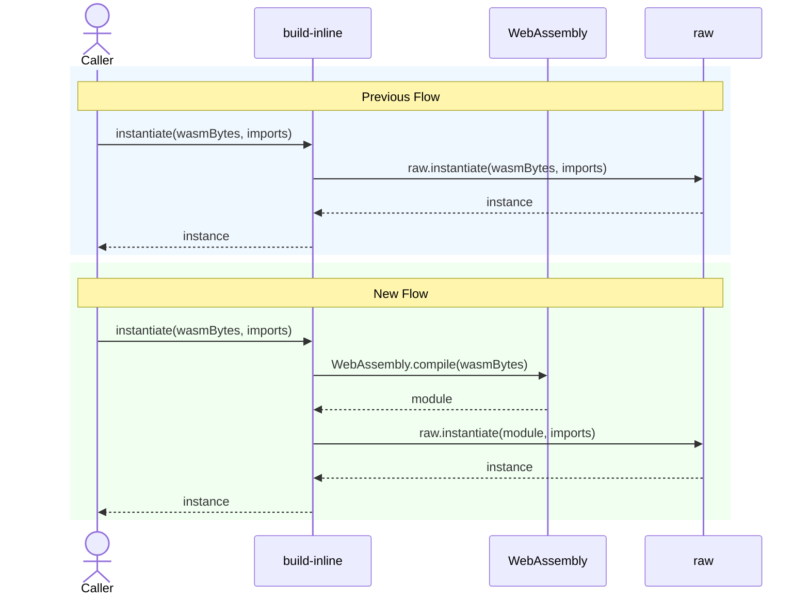

# Compile the module

## Pull Request by @tomusdrw

<!-- This is an auto-generated comment: release notes by coderabbit.ai -->

## Summary by CodeRabbit

* **Chores**
  * Optimized WebAssembly module instantiation process to include explicit compilation step before instantiation, maintaining full backward compatibility with no changes to existing functionality.

<!-- end of auto-generated comment: release notes by coderabbit.ai -->

## Comment by @coderabbitai[bot]

<!-- This is an auto-generated comment: summarize by coderabbit.ai -->
<!-- walkthrough_start -->

## Walkthrough

The instantiate function in bin/build-inline.ts now explicitly compiles WASM bytes to a WebAssembly.Module before instantiating, adding a compilation step between byte retrieval and instantiation.

## Changes

| Cohort / File(s) | Summary |
|---|---|
| **WASM Instantiation Enhancement**   `bin/build-inline.ts` | Modified instantiate function to compile WASM bytes to WebAssembly.Module via WebAssembly.compile() before calling raw.instantiate() |

## Sequence Diagram

## Estimated code review effort

🎯 2 (Simple) | ⏱️ ~8 minutes

- **Single file modification**: Changes isolated to one function in bin/build-inline.ts
- **Straightforward refactoring**: Control flow addition is linear and predictable
- **Error handling consideration**: Verify that exceptions from WebAssembly.compile() are properly propagated

## Possibly related PRs

- tomusdrw/anan-as#106: Modifies the same instantiate helper in bin/build-inline.ts, transitioning from raw.instantiate to an intermediate compilation approach.

## Poem

> 🐰 A bunny hops through WASM bytes so fine,
> Compiles them first in structured design,
> Before instantiation's grand ballet,
> The module prances in every way,
> One step at a time makes the magic play! ✨

<!-- walkthrough_end -->

<!-- pre_merge_checks_walkthrough_start -->

## Pre-merge checks and finishing touches

❌ Failed checks (1 warning)

|     Check name     | Status     | Explanation                                                                          | Resolution                                                                     |
| :----------------: | :--------- | :----------------------------------------------------------------------------------- | :----------------------------------------------------------------------------- |
| Docstring Coverage | ⚠️ Warning | Docstring coverage is 0.00% which is insufficient. The required threshold is 80.00%. | You can run `@coderabbitai generate docstrings` to improve docstring coverage. |

✅ Passed checks (2 passed)

|     Check name    | Status   | Explanation                                                                                                                                                                                                                                                                                                                                                                                                                                                                                                                                                                                   |
| :---------------: | :------- | :-------------------------------------------------------------------------------------------------------------------------------------------------------------------------------------------------------------------------------------------------------------------------------------------------------------------------------------------------------------------------------------------------------------------------------------------------------------------------------------------------------------------------------------------------------------------------------------------- |
| Description Check | ✅ Passed | Check skipped - CodeRabbit’s high-level summary is enabled.                                                                                                                                                                                                                                                                                                                                                                                                                                                                                                                                   |
|    Title Check    | ✅ Passed | The pull request title "Compile the module" accurately describes the primary change in the changeset. The code modification explicitly adds a compilation step by calling WebAssembly.compile(wasmBytes) before instantiation, which is precisely what the title conveys. The title is concise, clear, and specific enough that a teammate reviewing the commit history would understand that this PR introduces an explicit module compilation phase into the instantiation process. There is no vagueness, no irrelevant noise, and the title is directly related to the main modification. |

<!-- pre_merge_checks_walkthrough_end -->

<!-- finishing_touch_checkbox_start -->

✨ Finishing touches

- [ ] <!-- {"checkboxId": "7962f53c-55bc-4827-bfbf-6a18da830691"} --> 📝 Generate docstrings

🧪 Generate unit tests (beta)

- [ ] <!-- {"checkboxId": "f47ac10b-58cc-4372-a567-0e02b2c3d479", "radioGroupId": "utg-output-choice-group-unknown_comment_id"} -->   Create PR with unit tests
- [ ] <!-- {"checkboxId": "07f1e7d6-8a8e-4e23-9900-8731c2c87f58", "radioGroupId": "utg-output-choice-group-unknown_comment_id"} -->   Post copyable unit tests in a comment
- [ ] <!-- {"checkboxId": "6ba7b810-9dad-11d1-80b4-00c04fd430c8", "radioGroupId": "utg-output-choice-group-unknown_comment_id"} -->   Commit unit tests in branch `td-fixinline3`

<!-- finishing_touch_checkbox_end -->

---

📜 Recent review details

**Configuration used**: CodeRabbit UI

**Review profile**: CHILL

**Plan**: Pro

📥 Commits

Reviewing files that changed from the base of the PR and between fbc6aca542ad845cac1d8cf6f86163f1809e13d1 and 058ff0dafa2c5e40956a5700d31b4480fec90dc4.

📒 Files selected for processing (1)

* `bin/build-inline.ts` (1 hunks)

🔇 Additional comments (1)
<blockquote>

bin/build-inline.ts (1)
<blockquote>

`56-57`: **Verified: `raw.instantiate` correctly accepts a `WebAssembly.Module` parameter.**

The README documents the Raw Bindings API with exactly this pattern: "const ananAs = await instantiate(module);" where the module is created via WebAssembly.instantiateStreaming. The change properly separates WebAssembly compilation from instantiation, enabling better error handling and aligning with documented API usage.

</blockquote>

</blockquote>

<!-- tips_start -->

---

Thanks for using [CodeRabbit](https://coderabbit.ai?utm_source=oss&utm_medium=github&utm_campaign=tomusdrw/anan-as&utm_content=109)! It's free for OSS, and your support helps us grow. If you like it, consider giving us a shout-out.

❤️ Share

- [X](https://twitter.com/intent/tweet?text=I%20just%20used%20%40coderabbitai%20for%20my%20code%20review%2C%20and%20it%27s%20fantastic%21%20It%27s%20free%20for%20OSS%20and%20offers%20a%20free%20trial%20for%20the%20proprietary%20code.%20Check%20it%20out%3A&url=https%3A//coderabbit.ai)
- [Mastodon](https://mastodon.social/share?text=I%20just%20used%20%40coderabbitai%20for%20my%20code%20review%2C%20and%20it%27s%20fantastic%21%20It%27s%20free%20for%20OSS%20and%20offers%20a%20free%20trial%20for%20the%20proprietary%20code.%20Check%20it%20out%3A%20https%3A%2F%2Fcoderabbit.ai)
- [Reddit](https://www.reddit.com/submit?title=Great%20tool%20for%20code%20review%20-%20CodeRabbit&text=I%20just%20used%20CodeRabbit%20for%20my%20code%20review%2C%20and%20it%27s%20fantastic%21%20It%27s%20free%20for%20OSS%20and%20offers%20a%20free%20trial%20for%20proprietary%20code.%20Check%20it%20out%3A%20https%3A//coderabbit.ai)
- [LinkedIn](https://www.linkedin.com/sharing/share-offsite/?url=https%3A%2F%2Fcoderabbit.ai&mini=true&title=Great%20tool%20for%20code%20review%20-%20CodeRabbit&summary=I%20just%20used%20CodeRabbit%20for%20my%20code%20review%2C%20and%20it%27s%20fantastic%21%20It%27s%20free%20for%20OSS%20and%20offers%20a%20free%20trial%20for%20proprietary%20code)

Comment `@coderabbitai help` to get the list of available commands and usage tips.

<!-- tips_end -->

<!-- internal state start -->

<!-- DwQgtGAEAqAWCWBnSTIEMB26CuAXA9mAOYCmGJATmriQCaQDG+Ats2bgFyQAOFk+AIwBWJBrngA3EsgEBPRvlqU0AgfFwA6NPEgQAfACgjoCEejqANiS4BhFt3hXIuWCUjNF2KwYBy2ZgKUXACMAAwAnAYAqgBKADJcsLi43IgcAPTpROqw2AIaTMzpBMzYiLQUAO7pmJhgaIjp3F4W6WGRUYhBzixlFZUGAMr42BQMbgJUGAywXLi0YABm8AAe8BgW6yQAzAbQaBSkuJCTmDNczNoYQ7jUZVz43GQGMSQS8CSVlGmQBnEqJAsPwMNgoJGodHQnEgACZQjCAKxgMJgbahaDBAAsHARADYOMFggAtIz6YzgKBkej4RY4AjEMjKGj0QpsDDQ3j8YSicRSGTyJhKKiqdRaHRkkxQOCoVCYOmEUjkKjMhSsdhcKiVSCIfyXCjyOQKIUqNSabS6MCGcmmAxqDDpATYRwLdabcgaXBpAwAIl9BgAxP7IABBACSDKVEPoOtYB3kNMYsEwpEQZlcKAwiFu7PgEMgi2w03E+CwGHwWsKDisyBcbgA6sHBgBZE6yGg1/DoSB1kgCYOILoBCyyDRNzxOQKLfBgjNZzDiajrIgAGlnNDQ1NptHgYLEw7X89z4gwRHzFBYznTmtb7Y0kEGTwY8GWDDQFmHq/UjDBEOQaHc45uO8/49n2A4kEOI6Vo4JAABSVA0zAAEJttIACU6AYPQtZYK+77IJqGjrHOOYQrBHi0F4JCfsw3DTp6aGrmC3AWGgT4npebi8G88AjARaCVERmbZguNDwYhKHtjRdEUAxd7SsgMzJtInEKOy54WPmFjlj0GYMBY2BKJhkAkCsLHwE+xzQaxxZYFmJDcJh9CXPIaCLIsPImRQ558EmWFuqemDYfAzBLqulQ5JAZaJspum1iZZn0ZCBZFrxdnwEQGB3GCGhGEYgYhhYNDKmlHaqUo+kHIuJbIAmpkySq048HkmwMCZObiNIpKQD4nZKSeKkEAlDV0E0LUWfmhZiGl2oZVluCjCp6wnOsDpOhYLobFsHqpgYACiWYhVGRpuGC7yfCZ7n0VwTZ0PA/g+n6BhkgYkrtZu8oRkykKsuqkDXjGeoGgKijKCKZripar0UqqoW4AA+vAtCIPDZ0fF8tDw3OskWlab2hAiAAc7mhLQbloDCDAIiQmIRHiaAIgA7KEpPbMEAiYpihOhB5DDhKTDCYrj1pQKy6iI8jqM8Z8dDw1Swtvdx8NsIcJDwzMogANYo9jxwvQA3gYkCQN6SAAAoxEh2kMJrdB2Gq7Jm/g9m0N6XCLG+XTLkbJuILAIwbVb+A2xbbv5p71E+6biAAPJSN5SNKBgYce0CkfG96260DEhYACLB4MuAUEuiA2K4Nth0X2DpybWc5xg5i4FYZda5XFDV97Gd13n0gMMX3C2S3FfuxHncm26tu0KGA7V4ghcUGHvpj96rFZkPmuvDqRWIGHADaPvG4bxvHybGs2z4aBsIvue9/3tmQOv3pjyf3pzgtO9zO3Ncv/VrHzWli917ak1vAbgTx6BQDsEoGIJp1CAEwCZACAiCwDAFYKQmlAZxhQMgMgKgrC0A0E/A+x9vQURIIvBCFAMBLiISfDO04MrrDfOvC+V8uCZ1vqA2y3piEAF9n6QCPnQ70Z9NasPIewxuThH4CIzm/MobcO7EIzr/Wo3DJHpmaO+f6JAACOs9jjiCbm4AAOt6e2VY3DxQolRMx6AGAMFGBCfcShEB93gIEGsmji5AxigNDMql+ophIJoGA6ZBRuAos+Cy1UsC/wspYVytBkZdmsrE7UNBHKGjwgFbsvZ+yDgEMOAo9gYLiUQMhVCiAMKTmnG4YiIkjxpXCggGY2CeC7iQICeQlQkyGPTEYpwTAMBSFkIgeSAzLD1MUiWJ8XtGBWAOKuIK2pHzRLamQEYyDLzUC7OuWMNAdHnQihxeKYtjgICzNOHpAd6CFiFCRbCfTLyoAthmIunhxh/jiWZVqX4bFDNKTZGa3AkxdHeZ2eKDTDzpN4MHaQ4ywmUGmVFTsEg0BEGruQAcq5oo7jBGg+cqKunLKwqpQZKLty7ibvIAlx0hrWKuABbcL5YmENkSbMEiB8AGXUSbWhwiyEUIONQk8AqX67hLMsTFYIU6j2USbBh2QsoWBYZfCRJsKU8JPvw4hQiX6iPEdfYOWZi4cTsPHDF5COWv1uO/OVacbWqP/iWY1DBTVLgUJa0g7TQgaBZgAUkgL0iysB2nEWwO5BJ7AJmnT0U6METyuX+w2u07m/rQgBvZQq70XKeV4AAewgAmiMRgcp25YAAAYAAEInClNOaRU31IC0BNUXEulbdIhThVIFtbazWniYN6kg2a6EmyFewyhoqiDipIUqphqry5iPVYvVt7r20nh3nwn2ABdZeq9cAWykRq702xxjBEWDCXEmJwjBDQNzRm2xtgwh2ITdmhMETuRICQPEAh2YImCCQcItAYSMw8rQa9OwHFoHBLiXE4QSDBFoAiZDmJ2YCszv2pcFrlCkFDOySgKrC4QjDvrXhBhyPQwgB0tWKtSDqyXSjeW+ggA= -->

<!-- internal state end -->
