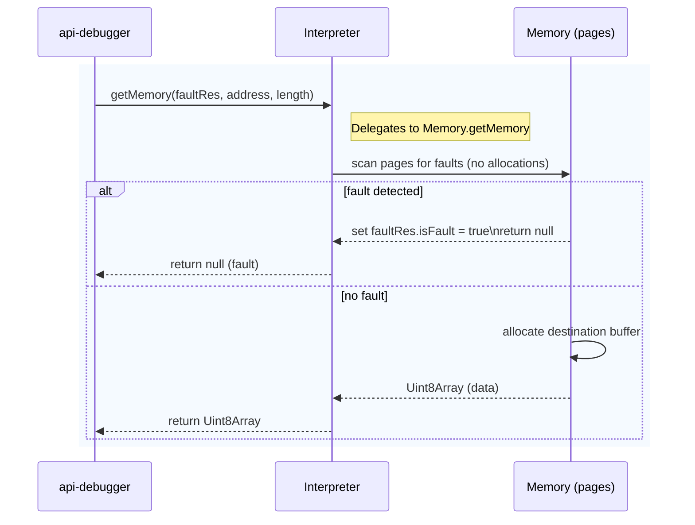

# Fix getting memory from ananas

## Pull Request by @tomusdrw

Current implementation was always attempting to allocate the destination vector (which could simply be impossible).

This PR patches the behavior by first checking if all pages are accessbile, yet the ultimate solution should be to get rid of this API in favour of a more performant one.

<!-- This is an auto-generated comment: release notes by coderabbit.ai -->
## Summary by CodeRabbit

* **New Features**
  * Memory reads now detect faults before allocating buffers, making read operations safer and more efficient.

* **Tests**
  * Added tests for memory boundary faults, oversized-read handling, and successful in-range reads to prevent regressions.

* **Documentation**
  * Expanded usage notes recommending more efficient access patterns and documenting deprecation of the old read approach.

* **Chores**
  * Updated project file inclusion rules to exclude build directories from assemblies.
<!-- end of auto-generated comment: release notes by coderabbit.ai -->


## Comment by @coderabbitai[bot]

<!-- This is an auto-generated comment: summarize by coderabbit.ai -->
<!-- walkthrough_start -->

## Walkthrough

Replaces the debugger's internal memory-read path to call a new `Memory.getMemory(fault, address, length)` that scans pages for faults before allocating a buffer. Implements `Memory.getMemory`, adds tests for fault and successful reads, and updates tooling includes to exclude build directories.

## Changes

| Cohort / File(s) | Summary |
|---|---|
| **Memory API Implementation** <br> `assembly/memory.ts` | Added `getMemory(fault: MaybePageFault, address: u32, length: u32): Uint8Array | null` which scans pages for faults without allocating, then allocates and reads only if safe. Added doc comments for `bytesWrite` and `setBytes`. |
| **Memory API Consumer (Debugger)** <br> `assembly/api-debugger.ts` | Switched debugger internal read to call `int.memory.getMemory(faultRes, address, length)` instead of allocating a buffer and using `int.memory.bytesRead`. Updated deprecation docblock and example to show preferred access pattern. |
| **Memory Fault & Read Tests** <br> `assembly/memory.test.ts` | Added three tests to `TESTS`: "should page fault when going beyond memory", "should page fault when trying to allocate too much", and "should read memory succesfully" — asserting fault behavior and successful read semantics. |
| **Tooling config** <br> `biome.jsonc` | Extended `files.includes` to exclude `build` directories by adding `"!build"` and `"!web/build"` to the `**/assembly/**/*` include list. |

## Sequence Diagram(s)



## Estimated code review effort

🎯 3 (Moderate) | ⏱️ ~25 minutes

- Inspect `assembly/memory.ts::getMemory` for correct page traversal, bounds and overflow checks, and allocation conditions.
- Verify `assembly/api-debugger.ts` correctly constructs/interprets `MaybePageFault` and handles `null` vs data.
- Check new tests in `assembly/memory.test.ts` for edge-case coverage and accurate assertions.

## Possibly related PRs

- tomusdrw/anan-as#92 — Earlier debugger `getMemory` implementation using `memory.bytesRead`; directly related because this PR replaces that path.  
- tomusdrw/anan-as#98 — Changes to debugger getMemory/fault semantics; closely connected to this read-path switch.  
- tomusdrw/anan-as#82 — Modifications to `assembly/memory.ts` page handling (RawPage/EMPTY_PAGE); relevant to memory traversal logic.

## Suggested reviewers

- DrEverr  
- mateuszsikora

## Poem

> 🐰  
> I hop the pages, nose so light,  
> I sniff for faults before I bite,  
> No spare buffers left to keep,  
> I fetch your bytes then wake from sleep. 🥕

<!-- walkthrough_end -->


<!-- pre_merge_checks_walkthrough_start -->

## Pre-merge checks and finishing touches
<details>
<summary>✅ Passed checks (2 passed)</summary>

|     Check name    | Status   | Explanation                                                                                                                                                                                                                                                                                                                                              |
| :---------------: | :------- | :------------------------------------------------------------------------------------------------------------------------------------------------------------------------------------------------------------------------------------------------------------------------------------------------------------------------------------------------------- |
| Description Check | ✅ Passed | Check skipped - CodeRabbit’s high-level summary is enabled.                                                                                                                                                                                                                                                                                              |
|    Title check    | ✅ Passed | The pull request title 'Fix getting memory from ananas' directly relates to the main changes in the changeset. The PR addresses an issue with memory allocation in the api-debugger by introducing a new getMemory method that checks page accessibility before attempting allocation. The title is concise and captures the core fix being implemented. |

</details>

<!-- pre_merge_checks_walkthrough_end -->

<!-- finishing_touch_checkbox_start -->

<details>
<summary>✨ Finishing touches</summary>

- [ ] <!-- {"checkboxId": "7962f53c-55bc-4827-bfbf-6a18da830691"} --> 📝 Generate docstrings
<details>
<summary>🧪 Generate unit tests (beta)</summary>

- [ ] <!-- {"checkboxId": "f47ac10b-58cc-4372-a567-0e02b2c3d479", "radioGroupId": "utg-output-choice-group-unknown_comment_id"} -->   Create PR with unit tests
- [ ] <!-- {"checkboxId": "07f1e7d6-8a8e-4e23-9900-8731c2c87f58", "radioGroupId": "utg-output-choice-group-unknown_comment_id"} -->   Post copyable unit tests in a comment
- [ ] <!-- {"checkboxId": "6ba7b810-9dad-11d1-80b4-00c04fd430c8", "radioGroupId": "utg-output-choice-group-unknown_comment_id"} -->   Commit unit tests in branch `td-read`

</details>

</details>

<!-- finishing_touch_checkbox_end -->


---

<details>
<summary>📜 Recent review details</summary>

**Configuration used**: CodeRabbit UI

**Review profile**: CHILL

**Plan**: Pro

<details>
<summary>📥 Commits</summary>

Reviewing files that changed from the base of the PR and between 43ea896163d3609c6ff9317694fc48fa8f36c8b2 and 7f32d713599649981063d8b77b12d0d729398820.

</details>

<details>
<summary>📒 Files selected for processing (1)</summary>

* `assembly/memory.ts` (3 hunks)

</details>

<details>
<summary>🚧 Files skipped from review as they are similar to previous changes (1)</summary>

* assembly/memory.ts

</details>

</details>

<!-- tips_start -->

---

Thanks for using [CodeRabbit](https://coderabbit.ai?utm_source=oss&utm_medium=github&utm_campaign=tomusdrw/anan-as&utm_content=112)! It's free for OSS, and your support helps us grow. If you like it, consider giving us a shout-out.

<details>
<summary>❤️ Share</summary>

- [X](https://twitter.com/intent/tweet?text=I%20just%20used%20%40coderabbitai%20for%20my%20code%20review%2C%20and%20it%27s%20fantastic%21%20It%27s%20free%20for%20OSS%20and%20offers%20a%20free%20trial%20for%20the%20proprietary%20code.%20Check%20it%20out%3A&url=https%3A//coderabbit.ai)
- [Mastodon](https://mastodon.social/share?text=I%20just%20used%20%40coderabbitai%20for%20my%20code%20review%2C%20and%20it%27s%20fantastic%21%20It%27s%20free%20for%20OSS%20and%20offers%20a%20free%20trial%20for%20the%20proprietary%20code.%20Check%20it%20out%3A%20https%3A%2F%2Fcoderabbit.ai)
- [Reddit](https://www.reddit.com/submit?title=Great%20tool%20for%20code%20review%20-%20CodeRabbit&text=I%20just%20used%20CodeRabbit%20for%20my%20code%20review%2C%20and%20it%27s%20fantastic%21%20It%27s%20free%20for%20OSS%20and%20offers%20a%20free%20trial%20for%20proprietary%20code.%20Check%20it%20out%3A%20https%3A//coderabbit.ai)
- [LinkedIn](https://www.linkedin.com/sharing/share-offsite/?url=https%3A%2F%2Fcoderabbit.ai&mini=true&title=Great%20tool%20for%20code%20review%20-%20CodeRabbit&summary=I%20just%20used%20CodeRabbit%20for%20my%20code%20review%2C%20and%20it%27s%20fantastic%21%20It%27s%20free%20for%20OSS%20and%20offers%20a%20free%20trial%20for%20proprietary%20code)

</details>

<sub>Comment `@coderabbitai help` to get the list of available commands and usage tips.</sub>

<!-- tips_end -->

<!-- internal state start -->


<!-- DwQgtGAEAqAWCWBnSTIEMB26CuAXA9mAOYCmGJATmriQCaQDG+Ats2bgFyQAOFk+AIwBWJBrngA3EsgEBPRvlqU0AgfFwA6NPEgQAfACgjoCEYDEZyAAUASpETZWaCrKPR1AGxJcAYvAAekKS44hhEkGzM+C6QAGYULOgYmGjIkAYAco4ClFwAjHkATJDpAKo2ADJcsCHciBwA9A1E6rDYAhpMzA0EzNiItBQA7g0pGGCpDdzYHh4NBcVliLmQvf2DQyUGAMr42BQMJJACVBgMsFy4tGAUJGj0gEmEMM7Bx6fnXMzaWOnbuNT9Lj4bhkLY2EgSeAkIaUeqQAAUGHw5EgHiQNFoAEothUVCQPHDEcijmjEBjsekAMK3ah0dCcSCFAAMhQArGACmAmQBmaBMgCcHCZeQ43MKAC0jAARaQMCjwbjiZFcOBHBj7W4YXAoZjcLxsLXUeDIyBDVLoDxm2TIag0XWhcIEC0efAMWmrWBHJRk+DJJVYKRiaIAGlNCHOChm9ByOu4+EQiHgAi8GhgCGQth41HO0g9RxysDQkOix3ksXgFDJjE9DAA1r7wvBYs6s6Qbbd0AxDgmk15jiRYtEjmhZq6jWE85BvaEjSbAwQKKnVVPZfLFcasEiaMhcJ7IDNxF8aPZ8B48Bv7LA9h5o0cnbcolIPagAIJWACSKCwsSLJfwzbQCIhx4ShBwoL4tX4cgNHMSxSm4WhaXoQQRDESRcwcJwXFg6w7Ewr5sIMdxcC8XwAiCEgQgbCISCiGJ4kSMZzXSLJmByCh8iKLZyiqSAalwOpGmaVp2k6FgehYdZhlGZJxkmaZZnmLilhWNYBmGLZdn2Q43kwD5VmuGlHmeChXhOPSLgib5NP+XBAX4EEfgMcFIWhWEuCJFFSXJHE8QJDykS89E6ApAxqTuDF6S4Zk2Q5PIuV5AUhRFMVJQMGVEDlBV/RVPd1QoTVtXgXV9XYWcsBHK0bRCWjFTpJ0RxdN1j13L1pBnf1IHnEMw3gCMmCjftY3jRNkyOX0TzYRhUmkJd01w6tMDbScCyLY0+CdctK21HM6zDSjPT4RrW1zZxhy7aRRr7HIwOHUdmuo1qVx9P0L26xc0zazK106rdc13ahJwPYr3UQU9zxNRAr0GmN71o/An13V8Py/OJfz4f90CAjsQQoMCIO1YkYIMfRjHAKAyGQgC8EIUhyCoSKugNBleH4YRRHEKQZHkJglCoVR1C0HRSZMKA4FQVBMBwAhiDIZRGZYZmuCoTZ8OceQ5AUPmVDUTRtF0MBDDJ0wDFSZY2I8WRRm4eAwCUARsCIUhF1weoDAAIk9gwLEgF931l+mkPsRwCPkTHziW6QjCgcE9TQQ56CeyJonkIys13VHggAWXhlwuF4CFjX6S3nTHSLANuBwPG1B3YliSgknoX0JHwWs6V9TRk5cDQ5G3cF7gAbkgJFNkasvcyRY5sDrhvMHoN1ZmQDuNC72QNGz3PZHhH8D3BRBQ3uQZLtDLwwl3TE5qOQRlgoCQVD7SuD0gB9vhtSBSg7gAOF8CrQeQAB9h4zA8KGB22onqIX+CebS41kCICGOoHMid8BY3IJsN874YJQHgpA+qe4lAFweiaP6S8sBPQ3nReQtBXTJldLWVYKDvRZRjL6Ac5YGBQjOGHZsT1Tz0DQNwXg+B46wEbgwlAsx+i4AZsOHgtx64FTpKvTs3ZkDcFtJQMhhZtS/ngLQZAtwQRBzHkQjA+8vwMDPLQaigFeZHBIP4NAJVhwYHoGSIORBhEEiwZALOvoSxkgoNgMQ+wRyLTCONLAFCU5cBMeVfgPC9yP2rlPGefBUAPgRnQIeT1YjYDOL9fAmxbholzCaJ6aCKK4BzpQ32KMnSCH+BNCB1A0DEx9i+au8sNw7hQRA0QHhnDlWQJjBxcYKCRRLNMZMfVIDsHUFCRA0dIAZGJB7L2JMTZm1osmK2q8NDbk0K7Dg6z3be0sH7AO8s6RqxiOHQsESlkGBfLQfRHpbhHEqYc3pk5oAAFFtjQG2MHdQ3gSaQHdlDa89B1GkDRk/IYnoon4GojkWQyJ6Cr3dlwMZHM347xSYi0EtwACO2B2rUWUWijF6A77wEGWNKcrSxG3DshQMxQDZg+MhdDG8J14WEqRasFwj0UFxJavgFBfRzjYrmf4EEYh8VoARUK0l5KXrhCllkys8AABedJxUXjns/Si+wOUYGAdyqFg007KIcBdRAeTZiyFlXfNEuCDF3GsROBBSMKr3SDso1lZrkBMEUWIVEZAiAZ2NZPAluAh5kAcJXYeyIwAWtmCaquOjXEKHDdqU+0bYChhLD+elNouzRG9UQS2xMrDtDRAwOp74GiJiIH6fYuYX4TXyRHCJtAh7IhLocplUDUAOJoK4ukmtfQ3wdHmZYqx2rVUnJTBJq7/Domov8wFwLnBUDXjhIwOEs6YCbO1SAfg+wvmSJbfVFBTnRy2QmHZlsGj7OOY+jp/s6bXLcSHdW66+1tmWS8t5gFKnTMbTRXcihfGb3XpRGpKdt7KurgfV5ldzGFvPh6QGuN8ZKoPGAeIJA7xUCkJWMJ8cEgJhOjIAcwFDUTkAtOX08Ta4KJZV6hsoZg3spse/L+P8D3rqemq9qdIcOiJLBmjwKAAICsJl2fYiBL4wavE3ZABE270AIbcZqdAGhSgAPIrJM9Ad+2w/liIllqSmdIwIrgdk7SgPRZAgnYjEDB+5lg+OXJU6JMQ2CwfoFtKsoKZE7lgAkR2ojlGwv+owyiHMlPIF9dDHRAb/TmNav6pqtI35sdeiaTjs9c1GWQJAwCTZU1Kf4CpysPiwNVddI4MqnUmbsB+Q4rdE4QuabdiUKAvdpAAHV5THiIK/LGJwoTNndhN0FpZtxxASMwII6EsAAAMwYwO25ADQR33ZTja8zcqMFhv2EogAIVkKt6bs7ZvygHBCpbx4wZTVGz8wGUQqzFES2pk71D1Tnf9D4vxSI+BMHs/4OyYS46HGZmJvcgWkObw03B5pe5kMxEsWbA+aJ23UQy3Kvr4QjINCGJNo4sQXSj1zfGvic80RhGJlAHOoX0CvLoFwbbQWt7xq4Ke2QOQrBoFID4NDuAMNHwTFwbAYoT5Rt3ArsUmIuAfy1N/X+ADOUeAOxNfHdHtu49kIbnb2yLZ7IQ67bb4KpRnY60ajAW5hnc6UGF6IfPvvvZIAd41u3bv3ekAdok9h4DtoBB2YD0hMQ4U6TQBmPTxH9Px8n5EIzmxjOiJMvgUHZnzPEFHcFnPNMe955Afn6PKGoYPMLv+YuJckClweWXWG1eFGV2fSyivCga6E9rkTf9ICALkxbxggyTdm4n9tq3uz3228QPb85viz31yrFeo4N6RyyHvce1fMoOGJhNDYGYJewCPs2ZfgwagWAkA0EIMGZwTmezOd+q5Mj/1YW4eEkD4KcFCs4h6VZpfRLFsBvRxEHFwClAp56U9MKwOZohFlSwPdqJ3YQAHZ4CTtjUMCYQBAGgsCbwTsnQnpesNUIUAAqSg0YF9a3Boaghgk7GtQQUMYDEncMURcsLwdsSJGAukDLPYcBPYc4aifAVqaHZEcsIgUJTqWhOsNTA/DpLpDPDlUg/BAZIZHLddHPCZOkKZBtQvLUBZC/S9KEPlQ+Svd8HbO/NgR/Z/BgA7fJPmScAvJtd2bg6QE7FCDmUMJ6bbMAqxUPdAXXFAZACdBzMLdbKvAAbXdkYPnzfUYMoPdgAF0DsnRts4iEi6CF9kj3ZQwMCiDaACiIUQB8DCDsBsD0iT118L0t9fZb099KAr9SYDBRY5lc1MZlUZZf0v8FBWB2BlY0BVYAMYhNY7F+ZdYhYDZDAOimZ1AAB9PRRARY24VyGEWgRY9xCZWY42KAT+T+AAdjQDyCOLyH5DyFZFoG5HuG5FZAADYjj+QHjVBaBWRmRP4AAWfkLsNAY4/kNAL4pkAQYoEWcmSAB4r47kK4wEwoIEh474pkL42IT+EgfkT+eE/keEhgbkT+HIU4gQPIWgBgB4hgQoB4vYjo6Eu4T+F4vIB47kG4h4gUUkuufkGEo4h4/kFEhgL4z+H8AU7kMk/EsEw2doiEo42IMUWgc4+4/kF4n4jEvIJkRk2gfEo4o4okwoWgJkWUwoDkjEzEpkPYiUiAAY5gJYlYtYwuNyLYtdcE80guRYtgUyEgRY3aWsVYnY7UNogAbwMBKHdiQFsBuyal00pEVnYCsHjAxFlR/AJBIGDEDIhWtRvDDLoVsHjJHGWGTKDKQBM0o3lB5wwGzMTLzIhWsVoDPwwEdwYD+HlDCEQEpBrFrFlWkXJQrPdirJrOIi8BbNEDbMuCCSTJTO7L0RrIyiynXGRAHLrDLNzLHNZ103fATHVQbNlU9i7Kn1wDnNrD3gPEQFlRiJTJKADJKAvIhU9IyCcRIE3KnJ+gvD3IKNPIvMhVsn6HbJHIrMvPdjGUGRK1LK4Hdj3PsHrEETpCgEjKUBsB1nUEAEwCZABAIgWAMALwKQeTW5eQcdZIMaWgDQF8y8oMqIJQTcs0ATMIQioi92ZAloW9Pcm8tgTcphR85EM5S8gAXx/MgHPOouvNvM3L7LVFbKot/PcTsiPOHM7NfKDP/JSH9EEr3AUnkwkyrHEBIiOAAHI/BAhgh51lEGINsmJEBNKpxECxAS4SkgD1CjgvgjcHllpsdhLI5lhNBPoFpD4sNTosAkAHAjhSdlFDUTQnL0AbY7YSAXNnZUCO4EhaBglBM0dqkMcBs4MAYdpWy1Fm8VFLokx6V1ANZGMOwNF7QbFssNx1N1K+xUAYdj8XF54BE2V/o8pgJyxAgchqJio9RaJ2A6ACLuKgzK5wYFLgLRK3ySK7zgLyKMAGxRqBrRApDI9O0FzRyiKIVaL2MPAGKBLgLKq7zXyOKUzUjtzUhcBbAHzsoNxNyeS0BUTWQVBWQ8g0SpS0AHrHr+TYg3RChP4BQeQvi+TcSIqXqni6SSBWR+QjjZSOS2RuQmRWRWQyNASWT+QqL3YdzbAhLNyIbATvqySvjNSBAjjP4XqbqmQnq0BmQvivj1TGTySjifiSBCgGaHirioS7r3q0B+QmQjjuRuQBAVAvjCgmSmQzkDqzSoBnTXTSAPSMrFiHTDYgA== -->

<!-- internal state end -->


## Comment by @tomusdrw

@coderabbitai please create an issue from this deprecation notice. Do not assign me.


## Comment by @coderabbitai[bot]

<details>
<summary>🧩 Analysis chain</summary>

🏁 Script executed:
```
#!/bin/bash
# Create a GitHub issue for the deprecation notice

gh issue create \
  --repo tomusdrw/anan-as \
  --title "Deprecate getMemory function and implement efficient memory reading via page pointers" \
  --body "## Background

The \`getMemory(address: u32, length: u32)\` function in \`assembly/api-debugger.ts\` has been marked as deprecated due to performance and reliability issues.

## Problem

The current implementation is extremely inefficient because:
1. It copies memory multiple times
2. It's error-prone as we may not be able to allocate sufficient memory

## Proposed Solution

Instead of the current approach, WASM should be able to return memory pointers for already allocated pages. This would enable:
1. No additional allocations on the WASM side
2. Direct copying from WASM memory on the JS side

The suggested implementation pattern is provided in the deprecation comment in the code.

## References

- PR: https://github.com/tomusdrw/anan-as/pull/112
- Comment: https://github.com/tomusdrw/anan-as/pull/112#discussion_r2485749395
- Requested by: @tomusdrw"
```

Length of output: 46

---


</details>

@tomusdrw, I've created issue [#113](https://github.com/tomusdrw/anan-as/issues/113) to track the deprecation of the `getMemory` function and the implementation of a more efficient memory reading approach via page pointers. The issue includes the background, problem statement, proposed solution, and references back to this PR and comment.

---

<details>
<summary>🧬 Code Graph Analysis Results</summary>

[assembly/api-debugger.ts: getMemory block (including deprecation note)]
/**
 * Read a chunk of memory at `[address, address + length)`.
 *
 * Returns the requested memory chunk or `null` if reading triggered a page fault.
 *
 * @deprecated Getting memory like that is extremely inefficient (copying mulitple times)
 * and error prone (we may not be able to allocate).
 * Instead WASM should be able to return memory pointers for already allocated pages.
 * So reading memory on the caller side should be something like this:
 * ```ts 
 * let pagesRead = 0;
 * for (let address = start; address < end; address += PAGE_SIZE) {
 *   const page = address >> PAGE_SIZE_SHIFT;
 *   const maybePointer = getPagePointer(page);
 *   // check page fault
 *   if (maybePointer === null) {
 *     throw new Error(`Page fault at ${page << PAGE_SIZE_SHIFT}`);
 *   }
 *   // otherwise copy to JS
 *   destination.set(
 *     pagesRead << PAGE_SIZE_SHIFT,
 *     new Uint8Array(wasm.instance.memory, maybePointer, Math.min(end, PAGE_SIZE))
 *   );
 *   pagesRead += 1;
 * }
 * ```
 *
 * goals:
 * 1. No additional allocations on the WASM side
 * 2. Copying directly from wasm memory on the JS side
 *
 */
export function getMemory(address: u32, length: u32): Uint8Array | null {
  if (interpreter === null) {
    return null;
  }
  const int = <Interpreter>interpreter;
  const faultRes = new MaybePageFault();
  const result = int.memory.getMemory(faultRes, address, length);
  if (faultRes.isFault) {
    return null;
  }
  return result;
}

[assembly/program.ts: extractCodeAndMetadata]
export function extractCodeAndMetadata(data: Uint8Array): CodeAndMetadata {
  const decoder = new Decoder(data);
  const metadataLength = decoder.varU32();
  const metadata = decoder.bytes(metadataLength);
  const code = decoder.remainingBytes();
  return new CodeAndMetadata(code, metadata);
}

[assembly/program.ts: liftBytes]
export function liftBytes(data: u8[]): Uint8Array {
  const p = new Uint8Array(data.length);
  p.set(data, 0);
  return p;
}

[assembly/api-debugger.ts: readPages]
function readPages(pageMap: Uint8Array): InitialPage[] {
  const pages: InitialPage[] = [];
  const codec = new Decoder(pageMap);
  while (!codec.isExhausted()) {
    const p = new InitialPage();
    p.address = codec.u32();
    p.length = codec.u32();
    p.access = codec.u8() > 0 ? Access.Write : Access.Read;
    pages.push(p);
  }
  return pages;
}

[assembly/api-debugger.ts: readChunks]
function readChunks(chunks: Uint8Array): InitialChunk[] {
  const res: InitialChunk[] = [];
  const codec = new Decoder(chunks);
  while (!codec.isExhausted()) {
    const c = new InitialChunk();
    c.address = codec.u32();
    const len = codec.u32();
    const data = codec.bytes(len);
    for (let i: u32 = 0; i < len; i++) {
      c.data.push(data[i]);
    }
    res.push(c);
  }
  return res;
}

</details>


---

<details>
<summary>🧠 Learnings used</summary>

```
Learnt from: tomusdrw
Repo: tomusdrw/anan-as PR: 92
File: assembly/api-debugger.ts:170-182
Timestamp: 2025-10-16T15:17:10.864Z
Learning: In assembly/memory.ts, the `bytesRead` method signature is: `bytesRead(faultRes: MaybePageFault, address: u32, destination: Uint8Array, destinationOffset: u32): void`. The last parameter is the offset within the destination buffer to start writing at, not the number of bytes to read. The method reads until the destination buffer is filled from destinationOffset to destination.length.
```

</details>


<!-- This is an auto-generated reply by CodeRabbit -->


## Comment by @coderabbitai[bot]

_⚠️ Potential issue_ | _🟡 Minor_

**Fix formatting issue.**

The pipeline reports a formatting error on this line.

Apply this diff:

```diff
-   * ```ts 
+   * ```ts
```

<details>
<summary>🧰 Tools</summary>

<details>
<summary>🪛 GitHub Actions: Node.js CI</summary>

[error] 179-179: File content differs from formatting output.

</details>

</details>

<details>
<summary>🤖 Prompt for AI Agents</summary>

````
In assembly/api-debugger.ts around line 179, fix the comment formatting by
replacing the current malformed code fence line with a properly indented
fenced-code marker (add the expected leading spaces so the line reads as the
indented "```ts" code fence within the comment block) to satisfy the formatter.
````

</details>

<!-- This is an auto-generated comment by CodeRabbit -->


## Comment by @coderabbitai[bot]

_⚠️ Potential issue_ | _🟡 Minor_

**Fix formatting issues.**

The pipeline reports formatting errors on these lines.

Apply this diff to fix the formatting:

```diff
-  test("should page fault when going beyond memory", (assert) => {
-    const address = 2343629385;
-    const length = 2145386496
+  test("should page fault when going beyond memory", (assert) => {
+    const address = 2343629385;
+    const length = 2145386496;
```

<!-- suggestion_start -->

<details>
<summary>📝 Committable suggestion</summary>

> ‼️ **IMPORTANT**
> Carefully review the code before committing. Ensure that it accurately replaces the highlighted code, contains no missing lines, and has no issues with indentation. Thoroughly test & benchmark the code to ensure it meets the requirements.

```suggestion
  test("should page fault when going beyond memory", (assert) => {
    const address = 2343629385;
    const length = 2145386496;
```

</details>

<!-- suggestion_end -->

<details>
<summary>🧰 Tools</summary>

<details>
<summary>🪛 GitHub Actions: Node.js CI</summary>

[error] 113-114: File content differs from formatting output.

</details>

</details>

<details>
<summary>🤖 Prompt for AI Agents</summary>

```
In assembly/memory.test.ts around lines 113 to 115, the test's variable
declarations are misformatted; fix the formatting by making the lines
syntactically correct and consistent (e.g., terminate statements with
semicolons, correct spacing/indentation) so the test compiles and the formatter
stops flagging errors.
```

</details>

<!-- This is an auto-generated comment by CodeRabbit -->

✅ Addressed in commit 643159a


## Comment by @coderabbitai[bot]

_⚠️ Potential issue_ | _🟡 Minor_

**Fix formatting issues.**

The pipeline reports formatting errors on these lines.

<details>
<summary>🤖 Prompt for AI Agents</summary>

```
In assembly/memory.ts around lines 194 to 198, the JSDoc block is misformatted
causing the pipeline error; remove the extra blank line(s), ensure each line
begins with " *" and the tags are on their own lines (e.g. a one-line summary
"DO NOT USE." followed by a separate "@deprecated Exposed temporarily for
debugger/typeberry API." line), and ensure there are no trailing spaces so the
docblock conforms to the project's formatter.
```

</details>

<!-- This is an auto-generated comment by CodeRabbit -->


## Comment by @coderabbitai[bot]

_⚠️ Potential issue_ | _🔴 Critical_

**CRITICAL: Incomplete page fault pre-check can miss pages.**

The pre-check loop increments both `nextAddress` and `destinationIndex` by `PAGE_SIZE`, then tests `destinationIndex < iLength`. This logic fails when the starting address is not page-aligned because it counts bytes covered (via `destinationIndex`) rather than checking all pages the range actually touches.

**Example trace:**
- `address = 0x0800`, `length = 0x2000`
- Range `[0x0800, 0x2800)` spans pages 0, 1, and 2

**Current execution:**
1. Iteration 1: `nextAddress = 0x0800`, checks page 0 → increments to `nextAddress = 0x1800`, `destinationIndex = 0x1000`
2. Iteration 2: `nextAddress = 0x1800`, checks page 1 → increments to `nextAddress = 0x2800`, `destinationIndex = 0x2000`
3. Loop exits (`0x2000 >= 0x2000`), **but page 2 was never checked**

If page 2 would fault, the pre-check misses it, allocates `destination`, then `bytesRead` faults—wasting the allocation.


Apply this diff to fix the loop to check all touched pages:

```diff
   getMemory(fault: MaybePageFault, address: u32, length: u32): Uint8Array | null {
     // first traverse memory and see if we don't page fault
     let nextAddress = address;
-    let destinationIndex = i32(0);
-    const iLength = i32(length);
-    while (destinationIndex < iLength) {
+    const endAddress = address + length;
+    while (nextAddress < endAddress) {
       const pageData = this.pageResult;
       this.getPage(fault, pageData, Access.Read, nextAddress);
       if (fault.isFault) {
         return null;
       }
-      nextAddress += PAGE_SIZE;
-      destinationIndex += PAGE_SIZE;
+      // Move to the next page boundary
+      const pageIdx = nextAddress >> PAGE_SIZE_SHIFT;
+      nextAddress = (pageIdx + 1) << PAGE_SIZE_SHIFT;
     }

     // only after, actually allocate and read the bytes.
     const destination = new Uint8Array(length);
     this.bytesRead(fault, address, destination, 0);
     if (fault.isFault) {
       return null;
     }

     return destination;
   }
```

<!-- suggestion_start -->

<details>
<summary>📝 Committable suggestion</summary>

> ‼️ **IMPORTANT**
> Carefully review the code before committing. Ensure that it accurately replaces the highlighted code, contains no missing lines, and has no issues with indentation. Thoroughly test & benchmark the code to ensure it meets the requirements.

```suggestion
  getMemory(fault: MaybePageFault, address: u32, length: u32): Uint8Array | null {
    // first traverse memory and see if we don't page fault
    let nextAddress = address;
    const endAddress = address + length;
    while (nextAddress < endAddress) {
      const pageData = this.pageResult;
      this.getPage(fault, pageData, Access.Read, nextAddress);
      if (fault.isFault) {
        return null;
      }
      nextAddress += PAGE_SIZE;
    }

    // only after, actually allocate and read the bytes.
    const destination = new Uint8Array(length);
    this.bytesRead(fault, address, destination, 0);
    if (fault.isFault) {
      return null;
    }

    return destination;
  }
```

</details>

<!-- suggestion_end -->

<details>
<summary>🤖 Prompt for AI Agents</summary>

```
In assembly/memory.ts around lines 199-222, the pre-check loop incorrectly uses
destinationIndex to decide iterations which can miss the last page when address
isn't page-aligned; change the loop to compute the final byte address
(endAddress = address + length) and iterate by page boundaries: start
nextAddress at address, call getPage for each page containing the range, then
advance nextAddress by PAGE_SIZE until nextAddress >= endAddress. Keep the
existing fault check after each getPage and only allocate the destination after
the loop.
```

</details>

<!-- This is an auto-generated comment by CodeRabbit -->
