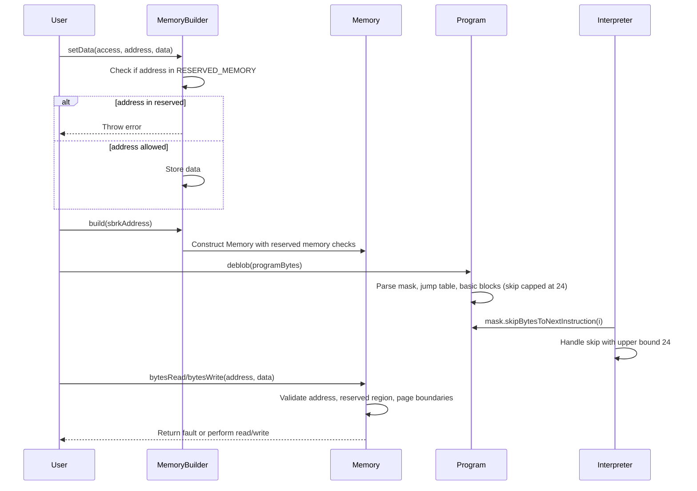

# 0.6.4 compatibility.

## Pull Request by @tomusdrw

1. [x] 0-length slice access
2. [x] Reserved pages
3. [x] skip bounded by 24 (fixes #45) 
4. [x] skip-based basic blocks
5. [x] `deblob` rename
6. [x] Fix examples (fib and game of life)
7. [x] Jump table calculation 

<!-- This is an auto-generated comment: release notes by coderabbit.ai -->
## Summary by CodeRabbit

- **New Features**
  - Introduced stricter enforcement of reserved memory regions, preventing allocation and access within reserved pages.
  - Added public methods for multi-page memory reads and writes, with improved fault handling and reporting.
  - Added new constants for reserved memory and page counts.
  - Expanded and improved test coverage for memory access and program decoding, including new test suites.

- **Bug Fixes**
  - Improved handling of jump table overflows and instruction boundary detection.
  - Enhanced interpreter error handling for certain fault conditions.

- **Refactor**
  - Renamed and updated public methods and internal logic for clarity and consistency, particularly around instruction decoding and memory access.
  - Refined basic block detection and jump table parsing logic for robustness.

- **Chores**
  - Removed an unused development dependency.

- **Style**
  - Updated default program code in demo HTML files for improved examples and demonstrations.

- **Tests**
  - Updated test signatures and assertion utilities for better array comparison and reporting.
  - Adjusted test logic to use improved memory builder defaults.
<!-- end of auto-generated comment: release notes by coderabbit.ai -->


## Comment by @coderabbitai[bot]

<!-- This is an auto-generated comment: summarize by coderabbit.ai -->
<!-- walkthrough_start -->

## Walkthrough

This set of changes introduces stricter handling of reserved memory regions, enforces an upper bound for instruction skip counts, and refactors program decoding and memory management logic. Constants for reserved memory are added, and memory access methods are updated to prevent allocation or access within reserved regions. The instruction mask logic is modified to cap skip counts at 24 bytes. The program decoding function is renamed and improved, and new tests are added to verify memory and program behavior. Test infrastructure is updated to accept assertion objects, and several test cases are modified to match new method signatures and behaviors.

## Changes

| File(s)                                                                                       | Change Summary |
|-----------------------------------------------------------------------------------------------|---------------|
| assembly/program.ts, assembly/api-generic.ts, assembly/api.ts, assembly/index.ts              | Replaced `decodeProgram` with `deblob`; updated mask skip logic; renamed mask methods; enforced skip upper bound (24); updated program decoding and mask logic. |
| assembly/memory-page.ts                                                                       | Added `RESERVED_MEMORY` and `RESERVED_PAGES` constants. |
| assembly/memory.ts                                                                            | Enforced reserved memory checks in builder and constructor; added multi-page read/write methods; unified page fault handling; improved chunk/page logic. |
| assembly/interpreter.ts                                                                       | Updated to use reserved memory constants; changed jump and fault handling; updated mask method usage; improved panic/fault logic. |
| assembly/instructions/bit.test.ts, assembly/instructions/branch.test.ts, assembly/instructions/logic.test.ts, assembly/instructions/math.test.ts, assembly/instructions/rot.test.ts | Updated test memory instantiation to use default argument for `.build()`. |
| assembly/memory.test.ts, assembly/program.test.ts                                             | Added new test suites for memory and program logic, including reserved memory, mask, and decoding behaviors. |
| assembly/test.ts                                                                              | Changed test and assertion function signatures to accept `Assert` objects; added array equality assertion. |
| assembly/test-run.ts                                                                          | Updated test runner to include new test modules and pass `Assert` objects to test functions. |
| package.json                                                                                  | Removed "@jazzer.js/core" from devDependencies. |
| web/conway.html, web/index.html                                                              | Updated program code arrays and memory page usage to reflect reserved memory changes. |

## Sequence Diagram(s)



## Assessment against linked issues

| Objective (issue #)                           | Addressed | Explanation |
|-----------------------------------------------|-----------|-------------|
| Enforce upper bound for instruction skip (24) (#45) | ✅        |             |

## Poem

> Oh, what a hop in memory’s field,  
> Reserved spaces now carefully sealed.  
> Skips are bounded, no more run wild,  
> The mask obeys, no bytes defiled.  
> With tests anew and code refined,  
> This rabbit’s proud of what you’ll find!  
> 🐇✨

<!-- walkthrough_end -->
<!-- internal state start -->


<!-- DwQgtGAEAqAWCWBnSTIEMB26CuAXA9mAOYCmGJATmriQCaQDG+Ats2bgFyQAOFk+AIwBWJBrngA3EsgEBPRvlqU0AgfFwA6NPEgQAfACgjoCEYDEZyAAUASpETZWaCrKNwSPbABsvkCiQBHbGlcSHFcLzpIACIABg0ANg0AFgVmbmp4NS91WWjIOUhsREowlmLaCgB3ABpIDEcBSijkgE46tFpK6RLkEqkqX2xuWmppdAx6ADN4AA9xgkgyB380jPFs3Mgq9VhIAcR4fCx4pOSNGFgPBlhMUmR4DAYvbCVIW8mcjCJIWLBI764PaIHIMDxoBhgxCIOrMTBoIiPH7+EoUKT0DL3DqTFDpSJsDDib7oewAa3g3AK+GwkyihQATKlFjNZihocFIGZkgBWC4ASVCaC8iHwKEJFEU2ChZIpYAEaBK9HlhwYBS8+AYpJhfjIaDYyCBHgABkoBOqBEa1sd2NjpnNxiRZnruJEeBKiFRmH0pXsFZAAGJZY4Qhg6TD0ADieo8+CmkAAMvApiQLgBBLrqI4YIVeWR1Q2eHw6oIhIojMYGq6QISOSm4FSuhhChjeTLHC7uSBTby+JT1+DCib0JhvG53cbOcESbReBvg0IF3j4CTwJT0ACqNnjXFguFw3EQHAA9EfEUDsAINExmEeCMwKtUj/CMGAFUfuD2j20NEZ9MZwFAZD0LGOAEMQZDKDQw4sASnBuvwwiiOIUgyPII7KKo6haDof4mFAcCoKgmCgYQpDkFQUFpLBXBUFU9iOHCLgFGhigYWomjaLoYCGP+pgGAqJTMGashPtw8DgeR8AMBouCHgY0QKQYFiQKmfISZBUQOE4TEgWO3zSG4VbwOk+AUKEiD1jQsHIFUzRlqMlGLI8zyvMaNgAKIAMruTYABq7kACIAPoALLuSFADyNgAJqWlMErMJARpsMwpmyGAmIkJa4Y6i6ELGko6FWO6nqWjsQJJaa5pxQlSVLh6epGvyWAFkapC4Km0IkEJubZTiRoUDSvnMHFNJiFm2pNj4Bqika3AaHCiCkhocg0Ig0D4AAco6uB8hgFmDeNxxlXZ/h5WC9DlXsc0LQqy1LRSABCshrRt22zLt+24Id4jHR2Vb1Z6kCFYoSJiklg0YMNloYPgdHFOMJokGaggABQ5FMuDPWtqMaHjACU+OWo8FkkJ0/BxkjRUlXq6NJljL3SLjBNE81YRVkaAjYAOtAhd1aWjU8v0YB09QkHR04UPAc5JYgAgUKSe1KLMxMPBgmZCvAABeUSLEaHneX5gWheFUWxRcADqCCuuokFg8upRzQi0hGnUSYkpl7x+lUUs0OgkI9HURpywrSuOqr9ljPQiwFnCszGY4FMoLJjDYBQ/iEvsQocjli7OwA5MgnTdNCFyBtmPh5uzxpczzlArdzXi0JaU1DL0svy4rtIq+gRdYM4RCOOwYqk+TIE6xKP5GEplipl4NAURNZTV8DoizovxzICBjrcKZlGmZ4ZpSUshKZgZBhQJtop6fcy8FocRDZrgafjAfhXr22+1Jzve9RAfH5H1VOwM+Nk7JwiUD+BS0Rfx8QEt1YSol4AyTklAmeKk1JkQ0vQLSjF5C6Q+PcQyHhjK7zMknKmrFir4AaiNLstVWqA0apAVKtBvAeCqH6M6s4LrbF2JVZG1ULgAGFTIol3pMJEuYOhFlbjNfh1NqGejppjbGTNGHMEJsTFqVZuxCyXgNaQJBcARgglLBgfV6AGJKMY0xUkLa7D5qlFwJ1Vg311rNKqaMMYMxxuozRaYMzCxzFXAs/hn4UCwBZMYsFwZtSMVQmhIiaQLzKn6FhSZ4DuKWLMF0Ul1C5kYAqUIRpHiaG4OY5eRpsAAGZ6SWiaFMUyHgwlp3VsSLC5hZ7zztpvO+VZ37OE/lvOMP8zJ/z4AA0EJ9wiZMQL+SAV9GAEPGLZVY4CPAxyrA/J+L9hnZNIfvCZF4pnAPEOMR4SU4E9REmgMSyCmryUUhfWBXVrlHkeMrZBHBHnQOUqpdSFFNIMWcHguMbi5kGE7CQve9hLLdWHhco0VyEEfMdPc7YaTQYzCyVw/K8jKE01oVdfhKMLR0JYCvJq75CWWhYWw4RojpDiNoJIquV0LmtRZYgZFkRBZHRFivVulSQZKASUovxqTkC4p4YUJGpLUYSu2FcbRxCMAflCOSHEqAjQmMkuYi4iz8CGj4OqREqoD5MHFPgXwUx1R0XBdsMBnQUzTzQXPBeQy+keAGRvL+28cm/2AkcwB0yQFGCvuQSBTyIBgCMDykSJNvpSmFogI87EZIhC+T8t1GDTFR3otpUFSzxwQs7GtUITZ26Ivje8r6P0JppqwuW9FqyPDpOxdHa+yyV4cPkK1RxaVHqNyUBQLRUSnjEOQJag6ya6AXE8twUQGTW5VxzPwSEacM7ShAkacgdEB0uCHXXCgqN8YNx5qjWIRNHWrGlVEYlu7xaQAPbII9TdKCnvPU3U9ZVdjUkFBgeQA8h6EkQP9VAbj0BTGTGISsqqNY5C1p/JOsd+Y6UQmIHgcDO0r3LVEXR/KZB4GBvgcYsNBTdL4AWctkBTVSQ6F1MyE06gWuON9a1XY7VTz+ZRz1mzvVr0GSm7+AaxlBsPic0+ZyIURpdag55sb+KvJRXW5NDb5aYBuBmiyWbUF/NzeRfNOCQVJ3BUQsIpZ0JdgPq1DTTxYBBUCEFYytDE31uOBi5A7bMlKjQgQsGBZHgSA1MhkC/a0OvuHR+s9tdv3XrYECRQFxiokBXNSEEVd1CecKT4e9fDiI71BFl4DMSjSxFdkOeocNk5shy5ES6f7iOYCAxQQe1lwNF0o8gWA1XUNOPkImzTk6FCqbEPhmzVYaNc1CLQUjyByPFv0hMPBxraPUPoyN9jNq7Usb4JQCUfAPi0C+D8Dlk3M2up4x64T/HV7PCE0vf1BzxkSePqc2Z4brRRugQpuNyncy1pnYRo8dHpLNtkt8vTs8DNYILbg0zyzS3nYsoU9ujSqNVlByPJNhHLmTGcxgCQFWjSmQJ0T20SVZiw1HTettWKfPL0gwWXtlKUr4EtIIEQmGIP+Cjsl/waXihSKSmzyV2PMDiHzYUVuYNH37oi2+kdn7Yu0Evde4lBWclFcFK1kDxTysdey24nDQq5fPoV1Fk9MXh0/t4YlprgH0C6/aws0URqrh8AdbdmjoO6j+ERKTPg1jhi7d7qiYTrbmHOqnp0lSvGbuigLD6z1T3A38GDZJmZ59ZPfZgYpmtbm1ObyPHCIE2nNAQ+zfpgFRngU6TBYj8zNHK3jHRyvUvexC/8q7GNYTqNkpoBVkHOOQVsDE+YI8cfjxR8VZykiroQValGnxrT5h9OslM6rCz1qouEJc9CIRL6EvpZQX56lo4Quq7JX5mLhgvPKLS5zLLvd5v+uK+i1+1XV6KuFbyREeQGQ0Isu5WvcEwTubWw8esKuTUlwqAHCU6yyJuT+xIZuL67+Vun+tuxKsM4BeuYGru/Aq2vuYelAKaoeNGwelI8B6AlGc6se7qPSX8t2yewmqeYm6er2QCUmH2BgOe2av2SmgkKmQOKaR4EoFemaleUO6CNelExm9ei2hCkKyOFaCo5yWASK/2Cao2oh4h5eLaYC6+Ju3azOaAfaHMu+nOSEtWd+ZMp+1gAuF+GWw+N+2Wg2p8UuaEyBPwqBFux6yuNu3+duvoWAv+oYOuEBmcZWMBBENknCJA50dIXhPgz+T6aBluARF66ujWAGLWkRKcFya6jSacFmKOLe+Bhqq2XuieKha2ZqDG4ezGHBlBq+6yMebq8eS8zBgmvqeyoyhynBoa0mn25A/BMaf2QhAOpSlAvARi9cUhik1emCgK2CdeRaZmyhxCJkZkoCqwwwDkWSzkLwbw+sXkPk/kwUYUkUMUNUFK1+/WGUzsFiSUYqeoSShIlAtxiUc0NKbMrUe0C8sxKSjAs40I+YVYCWPWOG7UK8DQQkpQIEq0CwNRHg5AH02O7mWA1Bxu5K3xSJ60W0O0e0IhWYloesD03AqiBJ70n0JJf0lwHgR2J25CNg0g3gmg/oqY648Y0AHOeA14KymKLKHaXA7srUjo6gIiSgEckQ0I7MxEpxhsFxJs1xsU4JqqgJYSpQUSz8DwfQRilSVgqYm0fIQiY6NAY8lMnJ3JvJAA3IQR7jsCUG7KEP4HCCTElNaTyb+hVAWBKRWqxPYEYv9MaAFDWOkKyQ4PPC3KCYgIXElHulYBUkuIumZH2rIIukbogbiUlDUnUoaYSu8Skn8RzLQAAFK1h8rCx1ANJNJh7wCPwBZVgv7qIKDJKlDxQUoFjhl1hziiw3CiCkjZbFxZLLAvywlPpWBCK1aymVgKn0gAB6S+kAqMSgMw5A9AfoRoIUqYAAGkFOuEvvjPae7ORuqbCtQMULVtYoacaaaTEc2ZOdOagIaKEVrn/gUpWguLNHmfUiQOjuCEAY/LBO0VdowXIknj0SniMqJgMZMm9twefFAEaGGbWJGeyTGQJFwDiSmaQfIHLkmWSRmR4J2d8b+QWYom8dSB8TTtWlobWpqXMRQPcrngITWmzi4I8aQLposdDrIUCoWgjiWm4FUKKC/tOvWKBkHAbOccbFcWbM8YqbJcFEaRGF5BVpHiOThrHJKJEBcEpUbJcabDcbVmuY8FEH6IuQAIwJDMRrQU4GXKmqXqU2HNitgP7yAsorgsooEyWGUqkKXMQrwSkWSy7OVBSeR8gABa7kLcm8klmgkAj07uYs9q8VEuasLkbw/gyYW6yJ2SC8FcJGLYsEyGm48YFRbuRB625qnubGEo221W1B3mdB08YFvRXqd2H8rBMFz24m8FXBWeEKUAIiR+mcWlXAjlclxl0UXA5FdFkxIkHF6UmU9yF8kAo146goXQdAk1flTlqYalnkc1y5C18CAOy1XFKYskRoYxLyi1JeEW+hCxvyfFyxtegl+CwlBgqYqVpR5k3Mfsbey1/sUIyABGQSOQuAA2as7GrCPCZ1byy1z1iAMBAom22gX8xRVGIQyAAwSYsgYMTQtwaWfAIEINvOtAfcl0vs4wNII6WcUs6WI2LKKaIZXY8AFAKOzeVwmoc5goAcQBxIzWKGRk6skuvgNlOoqI6IzCEWWGt8KI7JasJIUwaA7JwRVWoNPQNBdqc6DJQZlq0cpY+N2K/NOonQYMpFHsEoqZBSOYIWlEnsDgAcdANkORXY6t88dQVQ1s4IgthwwtzCSAgdPwnsB8PsmYxIiwaAFttAYAxwBSns30DZpAXNntytmttyKZUsYwGd88CgSg1N2tcptqCI+BZaCAFAxtZRxwMwFAXo8prpZMPlPwOUkdRIPwDksdEIEocpnsAg1FowUsKypkWoCg6cSEwuRxrwYMGQTGQo2wtN82ZMEyzsSwtAWIlWQI1AcdVttUxENIDtTYTt69TYCMRc+diV6NQoIoWcOQBxcGE9/gYg5AcpYW/S1AsdlNlWHdNAGA7N2NvppYY5KITdkAE8hAAIRAFUlNxdHd4ws2VWqhCMV9UqJARAzgx2OtH9ba8t/uWYJdiobsTwxxYMKIlA6IdQR9PgjtdAFOx9+amU+B7kEIewNGF9JBTGvSiwpt8gatGtZdRA2oIYOtQj2oAjBd6EIjOI3dYoNAHoWwvtdk2doIc4oFXS12XRKJXVD2vSbBcFxyCFQ18y7ksFUQElEuSU0AXk0Ax1MAIQAA2gALrZQ7X0CI0ILI3g6o11CWr9htI/D3jzwUiujN5qHg0Hwg2iNynTgP2fysXjGCHnVLVPUvU5r8WrGfUN7fVQrbHmRwrWSr47zhiHGkOuRJT7XTWqnE5VMqWHXqUOU2BoBVBWBPFph/XTERKL33ZylGhtOkABRf1i6lISjw2jlPC3JRl52x3blmFNADMkD+he24Cz4vFPEMM6izjITghdAoju1AhnYeCrUqQjZbVJSbQRRBThVem8nDnuPLxnQUPjVVYviSMFNjAMMaHhRWDQDRTXMNNxVjWhDUGjOSg8JPOGKnxB2ezYGigxPF3ERBaaz0C0QK0uoGB7RJTpHHoaDWJDP1hrMDmaj3NrjLyzFSDjW0Mn2EMgTMPBFHPS2UNRCexUD6TgkSg7DC2hHpwHzuzUBWTcD2GdiQmKBVZ0QtIRLIBGiHOo3Wae63CPBIjs2czDq0pGJQnxnBydzpglxyvz3RgLzZaIiUskhrkrP30cg7p1MBU3FTxYvhb9aYVykSU/SmR1BxOrjIbUFaXLygMbIcwhyki6v7OWizZkZGqe1FjspYAUNogsvOzahAictgwFa8t8DuxZbhsV0cygkdTUtRyLNxSZJNxuFWrjOblari3SyIZ0hqHAQqpuhQtgii3GhBtFvgx5y3xwjzQiViVPoDVy2JZU1Bz4msmdCKX4kWy00aUqMPOLCpno6JTBPiBXVx3wPL3S2LrjRSDC5Mlz3r2D303OCzJBVnR2F0CfneEkgtlSzTh+yiuWLtRFuG6Ps6jhJfyzOLMEtoAc4YYBmEiY1W0WuPCNLnmZQU7+DbOSC7N6uQdGKtJ9xLDpDQ3ouVbvMoBxhdvDYT5C0/AHwIumVkA+ZTydghWd1uiSB51vtxK4BCKwA0hahi45UQgED+A4aoO0cdtz7fvDP8ihCwwSsIdSskhGj0eMdytWGYYEdX3ysQOUBQNkAwO+gB2vx8DKNYD0uTjB14ccGPAItZB6UG1Y5t77vC2qd9AZAYCBP8DkAcG4CiXotxHICzEy10jEb+B/1kDLyoMFgv4qAHSscTSkccztRUmWhXBeCpk6julfxjSIEqvvNVmEPYnZmLCSv9zYvzMkCLPLMYXAyc1T0DZfQt1Jw+zZ1gxZaFFJTicYBMd75IRTwRQDA5jnkOpgvjOwpmJGtxuy0g3EtagdBdDMLsniSsst1HgINDtQnag0gE1ocYdmc/ArhfvOw/uz5arpAShSCydnR7xgzTpID/0MCyAaNx5aM8M6MsGPa9Vp7/xGODVhrrW6tRA0djst2ozFz7MnX0h1BF1EifxcDrilIAAcqY6cZh+MXAIU2XuXKzZJ18sZ2LEWWily9F3jqNz3Dzb3jMiA07tsn3ezPQP3dQIoacYIQPoP4PVAsgUPz6sPzseX0ZjOSP25KPsS7FaTmPUAL3GId71HGrYrXHzsn3AdXAqYAdQ3erP3dPvHhLLPAkyPTrHP6PXPt1UAIURh03Qv+LX9ovYN4vkv6ARP0IJPwMX9lPhIYPEPtP0Pfh76tFWAvT0rOLDvqPmhD1GPlohPZLvXCbpASyg5fj2ZGXYQxF+M61mvwpDOb3NuQbIbxPRQtSkAAAvJADa/JTFHTy+qj870r4Opbu75z/1uij71EOaxrQawlpQBHxr1r668mgfLpKzznyr572ryub637xiGfbzUOTlEqxLdrKFpTHm3POqCfXQEW7X8+lr7wFRw+4L0+0YrV1qPr4nxL2DVL990n793ZdIHNSD3T6v3Kxcnn2z8r54xdR36jCx2IE0hxyUElM+08ZVv02t8MzP1Hxkvhr3oQ0aO8x94788y2fBnqQCZ6rM2+KTR6iXxuorkcSofaGpmWtpicGOdXOVnrBh6yAFmjPeHhH3kxJMa06iFGpDl4oyF3qchNYkJX0gQpfqL+CgoDWGy+sr+IkYgT4wR730vWfsJgKsAhpZhNY0mLZvmicg6FCGIqJELCDugSDKsrZEQuOXnqh1+O8jMZlKAnBFBxAUNfhn/w8xVIQezgGnIsEtQDABOjQUoPoLMKw1ZowPK3tTzMIPkNkuNBQAMG+TrU2mXNe2HGAyCagogXeYWFHiWjag+GTZDUpQCKoUl9+TuGnsXV8GENXOZAFtgNzAzrV3IGAdHGCBiQgRY6ccBOIlHCE5AJ8oQECIyH34q1FoQ5UHD+CgABRRAoMYkCBBiEeYSs7AcGrVDRZIlze9YEhllTBhLck42yHwawDoAn4PAcTYIMXSPaTATMRtTMJvEqEG05U1UHvHomODxkVAA4LYAu2cBP80WrZJElZlKSig5B7HK0OQFAz0QbgoBMoXUB7JhA+ylWZUMfBRh80fafCA6OQwSLPNLIhDU2lJASbrVNqOOPwYiQVCPCJ+49a2lZhyhlCOhaAOoKAwO6MpucSgU+DMBpYeZESYIi8mQhyhAQeA+AUpEkKgBuDQ6ScG4fWDNArI+E68APnCUoDHxRh0gD1nSKmCE1iQPAl+gUylh1C8A6qOTmSIHhGIkhP1fuNgHjg5ATMJOcpKxGS4eYe2SHBoS1FFDqA1YysTtlWCIDmhF6+sdcJtHNKYlaMR3DlnDFTY8sDsmHZBtZnprs1y0yAVBgqU6jh5nWkTPgHAm4afscQrUctDKMVGrx1yqqLyquGwCL1wmvQPxtakiA7sSABST1g5DBh2p/gqWKMW6EoqJR4QuYQ4MXXEHEg8A6w6TGdwYIdVui92DqgYxeyDt3sSFFSA836K/9lhGhbAHoPTirkLe9QUwRQBcZ09rBuAa3jTyL70U2BkhbnlWLJY1joIwLaxrY3sbQAnGrjDGkq2JArtQmDgsohEygFvIBxOmG6ndXzz9jCUPFV6uQLzSUDsmihc+J2D4E6CRUJABdPABhjVYMuT9JWgXR3SeIyUiaUri+JqGipfiBtC8RoSvGvEiU8RbMGwBwwLDBAPpHrMRmqLJxYaoQxehUNOaWMoiO5fcp5AADSfIKwJBMtYeBihoLctqoJwz5CssscQfDkJlCUgmAySWFA/zVHGgYeS0J0Sq0YmkgnRWrfEhtE8jkhuA2UG3uK1olgNg4PE1GBgBXwABqSAFZUtAMip02dCysUlQkRVMJVgSAJJOklydYYL4BUSUIcogE28Ok/Ei8Iqi+tZsJVdgMhmLEE0mySAFVkgGJKAjSS2vYcEUifqopWQesbAAkGSBxQD4Ew4en5kHLjCIQQ5TycuQMndxlWBtHHq9EJIfQHJmJZjrqFAmVIKSVJN6ESVEHHRKsgnMUFlTUHXgYkhWIDtHVuALgtkPEtspnFQD+SkikAYofiW3pVgMuPg7uFHnkALYhQvaKdIykQDMpl4SLLKQA3mGPQQRDAR6GCLlYN97+6neImrRmm7Uasg/GttrAWA6JOaKOdoX6FjpPChyUSMyC6Q0hbwBgutXSUUHbgD4loGgeyUNMUplC8WPE9KXFNpKOTspTkZEeIBZEYki8WAfySe0ZGVZGI49XaViJTg4jJgRcSEKZFbrC43Sy4YIU20Fx9A4U3YXwCUgwATSNQbEuolJBVYEBPIKdb4Oq2HbkJRpKoTGXzTFwtUcM8knEInXkDsAR6BzPYFpLADdQhW8gWcE0GFAqsKy6QaAHOHYnSseycrcwemUzI4kUBBMzIAwFsGyBgAgEospQD0De9NYfoNvFUiPKVJpZ4gWWTb2ABeTkgKs/jj1J0IHxcpIYRwO5XGA3DZJoBbyXKCyw0h+hHjD4mnW1B9gkI9sAYLamqysIuRPwSIJjHsAIBMYiLQJE0RyjWIn6DIypIbI0BKTfIqYeMOuFiq2d+APsrjLAWOmUBfZdEXoT63naigKWCKJ4IiNCC2zs40gC4BFCqKBk3SmNW0fZnHC0B8xnRS7ivGu76Nbu7Be7iGgrHDVhxFjdKihL3LKSsJP3PsQ9TYGo05hrJECVEFHFLDu8FCb8SmIVSEpLe3YuWbLxpTCoBEaMdRFvJ7GQ8uAgEqedAJnkPI6+0fCxi3zugXz1xe4m6t8kgC6Ah59AMsp5ACgagqIkBWaJxPwDcSKQDyN+SNWzLTS2OOM1UIYNuSUTcJRcRSWPIwlYS1JUk0Be/Po4tznJSUQBTSQSk/TUY8AGXpPNSmPTceGU+KUNKIUkLd+OE0yRqD1x/Cb5P/YcKzzJlSQKZ9XFgdShTH3JX5mCiBfFTdYmoaqcnEGftNwBHhcRns/lD+DAWz9b5lifGYTKIC25FgLALLIzNPbEp2ZqHLmVGMJGKLWFIJRXkaD5ncABZFIx+QgivkCLwF2CpATGEpgiyviSUHWVJDlkKzCy1FBeCrO1lfC9ZNPA2d5ONkGAFF64csJREgU2Z4WG6YJnnQdnsRqwtYBBZrQdgUA85q8GgN3hyhLdEm91aAeWjACQx9xGTCgQJXhxfUaBTeUsJDHIgCToUOxMII52LgzCiqNGOlLKRcKwCQgilDcaswpwz0i61cTmv9Xoi2wVarUSGOP2nEWREAtuR0KIBzEeYSgJYCdFBiNY75qAsAdFDaPuH/k6yA0I1CxQNrQyEScYepQjIHxl44B+y5qg7BwwagWwLozGI7AqF3LcaKrSGLbj/FihgsaIrAG3jJgXCaMuUwAu3Fjov4jQDo0guaSGygFiITQzON7lLB/Ld4XTFcnNG+jL4/cCRbhAjIpZOE6swRf9LgRdyxFTxUGGDCnB6x0QaMT4sGasEEABN6GoBajGiu0FfxcpL9EgDBzAIwrGMkAqTt+R4C5zTIqYoVcF0gDElVwAbDwPtgPh7cmMxIdUPgG4Dnl3JjNaWBSOywZxow0wWqCUg4FGghAHAtAMFlXAhzOgxo0qTGDwClA1VlISWDqqM6dgUQhQrDrUUZVexPgJorJvDnn7QtA5YihuR6Xi4ty25F3Jgldygo9V9kd3DPMYye6Xwu0JaTqtskvJgNSx/VB7kMR0VOoIE8wmZT4DmWyRflXKt/j8uvR/LM14ScYGGqwARr9Irc7cRMSKWDjSBB4/5BUoDUmZqlShTsDEqDwNkdkzKr1caDLVOisyji0UP4CCCFdKUQrGnH8pjoBwhWAq2FWZHhUbLtp/cZ3MPByih97RQqirO+MtK3DNUPwHAsitkgMpJ6fU44DDJCRVgl5MrPpcvL8F1rxy1BfYsINFCl5QVCAFenRGxUrrK1Tijpi/ho5IA5Z7kIIEKGADQA9AovZ+EKC4DQAXGcInJEhEWmYbnGsIRAEQAAD8XAN4d8HVzbSi5lKLdZAOd4+0EAFw68PPQWCtKbeqEDmlzQrR99ghYy6BkCGLqvk1gJ7O1WMvI1EAwAQgfERuU2zNC8VByMGLh0A1XA8a0sYKvHFCooEkA8GoMV4GJlQl2aiqvgPqG5QB8l2ArSrhoVo3XTEAOmoUFTK16LByudYKsKx102VYd4uG+gHbIuSh1XQQQI1NXIILu5HVYi1jFakar2pEcq+DrkRKjXgVOqXcv1D3MMb9zEKg8gESItMys8p1a4hBOwNPE99PQTFOqDirD7ICjVp6VPnoBUinrKkn3IVeLyFUr4U+NW2jdfPNwkyJqSUWDTbzs1eAkNKGtzehpgBYb9kXmjDWNq9AkayNqiunpaubjgxz+7WvLQDnYFzCzGfVT9f/y9GraRIBWnCoMmr58AwNRFCrXcSq2tbatjo+ra6Lgi0aWtbW09QUsUxeDSQzsDQEIBFAYAu15So8ZUv7U5MalmxVeIulpBPB5A0QAAAJCA0AWsCeJ9tTQ8CSA+QYlAcEIbRAFy9IDQFZQ0CxBUd8RVKLLWtoFhogSgCQNULB3IjQw0gfICUG7y4MsMmoD7V9o8wzAjOlRD3KeLkRKAqd8Q2ZKTzvwUhZIoeBLJ0C/qtFo8l2TRglqLHdUbuCa3uUmse7DFeCX2NtQYFsgCAjwlqXtBoF3DMAvAv2pYv9r7UKENieTA5BeSsjDxqCJTWkDhmGXGh2oOs4oIpXahmN1A4PIgN6JaFdkISulFMDKsbZzQJAzAPaOoG9Garq2i9T2D22N56sZ1LanMtEUqSxBZgVlWIFnoNzFr/yKIWAEIkwDTg5WfynlUYhHooQ5a/WHMp7ClrnrgIng9evEGD1Lqw9NgGkFHqVTecCwVgXyCFFokHg/ANIQJi6TqJIcjNctaEOvWJT3xLIV5HEfHAiJ64Cghy1YCnSIBp0EZFkdVQUDwAEAneoIZaPMKEQRQAoacsWUbhYAug5iBSO9A1hMmpU6g6ofSC6P4kgRaRZiBBcHzuCErCUhdDwOqGdSuzbsvekKPFsLGxrix0FRXalszwpqCCMEpeX3LgOocktuxNtM6jVGoBhSUwF7UYC121pPkBuo3VXjeqm64cgO7neZkgx/q1onc/8ha38bDxGdRoYADQA+iTg0A/iqMfCkzjEorV0QdCPkEZYAAJaACFHjAc03VVYUyA2X06+BFxXwDwF/IiibRIhZhJOO0LtnUE79QVWOn5pID/BzKkAFQ2oYv3EoQQDZXcAUhwPNBM4H++kVXMQX2Bt2y6PEYcD7zkYGw5hDwFZWqQmScQ9IKyijh4NFNJZtUKykEeXhWU2g6HCIwAHZYgy8ekFnrxV9SvZu7Wnq+3XxuSY9vgVslZkANksDhK8LpvNI8DTYSMEbQUNBmsIi0Qtoi+oksEpahAluoefxg1U4zVZGW7OjFvQXbkxr6DUB+NUgeV35rs86uggdxF4iAQ6ZcYdWmBF7V/zCQNEFphQaYjS5WIVATCBxBwjTG8IVEdQM5ippBRHC4sOgEFEkVcQeIBx2IE2G5BdABA9IBgPSHpBTBaAsQeI60BsrchkgAgWIAkAEB/GeQIPVoCD2qTxGrKowBgNyDQBWVrjBgA48kCmDeTkT1SbkK0GSDVJWgDAVQCQASBoBWg3k0QNBlePvG/jVlIEyD25BWUGA8R6pAiYOMkAITUwHEy8diACAQeQR2IDyAYAJBITrQbE1MBB5fHYgUwWk6CYEC0B4jyQekAkCSN/hETAEQ47gGOOIBTj5+c47QEcw4h9AQAA=== -->

<!-- internal state end -->
<!-- finishing_touch_checkbox_start -->

<details>
<summary>✨ Finishing Touches</summary>

- [ ] <!-- {"checkboxId": "7962f53c-55bc-4827-bfbf-6a18da830691"} --> 📝 Generate Docstrings

</details>

<!-- finishing_touch_checkbox_end -->
<!-- tips_start -->

---


<details>
<summary>🪧 Tips</summary>

### Chat

There are 3 ways to chat with [CodeRabbit](https://coderabbit.ai?utm_source=oss&utm_medium=github&utm_campaign=tomusdrw/anan-as&utm_content=49):

- Review comments: Directly reply to a review comment made by CodeRabbit. Example:
  - `I pushed a fix in commit <commit_id>, please review it.`
  - `Generate unit testing code for this file.`
  - `Open a follow-up GitHub issue for this discussion.`
- Files and specific lines of code (under the "Files changed" tab): Tag `@coderabbitai` in a new review comment at the desired location with your query. Examples:
  - `@coderabbitai generate unit testing code for this file.`
  -	`@coderabbitai modularize this function.`
- PR comments: Tag `@coderabbitai` in a new PR comment to ask questions about the PR branch. For the best results, please provide a very specific query, as very limited context is provided in this mode. Examples:
  - `@coderabbitai gather interesting stats about this repository and render them as a table. Additionally, render a pie chart showing the language distribution in the codebase.`
  - `@coderabbitai read src/utils.ts and generate unit testing code.`
  - `@coderabbitai read the files in the src/scheduler package and generate a class diagram using mermaid and a README in the markdown format.`
  - `@coderabbitai help me debug CodeRabbit configuration file.`

Note: Be mindful of the bot's finite context window. It's strongly recommended to break down tasks such as reading entire modules into smaller chunks. For a focused discussion, use review comments to chat about specific files and their changes, instead of using the PR comments.

### CodeRabbit Commands (Invoked using PR comments)

- `@coderabbitai pause` to pause the reviews on a PR.
- `@coderabbitai resume` to resume the paused reviews.
- `@coderabbitai review` to trigger an incremental review. This is useful when automatic reviews are disabled for the repository.
- `@coderabbitai full review` to do a full review from scratch and review all the files again.
- `@coderabbitai summary` to regenerate the summary of the PR.
- `@coderabbitai generate docstrings` to [generate docstrings](https://docs.coderabbit.ai/finishing-touches/docstrings) for this PR.
- `@coderabbitai resolve` resolve all the CodeRabbit review comments.
- `@coderabbitai configuration` to show the current CodeRabbit configuration for the repository.
- `@coderabbitai help` to get help.

### Other keywords and placeholders

- Add `@coderabbitai ignore` anywhere in the PR description to prevent this PR from being reviewed.
- Add `@coderabbitai summary` to generate the high-level summary at a specific location in the PR description.
- Add `@coderabbitai` anywhere in the PR title to generate the title automatically.

### CodeRabbit Configuration File (`.coderabbit.yaml`)

- You can programmatically configure CodeRabbit by adding a `.coderabbit.yaml` file to the root of your repository.
- Please see the [configuration documentation](https://docs.coderabbit.ai/guides/configure-coderabbit) for more information.
- If your editor has YAML language server enabled, you can add the path at the top of this file to enable auto-completion and validation: `# yaml-language-server: $schema=https://coderabbit.ai/integrations/schema.v2.json`

### Documentation and Community

- Visit our [Documentation](https://docs.coderabbit.ai) for detailed information on how to use CodeRabbit.
- Join our [Discord Community](http://discord.gg/coderabbit) to get help, request features, and share feedback.
- Follow us on [X/Twitter](https://twitter.com/coderabbitai) for updates and announcements.

</details>

<!-- tips_end -->


## Comment by @mateuszsikora

```suggestion
      "Mask[0, 25, 25, 25, 25, 25, 25, 24, 23, 22, 21, 20, 19, 18, 17, 16, 15, 14, 13, 12, 11, 10, 9, 8, 7, 6, 5, 4, 3, 2, 1, 0, ]",
```


## Comment by @coderabbitai[bot]

_⚠️ Potential issue_

**Out‑of‑gas on fault is silently ignored**

`this.gas.sub(1)` returns `true` when the counter **under‑flows** (i.e. OOG), but the return
value is discarded inside the `Result.FAULT` branch.  
If the program is already out of gas, we’ll incorrectly mark the status as `PANIC`/`FAULT`
instead of `OOG`, diverging from the earlier pattern used at line 73.

```diff
-          this.gas.sub(1);
+          if (this.gas.sub(1)) {
+            this.status = Status.OOG;
+            return false;
+          }
```

Consider applying the same check in the `FAULT_ACCESS` branch for consistency.  


<!-- suggestion_start -->

<details>
<summary>📝 Committable suggestion</summary>

> ‼️ **IMPORTANT**
> Carefully review the code before committing. Ensure that it accurately replaces the highlighted code, contains no missing lines, and has no issues with indentation. Thoroughly test & benchmark the code to ensure it meets the requirements.

`````suggestion
        if (outcome.result === Result.FAULT) {
-          this.gas.sub(1);
+          if (this.gas.sub(1)) {
+            this.status = Status.OOG;
+            return false;
+          }
          // access to reserved memory should end with a panic.
          if (outcome.exitCode < RESERVED_MEMORY) {
            this.status = Status.PANIC;
          } else {
            this.status = Status.FAULT;
            this.exitCode = outcome.exitCode;
          }
        }
`````

</details>

<!-- suggestion_end -->

<!-- This is an auto-generated comment by CodeRabbit -->


## Comment by @coderabbitai[bot]

_⚠️ Potential issue_

**Second‑page access guard checks the wrong page**

`getChunks` verifies access rights on the *first* page twice and never checks `secondPage`.  
Replace `page.can` with `secondPage.can` to avoid granting writes/reads to a protected page.

```diff
-    const secondPage = this.pages.get(secondPageIdx);
-    if (!page.can(access)) {
+    const secondPage = this.pages.get(secondPageIdx);
+    if (!secondPage.can(access)) {
```


<!-- suggestion_start -->

<details>
<summary>📝 Committable suggestion</summary>

> ‼️ **IMPORTANT**
> Carefully review the code before committing. Ensure that it accurately replaces the highlighted code, contains no missing lines, and has no issues with indentation. Thoroughly test & benchmark the code to ensure it meets the requirements.

`````suggestion
    if (!this.pages.has(secondPageIdx)) {
      return new Chunks(fault(secondPageStart));
    }
    // fetch the second page and check access
    const secondPage = this.pages.get(secondPageIdx);
    if (!secondPage.can(access)) {
      const f = fault(secondPageStart);
      f.isAccess = true;
      return new Chunks(f);
    }
`````

</details>

<!-- suggestion_end -->

<!-- This is an auto-generated comment by CodeRabbit -->

✅ Addressed in commit fbef3a4


## Comment by @coderabbitai[bot]

_💡 Verification agent_

<details>
<summary>🧩 Analysis chain</summary>

**Guard against missing opcodes in helper `opcode()`**

`RUN.indexOf(search)` returns `-1` when the instruction is absent, which would encode an invalid opcode (`0xFFFF_FFFF`).  
Add an assertion (or throw) so tests fail loudly rather than silently corrupting data.

```diff
-  return RUN.indexOf(search);
+  const idx = RUN.indexOf(search);
+  if (idx < 0) throw new Error("Opcode not found in RUN table");
+  return idx;
```

---

🏁 Script executed:

```shell
#!/bin/bash
# Locate definition of RUN
rg -n "^const RUN" -n

# Show imports and helper around opcode() in program.test.ts
sed -n '1,50p' assembly/program.test.ts
sed -n '140,160p' assembly/program.test.ts
```

Length of output: 2083

---

🏁 Script executed:

```shell
#!/bin/bash
# Locate the file imported as "./instructions-exe"
fd -e ts -e js "instructions-exe"  

# Show occurrences of RUN in that file
grep -R "RUN" -n assembly/instructions-exe.ts  

# Print first 200 lines to inspect RUN's definition
sed -n '1,200p' assembly/instructions-exe.ts
```

Length of output: 4572

---


</details>

**Ensure `opcode()` throws on missing instructions**  
By default `RUN.indexOf(search)` yields `-1` when an instruction isn’t found, causing silent mis‑encodings. Let’s fail fast in the test helper:

```diff
--- a/assembly/program.test.ts
+++ b/assembly/program.test.ts
@@
-function opcode(search: InstructionRun): number {
-  return RUN.indexOf(search);
-}
+function opcode(search: InstructionRun): number {
+  const idx = RUN.indexOf(search);
+  if (idx < 0) {
+    throw new Error(`Opcode not found in RUN table for instruction`);
+  }
+  return idx;
+}
```

This change will make any missing opcode surface immediately rather than returning `-1`. 

<!-- suggestion_start -->

<details>
<summary>📝 Committable suggestion</summary>

> ‼️ **IMPORTANT**
> Carefully review the code before committing. Ensure that it accurately replaces the highlighted code, contains no missing lines, and has no issues with indentation. Thoroughly test & benchmark the code to ensure it meets the requirements.

`````suggestion
function opcode(search: InstructionRun): number {
  const idx = RUN.indexOf(search);
  if (idx < 0) {
    throw new Error(`Opcode not found in RUN table for instruction`);
  }
  return idx;
}
`````

</details>

<!-- suggestion_end -->

<!-- This is an auto-generated comment by CodeRabbit -->


## Comment by @coderabbitai[bot]

_⚠️ Potential issue_

**Fix the template literal in the error message.**

The error message uses a template literal without any interpolation, which is flagged by static analysis.

```diff
- throw new Error(`Opcode not found in RUN table for instruction`);
+ throw new Error("Opcode not found in RUN table for instruction");
```


<!-- suggestion_start -->

<details>
<summary>📝 Committable suggestion</summary>

> ‼️ **IMPORTANT**
> Carefully review the code before committing. Ensure that it accurately replaces the highlighted code, contains no missing lines, and has no issues with indentation. Thoroughly test & benchmark the code to ensure it meets the requirements.

`````suggestion
function opcode(search: InstructionRun): number {
  const idx = RUN.indexOf(search);
  if (idx < 0) {
    throw new Error("Opcode not found in RUN table for instruction");
  }
  return idx;
}
`````

</details>

<!-- suggestion_end -->

<details>
<summary>🧰 Tools</summary>

<details>
<summary>🪛 Biome (1.9.4)</summary>

[error] 152-152: Do not use template literals if interpolation and special-character handling are not needed.

Unsafe fix: Replace with string literal


(lint/style/noUnusedTemplateLiteral)

</details>
<details>
<summary>🪛 GitHub Actions: Node.js CI</summary>

[error] 152-152: Biome lint error: Do not use template literals if interpolation and special-character handling are not needed. Fixable by replacing with string literal.

</details>

</details>

<!-- This is an auto-generated comment by CodeRabbit -->

✅ Addressed in commits 17c48d2 to e37f9cc


## Comment by @tomusdrw

@coderabbitai Create an issue to handle a case where we write data on multiple pages and page fault at the end. Such behaviour should not alter the memory at all, while currently it will successfully write to all pages prior to an error.


## Comment by @coderabbitai[bot]


<!-- <agentComponentType>chat-answer</agentComponentType> -->

<!-- <rawResChunk><answer><details>
<summary>🧩 Analysis chain</summary>

@tomusdrw I've created an issue to handle the case you described where multi-page writes should be atomic. The issue tracks the problem where a page fault during a multi-page write operation currently results in partial writes to memory, when it should ideally leave memory completely unmodified if any part of the write fails.

The issue will be assigned to you. Is there anything specific you'd like me to add to the issue description?


ʕ •ᴥ•ʔ *thoughtfully takes notes*

---

🏁 Script executed:
```
#!/bin/bash
# Create a GitHub issue for handling multi-page writes that encounter faults
gh issue create \
  --title "Make multi-page memory writes atomic" \
  --body "## Problem
When writing data across multiple pages using the \`bytesWrite\` method, if a page fault occurs on a later page, the data has already been written to the earlier pages. This means a partial write has occurred, which can lead to memory inconsistency.

## Expected Behavior
The write operation should be atomic - either all pages are successfully written to, or none at all. If a page fault occurs at any point during a multi-page write, no memory should be altered.

## Current Implementation
In the current implementation of \`bytesWrite\`, the code processes the write page by page in a loop:

\`\`\`typescript
bytesWrite(address: u32, source: Uint8Array): MaybePageFault {
  let nextAddress = address;
  let sourceIndex = 0;

  while (sourceIndex < source.length) {
    const bytesLeft = source.length - sourceIndex;
    const pageData = this.getPage(Access.Write, nextAddress);
    if (pageData.fault.isFault) {
      return pageData.fault;
    }
    // ... write data to the page ...
    sourceIndex += bytesToWrite;
    nextAddress += bytesToWrite;
  }

  return NO_PAGE_FAULT;
}
\`\`\`

When a page fault occurs, the method immediately returns an error, but any data written to previous pages remains, creating a partial write situation.

## Related PR Discussion
This issue was identified during the review of PR #49: https://github.com/tomusdrw/anan-as/pull/49#discussion_r2054410832" \
  --assignee "tomusdrw"
```

Length of output: 1532

---


</details>

@tomusdrw I've created an issue (#51) to track the atomic memory write requirement. The issue describes how the current implementation can lead to partial writes when a page fault occurs during a multi-page write operation. As requested, the issue has been assigned to you.

---

<details>
<summary>🧬 Code Graph Analysis Results</summary>

### Relevant snippets from `assembly/memory.ts` (lines as in provided file):

- **MemoryBuilder.setData(access: Access, address: u32, data: Uint8Array): MemoryBuilder**  
  This method writes data to memory pages, potentially spanning multiple pages. It iterates over the data, calculates the page index and relative address, and writes chunks of data to each page. It creates pages if they do not exist.  
  *Important detail:* It writes data page-by-page without rollback on faults, which relates to the user comment about partial writes before a page fault.

- **Memory.bytesWrite(address: u32, source: Uint8Array): MaybePageFault**  
  Writes bytes to memory starting at the given address, handling page boundaries. It fetches the page for writing, checks for faults, and writes the data chunk by chunk.  
  *Important detail:* If a fault occurs at any page, it returns immediately, but data already written to previous pages is not reverted, matching the user comment scenario.

- **Memory.getPage(access: Access, address: u32): PageData**  
  Retrieves the page and relative address for a given memory address and access type. Returns a fault if the page does not exist or access is not allowed.

- **Memory.getChunks(access: Access, address: u32, bytes: u8): Chunks**  
  Retrieves one or two chunks of bytes spanning one or two pages for the requested access and byte count. Returns a fault if any page is missing or access is denied.

- **Memory.setU8, setU16, setU32, setU64**  
  These methods use `getChunks` to get writable chunks and write values byte-wise. They return faults if any occur.

- **Helper functions `fault(address: u32): MaybePageFault` and `getBytes(bytes: u8, first: Uint8Array, second: Uint8Array): StaticArray<u8>`**  
  Used for fault creation and combining byte arrays from chunks.

---

### Relevant snippets from `assembly/memory-page.ts`:

- **Page.can(access: Access): boolean** (lines 21-30)  
  Checks if the page allows the requested access. Returns true if the page access is Write or matches the requested access.

- **RawPage.data getter** (lines 32-44)  
  Lazily initializes the page data buffer if null and returns it.

- **Arena.acquire() and Arena.release()** (lines 46-81)  
  Manages allocation and release of RawPage instances representing memory pages.

- **Constants**  
  - `PAGE_SIZE = 4096` (line 5)  
  - `PAGE_SIZE_SHIFT = 12` (line 6)  
  - `RESERVED_MEMORY = 2 ** 16` (line 9)  
  - `RESERVED_PAGES = RESERVED_MEMORY / PAGE_SIZE` (line 10)  

---

### Relevant snippets from `assembly/instructions/utils.ts`:

- **u8SignExtend, u16SignExtend, u32SignExtend** (lines 67-79)  
  Functions to sign-extend unsigned integers to 64-bit signed integers, used in `Memory.getI8`, `getI16`, and `getI32`.

---

### Summary of relevance:

- The user comment concerns the behavior when writing data across multiple pages and encountering a page fault at the end, which currently results in partial writes to earlier pages.  
- The `Memory.bytesWrite` method and `MemoryBuilder.setData` method are directly relevant as they perform multi-page writes without rollback on faults.  
- The `getPage` and `getChunks` methods are relevant as they detect faults and access permissions per page.  
- The `Page.can` method is relevant for access checks.  
- The `Arena` and `RawPage` classes are relevant for page allocation and data storage.  
- The constants define page size and reserved memory regions affecting page indexing and fault detection.

---

No other snippets from `assembly/codec.ts` are directly relevant to the memory write and fault handling logic.

</details>


---

<details>
<summary>✏️ Learnings added</summary>

```
Learnt from: tomusdrw
PR: tomusdrw/anan-as#49
File: assembly/memory.ts:335-335
Timestamp: 2025-04-22T15:58:24.264Z
Learning: In the bytesWrite method, memory writes should be atomic. If a page fault occurs during a multi-page write, no memory should be altered (current implementation allows partial writes).
```

---

```
Learnt from: tomusdrw
PR: tomusdrw/anan-as#49
File: assembly/memory.ts:335-335
Timestamp: 2025-04-22T15:58:24.264Z
Learning: In the bytesWrite method, memory writes should be atomic. If a page fault occurs during a multi-page write, no memory should be altered (current implementation allows partial writes).
```

> Note: Learnings are effective only in the context of similar code segments. To apply general coding guidelines, please configure [review instructions](https://docs.coderabbit.ai/guides/review-instructions). You can manage existing learnings in the [app](https://app.coderabbit.ai/learnings).

</details>

</answer></rawResChunk> -->

<!-- This is an auto-generated reply by CodeRabbit -->
