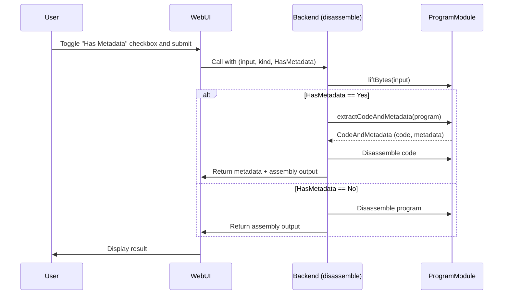

# Add metadata parsing

## Pull Request by @tomusdrw


<!-- This is an auto-generated comment: release notes by coderabbit.ai -->
## Summary by CodeRabbit

- **New Features**
  - Added an option in the web interface to include or exclude metadata in the disassembly output using a new "Has Metadata" checkbox.
  - Enhanced the disassembly process to support metadata extraction and display when requested.
  - Introduced a method to retrieve all remaining bytes from the current position during decoding.

- **Improvements**
  - Improved handling of program input by allowing users to control metadata inclusion in both web and command-line interfaces.
<!-- end of auto-generated comment: release notes by coderabbit.ai -->


## Comment by @coderabbitai[bot]

<!-- This is an auto-generated comment: summarize by coderabbit.ai -->
<!-- walkthrough_start -->

## Walkthrough

This update introduces support for handling and displaying metadata in the disassembly process. A new `HasMetadata` enum is added to control whether metadata is included in the disassembly output. The `disassemble` function and its usage are updated to accept this parameter. The backend logic now includes functions and classes for extracting code and metadata from input data. The web interface is enhanced with a checkbox allowing users to toggle metadata inclusion, and related logic is updated to pass the user's choice to the backend. Minor adjustments are made in the CLI to specify metadata handling explicitly. Additionally, a new method `remainingBytes()` is added to the `Decoder` class to facilitate reading remaining bytes from a buffer.

## Changes

| Files / Areas                  | Change Summary                                                                                          |
|-------------------------------|--------------------------------------------------------------------------------------------------------|
| `assembly/codec.ts`            | Added `remainingBytes()` method to `Decoder` class for consuming and returning all remaining bytes.     |
| `assembly/index.ts`            | Added `HasMetadata` enum; updated `disassemble` signature and logic to support metadata extraction.     |
| `assembly/program.ts`          | Added `CodeAndMetadata` class and `extractCodeAndMetadata` function; updated `decodeSpi` for arguments.|
| `bin/index.js`                 | Updated `disassemble` call to explicitly pass `HasMetadata.No` as third argument.                      |
| `web/index.html`               | Added "Has Metadata" checkbox and logic to pass user choice to `disassemble` using `HasMetadata` enum.  |

## Sequence Diagram(s)



## Poem

> In bytes and code, a secret lies,  
> Now metadata’s in our eyes!  
> A toggle here, a checkbox there,  
> Reveals more wonders, if you dare.  
> With enum flags and flows anew,  
> This rabbit’s code hops right on through!  
> 🐇✨

<!-- walkthrough_end -->


---

<details>
<summary>📜 Recent review details</summary>

**Configuration used: CodeRabbit UI**
**Review profile: CHILL**
**Plan: Pro**

<details>
<summary>📥 Commits</summary>

Reviewing files that changed from the base of the PR and between f31713330e40e3ea678a853185b28b31767964ef and 5d3b27a7b76b3a006544b25ec571b115aac45f73.

</details>

<details>
<summary>📒 Files selected for processing (1)</summary>

* `assembly/program.ts` (5 hunks)

</details>

<details>
<summary>🚧 Files skipped from review as they are similar to previous changes (1)</summary>

* assembly/program.ts

</details>

</details>
<!-- internal state start -->


<!-- DwQgtGAEAqAWCWBnSTIEMB26CuAXA9mAOYCmGJATmriQCaQDG+Ats2bgFyQAOFk+AIwBWJBrngA3EsgEBPRvlqU0AgfFwA6NPEgQAfACgjoCEejqANiS4BBWvTa40tamh5oKieBiIGActjMApRcAKwATAYAqoghkATM2Ii0FADuRvrG4FBk9PgAZjgExGTKNPRMrOxcvPzCouJSMvJMSlSq6lo6mSZQcKiomEWEpORU5QpVGJyQVKmQiIHMHvJyCm0qapraumCGWaYGaIixQRayAPStohq4iBwGAETPBgDEr5A2AJIlY9R0CyWK34hQYsEwpEQRhskHI80csEUkAABhQSMtvN4iAAhWQ0RAACgAlMjIKljuh7ACCPFYCQUQARUSKSikhgWY6IDQwBDIBFItG4bAUDDINzIqLeXAADhsFCosjZ+Gm2gwWPQFgskDk+Mg+QoLFp9IYwrR0xB+ViuHi+CNkFyILtiHwwoY9IE2Hy+Uo3K+1rQFmdlIkmDdyFwdJQ00oGADFqt2vkEfpVh8EcdydmJCFIoBiwEHgVABp7V6GpISOcFKLAuqA1q0Ri1T5E7rvE6XRQ3RojO9PhYaON4Mrw7bM0p2R5qMPRY6SAAPbj4CgTZc8bACCzwBj26bqeDSDKQACy2cR9GcSloXFR6NVWNx+OJXEl01l8rQiqjjA5J0ZzLaUl22RTl0U3S5rgYW5EGRJ4XgMCAwCMUCzkubwlHnaCHmeR43g+b5fjKPMgQoeQCkYcEfEPAw4HpZFaCQFDNxIUl8mwDAxBnBZ4CIWMc3pclkDBCFqVtbx2WwJR0FpeAKHobgp0cSgUVSdRYFPJwXCcUlyMzOFd0CeJZG4OiAAljg05xXFJAlVPTEMLGwaQUQATWcgBeSAAAZSUwehkT8W1PIARmRIlfVFeApPoxiTjAqxkRLTNvG4PBW2cjx6XyWTEGtJgMCkFdROk3h8CIKhmCzXhpHYadlUgCR4HFLd8lwR9pGRX1CmROz1OzKztJQZBkTcmCksjNiOPEeqF1wKgxCEll0AwBx+q0tx9UNTNSvKtBKqSdVkVm+bcAAYRZGwVss9bEqqjkwztHaKrJNS7WOtAxABa4Sz8ng0RMlaxT1ZdllwCZHAGtw6XnBY5vVGlMxdXBUs0HksvYzj6uTLBSrdOhR0gBjECYqxHoNXbKoLWI8iwTNkQAa3Q0kFIq7NlIJZEAHFSgobcdL4ZEAGUAAUvjCn7uABhiW0zEmyLwFGbTtCH1th3mW3gQpqtiaZuVorMcywBynOrBh/j45zMxV1w1fVAlNeW2QiRe9NZbi1D+AVvA9cjeBmCXFdYf+NhzUEyBsG4LTivExypL0kh5iO+c5o+s6LqutbrL1DHpqwTbKs6i4nr2zre3wgcyhnAnx1EDkhxHOdF2XVc+FSzdt13cRxGoqAAFEMEMy86BvczEGurPesgNggkoYbRsgTyfOW/zAoXyBQu/ED3fAi50IXaDYKgAAxHOuK8XjqGFekI6j68USJkmSHtjAUa4bBpQAbQAXRLRmVq4L4L88AAGl0JEi4LldWRBSSACTCe+sVTjMWfq/cOn8f6QD/nfQBKNQErRLL1ceTguCj0IWgcBtsfBASwFvRB5xd4rX3ncWCOEMiHDlkXcmFUsJwVwn2AiowiL0EWKwYE5FhJUShAYGE+kFwBwmJOP8yJzpKEurQUhpIw5D3oDSMgZtuCLA5DQEq2g+DkQlFKd8CodL1AWlVNEOtxAtmuMvKemcnDcmkQne0Tcir0Empjah70xDKJIKo9RZIKRSgNLQbAbpaD4IQGCQmAEMoolfDKOUVioyKzWNlTw1o0TODrA1DwTVmJgFTEQdM7Fz7kHoAAZnCGALYUYaCkD4Ohbc04ZaRkqemci1snDjTIN4lOnEenUFcZpG2sQiAh1wD9FaepvD1nkEExxRA7SNnvC2HUGVFpKBLIKYUzZNlDG8LlUM9IzEhLCW4tAnVICALevOJAGz74pMFtweArFT7Kh+q1ZShTpabMzM42Z8zhlZibOqPZYo0SwnwPMTkPE6lKzcPpCw+AzZahDLzFQpNkQAH0PBEECOwMatIXREFgDJZAeKymk1QBgfA1okgAjYiuOkFAPH2H3MqVZJZ9K0GxeSlUudJjzOQGib0ZoGDw0jJzBUkBhZoBMnwRAJl5XZTNhK1IlB6RaKVknMZacVEZ2mdpEs9FPnfNujazcgh7XHmOPTW6v1kTYmONubEWKGD0xgkrTpur6TJlkgsLVmsukSsKl4EcPY8L9kHHVWcCNIwTjrim5A5FZHNwBGuNuW4dzsH3D3T4VJ6C5t8T+TkKJbkWshho16+VIGxIIHwD6bpuDvORNcF8FjMmfl8ks5Egy0D9rfIOxUPYoB2CvN4uRHK/mBOTidetaj7kEnWhOjJH4nZcHXeomdJ5FBRoBFWiY/iJU2uuF8+AW7XA7ssZ+chwtOEl0TJSEF0lMXYrjAygldESUUDJVK3yJxUXFUzNszEuy8QZUBXwYFCrjRLQhewHsLCEKHDUBgehGENBCHuDwxN/Ceb/CESRMioJKKQjML7f2zcg40HmRE5AN8KNBo4rHMyFl7msQNJVK2ihsCEseBoDQFwPTwAsLQC4aIrDHBIIRxAjxHmAK8HHSMyJcbSEQAAKWdBgX5U0ZxQpxVqGkMVibbwSmxiiIltG2kvNJCMskLwgbFdaZEJD7kaECo8t9JBGoukQOca1D9bMsXsxZgEk9cCpGc55qVN4Ure2LswYd/lsEgPQhobmYw+bckCvMdQQ1GD1ji69CMaJDXJYpaloBmgMv2py7gXBtB8s8z5os/yvnLVoH8/gR5/RkCyKLZYeQmrRBnvDOCa0LKpmQwWIiUT9BghRgkvOmJUDCYIPivIVIdIsBKA9Js5gS1UBkEA51suSbK4NzTfSDNU5c7ZsKBe/NrcNxFs7qWyRgVyCYfgohIw+qBD4f3rAXAzALDYReHwn4AjxjEREaRR04i6M0UjJj5yUSRNukBJLJj+Q1wYq8Y8UeJ57mPH4N2ri7ZMzg9aZQfIH1lNoxRP1xtBlKoDEY9W/OdoCz+odBdmJpNfrk/mGCUQ9MBD4Bhml60k8ooojHUBMUFalaZlMtAY8AAZH29JEAMF5t2yAABHJyvNLa8gonLhXMNfrAuQOoISdJRdCKcEYnb6oFyiDwDOH2qBLlGNQPlQqEwpTOa53xgbpIyCGWNvSDmo1+YogC87X6Ck4oXjFFgS8/LYxalJV5nX2nIu0Oi1e4PnP7HWl0r0sq24Swx0kuqFmXgnFLRdyQIgbzZ4lkoAaPglFaBbh8L12Y7FTlkzKhVI5d4Lnhw4rRugxvYReNl/6p3GosWpHY7ETwOuypEFJmOzbjk41YEZ+m/bHskYowTXdmwFd66prHOm2ur2q6N0XXkN9u3MWnuN3JIlAKvLjgTJ9oAeuMAX9mAQAOTJKTgf7ID6oIrLBSR36oAMRegADc/AGAVYSQaApALiUQXwLOu0EqOaryuU/uoBB4yAHM3ON0zsGBhqFawOuE2G+wvQu4eQhQaAeAIw5G8iLA8yXAcwgIaOqwLQLI7QWwXQuwhgAhlQzA6gRKUUiARKaIjUCcdARKlygcmQBgAhAA7BYbQAACwACcKgAAbCQGgKEHYS4fUnYY4cFF5F5PkAwDYW6NKCQPUtKOEHYeECQCQNKMFPkF5HYRYaoeYdkHqPUsFBYcFPUlkV5CQDYTkfUi4Y4RYdKGgNKKEGkWUQIOENKAIGkRYUUV4TYSQIUD0CkaELQPUlURYWgBYQIPUbUWgL4Y4aEDYTYVUaEKIKEBkQIMFMFKEGgB9DYaEPkBYfUkkckRAJKloToXocFgePqrQESg6PoEAA -->

<!-- internal state end -->
<!-- finishing_touch_checkbox_start -->

<details open="true">
<summary>✨ Finishing Touches</summary>

- [ ] <!-- {"checkboxId": "7962f53c-55bc-4827-bfbf-6a18da830691"} --> 📝 Generate Docstrings

</details>

<!-- finishing_touch_checkbox_end -->
<!-- tips_start -->

---


<details>
<summary>🪧 Tips</summary>

### Chat

There are 3 ways to chat with [CodeRabbit](https://coderabbit.ai?utm_source=oss&utm_medium=github&utm_campaign=tomusdrw/anan-as&utm_content=52):

- Review comments: Directly reply to a review comment made by CodeRabbit. Example:
  - `I pushed a fix in commit <commit_id>, please review it.`
  - `Generate unit testing code for this file.`
  - `Open a follow-up GitHub issue for this discussion.`
- Files and specific lines of code (under the "Files changed" tab): Tag `@coderabbitai` in a new review comment at the desired location with your query. Examples:
  - `@coderabbitai generate unit testing code for this file.`
  -	`@coderabbitai modularize this function.`
- PR comments: Tag `@coderabbitai` in a new PR comment to ask questions about the PR branch. For the best results, please provide a very specific query, as very limited context is provided in this mode. Examples:
  - `@coderabbitai gather interesting stats about this repository and render them as a table. Additionally, render a pie chart showing the language distribution in the codebase.`
  - `@coderabbitai read src/utils.ts and generate unit testing code.`
  - `@coderabbitai read the files in the src/scheduler package and generate a class diagram using mermaid and a README in the markdown format.`
  - `@coderabbitai help me debug CodeRabbit configuration file.`

Note: Be mindful of the bot's finite context window. It's strongly recommended to break down tasks such as reading entire modules into smaller chunks. For a focused discussion, use review comments to chat about specific files and their changes, instead of using the PR comments.

### CodeRabbit Commands (Invoked using PR comments)

- `@coderabbitai pause` to pause the reviews on a PR.
- `@coderabbitai resume` to resume the paused reviews.
- `@coderabbitai review` to trigger an incremental review. This is useful when automatic reviews are disabled for the repository.
- `@coderabbitai full review` to do a full review from scratch and review all the files again.
- `@coderabbitai summary` to regenerate the summary of the PR.
- `@coderabbitai generate docstrings` to [generate docstrings](https://docs.coderabbit.ai/finishing-touches/docstrings) for this PR.
- `@coderabbitai generate sequence diagram` to generate a sequence diagram of the changes in this PR.
- `@coderabbitai resolve` resolve all the CodeRabbit review comments.
- `@coderabbitai configuration` to show the current CodeRabbit configuration for the repository.
- `@coderabbitai help` to get help.

### Other keywords and placeholders

- Add `@coderabbitai ignore` anywhere in the PR description to prevent this PR from being reviewed.
- Add `@coderabbitai summary` to generate the high-level summary at a specific location in the PR description.
- Add `@coderabbitai` anywhere in the PR title to generate the title automatically.

### CodeRabbit Configuration File (`.coderabbit.yaml`)

- You can programmatically configure CodeRabbit by adding a `.coderabbit.yaml` file to the root of your repository.
- Please see the [configuration documentation](https://docs.coderabbit.ai/guides/configure-coderabbit) for more information.
- If your editor has YAML language server enabled, you can add the path at the top of this file to enable auto-completion and validation: `# yaml-language-server: $schema=https://coderabbit.ai/integrations/schema.v2.json`

### Documentation and Community

- Visit our [Documentation](https://docs.coderabbit.ai) for detailed information on how to use CodeRabbit.
- Join our [Discord Community](http://discord.gg/coderabbit) to get help, request features, and share feedback.
- Follow us on [X/Twitter](https://twitter.com/coderabbitai) for updates and announcements.

</details>

<!-- tips_end -->


## Comment by @coderabbitai[bot]

_⚠️ Potential issue_

**Missing import for HasMetadata enum.**

The code is using `HasMetadata.No` but there's no import statement for the `HasMetadata` enum. This will cause a runtime error.


```diff
- import { runVm, InputKind, disassemble } from "../build/release.js";
+ import { runVm, InputKind, disassemble, HasMetadata } from "../build/release.js";
```


<!-- suggestion_start -->

<details>
<summary>📝 Committable suggestion</summary>

> ‼️ **IMPORTANT**
> Carefully review the code before committing. Ensure that it accurately replaces the highlighted code, contains no missing lines, and has no issues with indentation. Thoroughly test & benchmark the code to ensure it meets the requirements.

`````suggestion
-import { runVm, InputKind, disassemble } from "../build/release.js";
+import { runVm, InputKind, disassemble, HasMetadata } from "../build/release.js";
`````

</details>

<!-- suggestion_end -->

<!-- This is an auto-generated comment by CodeRabbit -->

✅ Addressed in commit f317133
