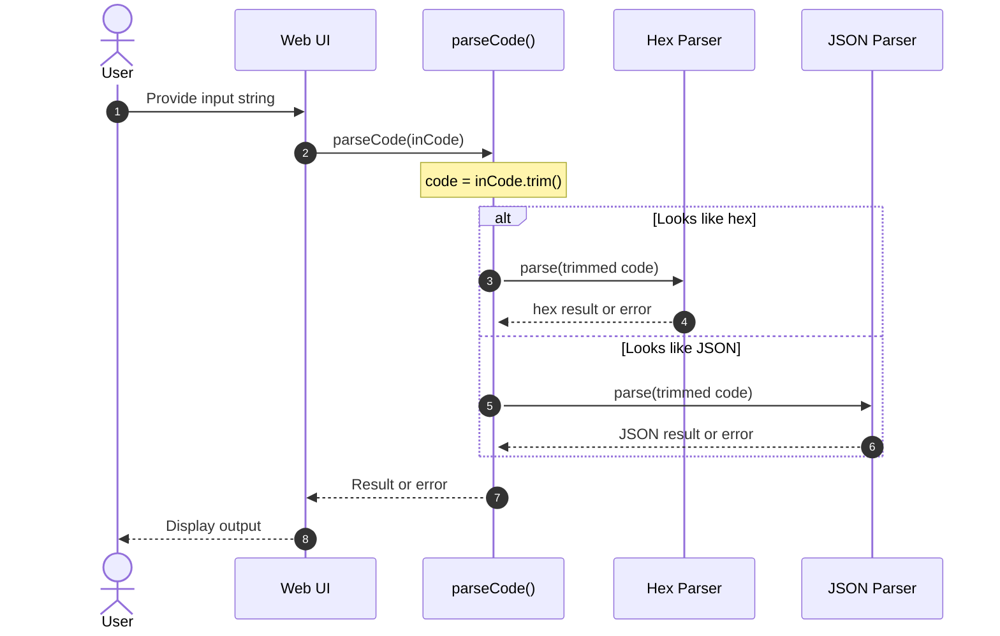

# Remove whitespace from input.

## Pull Request by @tomusdrw

<!-- This is an auto-generated comment: release notes by coderabbit.ai -->

## Summary by CodeRabbit

* **Bug Fixes**
  * Inputs with leading or trailing spaces are now trimmed automatically before parsing, reducing false errors and improving reliability for both hex and JSON content.
  * Pasted content with extra whitespace is handled more gracefully, without affecting existing parsing behavior.
  * No changes to error messages or other parsing outcomes; overall flow remains consistent while accepting more forgiving input formats.

<!-- end of auto-generated comment: release notes by coderabbit.ai -->

## Comment by @coderabbitai[bot]

<!-- This is an auto-generated comment: summarize by coderabbit.ai -->
<!-- walkthrough_start -->

## Walkthrough
The parser in web/index.html now trims input before deciding between hex or JSON parsing. The parameter was renamed from code to inCode, with a local const code = inCode.trim(). No other logic, error handling, or exports changed.

## Changes
| Cohort / File(s) | Summary of edits |
| --- | --- |
| **Input trimming before parse** `web/index.html` | Renamed parseCode parameter from code to inCode; introduced const code = inCode.trim(); subsequent hex/JSON parsing uses trimmed code; no other control flow or error handling changes; no public/exported APIs affected. |

## Sequence Diagram(s)

## Estimated code review effort
🎯 2 (Simple) | ⏱️ ~10 minutes

## Poem
> I nibbled the edges, neat and prim,  
> Whitespace whiskers—snip and trim!  
> Hex or JSON, clean and bright,  
> Hop we go to parse it right.  
> With tidy fields and ears a-flare,  
> This bunny ships with extra care. 🐇✨

<!-- walkthrough_end -->

<!-- announcements_start -->

> [!TIP]
> 

> 
🔌 Remote MCP (Model Context Protocol) integration is now available!

> 
> Pro plan users can now connect to remote MCP servers from the [Integrations](https://app.coderabbit.ai/integrations) page. Connect with popular remote MCPs such as Notion and Linear to add more context to your reviews and chats.
> 
> 

<!-- announcements_end -->
<!-- internal state start -->

<!-- DwQgtGAEAqAWCWBnSTIEMB26CuAXA9mAOYCmGJATmriQCaQDG+Ats2bgFyQAOFk+AIwBWJBrngA3EsgEBPRvlqU0AgfFwA6NPEgQAfACgjoCEejqANiS4AlEs3xTIAdwQ1E3NAxKQAZhRYUDG48DQMAOWxmAUouAHYABgMAVRsAGS5YXFxuRA4AenyidVhsAQ0mZnyCZmxEWgpnfMxMMDREfJCLC3zElMRYyBq6hucDAGV8bApvSAEqDAZYLlxaMFd1aU9vA2g0ClJcOYWlrmZtDAncajqufG4yAzsJeBJnSjzIAzSVEgtPgwAYQoJGodHQnEgACYElCAKxgBIADjAAEYAJzQBLojgAFgSHAAzOiAFpGfTGcBQMj0fC+HAEYhkZQ0eiVNgYSG8fjCUTiKQyeRMJRUVTqLQ6CkmKBwVCoTAMwikchUVkKVjsLhUZyQRBRc4UeRyBQilRqTTaXRgQyU0wGd4CfLwDBKAAeGiyzAsHAMACJ/QYAMSByAAQQAkkyVWD6HrWPt5HTGLBMKREOTIAAFfZoNg0PgYXM+JOeCgDQGKHxLVPg/yBYU+AhBCtKMJQUO0JT0NCQcg6iz4BhoCyQCzO6wKDCII4NyAAXmblY0uAo8GYAAoAJQAbhcCCWkCUvnHyB7K7XbHoUjL8HwWCTuFgPmdISOvnwfD1AgGAEdsOweH2RBnSINtIHGexMHEBhkEQBBfEhF88F1c8MCIZBnBKUdQVoEDqioeAxzQvdNg8LwfH2HwMHwHVzw1egYnfEFICfV1+D4AApcYAHlwkAm80N3R8fBBad+HpYT+OA4iB2KBhIHXVjAMfdAXUgLjeOU2BN0gEFzmdZBJMQIsABo5mQ+4WWkfgsEkujLxNHwJH2eAVCsMDwnwZMa0MrzKACPgUxdIiiHYoYn34a9hxHJhOQCEdfAHHUYlkO96DqEDwsbVd6KCV8wiMIMQ1DCx82oW8pyGLzJKUBgLBzcQ72QJMSFdbgPzVD8eDKMd5PYdRXnTAwoE8yBWvaihWU6Hr4Hk2r6tVCrkGrNC6AKgBRac1xjRzdJIF43jG3wmMhABZOh4CiP0A2G61bWpNSkzQPAlWZVVwXZTVdLQHU4wNI0hUrUVzQlK1DGldVmHUAB9eBaEQaGQQO95aGh6d9iOCkDAhhhaCRUQkUJJFVDiXE0AANjQEhkVROEoUJOEBChEgSESXxaFxJFcThXEoXROF6SxnGWCh3BYfhxH9teFHoZpMHsapSBmAYbhodimhXTF9HJvlgwAG8DEgSBfSHTw1DHcRpHGfUE19LhfVG07AUzKr8H+dBnMItySF9AwAF97qVlW1bvDWxbl/QgA== -->

<!-- internal state end -->
<!-- finishing_touch_checkbox_start -->

✨ Finishing Touches

🧪 Generate unit tests

- [ ] <!-- {"checkboxId": "f47ac10b-58cc-4372-a567-0e02b2c3d479", "radioGroupId": "utg-output-choice-group-unknown_comment_id"} -->   Create PR with unit tests
- [ ] <!-- {"checkboxId": "07f1e7d6-8a8e-4e23-9900-8731c2c87f58", "radioGroupId": "utg-output-choice-group-unknown_comment_id"} -->   Post copyable unit tests in a comment
- [ ] <!-- {"checkboxId": "6ba7b810-9dad-11d1-80b4-00c04fd430c8", "radioGroupId": "utg-output-choice-group-unknown_comment_id"} -->   Commit unit tests in branch `td-whitespace`

<!-- finishing_touch_checkbox_end -->
<!-- tips_start -->

---

Thanks for using CodeRabbit! It's free for OSS, and your support helps us grow. If you like it, consider giving us a shout-out.

❤️ Share

- [X](https://twitter.com/intent/tweet?text=I%20just%20used%20%40coderabbitai%20for%20my%20code%20review%2C%20and%20it%27s%20fantastic%21%20It%27s%20free%20for%20OSS%20and%20offers%20a%20free%20trial%20for%20the%20proprietary%20code.%20Check%20it%20out%3A&url=https%3A//coderabbit.ai)
- [Mastodon](https://mastodon.social/share?text=I%20just%20used%20%40coderabbitai%20for%20my%20code%20review%2C%20and%20it%27s%20fantastic%21%20It%27s%20free%20for%20OSS%20and%20offers%20a%20free%20trial%20for%20the%20proprietary%20code.%20Check%20it%20out%3A%20https%3A%2F%2Fcoderabbit.ai)
- [Reddit](https://www.reddit.com/submit?title=Great%20tool%20for%20code%20review%20-%20CodeRabbit&text=I%20just%20used%20CodeRabbit%20for%20my%20code%20review%2C%20and%20it%27s%20fantastic%21%20It%27s%20free%20for%20OSS%20and%20offers%20a%20free%20trial%20for%20proprietary%20code.%20Check%20it%20out%3A%20https%3A//coderabbit.ai)
- [LinkedIn](https://www.linkedin.com/sharing/share-offsite/?url=https%3A%2F%2Fcoderabbit.ai&mini=true&title=Great%20tool%20for%20code%20review%20-%20CodeRabbit&summary=I%20just%20used%20CodeRabbit%20for%20my%20code%20review%2C%20and%20it%27s%20fantastic%21%20It%27s%20free%20for%20OSS%20and%20offers%20a%20free%20trial%20for%20proprietary%20code)

🪧 Tips

### Chat

There are 3 ways to chat with [CodeRabbit](https://coderabbit.ai?utm_source=oss&utm_medium=github&utm_campaign=tomusdrw/anan-as&utm_content=70):

- Review comments: Directly reply to a review comment made by CodeRabbit. Example:
  - `I pushed a fix in commit <commit_id>, please review it.`
  - `Open a follow-up GitHub issue for this discussion.`
- Files and specific lines of code (under the "Files changed" tab): Tag `@coderabbitai` in a new review comment at the desired location with your query.
- PR comments: Tag `@coderabbitai` in a new PR comment to ask questions about the PR branch. For the best results, please provide a very specific query, as very limited context is provided in this mode. Examples:
  - `@coderabbitai gather interesting stats about this repository and render them as a table. Additionally, render a pie chart showing the language distribution in the codebase.`
  - `@coderabbitai read the files in the src/scheduler package and generate a class diagram using mermaid and a README in the markdown format.`

### Support

Need help? Create a ticket on our [support page](https://www.coderabbit.ai/contact-us/support) for assistance with any issues or questions.

### CodeRabbit Commands (Invoked using PR/Issue comments)

Type `@coderabbitai help` to get the list of available commands.

### Other keywords and placeholders

- Add `@coderabbitai ignore` anywhere in the PR description to prevent this PR from being reviewed.
- Add `@coderabbitai summary` to generate the high-level summary at a specific location in the PR description.
- Add `@coderabbitai` anywhere in the PR title to generate the title automatically.

### CodeRabbit Configuration File (`.coderabbit.yaml`)

- You can programmatically configure CodeRabbit by adding a `.coderabbit.yaml` file to the root of your repository.
- Please see the [configuration documentation](https://docs.coderabbit.ai/guides/configure-coderabbit) for more information.
- If your editor has YAML language server enabled, you can add the path at the top of this file to enable auto-completion and validation: `# yaml-language-server: $schema=https://coderabbit.ai/integrations/schema.v2.json`

### Status, Documentation and Community

- Visit our [Status Page](https://status.coderabbit.ai) to check the current availability of CodeRabbit.
- Visit our [Documentation](https://docs.coderabbit.ai) for detailed information on how to use CodeRabbit.
- Join our [Discord Community](http://discord.gg/coderabbit) to get help, request features, and share feedback.
- Follow us on [X/Twitter](https://twitter.com/coderabbitai) for updates and announcements.

<!-- tips_end -->
