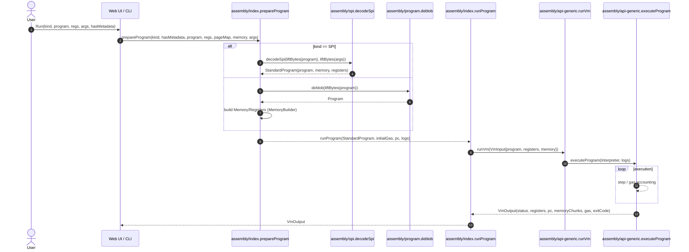
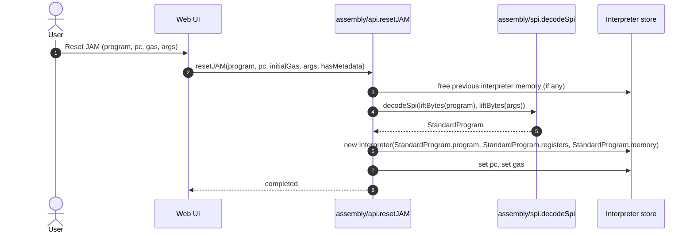

# Decode standard program

## Pull Request by @DrEverr


<!-- This is an auto-generated comment: release notes by coderabbit.ai -->
## Summary by CodeRabbit

- **New Features**
  - SPI program input with arguments and optional metadata; new API to load/reset SPI programs and a streamlined prepare/run flow.

- **UI**
  - Added Arguments panel and SPI toggle; args input validated and visibility tied to SPI selection.

- **Bug Fixes / Reliability**
  - Safer interpreter resets, explicit memory cleanup, and more robust memory initialization.

- **Tests**
  - Added SPI decoding tests and integrated them into the test runner.

- **Style**
  - Added rule to hide collapsed UI details.
<!-- end of auto-generated comment: release notes by coderabbit.ai -->


## Comment by @coderabbitai[bot]

<!-- This is an auto-generated comment: summarize by coderabbit.ai -->
<!-- walkthrough_start -->

## Walkthrough
Adds SPI decoding and StandardProgram construction; refactors VM input to carry Program/Memory/Registers; extracts executeProgram from runVm; introduces prepareProgram/runProgram APIs; adds memory builder helpers, SPI decoder/tests, CLI/UI args handling, and new resetJAM/resetGeneric variants.

## Changes
| Cohort / File(s) | Summary |
| --- | --- |
| **VM input & runner**<br>`assembly/api-generic.ts` | Replace `VmInput` fields with constructor exposing `program: Program`, `memory: Memory`, `registers: Registers`; remove unused imports; add `executeProgram(int, logs)` helper centralizing interpreter loop; simplify `runVm` to construct `Interpreter` from `input` and call `executeProgram`. |
| **Public API & resets**<br>`assembly/api.ts` | Add `resetJAM(program, pc, initialGas, args, hasMetadata)`; update `resetGeneric` and `resetGenericWithMemory` to accept `hasMetadata`; import `decodeSpi` and `extractCodeAndMetadata`; ensure previous interpreter memory is freed before replacing. |
| **Top-level prepare/run**<br>`assembly/index.ts` | Add `prepareProgram(kind, hasMetadata, program, initialRegisters, initialPageMap, initialMemory, args)` returning `StandardProgram`; change `runProgram` to accept `StandardProgram`, build `VmInput`, and call `runVm`. |
| **SPI decoder & StandardProgram**<br>`assembly/spi.ts` | New `decodeSpi(data, args)` parsing header and segments, building `Memory` via `MemoryBuilder`, deblobing code to `Program`, and returning a `StandardProgram` (program, memory, registers, metadata, helpers). |
| **SPI tests & harness**<br>`assembly/spi.test.ts`, `assembly/test-run.ts` | Add `spi` test suite (`TESTS`) verifying `decodeSpi`→`StandardProgram`; wire `spi.TESTS` into `runAllTests()`. |
| **Program module cleanup**<br>`assembly/program.ts` | Remove `decodeSpi` export; retain `liftBytes`/`lowerBytes` utilities. |
| **Memory builder & page API**<br>`assembly/memory.ts`, `assembly/memory-page.ts` | Add `MemoryBuilder.setEmpty` and `getOrCreatePageForAddress`; refactor `setData` to use helper; introduce `SEGMENT_SIZE`, `SEGMENT_SIZE_SHIFT` and alias `RESERVED_MEMORY = SEGMENT_SIZE`; explicitly type `PAGE_SIZE_SHIFT`. |
| **Web UI & CLI wiring**<br>`web/index.html`, `web/styles.css`, `web/pvm-metadata.json`, `bin/index.js` | Add JAM SPI arguments UI and toggles; parse/validate args; call `prepareProgram` then `runProgram`; update imports/disassemble signature to accept args; add `details.hidden { display: none; }`; enable `resetJAM`/`resetGenericWithMemory` capabilities; update CLI to use `prepareProgram`+`runProgram`. |
| **Misc / imports**<br>`assembly/test-run.ts`, other small files | Add/import references to new SPI module and update import lists to include `prepareProgram`/`runProgram` where relevant. |

## Sequence Diagram(s)




## Estimated code review effort
🎯 4 (Complex) | ⏱️ ~60 minutes

## Possibly related PRs
- tomusdrw/anan-as#53 — Overlaps SPI decoding and argument handling; touches the same decodeSpi/args surface.  
- tomusdrw/anan-as#49 — Related refactors around program decoding, memory-page, and api-generic changes.

## Suggested reviewers
- mateuszsikora

## Poem
> I munched on headers, stacked args in rows,  
> Aligned the pages where the memory grows.  
> SPI whispered bytes, I stitched them with care,  
> I hopped, I reset, then ran — logs in the air.  
> Rabbit cheers: compile, execute, and share! 🐇

<!-- walkthrough_end -->


<!-- pre_merge_checks_walkthrough_start -->

## Pre-merge checks and finishing touches
<details>
<summary>❌ Failed checks (2 warnings)</summary>

|     Check name     | Status     | Explanation                                                                                                                                                                                                                                                                                                                                                                                                                                                                                                                                                                                                                      | Resolution                                                                                                                                                                                                                                                                                                    |
| :----------------: | :--------- | :------------------------------------------------------------------------------------------------------------------------------------------------------------------------------------------------------------------------------------------------------------------------------------------------------------------------------------------------------------------------------------------------------------------------------------------------------------------------------------------------------------------------------------------------------------------------------------------------------------------------------- | :------------------------------------------------------------------------------------------------------------------------------------------------------------------------------------------------------------------------------------------------------------------------------------------------------------ |
|     Title Check    | ⚠️ Warning | The title “Decode standard program” focuses narrowly on the SPI decoding aspect, but the pull request actually delivers a broad refactoring of the VM API and runtime flow, including new executeProgram, prepareProgram/runProgram functions, updated VmInput construction, memory builder enhancements, UI adjustments, and test integrations. It does not communicate the introduction of the StandardProgram API or the extensive reorganization of reset and run functions across modules. As a result, teammates scanning the history may miss the scope and impact of the API and infrastructure changes beyond decoding. | Please update the title to clearly reflect the full scope of the changes, for example “Introduce StandardProgram API and refactor VM runtime with prepareProgram/runProgram and SPI decoding,” so that reviewers and future maintainers understand the primary refactoring and new functionality at a glance. |
| Docstring Coverage | ⚠️ Warning | Docstring coverage is 25.00% which is insufficient. The required threshold is 80.00%.                                                                                                                                                                                                                                                                                                                                                                                                                                                                                                                                            | You can run `@coderabbitai generate docstrings` to improve docstring coverage.                                                                                                                                                                                                                                |

</details>
<details>
<summary>✅ Passed checks (1 passed)</summary>

|     Check name    | Status   | Explanation                                                 |
| :---------------: | :------- | :---------------------------------------------------------- |
| Description Check | ✅ Passed | Check skipped - CodeRabbit’s high-level summary is enabled. |

</details>

<!-- pre_merge_checks_walkthrough_end -->

<!-- finishing_touch_checkbox_start -->

<details>
<summary>✨ Finishing touches</summary>

- [ ] <!-- {"checkboxId": "7962f53c-55bc-4827-bfbf-6a18da830691"} --> 📝 Generate Docstrings
<details>
<summary>🧪 Generate unit tests</summary>

- [ ] <!-- {"checkboxId": "f47ac10b-58cc-4372-a567-0e02b2c3d479", "radioGroupId": "utg-output-choice-group-unknown_comment_id"} -->   Create PR with unit tests
- [ ] <!-- {"checkboxId": "07f1e7d6-8a8e-4e23-9900-8731c2c87f58", "radioGroupId": "utg-output-choice-group-unknown_comment_id"} -->   Post copyable unit tests in a comment

</details>

</details>

<!-- finishing_touch_checkbox_end -->


---

<details>
<summary>📜 Recent review details</summary>

**Configuration used**: CodeRabbit UI

**Review profile**: CHILL

**Plan**: Pro

<details>
<summary>📥 Commits</summary>

Reviewing files that changed from the base of the PR and between c7981715f116d8abcbe5b73277b74429bde97356 and ac1dd45f0840661298eb3d6ee184a003f83d0340.

</details>

<details>
<summary>📒 Files selected for processing (2)</summary>

* `assembly/spi.test.ts` (1 hunks)
* `bin/index.js` (6 hunks)

</details>

<details>
<summary>🧰 Additional context used</summary>

<details>
<summary>🧬 Code graph analysis (2)</summary>

<details>
<summary>assembly/spi.test.ts (3)</summary><blockquote>

<details>
<summary>assembly/test.ts (3)</summary>

* `Test` (1-6)
* `test` (38-40)
* `Assert` (8-36)

</details>
<details>
<summary>assembly/program.ts (1)</summary>

* `liftBytes` (28-32)

</details>
<details>
<summary>assembly/spi.ts (1)</summary>

* `decodeSpi` (15-78)

</details>

</blockquote></details>
<details>
<summary>bin/index.js (1)</summary><blockquote>

<details>
<summary>assembly/index.ts (2)</summary>

* `prepareProgram` (47-89)
* `runProgram` (91-105)

</details>

</blockquote></details>

</details>

</details>

<details>
<summary>🔇 Additional comments (5)</summary><blockquote>

<details>
<summary>assembly/spi.test.ts (3)</summary><blockquote>

`1-3`: **LGTM!**

Imports are correctly structured and align with the available modules.

---

`5-22`: **LGTM!**

Test structure follows the established pattern and correctly implements the test framework conventions.

---

`7-19`: **LGTM!**

Test data and assertions are well-structured. The expected string correctly includes the `program: Program { ... }` wrapper, addressing the previous review feedback.

</blockquote></details>
<details>
<summary>bin/index.js (2)</summary><blockquote>

`8-8`: **Import statement updated correctly for processJson path.**

The imports now include `prepareProgram` and `runProgram`, aligning with the new execution model. However, note that `readFromStdin` still references `runVm` which is no longer imported (see separate comment).

---

`164-165`: **LGTM!**

The `processJson` function correctly adopts the new two-step execution flow: `prepareProgram` builds the `StandardProgram`, and `runProgram` executes it. All parameters are properly passed.

</blockquote></details>

</blockquote></details>

</details>

<!-- tips_start -->

---

Thanks for using CodeRabbit! It's free for OSS, and your support helps us grow. If you like it, consider giving us a shout-out.

<details>
<summary>❤️ Share</summary>

- [X](https://twitter.com/intent/tweet?text=I%20just%20used%20%40coderabbitai%20for%20my%20code%20review%2C%20and%20it%27s%20fantastic%21%20It%27s%20free%20for%20OSS%20and%20offers%20a%20free%20trial%20for%20the%20proprietary%20code.%20Check%20it%20out%3A&url=https%3A//coderabbit.ai)
- [Mastodon](https://mastodon.social/share?text=I%20just%20used%20%40coderabbitai%20for%20my%20code%20review%2C%20and%20it%27s%20fantastic%21%20It%27s%20free%20for%20OSS%20and%20offers%20a%20free%20trial%20for%20the%20proprietary%20code.%20Check%20it%20out%3A%20https%3A%2F%2Fcoderabbit.ai)
- [Reddit](https://www.reddit.com/submit?title=Great%20tool%20for%20code%20review%20-%20CodeRabbit&text=I%20just%20used%20CodeRabbit%20for%20my%20code%20review%2C%20and%20it%27s%20fantastic%21%20It%27s%20free%20for%20OSS%20and%20offers%20a%20free%20trial%20for%20proprietary%20code.%20Check%20it%20out%3A%20https%3A//coderabbit.ai)
- [LinkedIn](https://www.linkedin.com/sharing/share-offsite/?url=https%3A%2F%2Fcoderabbit.ai&mini=true&title=Great%20tool%20for%20code%20review%20-%20CodeRabbit&summary=I%20just%20used%20CodeRabbit%20for%20my%20code%20review%2C%20and%20it%27s%20fantastic%21%20It%27s%20free%20for%20OSS%20and%20offers%20a%20free%20trial%20for%20proprietary%20code)

</details>

<details>
<summary>🧪 Early access (Sonnet 4.5): enabled</summary>

We are currently testing the [Sonnet 4.5](https://www.anthropic.com/news/claude-sonnet-4-5) model, which is expected to improve code review quality. However, this model may lead to increased noise levels in the review comments. Please disable the early access features if the noise level causes any inconvenience.

Note:

- Public repositories are always opted into early access features.
- You can enable or disable early access features from the CodeRabbit UI or by updating the CodeRabbit configuration file.

</details>


<sub>Comment `@coderabbitai help` to get the list of available commands and usage tips.</sub>

<!-- tips_end -->

<!-- internal state start -->


<!-- DwQgtGAEAqAWCWBnSTIEMB26CuAXA9mAOYCmGJATmriQCaQDG+Ats2bgFyQAOFk+AIwBWJBrngA3EsgEBPRvlqU0AgfFwA6NPEgQAfACgjoCEejqANiS4ARUYpKREuTLTQV6vfESrMDAOWxmAUouAHYADgMAVQAlABkuWFxcbkQOAHoMonVYbAENJmYMgmZsRFoKAHcMzEwwNEQM7mwLCwzImMRQyBsKAFEpCgoDAGV8bAoGRwEqDAZYLmZGwmdXd1owLx80P2h3UlxIWcwFpe0MMZdccq58bjIDWJIJeBIqynTIA3iVEgsvgYAMIUEjUOjoTiQABMAAZoQBWMCwgCcYGh0OgcI4qI4AEYwgAtIz6YzgKBkej4ABmOAIxDIyho9CKbAwUN4/GEonEUhk8iYSioqnUWh0pJMUDgqFQmDphFI5CozIUrHYXCoVScQWWFHkcgUQpUak02l0YEMZNMBka3WCFlktW48AZSvgDA0uHSBgARH6DABiAOQACCAElXUyIYgde55DTGLBMKRECTIM8qvgKABrCEANQAsigMC0jkwMM4KNgxPB8BguHnmGGS3hIBh8JALHXSHxYPgLLRkJqeBRvL4ADQ8NCkAtobiTrOQNjMLPydxUWSIDSQMNHdtasgMOcxizg5DbCdLkgrvWT1yQUE5ZyfSCvNDoNvvBQV3BVsRZycFmTeAMCISA+y1XBYEcQsUGQED1HgNALHgAAvOgNAMKBRngZhuBQ6k3noKsMEbYtEOQtDqFretengUExAdb9K2rL1ICgxxmxoCheBIbjICqXJi1LDQL12ScQJEx8kG4xA7wwehJLwDRl1XYtnzQKlaVBARsHgAcQLA6TnwoZB71UvVIGpUdmCcEhuHccErLeActywnd2VHWhqwhEgAA9RDwEgAAVRx2WzoIsB4KC4ENaCUeh33IA8AoYILQrHXYrOweZxDrdikzLOsXBA5AOMgfzAryrAu3uScuyIHJQPk+hCIwZDIEbAB5PBS2Y39WJoydQXwtAGEMgrHF414JngjAUPITt8HudT4CUB8csbTCoH6PzfzGlVKrS6qlpWkIkxmmKYGghRQWLbjeOuGjTu4dAFOc9qLH4XrW1ta8BCY9xHH3Rh2CoFD0MUrAjvSsLL0EqCUCUdl3Q6ykwDWGhvtSPBkAACkx8phpIJ9ZMnbgGEnIhGknCyBTyDBszkiq/PUQ0SAASje+g6cYKxMGwbhtvTEhqQOrMIVw7gsy9LhnhXKR6CUAHBHq+BqVwAAhWQaGZ+9/C6gB9LqADFDdifoAHEw1GaB+liUYUDwmXEAAbiXfBFZF0mXylmX2I7d9ugc5VHAWkh3c0oRyhVP2KDYgh0BQogsAR2BJs/LVG2bPrEHgFPqEmEhhdnECSvITx8hQhhQ2CsNtQoMXpisxdDh6nHcCBBmme5449IHAtr1XSddKOZDuIhcqy8oT6rK7SCO1HIKCqXoh0/K5KWaqkK4ayyLoswwNgxDCxuOousyo7cqlAYU9lRo5AE386X44hRcWgB90KpR8RpDTAtFDqyIlwW+tpOpNhbEcECkAAAGf17SOjnC6RUlB3SekQDAgwkBdCQE1qLCWXBCL/EHMWW+2AEqwOMrJLg2AABsAAWAA2gAXRgZOGBYlmA0IiCwthsCHIzjnFwZsFELDBWnCQXh7C6bCIwKIruOVsy8KwTgkMGsejlhYv+PgaceBVy/qCTSdYmJENclwDhu8uGQAyuFPhMCZGQEHjeWQdiqGfDliTGSnxMFQAAbQIBdAuBxzYtAuBiA7QA0Qc6SMFA0FekwdgqAeDqQENgcEyAABvaxljJzKy7AIXJ9glAhgoEQII7BmYES1jraQxNED9ikCUspbI2IAF8rI2UgD6DQzRLE+ldjA3uMD0lZINsbM2Ftra23tqMSczwfamUgO06yLAuk9LcaZfpCTVHqKusM528dMnZMyswQpgoSBNPKeyZmoJ6kWEaaUq5bSOmrO6b0k5WyhkjO9l4xZyzOlvI2YgLZ7k4oJUITlGsdYwBWCkF9UETcCB8BSfgVIsT2QqKgGCwJsDqSQpOjDGgNjfB4zLrIh6oJuL1W8F8AQy1+ZYAALxWWQt0DmDZmDt1LIMvGm8P7VxhfAXM4F/jRUgOUCRAlcjQJXN5KwHN3J+ICbQcxJFGyDLzgXG4d0JWkExbg/BoIQEXwGmICEvN7xApebZYZkDRISNnNwQZ95bUiTpnwjiWAYGby4pQR6lA8bzgfJ4kyzM6Yc22Vi3Z5jNFQPZJAZlPr2R+spQGpSmhOESTtUCrNbqh56g5gM3ulLJhesJTvE5pL2TUqIIgQtmC/Q+hJNaeBkSnTwHQRwX0/ogyhgjCg0O9AYysDjPwWkQFQJ/3clxLyPkzKZz0Z/GuIY67Bu6LgAAUiGAsgbLHcJYeTBgXAMBBBCBQLNojLaNC4FevWpSvjYB4cwycSZECDxcG4FwXA6X9jBEyllAJOZcAkPgNa25dz8G4NVZCTEb4OGQOcqViN/L7TEECBwIYFLvs0tQd86twKNGw5+vDZUqwkEnJ6yAcGlDIFGKut8VGikkFGM6PG5y1Ya21rrPGBw60cwveISi6F51JopXxSgSH143WoxCTNwaFllRui4UpfEeCU17tTZm1kSDSDevIaatZyhMWcBLKGYn+J0wo9BLAJnbkZ03tPHiqaKDCy7smXTty+KW0ZLEmuicYzcBfmPLA9xoNfVfUR3Dc9pyQDxhFviOGv3HHpX+hNAG2W90TgsZa3R2ZTkRuUCaKGqBoYw1hhLxG8ZVK49IXdJyOYc0KA4AS1mCNvoq1F1AA1yP8A4tUJAYd1bVO45wxrO49z4C1DJ5AhXQKMZVgINjDgub3gQoJiGunfVOfEzooS5VbmtHEHNzhxaQ1kyTvnORc3ea3z/YLAO/AGBpT4CEFJd1bSXYmhvL8jn/UudBfFZA8WP24e/SluUzKxaAYe553A3m3QMAAOq5CcWpe8UcY4Ieaw5RGedmD6XcExRO5RHDFYOuh4p5WQcuBa2QNrkWaddbIwuPrglcvVZqczV7Et5v5KW0oMbcBHB4tys9SlFxkC83Xfd6k89e6C0/bpqeybtv8TQLsq8zjyLraotVYWYLkDP2rmzG7DKZfv1BDNIz8hbOSxV394syXEaw/h6gmulrpBeZ8+6ZHUFUeWRx7AZmZAYzorAgZ2agM2j4CPCqXmqBtOydiYuROI1TzjTm+VW3ZmU07eFmGA5bEZMsZ0Cs2yiBnS9zJ6VyntAGfvjLyOE5LVxXdEU9eB7AWguQDoxGAQjQISw7npN3ubBqdoAaFUIGjHBSGUPr2k+Z9qqXwzjfO+58KxjpZkFt+fB+Vf3YIhKdvi+J9kSvFHFMDn7+xF1CrAsOt07s4fu59anj2nsoAJpCFhb03ppuge9F/NLA9enDrJLH9BlNLKHNlYDUDWgQZUJVtB0dtdBHxRxU/RQJwS7QuHVbgRXFVWBa/Q5W/E6F3b3BgOrcKF/ScWXageZX5B9J9L/ZCX/SAW9F9QjMAtAMHX9CHdLIDV8OAhAr1JAqJDteJRVDAodbA7VRwBXcEAgq/PybvEgsXT3OHcg33WAf3WQSg3wag6LXAeg0NAwgREgR1LgaIMuCIEpDcQCbuL4Kw9kGw4YNAWQZgn/a9Ng//YHRLbg5LXg/9aAgQkDNaYQ2BUQlAiQgwfoZwXCBQvLS3N4A8akN7KEWcIQLMbtJtLCFtcJf6ZAkCJQPyTtbIo+PtGJBI4dXUeMcdJMSdVMAHChPlfRGuVQ/KXiEOCtcKPGbMIojg9rcfcmHJbXb/Yw87Nbb/cRQRINSY5CHQu8e9LmKCagJvaYfIuaPqMuQOHvFwBSDYYlXYcDI4KpdvJvcKQCOsfxMLJiavNiMfPwlqGgxcV3XzSAPohSQpBbMyd6XSfSEhOmDITGRwbYj8UYPYtwDwQ42yUqPY6YYmbVK7MCUUSAE2RcXvd4/olAI4abVvCaYvSvXRKpCEXjO8FIMaaCSXLglvEtCgTfd8cE9YKEyxYWZ4UaaYegcqCPcoDaDAaErArVIuWLdNAwoFGhBhEAj4ggnOPAAAaSKK5l0U6KBn5PRwXRIn5M1XalkI1BymhL0N2C4EZP2OZOb1GJYK8PgAYTS1hGGJOXQxym4hoQAGZoQbSa1aVwcgjWUesSdRhZhsxWCIDUtIcfSuYLRwEuVlJrpgYvwNTLF+o/w2J3xs5IFrUM5jTITaB+TTFBxhocohxNpbIlTRxXgKFaDa0PSM5CY9Z3paTN9ypuofpNBp0sB/FEAkCesMTA82wR9cTdE5QycKo8JcB5AnDcAXCNwADml2B5c28eBRIEy3t0B8iEEs0NItI8TM8bpuTzwqN6IeQHRhZdoHIFJJZC8V8QIyF1oRF1sFFGZJxbypiJFJwdDNZ+4hRJxMyDiRixlTZzYrYbY7YHY5kztPgW8CTS9OlNJriaIOpZVWhpB3Y8lVYWZUNO4ys69qTOwhsaszI7pxcQI6BJxdFQQsxqY5FUIN9O9BZu9vstRlTQR+TA989PJFAfJ6BN4LV3pOEwA/iDI5tZcR9lzXiv4pTXwkJ0DnF3z/iJN7x+KsLnF3ZY0kyIRxiXxG85iLB1LFl9YjZ/zJkgKZkW8GBDEVQGSISfyTlJN2ZaZ813DTsFMs1ryJoHjiNacsBeJuh2RhY0S+Be9hj7IVSEyQZ6z51vzTTwpjh5BqMJoiTcLOceMlje5qAXAFhXKuDhYuohgYNh8tQQZpgVdH5PKRp3AJoLKmTsyEyGNGLujfBMtWsSIkSJL3wg5DIrBeTmLqBYBiZ2SitCc3g+ByxYK6wOoTh5hKTjgB8qQsBxK05oF4yTl59j5T4mQH4Htr5RB19l8t8iCVR35Wjv5xBf5GioATZ8VnotScC5C8CFDVU9TLEq1SxRSwLTJxSmFX8pTZFSx5SFJ2VIzmzwiwkIlCizySj4lIBAAkwkoQesrWf12MquhI8NYKtPoXdPON8AdJVxdLdOZVtKWlrR4MgNDMA0nD9IDKDK9KgLDI5SjNwDQP8C/H3zaIuvyhgsv1qv1K+o8h+qxN8OIy4AAAlOChiMbDTxUmDzTtLXqH0JTX8tLpjzChEPJRFFaQCtKdDZF5Fu4QDeMX9/qIqqqTlMEYi4jlgVREMkivxRY0ihb85YAyjciwAjBIi6YtgJFSjG1yjwxKiVRqjR0EwJ0Uw0wZ12KOSF1mb+pMA2JRgrYCx+h/BoBDZRgwxCR+hYtsBXSVt3pY7LZ47E7k7U7+hk7BawwTZoAM6s7Tt2TJ4bp+weZ7Ko740By7IiAWk+Lpr0BAtRwKTtxc786k6U607g0a6zjdz0x+hY7Yg8x+gbBDZ46CwupYgABNV8ZCbARwRoDOHKIUB0CaPOdCYNakSgQ8YuJokkxdauC7Lwi2Kemeuehepe1ekGEgAAR2wFZR7zjoTsHqLti1zHsi+xug7LYAqlSJ5EkEcAkHXpmFbFBFmzAnotbvbv726E4t2EMka3cmiFupVGChDEtmLqHqIdLvLoexCG32N1wCJ1kAeEShm1dNiynzmmPuGDtxHBeEM2QCGDzjrCwagBwfwIzjGiKFPNkHxJjyeWotZAqQyAWh7lT1FisDEHsx+2RnECIV0veh4ZomFiF0YGQjSlPBOgTFvvtnvsNnwcIcdlBGWFKimrQf4CwDMentnvnv6EXpXt7isaIaLsnBBgQeEZQkaCBJJhQc7tjWjrci9qdpdtXLbU4U9p7WPn7R8yqNjEskDvqODvcnlk9lk0OvaLbKYxLzxgFsgHHMnLcP+pzOgvieQMSa9GFllPshOISu43KcfRYX+sqdsLcN7nnkoDwrKdBwqesL6dkH+q6eYRXMvq/jwH0iPzdnQAv1oFqFoGjmfESiexYDEYmhkeuRbhe1RVgGFn8A7BOYk0EG6AoGgYBhmBIAulrHBkTHcxX1oEmx/EMVsgandGUux26qPpPvmHxJKcr1QFsfydoEPiMAX1Wvvgvg2uky2sch2qfmUJll3zmZrkPxOrTGCkOtxfkEhcVnMUgpGaS16dcMma4GhKBsiMaYwSMFiPEHNohEts4ettSJli4EHn8SCEdogGdoMA+AEAyCKP8g0GSGYAsC7S9oX1SaVHSZHUybqLeZDsL17kjpXTDFilWY4a6P5MTnKgQo6vSXvF1Qjn3I7PqeBhHxEdaZ+LQqoGnPPEcjH0oHdk5oTJlDYu8nDsTk7I/BO1IplpSvvWOENVJ1SgWbrGFmiF1Y8l/DDohE3kfx71XUuRaWQG6DbtnIHKwF43YhQyBlavekElBHoFeDzjUBQlHIDkagWjAmXKtXR0eWzeOC7AYB7lQbfiwAxIWFEGzDpT8mQtFjQEOwkprcWfrfkJVEUdlx5FUa1FzezePJjeqgyHbNELyq4BDm6Apzta1BJ1akXF42QqQCDd9ZA1zHoALZWZGtniLZDl2B23dkoFHEWWXJAmgZQkSgjen1DybnYfKgTYas3ojfTSXHcFvZssHOGEXGBNZJyny3TnvHcqEqqFpdKsrbFtshqpw7qqyivIsHIXKvvSszp3LTvaEkWqisCa5MI/oEJRUCsHfYQ97FcCbfFVwcng7F1GzAzlBFhWjoqfrig63o/dM1YtEV1xoj1eaK/AOCeRzYgbZvLYPPoF7zAEqEgawGrfgFrfUGJcQuWaUDFknYQAvxs2uGFxTxuk3lXYqWFgJaXVrnrktcsN47vZIDFYlZKOla+mCR+JZFyqutkJXwRWUaOCQe9esr2vA7QspAhG3dtfc/dhIlQ5WbnHnY7BJwzlqs8ATLbdrWWtDHhY3xX02tAQRc33RZ3ypD30JZ/jeFOp7xkKFLncv1S5BpIANNOUxM+NAPHwjShtgR64KL67kylIGPr0WNrVG+gW1dXUtck1CVFfFbBqldwBlbQJwkFPe1WfMTi56Jm+G8eLw+JicqnBmLsucXm7rXCOW4847NIDW69Q2/8+292+nU1a68UJO98GdX1eNZunSUbxgR6QUoyGE7BG6A0CEAwUdxgU+628C5NpZfiItuaytpSNtsgEFvtsFetA2+4AkGYDADctwwR/qXrDKIVd9ujAydqNeYaJDtTl8+aHJ8p8ysR7rEAjnBUBnda40Af23VZ9IFak6WCI2rI3131c3iPAciM9HJAUF5V5F7IIRy0J0Lshi6vjl/ciV6F7rc1/UNEprlsYl3YjI2UvV+F+kFF/UOCn7GzDQFgit/seCO3HOd62giGuyaVw7GN418d+ZbNoSI5deC5fx75fgAFZiaFbiZBsdDpiSabQZ4HWVZqK3yDuP1DH1bfI/MoA0HXX6BHN0IdfCTvHiluUqTIGWMDmj1j03vei0rQimgkTMlMvwHCQ/DmDe4NBGjBGZCYlMpH4mjMOQGXLBAWGsQId8eHqc58tyfsnTztx561zMMYDMuelKjWkcHXRsCixbs3n3gkyPDaEgDbgoBBBH5CgkT8rBTr54ye2kD1lr/f/42DQVnxIPJUbMJhhaAfkAxhYCMaVdTsNzRWO7Te6Dtu20/TpEf2p6tlk2/rVNl+HP58Ai+slFzDfzv7ghFaT/T/uElf7rEP+lQL/g9l/ZrQnI04CXEcE8y3NZMXfQCGZU3oLpFaHlJcEgDzjNRTsiJITtIAaQQhFaJcECIh1NTaoOoUsA6FwCQE05Qq/wVrk42XYiooon+ZiP2BoFHZw8kqcftRV+bu46yQ8V4HNm8j4RUY2PdaIHjchGBvaFXHaqD0cBr5UW61erpi0a7YsjqSzf+FIQfaX4y+FfUge/1ihv9q+D7OvjjXqhkAcai3LAKAj74wJsBA4SgOEUIgdVgaBRVPvZVQKSEoImBdmooTwFsDCBWYZ/u/2CHhJQhZAmvhQKqHios6tLCROEQSHIAkh9lGSikIoBpD9IjgTIQggyBp8JCifPIinyBLOhPQ0gTQLLHp4pNGeQ6Znrn0D6NEDcH4TeNAFobMZTK8AKDMW2cDOQOqkRCvOISmHoICoqxYLjhU4yc4zkDgEvC3l1hHAFmpvR3km1nTrFg2h1R4dqHUBQNJKe1CEHbFtiOxNEMkCaAmDaqgQOq3wo8Llh9CIA+wrQJWExicCWUPAeHH0C1ndDpwVKrEZAMFFiBdRLYsQcXveBDCxBLYjsOQFjHXBuEZsvAsCBzl1i3CaMk0YskJEgr3QdixwrkCIDEAt4/o8cRTKsWOGeh8A4JMPHjC5jm1B2ZxZ+DyAhCG1NSv4OfJABPIuwPwQI6AI7FpEChioFwIBo4EeEwt7BS+dak4JnzbU3BtIAEZ4Mjq4tWuaYPMGVVY6b0juhBDFocljQwBJ62orgNACmG8JHc6QvoUcImHGjoimPNliyBx6cs8ePLdAvyz8AjDhWYY8Qt6HlZzCs+ftRYVk3VYGBVhSUL8BiVirXZ2Khw+po6FFEJxCo90d4bpgbytAvo3ZBMriO0Tpkbm3+DvkrGp7jZGMbUXTJE0OY2AQw0AEMIbHiAJ1LY0AQWpOHJGUjk639AurbHJHQAW8K4oELKUXF50f6hsBOjYAew0YZCjgXmKeFkATAjgdKHemVVeGrDyWxGB7oqQQBz9qBiufCjOXjRWBQIUEFkbpmgiaQJMuZfGKOHiBkAiAP4h8FUFAnfieqIqOcIrWZhrBu2OEdCNnQbpa5l+bEPGKOCcTDQqgTib/veDuJY51oicN7LZHfD8kGMKFAoLgg/LzpdeDGZIZ+VAHgCdBcE16PeCQmCdpIF8FvNLBaDGMPMYINwPc17hVBYkLgMSRah2YeB2qDlEjmRzmzKcWkVGKLPeHQijgwA6QqwPQH/GvRugd+LcJAHwG6wwSaIo2lFVhKnBSc8wY8K0GojHYRilmRygwRIpCRByGAeogG3FEqjQIUo8VOIDrayBwMeEKwB21wCZg1BYqSiCnFUlFMzIycDANAHwCK0UJrfRKElJSmjAwm7AdKQ9lik2YO+K+RAJuBoC2QzCoTPNvGivEmkReaoz0cmQRomlLJ9VVoTZSAlHNLumuYeK5NDTkxSOVJcfFqwYDZAt6NdPsF0On6LhlY2ARqIZHdhKiWSBACUYZACleAyyDY78ONFyyzSjI9kTzOyA3zbh9GprEEheTsg5UvoXbDqKIzrAVJYs5ydTC5LdpmE7SFxeTAwTQlSo7MHEWyInC8BoCPwTASkpAxnwOBaAd3VcJTxlhAwiu1lQxLQHkAz8N2z0RcKVAeB34yui+NaoiwtEuDauj8G0Y1Kxb2iWu+fc6qLjZruiYE940ZlSzsKutLC4zalgbQsl0tHcZ0iIpWPGHpi0C6GH8KJ0KHmIRxY4icVOJnE41wiXM/oW2mrFMsoAAstYPGmFmwJ5xowbcQPWTpjjYg0AKWZzPLGhieZ8s/mSaiFk0yNxW4/uruP3H6yZUhs7mWMJNnuQgQp4PvqrJgRLTjaBsuVEbKdnhiFZ6BfIefnBSwIVpfkogFKLkERyWhbstoV7NsQ+zEKjsrIbzNyEGAAAVBnKjGR9Yx0feMfHDtprws5xPYVht2cCyArAW4BgFUNmEVFsxTPFVizzz5tdsUiUBdECFGA2Nk5y5KzqCxKgAgKo4UipFwCUADytwVnZGEcnbKjRZAx6e6e7FaTbgXeecaqCSS7CgQ8460fyGCMzwltDEqIyuYZHcn5Dfo8LIrKzDiJzZzoaAS6FvkuZ8Bug0XLMLYNhYrUzReMq+Mixq4QD3Br8O0c12OqOjcmycj2WPO0AAgpWa0ZGD0IyHlzRyVcwoOEkGTQ1aZCWfSBPOgV04skM8s8fPPICLyMeEfKwY4Fx5gNY+dAePsmP9CxMbQPMx4WABIjp9vairKMAsKblLD8x+jPPnWJTZOt0kwJeKWewXTfCYwvwj2L7LbCvt6AMCY4eEXKiyzkCDCphRDRDEnSHOP2TVnjH2Td4M5szHkY3jeTViphWyLmLKH1bIRuwW86NrvORIXlJwFeUQEAkv6AwNcCizhIMi5nyUo2GcGBAGOcAIFC824dDGwwrxXF5JJ8hAFgAUUkQT4FgfxV6ClGDIimlHO6LKELbxREI+UCEThUWgrEjg5aM4rIomFajRggyBjjdBgQkQkl2UKmRgDvCBZKQhotdJOwtHTgfAJMJyNA1iSuiIiPKOBJAAADUzKapaKNKWTh4RAcn0PWkFw3RywybL6JhwkUBIzi3wwlJdTfob15gRojsIpNImVK5Fewo4GIpoCTgUMTS7co4Hybgwvojw/ZtcslRESKwkwIBqsWKUdpSlzqO6NRweHQR6ILS0+PhRBLzAswL8BIqCXKgEAXAtyqYdqCbnqKT6ABO1n7wkyypnFEAxOFJ044KRuOi4IpgTXdC/KbFV85tqzU3ye8sAOUdXMfTNSQyu67gI4I3mVzj8Wk0g+YINLRm0gkGoivSDQBNFJ9TRuMhsl/OcEotCZu1EmQArc4Oi/4WKGmXoq3qHLoEU8TVgTN/m0hFFjoZRTlFQLy9Q5Ay4ZbyQJglLfRsyLpPLOmVFp5q0SypbEraAJLEANSsfGfmR6RFtVGAXVc2mFZBhw+rLXOetDIU20ExcfBPjQoFVqAMAm3YojTzlbJN65aTHMRwrzFs9V+NdJWP/wYFFlW8kqFupFNWA0BOJ3dfABSSCSF4k8QVJisVzrKw1wo/zL5qxBJLQwN2vSgjhWqI4UT3o1HbEjZTo6Xg52zS9NBkAvF9QllIjLMP4ihEhTsG3nJ2CoU6QaAoeH5GHv8Dh7FxEeD2PZVNEI6qlq1fJSxBlxMEQhVuCYNVMwD1XoCtQ9RWgNxwBmjgyBG6Wng9n0E0im1VUFtZJUB5ZRLUKHNmKRRrWXg08Y0ZpePVPWocxB7YZFFmHNrsSMczgDttAgEW2cO2xqoDcpKXi/ESs0gZYrWI+a9kx44DFRjfMujgbFwVQBALrAcjNxYNO3B6QtREkmwbI4JCdX3HAZ8B2+VFE6KtkLaaCrAGgECCklAGLKoNqVOKtKmKa6QwIO7YdcpEVTiC+A1G1SWRKzAwploBk2QEdJAGN5lyeMV2K7Eb5dSdNkAPTZJgvES8JoRG55iRvk0bMY4EUjsDWWg6vRyJIm6+cSxMETQQI4cVUB2w9zjrUEc2XMJuFizthald+W6YHwezLBAsmDbGQ4PNEirLRrgxFn/P2pNdpV5Mtru+hdUezP1zAPGDKVwC/U6VwtQYhdzkw5obuStINC5O6bSyHZkPRdf8WXX8x4eiPNAlloKE0ze1uwPGJVCpj/4KYEkRAHYAk1k1ug/pHMLejiESLk5DWjIND1h4D4ae7WvweFyFIktL8p65JZ0hlkLr5tS6xba1qZblEXARAX1Vj3ZZ5zki5C4NZQtDU5FSQBgSUN/E3ITt6QDcmMWqHZAag0AK7RYQaHOTCgTQYoc0IYGe2sh1AhsNaIgENi486AhsNYIcke3Pa0AJAFEAiDQB4hqQsINHREBICwgGAtCNALQjcC0I8QDAFEE3GhB4gIgsIAkNSARC0BUQsIehCiFB1PbyQMIAQJEFEARAGA9CWhGEGdLc7oQDAWEAwnijY7sdhOsIAIARB4g3AtAehGEHoRoAEQYQdnc9vF3OkSACIWECrs0gCAUQbgVndCBRB06GAcuwnfCBID0ICQOO6kBEGJ1uBYQmuznSQGhBq6wg0IAQAwAZ0RABAsIWgCiGdLOlqQtACIAiBIBhAo9xu3zpToZ0kAIgSugQIiDd0QBIAzpfnXiHF3UgUQEQcnWgDV1+6UQ0etAJHtoAIhqQCuhELQgYB4hnS8uqvc6VoAMBnS6eqAALrxC26FdDAaELQhRDd6WdtAM3bQmhARAddCIUPUbrFgj76Etuy3Xztd0ShOdtelXc6Wd2C70dtAHXY3rl14h59sIMWLQlhDN6UQ0IXXbQDCBhBqQzpNGivoz14gUQgeugGgG92D6hd0IY+tfoRD0JaAAgakPQgRBO6dM/eZXc6QiAX68QoujvZACn14gGEaAEPU9iz3wh6E0Ia/REFV3m60A1Om/YPuhDz6wgDehvW3tgNhB49+OiIBEFSJIHADf+4+o3t85whadT2cXWgHhCwgN9AgAXWzof1QAGAYQfPQSDxBV68QCBiPSoEt267udrpa/dzvoToHn9SgFEELtr2wGxoCupXVXthBYHxdZOs3XjoEAt7aEOmGnarthBcHHdLerg/QmX0WgrQAhlgPjlwBQ7BwsOuMfDspCwHeIhsNgCpkNhwCmYCO5TEcEe0ZIVEPoJAASM1hdtb26GL7bgBXnMgfQhCH0uOEiMIiJgA4WIzHmzAEjUj/BDI9giiOIBsqH7LBRgEKPBFijXSfxLQFiA5QbAMeVaZvK7hDtCj3WWoz6HqONHkplgEgO0e7adHmckR3o00ekDbCoMNEIY9mGqPpHIj8jOgGGHCQb1EAEowo36G6NuzO40Ebts8BPBehCjjCFRNggiPYILjXSII/4FfabG7AiAKYydFmM+hajlx+EdcHKAjGN6rxi4z6CNx1Bqomx2Y04D6KNL6AishwLEGNDqBAAmARA57aMKF4P8DhU59UAZAV0dCxeOnHfjsqEgJsanx0lDIWJy4yUazD5wQIyEWYzcbYCbGaMjxmiE2kuOtIfj5xkkz6GuO3GuAPocwNQ0cDPGfjJRmsvMdJrYmSj/x7Ugya5P6NjqHVQADgEdgRDMrKzJ4dAAuAQtw0o85dqAhyqBMR8o5UEsUUnKqOL+RfcGLjuSbHBp36sKg6B/TaAxUlBPDD8LMGLXERx22icEVypuiwQdWxaR0rhGFzzxnKpHCdWBE3jlokaBrYKichh7/qsoCUsmjOtTJ9Q2x1UKGZZAUoSYyA3k68BUknBgcFNuZzLLCung7Bl8xxKjPgF0ztgiorAHKJYKNFg8/Wg0bJZ6ccAJz6qPp+ztGxoAVgwZZFUpJgDk4tm10qmb9VgASnoAe+ffM6cZJDDzoDsp8CjGCBHRmSHjmAZquVAQC2Z5AywHczwOrJMAHgvcGQSowTDlQfTXG6yI0EkFCkW5kbc8e9FLFEANAxJtk7cn7CxsqjXJ4KC1puqK4M4MpnZXzDBAUAmIUXJduVDxRX8Hj9wK5a2Yl61Iup/kXYPhEcCynQ6QM9s1lAvPGDEUi4D3n6dAYlk210JGM3uusr3gDTs+ZqGqfqTnCGBnhrRq1DwBCk7GR0oiosh3qfAISBXWJDnwRTiww8vcTeEU0oj1tVi74IgKeG2UvmBTXSXE/ifcBIlXzbxhiHWEIhlJQQwp7oHJZ9BkmmolJvY9mGpN4muTgFxkxceZPYnWTbxjkzSa5PNGa5EckyQ8tIAqXfjQptIyKZJNdJxTG+O4zHkrD3Kcqb3VAIiA0CWGAApFiLn6+sYwqRd0G8B8oxlLTekXDlBFuSTTFIyAWnRFdhCRXZLoprpO+dI6AmuTy9CYAY3vwocYEAAAUB3QmSo1/BNc4MCsRykeicKWKWVatOWhLTAEK8XHcslGFLXJgk8pd0v6WKTFgKk5ybqNtWw8wKbE60hUTPpFj15gkTyasC0mEDiIZ0mEGD346Fdje6nbQmoN06T92Om/bQkZ0ohaEvukPQPpOv95aEqRFENMFV3J6wQRO3XZbpH1NplrHOjPb4f8OkBAjRlmHd4f0BAA= -->

<!-- internal state end -->


## Comment by @coderabbitai[bot]

_⚠️ Potential issue_

**PC is overwritten on first step; use nextPc instead of pc. Also type pc as u32 and free previous interpreter memory.**

`Interpreter.nextStep()` applies `nextPc` (default 0) on first call, which will override `int.pc`. Set `nextPc` and tighten the param type. Free old memory to avoid leaks on repeated resets.


```diff
-export function resetSpi(program: u8[], pc: number, gas: Gas): void {
-  const p = decodeSpi(liftBytes(program), new Uint8Array(0));
-  const int = new Interpreter(p, p.registers, p.memory);
-  int.pc = <u32>pc;
-  int.gas.set(gas);
-
-  interpreter = int;
-}
+export function resetSpi(program: u8[], pc: u32, gas: Gas): void {
+  const p = decodeSpi(liftBytes(program), new Uint8Array(0));
+  const int = new Interpreter(p, p.registers, p.memory);
+  int.nextPc = pc;
+  int.gas.set(gas);
+
+  if (interpreter !== null) {
+    // free previously allocated pages
+    (<Interpreter>interpreter).memory.free();
+  }
+  interpreter = int;
+}
```

<!-- suggestion_start -->

<details>
<summary>📝 Committable suggestion</summary>

> ‼️ **IMPORTANT**
> Carefully review the code before committing. Ensure that it accurately replaces the highlighted code, contains no missing lines, and has no issues with indentation. Thoroughly test & benchmark the code to ensure it meets the requirements.

```suggestion
export function resetSpi(program: u8[], pc: u32, gas: Gas): void {
  const p = decodeSpi(liftBytes(program), new Uint8Array(0));
  const int = new Interpreter(p, p.registers, p.memory);
  int.nextPc = pc;
  int.gas.set(gas);

  if (interpreter !== null) {
    // free previously allocated pages
    (<Interpreter>interpreter).memory.free();
  }
  interpreter = int;
}
```

</details>

<!-- suggestion_end -->

<details>
<summary>🤖 Prompt for AI Agents</summary>

```
In assembly/api.ts around lines 12 to 19, the resetSpi implementation overwrites
int.pc on the first step; change the function signature to accept pc: u32, set
int.nextPc = pc (not int.pc) so Interpreter.nextStep() uses the intended next
PC, and before assigning the new interpreter free the previous one to avoid
leaks (e.g., if (interpreter) interpreter.free() or the appropriate cleanup
method), then assign interpreter = int.
```

</details>

<!-- fingerprinting:phantom:medusa:chinchilla -->

<!-- This is an auto-generated comment by CodeRabbit -->


## Comment by @coderabbitai[bot]

_⚠️ Potential issue_

**Unsafe use of `eval` for parsing user input poses security risks.**

Using `eval` to parse user-provided input creates a code injection vulnerability where malicious JavaScript can be executed in the application's context, potentially accessing sensitive data or manipulating the application state.


Apply this diff to safely parse the arguments without eval:

```diff
 function parseArgs(input) {
-  const args = eval(input);
+  const args = JSON.parse(input);
 
   if (!Array.isArray(args)) {
     throw new Error('Args should be an array!');
   }
 
   return args;
 }
```

Additionally, you should update line 45 in `parseRegisters` function for consistency:

```diff
 function parseRegisters(input) {
-  const registers = eval(input);
+  const registers = JSON.parse(input);
```

<!-- suggestion_start -->

<details>
<summary>📝 Committable suggestion</summary>

> ‼️ **IMPORTANT**
> Carefully review the code before committing. Ensure that it accurately replaces the highlighted code, contains no missing lines, and has no issues with indentation. Thoroughly test & benchmark the code to ensure it meets the requirements.

```suggestion
function parseArgs(input) {
  const args = JSON.parse(input);

  if (!Array.isArray(args)) {
    throw new Error('Args should be an array!');
  }

  return args;
}
```

</details>

<!-- suggestion_end -->

<details>
<summary>🤖 Prompt for AI Agents</summary>

```
In web/index.html around lines 57 to 65, replace the unsafe eval-based parsing
with a safe JSON.parse approach: wrap JSON.parse(input) in a try/catch, validate
the result is an array with Array.isArray, and throw a clear error if parsing
fails or the result is not an array; ensure no code execution paths remain. Also
update the parseRegisters call at line 45 to use the same JSON.parse-based
parsing and error handling for consistency.
```

</details>

<!-- fingerprinting:phantom:medusa:armadillo -->

<!-- This is an auto-generated comment by CodeRabbit -->

✅ Addressed in commit 2b78ec8


## Comment by @tomusdrw

This seems a bit copy-pasty from `runVm`, can we deduplicate the two? I think that after initialisation the logic should be exactly the same in both.

Please consider making the API similar to `disassemble` maybe with `inputKind`?


## Comment by @tomusdrw

Arguments must be passed here.


## Comment by @tomusdrw

`args` here seems redundant. This method is just disassembling the program code, `args` are SPI-only thing that just get's inserted into the memory. Since we are not building the memory here anywhere, just pass an empty array?


## Comment by @tomusdrw

Please consider modifying `VmInput` to include `InputKind` and `args`. That should simplify both this function and `runVm` function. Now the `args` stuff seems to be just randomly added to a bunch of `*spi` methods.


## Comment by @tomusdrw

1. This is SPI-specific thing, I'd rather put it in a SPI-specific file (not generic `memory-page`).
2. Also would be good to get GP ref.


## Comment by @tomusdrw

My suggestion would be to move all of the SPI-specific stuff to `assembly/spi.ts`.


## Comment by @tomusdrw

You should not be using `RESERVED_MEMORY` name here. Value `Z_z` is `SEGMENT_SIZE`. We should rather have `const RESERVED_MEMORY = SEGMENT_SIZE` and use the names adequately to the context.

Examples:
1. So if we check if memory access is allowed we check `RESERVED_MEMORY`.
2. If we align memory index to segment size we use `SEGMENT_SIZE`.


## Comment by @tomusdrw

Why not define it explicitly as in GP using subtractions?


## Comment by @tomusdrw

I'd prefer to avoid allocating this big array of zeros. Every page is zeroed by default, so we only call this function to make sure that enough read only pages is created. 
Could you please alter the `setData` function to allow it to pass just length? Maybe something like this:
```typescript

  getOrCreatePageForAddress(access: Access, currentAddress: u32): Page {
    const pageIdx = u32(currentAddress >> PAGE_SIZE_SHIFT);
    if (pageIdx < RESERVED_PAGES) {
      throw new Error(`Attempting to allocate reserved page: ${pageIdx}`);
    }

    if (!this.pages.has(pageIdx)) {
      const page = this.arena.acquire();
      this.pages.set(pageIdx, new Page(access, page));
    }

    const page = this.pages.get(pageIdx);
    return page;
  }

  setZeros(access: Access, address: u32, len: u32): MemoryBuilder {
    let endAddress = address + len;
    for (let currentAddress = address; currentAddress < endAddress; currentAddress += PAGE_SIZE) {
      this.getOrCreatePageForAddress(access, currentAddress);
    }
    return this;
  }

  setData(access: Access, address: u32, data: Uint8Array): MemoryBuilder {
    let currentAddress = address;
    let currentData = data;
    while (currentData.length > 0) {
      const page = this.getOrCreatePageForAddress(access, currentAddress);
      
      const relAddress = currentAddress % PAGE_SIZE;
      const spaceInPage = PAGE_SIZE - relAddress;
      const end = u32(currentData.length) < spaceInPage ? currentData.length : spaceInPage;
      page.raw.data.set(currentData.subarray(0, end), relAddress);

      // move to the next address to write
      currentAddress = currentAddress + end;
      currentData = currentData.subarray(end);
    }
    return this;
  }
```


## Comment by @tomusdrw

Similar to args zeros. This allocation can be avoided.


## Comment by @tomusdrw

likewise


## Comment by @tomusdrw

```suggestion
  return ((size + PAGE_SIZE - 1) >> PAGE_SIZE_SHIFT) << PAGE_SIZE
```


## Comment by @tomusdrw

```suggestion
  return ((size + SEGMENT_SIZE - 1) >> SEGMENT_SIZE_SHIFT) << SEGMENT_SIZE_SHIFT;
```


## Comment by @tomusdrw

```suggestion
export class StandardProgram {
```
standard program MUST NOT extend `Program`. It's not the same thing.
Standard program CONTAINS `program`, so if only program is needed it should be just accessed using the field.
Please also move to the `spi.ts` file.


## Comment by @tomusdrw

Just use `this.program.toString()` instead of duplicating this?


## Comment by @tomusdrw

```suggestion
    public readonly program: Program,
```


## Comment by @tomusdrw

```suggestion
  const registers = eval(input);
```
should stay as `eval`. I want to be able to pass `[0x1, 0x2]` as arguments.


## Comment by @tomusdrw

Args should be the same format as program (so hex-encoded bytes blob or array of numbers), so feel free to use `parseCode` function


## Comment by @tomusdrw

```suggestion
    <input type="checkbox" id="spi" checked> JAM SPI
```


## Comment by @tomusdrw

This doesn't make sense in SPI. Should rather become read-only and auto-filled in from the code input.


## Comment by @coderabbitai[bot]

_⚠️ Potential issue_ | _🔴 Critical_

**Fix the alignment helpers; they currently do not compile.**

`size` is still `number` (f64), the code shifts by `PAGE_SIZE`, and `SEGMENT_SIZE` / `SEGMENT_SIZE_SHIFT` aren’t defined/imported, which matches the pipeline failures. Please switch to integer types, import the missing constants, and shift by the corresponding shift values.

```diff
-import { ARGS_SEGMENT_START, Access, PAGE_SIZE, RESERVED_MEMORY, STACK_SEGMENT_END } from "./memory-page";
+import {
+  ARGS_SEGMENT_START,
+  Access,
+  PAGE_SIZE,
+  PAGE_SIZE_SHIFT,
+  RESERVED_MEMORY,
+  SEGMENT_SIZE,
+  SEGMENT_SIZE_SHIFT,
+  STACK_SEGMENT_END,
+} from "./memory-page";
…
-function alignToPageSize(size: number): u32 {
-  return ((size + PAGE_SIZE - 1) >> PAGE_SIZE_SHIFT) << PAGE_SIZE
+function alignToPageSize(size: u32): u32 {
+  return ((size + PAGE_SIZE - 1) >> PAGE_SIZE_SHIFT) << PAGE_SIZE_SHIFT;
 }
 
-function alignToSegmentSize(size: number): u32 {
-  return ((size + SEGMENT_SIZE - 1) >> SEGMENT_SIZE_SHIFT) << SEGMENT_SIZE_SHIFT;
+function alignToSegmentSize(size: u32): u32 {
+  return ((size + SEGMENT_SIZE - 1) >> SEGMENT_SIZE_SHIFT) << SEGMENT_SIZE_SHIFT;
 }
```

<!-- suggestion_start -->

<details>
<summary>📝 Committable suggestion</summary>

> ‼️ **IMPORTANT**
> Carefully review the code before committing. Ensure that it accurately replaces the highlighted code, contains no missing lines, and has no issues with indentation. Thoroughly test & benchmark the code to ensure it meets the requirements.

```suggestion
// Replace the existing import with the expanded import including the missing constants:
import {
  ARGS_SEGMENT_START,
  Access,
  PAGE_SIZE,
  PAGE_SIZE_SHIFT,
  RESERVED_MEMORY,
  SEGMENT_SIZE,
  SEGMENT_SIZE_SHIFT,
  STACK_SEGMENT_END,
} from "./memory-page";

function alignToPageSize(size: u32): u32 {
  return ((size + PAGE_SIZE - 1) >> PAGE_SIZE_SHIFT) << PAGE_SIZE_SHIFT;
}

function alignToSegmentSize(size: u32): u32 {
  return ((size + SEGMENT_SIZE - 1) >> SEGMENT_SIZE_SHIFT) << SEGMENT_SIZE_SHIFT;
}
```

</details>

<!-- suggestion_end -->

<details>
<summary>🧰 Tools</summary>

<details>
<summary>🪛 GitHub Actions: Node.js CI</summary>

[error] 100-100: The '>>' operator cannot be applied to type 'f64'.

---

[error] 100-100: AS200: Conversion from type 'f64' to 'u32' requires an explicit cast.

---

[error] 104-104: Cannot find name 'SEGMENT_SIZE'.

---

[error] 104-104: The '>>' operator cannot be applied to type 'f64'.

---

[error] 104-104: The '<<' operator cannot be applied to type 'f64'.

---

[error] 104-104: AS200: Conversion from type 'f64' to 'u32' requires an explicit cast.

</details>

</details>

<details>
<summary>🤖 Prompt for AI Agents</summary>

```
In assembly/program.ts around lines 99-105, the two alignment helpers use
floating `number` types, shift by the wrong constants, and reference undefined
segment constants; change the parameter and return types to u32, import or
reference the existing PAGE_SIZE, PAGE_SIZE_SHIFT, SEGMENT_SIZE and
SEGMENT_SIZE_SHIFT constants at the top of the file, and adjust the bit ops to
shift by the *_SHIFT values (e.g. ((size + PAGE_SIZE - 1) >> PAGE_SIZE_SHIFT) <<
PAGE_SIZE_SHIFT for page alignment and similarly for segment alignment) so the
functions compile and perform correct integer alignment.
```

</details>

<!-- fingerprinting:phantom:poseidon:sabertoothed -->

<!-- This is an auto-generated reply by CodeRabbit -->


## Comment by @DrEverr

I don't see the difference.


## Comment by @coderabbitai[bot]

_⚠️ Potential issue_ | _🔴 Critical_

**Fix: StaticArray misuse (join/map/slice) and add minor OOB guard in logs**

Registers are `StaticArray`, which doesn't support `join`, `map`, or `slice` the way `Array` does. This will not compile. Also, logging currently calls `mask.skipBytesToNextInstruction` unguarded; if `pc` is out of bounds, it may throw during logging.

Proposed fix replaces `join`/`map`/`slice` with manual copies/formatters and guards instruction decoding when `pc` is valid.


Apply this diff:

```diff
-function executeProgram(int: Interpreter, registers: Registers, logs: boolean = false): VmOutput {
-  let isOk = true;
-  for (;;) {
-    if (!isOk) {
-      if (logs) console.log(`REGISTERS = ${registers.join(", ")} (final)`);
-      if (logs) console.log(`REGISTERS = ${registers.map((x: u64) => `0x${x.toString(16)}`).join(", ")} (final)`);
-      if (logs) console.log(`Finished with status: ${int.status}`);
-      break;
-    }
-
-    if (logs) console.log(`PC = ${int.pc}`);
-    if (logs) console.log(`STATUS = ${int.status}`);
-    if (logs) console.log(`REGISTERS = ${registers.join(", ")}`);
-    if (logs) console.log(`REGISTERS = ${registers.map((x: u64) => `0x${x.toString(16)}`).join(", ")}`);
-    if (logs) {
-      const instruction = int.pc < u32(int.program.code.length) ? int.program.code[int.pc] : 0;
-      const iData = instruction >= <u8>INSTRUCTIONS.length ? MISSING_INSTRUCTION : INSTRUCTIONS[instruction];
-      const skipBytes = int.program.mask.skipBytesToNextInstruction(int.pc);
-      const name = changetype<string>(iData.namePtr);
-      console.log(`INSTRUCTION = ${name} (${instruction})`);
-      const args = resolveArguments(iData.kind, int.program.code.subarray(int.pc + 1), skipBytes, int.registers);
-      if (args !== null) {
-        console.log(`ARGUMENTS:
-  ${args.a} (${args.decoded.a}) = 0x${u64(args.a).toString(16)}, 
-  ${args.b} (${args.decoded.b}) = 0x${u64(args.b).toString(16)},
-  ${args.c} (${args.decoded.c}) = 0x${u64(args.c).toString(16)},
-  ${args.d} (${args.decoded.d}) = 0x${u64(args.d).toString(16)}`);
-      }
-    }
-
-    isOk = int.nextStep();
-  }
-
-  const output = new VmOutput();
-  output.status = int.status;
-  output.registers = int.registers.slice(0);
-  output.pc = int.pc;
-  output.gas = int.gas.get();
-  output.memory = getOutputChunks(int.memory);
-  output.exitCode = int.exitCode;
-
-  // release used pages back
-  int.memory.free();
-
-  return output;
-}
+function executeProgram(int: Interpreter, registers: Registers, logs: boolean = false): VmOutput {
+  let isOk = true;
+  for (;;) {
+    if (!isOk) {
+      if (logs) {
+        // decimal
+        let dec = "";
+        for (let i = 0; i < registers.length; i++) {
+          if (i > 0) dec += ", ";
+          dec += u64(registers[i]).toString();
+        }
+        console.log(`REGISTERS = ${dec} (final)`);
+        // hex
+        let hex = "";
+        for (let i = 0; i < registers.length; i++) {
+          if (i > 0) hex += ", ";
+          hex += "0x" + u64(registers[i]).toString(16);
+        }
+        console.log(`REGISTERS = ${hex} (final)`);
+        console.log(`Finished with status: ${int.status}`);
+      }
+      break;
+    }
+
+    if (logs) {
+      console.log(`PC = ${int.pc}`);
+      console.log(`STATUS = ${int.status}`);
+      // decimal
+      let dec = "";
+      for (let i = 0; i < registers.length; i++) {
+        if (i > 0) dec += ", ";
+        dec += u64(registers[i]).toString();
+      }
+      console.log(`REGISTERS = ${dec}`);
+      // hex
+      let hex = "";
+      for (let i = 0; i < registers.length; i++) {
+        if (i > 0) hex += ", ";
+        hex += "0x" + u64(registers[i]).toString(16);
+      }
+      console.log(`REGISTERS = ${hex}`);
+
+      const codeLen = u32(int.program.code.length);
+      if (int.pc < codeLen && int.program.mask.isInstruction(int.pc)) {
+        const instruction = int.program.code[int.pc];
+        const iData = instruction >= <u8>INSTRUCTIONS.length ? MISSING_INSTRUCTION : INSTRUCTIONS[instruction];
+        const skipBytes = int.program.mask.skipBytesToNextInstruction(int.pc);
+        const name = changetype<string>(iData.namePtr);
+        console.log(`INSTRUCTION = ${name} (${instruction})`);
+        const args = resolveArguments(iData.kind, int.program.code.subarray(int.pc + 1), skipBytes, int.registers);
+        if (args !== null) {
+          console.log(`ARGUMENTS:
+  ${args.a} (${args.decoded.a}) = 0x${u64(args.a).toString(16)}, 
+  ${args.b} (${args.decoded.b}) = 0x${u64(args.b).toString(16)},
+  ${args.c} (${args.decoded.c}) = 0x${u64(args.c).toString(16)},
+  ${args.d} (${args.decoded.d}) = 0x${u64(args.d).toString(16)}`);
+        }
+      }
+    }
+
+    isOk = int.nextStep();
+  }
+
+  const output = new VmOutput();
+  output.status = int.status;
+  // copy registers into a dynamic array
+  const regsOut = new Array<u64>(int.registers.length);
+  for (let i = 0; i < int.registers.length; i++) regsOut[i] = int.registers[i];
+  output.registers = regsOut;
+  output.pc = int.pc;
+  output.gas = int.gas.get();
+  output.memory = getOutputChunks(int.memory);
+  output.exitCode = int.exitCode;
+
+  // release used pages back
+  int.memory.free();
+
+  return output;
+}
```

<!-- suggestion_start -->

<details>
<summary>📝 Committable suggestion</summary>

> ‼️ **IMPORTANT**
> Carefully review the code before committing. Ensure that it accurately replaces the highlighted code, contains no missing lines, and has no issues with indentation. Thoroughly test & benchmark the code to ensure it meets the requirements.

```suggestion
function executeProgram(int: Interpreter, registers: Registers, logs: boolean = false): VmOutput {
  let isOk = true;
  for (;;) {
    if (!isOk) {
      if (logs) {
        // decimal
        let dec = "";
        for (let i = 0; i < registers.length; i++) {
          if (i > 0) dec += ", ";
          dec += u64(registers[i]).toString();
        }
        console.log(`REGISTERS = ${dec} (final)`);
        // hex
        let hex = "";
        for (let i = 0; i < registers.length; i++) {
          if (i > 0) hex += ", ";
          hex += "0x" + u64(registers[i]).toString(16);
        }
        console.log(`REGISTERS = ${hex} (final)`);
        console.log(`Finished with status: ${int.status}`);
      }
      break;
    }

    if (logs) {
      console.log(`PC = ${int.pc}`);
      console.log(`STATUS = ${int.status}`);
      // decimal
      let dec = "";
      for (let i = 0; i < registers.length; i++) {
        if (i > 0) dec += ", ";
        dec += u64(registers[i]).toString();
      }
      console.log(`REGISTERS = ${dec}`);
      // hex
      let hex = "";
      for (let i = 0; i < registers.length; i++) {
        if (i > 0) hex += ", ";
        hex += "0x" + u64(registers[i]).toString(16);
      }
      console.log(`REGISTERS = ${hex}`);

      const codeLen = u32(int.program.code.length);
      if (int.pc < codeLen && int.program.mask.isInstruction(int.pc)) {
        const instruction = int.program.code[int.pc];
        const iData = instruction >= <u8>INSTRUCTIONS.length
          ? MISSING_INSTRUCTION
          : INSTRUCTIONS[instruction];
        const skipBytes = int.program.mask.skipBytesToNextInstruction(int.pc);
        const name = changetype<string>(iData.namePtr);
        console.log(`INSTRUCTION = ${name} (${instruction})`);
        const args = resolveArguments(
          iData.kind,
          int.program.code.subarray(int.pc + 1),
          skipBytes,
          int.registers
        );
        if (args !== null) {
          console.log(`ARGUMENTS:
  ${args.a} (${args.decoded.a}) = 0x${u64(args.a).toString(16)}, 
  ${args.b} (${args.decoded.b}) = 0x${u64(args.b).toString(16)},
  ${args.c} (${args.decoded.c}) = 0x${u64(args.c).toString(16)},
  ${args.d} (${args.decoded.d}) = 0x${u64(args.d).toString(16)}`);
        }
      }
    }

    isOk = int.nextStep();
  }

  const output = new VmOutput();
  output.status = int.status;
  // copy registers into a dynamic array
  const regsOut = new Array<u64>(int.registers.length);
  for (let i = 0; i < int.registers.length; i++) {
    regsOut[i] = int.registers[i];
  }
  output.registers = regsOut;
  output.pc = int.pc;
  output.gas = int.gas.get();
  output.memory = getOutputChunks(int.memory);
  output.exitCode = int.exitCode;

  // release used pages back
  int.memory.free();

  return output;
}
```

</details>

<!-- suggestion_end -->

<!-- fingerprinting:phantom:medusa:chinchilla -->

<!-- This is an auto-generated comment by CodeRabbit -->


## Comment by @coderabbitai[bot]

_⚠️ Potential issue_ | _🟠 Major_

**Fix expected string to match StandardProgram.toString()**

StandardProgram.toString() prints `program: ${this.program}` (which in turn uses Program.toString()). The test currently expects flattened fields. Update expected to include `program: Program { … }`.


Apply this diff:

```diff
-      "StandardProgram { code: 200,135,9, mask: Mask[0, 2, 1, ], jumpTable: JumpTable[], basicBlocks: BasicBlocks[0 -> start, ] , memory_pages: 8, registers: 4294901760,4278059008,0,0,0,0,0,4278124544,3,0,0,0,0 }",
+      "StandardProgram { program: Program { code: 200,135,9, mask: Mask[0, 2, 1, ], jumpTable: JumpTable[], basicBlocks: BasicBlocks[0 -> start, ] }, memory_pages: 8, registers: 4294901760,4278059008,0,0,0,0,0,4278124544,3,0,0,0,0 }",
```

<!-- suggestion_start -->

<details>
<summary>📝 Committable suggestion</summary>

> ‼️ **IMPORTANT**
> Carefully review the code before committing. Ensure that it accurately replaces the highlighted code, contains no missing lines, and has no issues with indentation. Thoroughly test & benchmark the code to ensure it meets the requirements.

```suggestion
    const assert = new Assert();
    assert.isEqual(
      spi.toString(),
      "StandardProgram { program: Program { code: 200,135,9, mask: Mask[0, 2, 1, ], jumpTable: JumpTable[], basicBlocks: BasicBlocks[0 -> start, ] }, memory_pages: 8, registers: 4294901760,4278059008,0,0,0,0,0,4278124544,3,0,0,0,0 }",
    );
```

</details>

<!-- suggestion_end -->

<details>
<summary>🤖 Prompt for AI Agents</summary>

```
In assembly/spi.test.ts around lines 15 to 19, the asserted expected string is
flattened but StandardProgram.toString() nests the program via "program: Program
{ ... }"; update the expected string to match the actual output by wrapping the
existing program fields inside "program: Program { ... }" and adjusting
surrounding punctuation/spacing so the full toString() value matches exactly
(replace the flattened fields with "program: Program { <existing program
content> }" while keeping the rest of the StandardProgram fields unchanged).
```

</details>

<!-- fingerprinting:phantom:medusa:chinchilla -->

<!-- This is an auto-generated comment by CodeRabbit -->

✅ Addressed in commit 56743a6


## Comment by @coderabbitai[bot]

_⚠️ Potential issue_ | _🟠 Major_

**Fix args zeroing range: avoid allocating an extra aligned-length segment**

You currently allocate [argsEnd, argsEnd + align(argsLen)), effectively doubling the aligned region. The zero region should be from actual end (ARGS_SEGMENT_START + argsLength) up to the aligned end.


Apply this diff:

```diff
-  const argsEnd = ARGS_SEGMENT_START + alignToPageSize(argsLength);
-  const argsZerosLength = alignToPageSize(argsLength);
-  const argsZerosEnd = argsEnd + argsZerosLength;
+  const argsAlignedEnd = ARGS_SEGMENT_START + alignToPageSize(argsLength);
+  const argsZerosStart = ARGS_SEGMENT_START + argsLength;
+  const argsZerosLength = argsAlignedEnd - argsZerosStart;
 
   // readable memory
   if (roLength > 0) {
     builder.setData(Access.Read, SEGMENT_SIZE, roMem);
   }
   if (argsLength > 0) {
     builder.setData(Access.Read, ARGS_SEGMENT_START, args);
   }
-  if (argsEnd < argsZerosEnd) {
-    builder.setEmpty(Access.Read, argsEnd, argsZerosLength);
+  if (argsZerosLength > 0) {
+    builder.setEmpty(Access.Read, argsZerosStart, argsZerosLength);
   }
```

<!-- suggestion_start -->

<details>
<summary>📝 Committable suggestion</summary>

> ‼️ **IMPORTANT**
> Carefully review the code before committing. Ensure that it accurately replaces the highlighted code, contains no missing lines, and has no issues with indentation. Thoroughly test & benchmark the code to ensure it meets the requirements.

```suggestion
  const argsAlignedEnd = ARGS_SEGMENT_START + alignToPageSize(argsLength);
  const argsZerosStart = ARGS_SEGMENT_START + argsLength;
  const argsZerosLength = argsAlignedEnd - argsZerosStart;

  // readable memory
  if (roLength > 0) {
    builder.setData(Access.Read, SEGMENT_SIZE, roMem);
  }
  if (argsLength > 0) {
    builder.setData(Access.Read, ARGS_SEGMENT_START, args);
  }
  if (argsZerosLength > 0) {
    builder.setEmpty(Access.Read, argsZerosStart, argsZerosLength);
  }
```

</details>

<!-- suggestion_end -->

<details>
<summary>🤖 Prompt for AI Agents</summary>

```
In assembly/spi.ts around lines 49-62 the zeroing region is computed incorrectly
and doubles the aligned area; change argsEnd to be the actual end
(ARGS_SEGMENT_START + argsLength), compute argsZerosLength as
alignToPageSize(argsLength) - argsLength (ensure it's > 0), set argsZerosEnd =
argsEnd + argsZerosLength, and only call builder.setEmpty(Access.Read, argsEnd,
argsZerosLength) when argsZerosLength > 0 so the zero region covers only from
the true end of args to the aligned end.
```

</details>

<!-- fingerprinting:phantom:medusa:chinchilla -->

<!-- This is an auto-generated comment by CodeRabbit -->


## Comment by @coderabbitai[bot]

_⚠️ Potential issue_ | _🔴 Critical_

**Fix alignment helpers: type and shift constants; compilation failing**

Parameters must be u32 and bit-shifts must use *_SHIFT. Current code causes AS TS2469/AS200 errors.

Apply this diff:

```diff
-function alignToPageSize(size: number): u32 {
-  return ((size + PAGE_SIZE - 1) >> PAGE_SIZE_SHIFT) << PAGE_SIZE;
+function alignToPageSize(size: u32): u32 {
+  return ((size + PAGE_SIZE - 1) >> PAGE_SIZE_SHIFT) << PAGE_SIZE_SHIFT;
 }
 
-function alignToSegmentSize(size: number): u32 {
-  return ((size + SEGMENT_SIZE - 1) >> SEGMENT_SIZE_SHIFT) << SEGMENT_SIZE_SHIFT;
+function alignToSegmentSize(size: u32): u32 {
+  return ((size + SEGMENT_SIZE - 1) >> SEGMENT_SIZE_SHIFT) << SEGMENT_SIZE_SHIFT;
 }
```

<!-- suggestion_start -->

<details>
<summary>📝 Committable suggestion</summary>

> ‼️ **IMPORTANT**
> Carefully review the code before committing. Ensure that it accurately replaces the highlighted code, contains no missing lines, and has no issues with indentation. Thoroughly test & benchmark the code to ensure it meets the requirements.

```suggestion
function alignToPageSize(size: u32): u32 {
  return ((size + PAGE_SIZE - 1) >> PAGE_SIZE_SHIFT) << PAGE_SIZE_SHIFT;
}

function alignToSegmentSize(size: u32): u32 {
  return ((size + SEGMENT_SIZE - 1) >> SEGMENT_SIZE_SHIFT) << SEGMENT_SIZE_SHIFT;
}
```

</details>

<!-- suggestion_end -->

<details>
<summary>🧰 Tools</summary>

<details>
<summary>🪛 GitHub Actions: Node.js CI</summary>

[error] 92-92: TS2469: The '>>' operator cannot be applied to type 'f64'.

---

[error] 92-92: AS200: Conversion from type 'f64' to 'u32' requires an explicit cast.

---

[error] 88-88: TS2469: The '>>' operator cannot be applied to type 'f64'.

---

[error] 88-88: AS200: Conversion from type 'f64' to 'u32' requires an explicit cast.

</details>

</details>

<details>
<summary>🤖 Prompt for AI Agents</summary>

```
In assembly/spi.ts around lines 87-93, the alignment helpers use wrong parameter
types and shift constants causing AS TS2469/AS200 errors; change both function
parameters to u32 and ensure both bit-shifts use the *_SHIFT constants (e.g.,
((size + PAGE_SIZE - 1) >> PAGE_SIZE_SHIFT) << PAGE_SIZE_SHIFT for page
alignment and similarly use SEGMENT_SIZE_SHIFT for segment alignment) and keep
the functions returning u32.
```

</details>

<!-- fingerprinting:phantom:medusa:chinchilla -->

<!-- This is an auto-generated comment by CodeRabbit -->


## Comment by @tomusdrw

Yeah, I remember it was `checked="true"` or sth, but must have been fixed already before I posted the review.


## Comment by @tomusdrw

That's a very good point.


## Comment by @coderabbitai[bot]

@tomusdrw Thank you for confirming! The compilation errors in those alignment helper functions definitely need to be fixed for the code to build properly. The suggested changes should resolve all the type issues and missing imports. Feel free to implement the fix when you're ready to address these compilation issues.

---

<!-- This is an auto-generated comment: tweet message by coderabbit.ai -->

If you found this review helpful, would you consider giving us a shout-out on [X](https://twitter.com/intent/tweet?related=CodeRabbitAI&text=Fix%20alignment%20helpers%3A%20switch%20size%20to%20u32%2C%20import%20PAGE_SIZE%2FPAGE_SIZE_SHIFT%2FSEGMENT_SIZE%2FSEGMENT_SIZE_SHIFT%2C%20shift%20by%20*_SHIFT%20to%20avoid%20compile%20errors.%20Try%20%40coderabbitai%20%F0%9F%9A%80%F0%9F%9B%A0%EF%B8%8F&url=https%3A%2F%2Fgithub.com%2Ftomusdrw%2Fanan-as%2Fpull%2F78%23discussion_r2378956908)?

Thank you for using CodeRabbit!

<!-- end of auto-generated comment: tweet message by coderabbit.ai -->


<!-- This is an auto-generated reply by CodeRabbit -->


## Comment by @tomusdrw

That doesn't make much sense. Apologies for suggesting that `kind` should be added to `VmInput`, I didn't have a full picture.

Having a bunch of required properties (like `registers, pageMap, memory`) that are simply ignored, when some other field has particular value is bad design. There are couple of really good code patterns that allow you to avoid that (for instance unions; albeit they are not supported in AssemblyScript afair).
 
Let's analyze exactly what we want to achieve:
1. We have some input data that we need to parse.
2. We want to initialize & configure the VM according to the input data.
3. Next, we want to execute the program until it stops (for whatever reason).
4. We might want to resume the program after we alter `registers` and `memory`.

Next let's further analyze what kind of input data we have to deal with. We have either:
1.1 `pc + gas + generic_program/code + registers + memory (in some form)`
1.2. `pc + gas + spi blob` which decodes to `pc + gas + generic_program/code + registers + memory`
Additionally either `generic_program` or `spi blob` may contain some metadata (to be fair, we can limit metadata to only spi-like blobs, since it only shows up in the context of JAM services code).

Let's see how VM is initialized:
2.1. 
```ts
let interpreter = new Interpreter(code, registers, memory);
interpreter.nextPc = ...;
interpreter.gas.set(...);
```

Let's now see how the program is executed:
3.1. That's basically what you've extracted now to `executeProgram`. However this code does not have an ability to be resumed (we extract memory chunks and free memory pages), which leads us to problems with 4.


So how do we fix this thing? We need to change the API in a more coherent way. My proposal is, something along these lines.
Step 1:
```ts
const { code, registers, memory, pc, gas, metadata } = decodeSpi(programCode, hasMetadata);
// or for generic program
const { code, registers, memory, pc, gas, metadata } = {
  code: deblob(genericProgramCode),
  registers: userConfiguredRegisters,
  memory: userConfiguredMemory, // can be produced from `pageMap + chunks`
  pc: userConfiguredPc,
  gas: userConfiguredGas,
  metadata: irrelevant,
};
```
Step 2 & 3:
```ts
const output = runVm(code, registers, memory, pc, gas); // that set of parameters can be the `VmInput`
```

Step 4:
```ts
const { registers, memory, pc, gas, status, exitCode } = output;
```


Note that we can pass most of the `output` parameters back to `input`, we just additionally need to pass `code`.


## Comment by @tomusdrw

```suggestion
  // stackLength is bounded to `2**24`, so there is no risk of underflow here.
  const stackStart = STACK_SEGMENT_END - stackLength;
```


## Comment by @tomusdrw

Is this a practical limitation or is it coming explicitly from the GP? Should the constant be just called `MAX_ARGUMENTS_SIZE` instead?


## Comment by @tomusdrw

```suggestion
  // `argsLength` is at most `DATA_SIZE`, so there is no risk of overflow
  const argsEnd = ARGS_SEGMENT_START + alignToPageSize(argsLength);
```


## Comment by @tomusdrw

Are you sure this is correct? What we will end up is this:
```
ARGS_SEGMENT_START            argsEnd          argsZerosEnd
                  [ <args> 0000  | 00000000000000  ]
```

So we will basically add not only the first `0000` that comes from page alignment, but also additional pages with zeros.
I didn't check the GP, but jut from the logic it seems that the naming suggests:
```
let argsEnd = ARGS_SEGMENT_START + argsLength;
let argsZerosStart = argsEnd;
let argsZerosEnd = ARGS_SEGMENT_START + alignToPageSize(argsLength);
```
but maybe I'm missing the motivation for extra zeros there. If that's the case, worth adding a comment I guess.
       


## Comment by @tomusdrw

```suggestion
  return ((size + PAGE_SIZE - 1) >> PAGE_SIZE_SHIFT) << PAGE_SIZE_SHIFT;
```


## Comment by @tomusdrw

```suggestion
    <summary>JAM SPI Arguments</summary>
```


## Comment by @coderabbitai[bot]

_⚠️ Potential issue_ | _🔴 Critical_

**STDIN execution now breaks without the new VmInput fields**

The new defaults are only applied in `processJson`, but `readFromStdin` still builds an input object without `withMetadata`, `args`, or `kind`. After the VM refactor, `runVm` expects these fields (it iterates over `input.args`), so running `index.js -` now throws (`TypeError: Cannot read properties of undefined (reading 'length')`). Please add the same defaults (or JSON overrides) in the stdin path, and ideally source them via `read(...)` so JSON fixtures can supply non-default values.

```diff
@@
-    program: read(data, 'program'),
-    // default for this test
-    withMetadata: false,
-    args: [],
-    kind: 0,
+    program: read(data, 'program'),
+    withMetadata: read(data, 'withMetadata', false),
+    args: read(data, 'args', []),
+    kind: read(data, 'kind', InputKind.Generic),
```

…plus mirror these fields when constructing the stdin `input`.

<!-- suggestion_start -->

<details>
<summary>📝 Committable suggestion</summary>

> ‼️ **IMPORTANT**
> Carefully review the code before committing. Ensure that it accurately replaces the highlighted code, contains no missing lines, and has no issues with indentation. Thoroughly test & benchmark the code to ensure it meets the requirements.

```suggestion
    program: read(data, 'program'),
    withMetadata: read(data, 'withMetadata', false),
    args: read(data, 'args', []),
    kind: read(data, 'kind', InputKind.Generic),
  };
```

</details>

<!-- suggestion_end -->

<details>
<summary>🤖 Prompt for AI Agents</summary>

```
In bin/index.js around lines 147 to 150, the stdin path builds an input object
that lacks the new VmInput defaults (withMetadata, args, kind), causing runVm to
throw when it accesses input.args; update readFromStdin to either call the same
read(...) code path used by processJson or explicitly set defaults on the
stdin-built input (withMetadata: false, args: [], kind: 0) and ensure any JSON
fixtures from stdin can override them, and mirror these fields when constructing
the final input passed into runVm.
```

</details>

<!-- fingerprinting:phantom:poseidon:sabertoothed -->

<!-- This is an auto-generated comment by CodeRabbit -->


## Comment by @coderabbitai[bot]

_⚠️ Potential issue_ | _🟠 Major_

**Hidden args should not block Generic runs**

We now hide the args textarea unless SPI is checked, but the code still parses it unconditionally. If a user experiments with SPI inputs (say, leaves an incomplete JSON blob) and then flips back to Generic, every run fails with “Invalid args” even though the control is no longer visible. Guard the parsing behind `isSpi` and fall back to an empty array otherwise.

```diff
-  let args;
-  try {
-    // Args has the same format as program
-    args = parseCode($args.value);
-  } catch (e) {
-    console.error(e);
-    $out.innerHTML = `Invalid args: ${e}`;
-    $args.classList.add('error');
-    return;
-  }
+  let args = [];
+  if (isSpi) {
+    try {
+      // Args has the same format as program
+      args = parseCode($args.value);
+    } catch (e) {
+      console.error(e);
+      $out.innerHTML = `Invalid args: ${e}`;
+      $args.classList.add('error');
+      return;
+    }
+  }
```

<!-- suggestion_start -->

<details>
<summary>📝 Committable suggestion</summary>

> ‼️ **IMPORTANT**
> Carefully review the code before committing. Ensure that it accurately replaces the highlighted code, contains no missing lines, and has no issues with indentation. Thoroughly test & benchmark the code to ensure it meets the requirements.

```suggestion
  let args = [];
  if (isSpi) {
    try {
      // Args has the same format as program
      args = parseCode($args.value);
    } catch (e) {
      console.error(e);
      $out.innerHTML = `Invalid args: ${e}`;
      $args.classList.add('error');
      return;
    }
  }
```

</details>

<!-- suggestion_end -->

<details>
<summary>🤖 Prompt for AI Agents</summary>

```
In web/index.html around lines 122 to 131, the code always parses the hidden
args textarea which causes Generic runs to fail if the previously-entered SPI
args are invalid; wrap the args parsing in a conditional that only runs
parseCode($args.value) when isSpi is true, and otherwise set args to an empty
array (or equivalent empty value expected by the program); ensure you still
handle parse exceptions when isSpi is true and fall back to [] on failure so
Generic runs are unaffected.
```

</details>

<!-- fingerprinting:phantom:triton:sabertoothed -->

<!-- This is an auto-generated comment by CodeRabbit -->


## Comment by @DrEverr

It’s called like that because it represents the maximum length of readonly, write, and stack sizes in memory. Additionally, it’s also tied to the args array — but unlike the others, the args array length is calculated dynamically and not strictly encoded in the bytes blob.


## Comment by @DrEverr

Yes, this could be simplified. Zeroes are just to the end of args last allocated page.


## Comment by @coderabbitai[bot]

_⚠️ Potential issue_ | _🔴 Critical_

**Fix heap zeroing start: extra page allocated (root cause of failing test).**

You start zeroing at `heapStart + alignToPageSize(rwLength)`, which skips the partially filled RW page when `rwLength` is not page‑aligned. This allocates one extra heap page vs. the expected layout where the tail of the RW page counts toward heap. Start zeroing at `heapStart + rwLength` to allocate exactly `heapPages` new pages. This should fix “Expected memory_pages: 6, but got 7.”


Apply this diff:

```diff
-  const heapZerosStart = heapStart + alignToPageSize(rwLength);
+  const heapZerosStart = heapStart + rwLength;
   const heapZerosLength = heapPages * PAGE_SIZE;
   const heapZerosEnd = heapZerosStart + heapZerosLength;
```

<!-- suggestion_start -->

<details>
<summary>📝 Committable suggestion</summary>

> ‼️ **IMPORTANT**
> Carefully review the code before committing. Ensure that it accurately replaces the highlighted code, contains no missing lines, and has no issues with indentation. Thoroughly test & benchmark the code to ensure it meets the requirements.

```suggestion
  const heapZerosStart = heapStart + rwLength;
  const heapZerosLength = heapPages * PAGE_SIZE;
  const heapZerosEnd   = heapZerosStart + heapZerosLength;
```

</details>

<!-- suggestion_end -->

<details>
<summary>🤖 Prompt for AI Agents</summary>

```
In assembly/spi.ts around lines 41 to 44, the heap zeroing start is incorrectly
set to heapStart + alignToPageSize(rwLength), which skips the partially filled
RW page and causes an extra page allocation; change the start to heapStart +
rwLength so zeroing begins immediately after the used RW bytes (not after the
next page boundary), ensuring exactly heapPages pages are allocated and fixing
the off-by-one page count.
```

</details>

<!-- fingerprinting:phantom:poseidon:chinchilla -->

<!-- This is an auto-generated comment by CodeRabbit -->


## Comment by @tomusdrw

Sorry, but I still don't get the reason for this condition then. If `argsLength` MUST be smaller than `DATA_LENGTH` (because `DATA_LENGTH` encapsulates all of the other values as well), why are we only checking this instead of doing a proper check later on when we know how much space we have left for arguments?

I imagine we should be doing something like this:
```ts
// allocate ro
// allocate rw
// allocate stack
let amountOfMemoryLeftForArgs = ...;

if (args.length > amountOfMemoryLeftForArgs) {
  throw new Error(`Not enough memory for arguments. Need: ${args.length}, got ${amountOfMemoryLeftForArgs}`);
}
```


## Comment by @tomusdrw

@DrEverr can you address this? I still have doubts what the `argsLength > DATA_LENGTH` check is supposed to be doing. From what I can tell we have even less space for args.


## Comment by @tomusdrw

@coderabbitai can you create an issue from this discussion?


## Comment by @coderabbitai[bot]

<details>
<summary>🧩 Analysis chain</summary>

🏁 Script executed:
```
#!/bin/bash

# Create a GitHub issue for the args validation discussion
gh issue create \
  --repo tomusdrw/anan-as \
  --title "SPI decoder args length validation may be too permissive" \
  --body "## Context

This issue tracks a discussion raised in PR #78 about the \`argsLength > DATA_LENGTH\` validation check in the \`decodeSpi\` function in \`assembly/spi.ts\`.

## Problem

Currently, the decoder validates that arguments length is less than \`DATA_LENGTH\` (2^24 bytes):

\`\`\`typescript
if (argsLength > DATA_LENGTH) {
  throw new Error(\"Arguments length too big\");
}
\`\`\`

However, \`DATA_LENGTH\` represents the maximum size for multiple memory segments (readonly, read-write, and stack), not just arguments. The current check may accept argument sizes that would later fail due to insufficient remaining memory after allocating other segments.

## Suggestion

The validation should ideally check against the actual remaining memory available for arguments after allocating ro, rw, and stack segments, rather than checking against the total \`DATA_LENGTH\` constant.

## References

- PR: https://github.com/tomusdrw/anan-as/pull/78
- Discussion: https://github.com/tomusdrw/anan-as/pull/78#discussion_r2380234704
- Reported by: @tomusdrw" \
  --assignee tomusdrw
```

Length of output: 45

---


</details>

@tomusdrw I've created issue #79 to track this discussion about the args length validation in the SPI decoder: https://github.com/tomusdrw/anan-as/issues/79

The issue captures your concern that the current `argsLength > DATA_LENGTH` check may be too permissive since `DATA_LENGTH` represents the total space for multiple segments, not just arguments. The validation should ideally check against the actual remaining memory after allocating ro, rw, and stack segments.


<!-- <agentComponentType>chat-answer</agentComponentType> -->

<!-- <rawResChunk><answer><details>
<summary>🧩 Analysis chain</summary>

🏁 Script executed:
```
#!/bin/bash

# Create a GitHub issue for the args validation discussion
gh issue create \
  --repo tomusdrw/anan-as \
  --title "SPI decoder args length validation may be too permissive" \
  --body "## Context

This issue tracks a discussion raised in PR #78 about the \`argsLength > DATA_LENGTH\` validation check in the \`decodeSpi\` function in \`assembly/spi.ts\`.

## Problem

Currently, the decoder validates that arguments length is less than \`DATA_LENGTH\` (2^24 bytes):

\`\`\`typescript
if (argsLength > DATA_LENGTH) {
  throw new Error(\"Arguments length too big\");
}
\`\`\`

However, \`DATA_LENGTH\` represents the maximum size for multiple memory segments (readonly, read-write, and stack), not just arguments. The current check may accept argument sizes that would later fail due to insufficient remaining memory after allocating other segments.

## Suggestion

The validation should ideally check against the actual remaining memory available for arguments after allocating ro, rw, and stack segments, rather than checking against the total \`DATA_LENGTH\` constant.

## References

- PR: https://github.com/tomusdrw/anan-as/pull/78
- Discussion: https://github.com/tomusdrw/anan-as/pull/78#discussion_r2380234704
- Reported by: @tomusdrw" \
  --assignee tomusdrw
```

Length of output: 45

---


</details>

@tomusdrw I've created issue #79 to track this discussion about the args length validation in the SPI decoder: https://github.com/tomusdrw/anan-as/issues/79

The issue captures your concern that the current `argsLength > DATA_LENGTH` check may be too permissive since `DATA_LENGTH` represents the total space for multiple segments, not just arguments. The validation should ideally check against the actual remaining memory after allocating ro, rw, and stack segments.</answer></rawResChunk> -->

<!-- This is an auto-generated reply by CodeRabbit -->
