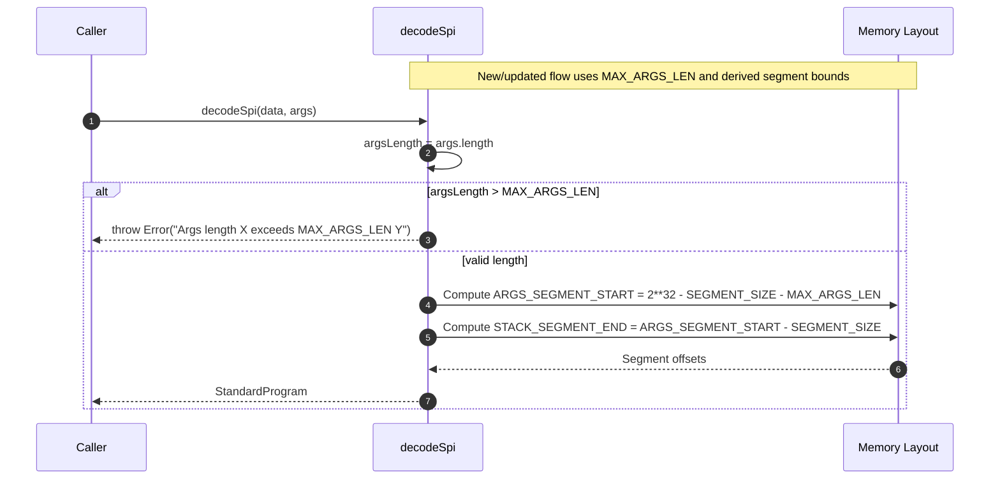

# Better naming for args-related constants

## Pull Request by @tomusdrw

Closes #79 

<!-- This is an auto-generated comment: release notes by coderabbit.ai -->

## Summary by CodeRabbit

- Bug Fixes
  - Clearer validation error when SPI argument length exceeds the maximum, including provided and allowed lengths.
- Refactor
  - Standardized memory sizing constants and calculations; renamed argument-length constant for clarity with no functional changes.
- Documentation
  - Updated inline comments to clarify memory segment sizing.

<!-- end of auto-generated comment: release notes by coderabbit.ai -->

## Comment by @coderabbitai[bot]

<!-- This is an auto-generated comment: summarize by coderabbit.ai -->
<!-- walkthrough_start -->

## Walkthrough
Constants for memory sizing were refactored in assembly/memory-page.ts, changing literal forms and decoupling RESERVED_MEMORY from SEGMENT_SIZE. In assembly/spi.ts, DATA_LENGTH was replaced by MAX_ARGS_LEN, segment boundaries were recalculated accordingly, and decodeSpi’s argument-length validation now checks against MAX_ARGS_LEN with an improved error message.

## Changes
| Cohort / File(s) | Change summary |
|---|---|
| **Memory constants refactor** `assembly/memory-page.ts` | Rewrote PAGE_SIZE as 2 ** 12; set RESERVED_MEMORY to 2 ** 16 instead of aliasing SEGMENT_SIZE; RESERVED_PAGES remains RESERVED_MEMORY / PAGE_SIZE; added inline comment to SEGMENT_SIZE without behavioral change. |
| **SPI args and segment layout updates** `assembly/spi.ts` | Replaced `DATA_LENGTH` with `MAX_ARGS_LEN` (same numeric value); `ARGS_SEGMENT_START` now subtracts `MAX_ARGS_LEN`; `STACK_SEGMENT_END` now derived from `ARGS_SEGMENT_START`; `decodeSpi` validates against `MAX_ARGS_LEN` with a detailed error message; updated related comments. |

## Sequence Diagram(s)

## Estimated code review effort
🎯 2 (Simple) | ⏱️ ~10 minutes

## Possibly related PRs
- tomusdrw/anan-as#53 — Also touches decodeSpi and argument handling/validation, indicating closely related logic changes.

## Suggested reviewers
- mateuszsikora

## Poem
> I nibbled bytes and hopped through RAM,  
> From 2**12 to tidy spans—how glam!  
> MAX_ARGS_LEN now guards the gate,  
> No overflow, just perfect weight.  
> With stacks aligned and pages neat,  
> This bunny’s code is crisp and sweet. 🐇💾

<!-- walkthrough_end -->

<!-- pre_merge_checks_walkthrough_start -->

## Pre-merge checks and finishing touches

❌ Failed checks (2 warnings)

|         Check name         | Status     | Explanation                                                                                                                                                                                                                                                                                                                                  | Resolution                                                                                                                                                                                                          |
| :------------------------: | :--------- | :------------------------------------------------------------------------------------------------------------------------------------------------------------------------------------------------------------------------------------------------------------------------------------------------------------------------------------------- | :------------------------------------------------------------------------------------------------------------------------------------------------------------------------------------------------------------------ |
|     Linked Issues Check    | ⚠️ Warning | The pull request renames DATA_LENGTH to MAX_ARGS_LEN and updates decodeSpi to compare against this new constant, but it does not implement validation against the actual remaining memory available after allocating readonly, read-write, and stack segments as required by issue #79, instead preserving the original fixed numeric limit. | Update the validation logic in decodeSpi to compute the true available memory for arguments by subtracting reserved space for other segments and validate against that computed limit rather than a fixed constant. |
| Out of Scope Changes Check | ⚠️ Warning | This pull request includes changes to assembly/memory-page.ts—such as altering PAGE_SIZE notation and RESERVED_MEMORY constants—that are unrelated to SPI decoder argument-length validation and therefore fall outside the scope of issue #79.                                                                                              | Remove or isolate the memory-page.ts modifications into a separate pull request if they are not directly required to address the SPI decoder validation objectives.                                                 |

✅ Passed checks (3 passed)

|     Check name     | Status   | Explanation                                                                                                                                                                                                    |
| :----------------: | :------- | :------------------------------------------------------------------------------------------------------------------------------------------------------------------------------------------------------------- |
|  Description Check | ✅ Passed | Check skipped - CodeRabbit’s high-level summary is enabled.                                                                                                                                                    |
|     Title Check    | ✅ Passed | The title succinctly highlights the renaming of args-related constants, accurately reflecting the key change in assembly/spi.ts and communicating the developer’s primary intent in a clear, concise sentence. |
| Docstring Coverage | ✅ Passed | Docstring coverage is 100.00% which is sufficient. The required threshold is 80.00%.                                                                                                                           |

<!-- pre_merge_checks_walkthrough_end -->

<!-- finishing_touch_checkbox_start -->

✨ Finishing touches

- [ ] <!-- {"checkboxId": "7962f53c-55bc-4827-bfbf-6a18da830691"} --> 📝 Generate docstrings

🧪 Generate unit tests (beta)

- [ ] <!-- {"checkboxId": "f47ac10b-58cc-4372-a567-0e02b2c3d479", "radioGroupId": "utg-output-choice-group-unknown_comment_id"} -->   Create PR with unit tests
- [ ] <!-- {"checkboxId": "07f1e7d6-8a8e-4e23-9900-8731c2c87f58", "radioGroupId": "utg-output-choice-group-unknown_comment_id"} -->   Post copyable unit tests in a comment
- [ ] <!-- {"checkboxId": "6ba7b810-9dad-11d1-80b4-00c04fd430c8", "radioGroupId": "utg-output-choice-group-unknown_comment_id"} -->   Commit unit tests in branch `td-args`

<!-- finishing_touch_checkbox_end -->

---

📜 Recent review details

**Configuration used**: CodeRabbit UI

**Review profile**: CHILL

**Plan**: Pro

📥 Commits

Reviewing files that changed from the base of the PR and between 6119f8c5fcc307babcfdb96675f428228382ba22 and 2c170aff6522fc682761326c487558d4f6b7f61c.

📒 Files selected for processing (2)

* `assembly/memory-page.ts` (1 hunks)
* `assembly/spi.ts` (1 hunks)

🧰 Additional context used

🧬 Code graph analysis (1)

assembly/spi.ts (1)
<blockquote>

assembly/memory-page.ts (1)

* `SEGMENT_SIZE` (9-9)

</blockquote>

🔇 Additional comments (8)
<blockquote>

assembly/memory-page.ts (3)
<blockquote>

`4-5`: **LGTM! Exponential notation improves clarity.**

Using `2 ** 12` instead of the literal `4096` makes the bit-shift relationship with `PAGE_SIZE_SHIFT` (line 6) more explicit and aligns with the pattern used for other constants in this file.

---

`8-9`: **LGTM! Consistent exponential notation.**

The exponential form `2 ** 16` is clearer and consistent with other constants in this file. The inline comment preserves the numeric value for reference.

---

`12-14`: **LGTM! Decoupling RESERVED_MEMORY from SEGMENT_SIZE is appropriate.**

While both constants currently have the same value (`2 ** 16`), they reference different sections of the Gray Paper specification (lines 8 and 12), suggesting they represent distinct concepts that might evolve independently. Explicitly defining `RESERVED_MEMORY` rather than aliasing `SEGMENT_SIZE` improves maintainability.

</blockquote>

assembly/spi.ts (5)
<blockquote>

`10-10`: **LGTM! Expression correctly updated.**

The expression is mathematically equivalent to the previous version, now using the more descriptive `MAX_ARGS_LEN` constant.

---

`12-12`: **LGTM! Refactor eliminates duplicate calculation.**

Computing `STACK_SEGMENT_END` from `ARGS_SEGMENT_START` removes duplication. The value remains mathematically equivalent:
- Old: `2^32 - 2*SEGMENT_SIZE - DATA_LENGTH`
- New: `(2^32 - SEGMENT_SIZE - MAX_ARGS_LEN) - SEGMENT_SIZE = 2^32 - 2*SEGMENT_SIZE - MAX_ARGS_LEN`

---

`17-18`: **LGTM! Improved error message.**

The error message now includes both the received length and the maximum, making debugging easier. The validation logic correctly uses `MAX_ARGS_LEN`.

---

`15-78`: I couldn’t locate the JAM Gray Paper section 2daf002daf00. Please provide the relevant memory‐layout validation requirements text or a link so I can verify segment‐overlap checks.

---

`7-8`: **All `DATA_LENGTH` references removed**  
Ripgrep search found no remaining `DATA_LENGTH` occurrences outside `assembly/spi.ts`; rename to `MAX_ARGS_LEN` is applied consistently.

</blockquote>

</blockquote>

<!-- tips_start -->

---

Thanks for using CodeRabbit! It's free for OSS, and your support helps us grow. If you like it, consider giving us a shout-out.

❤️ Share

- [X](https://twitter.com/intent/tweet?text=I%20just%20used%20%40coderabbitai%20for%20my%20code%20review%2C%20and%20it%27s%20fantastic%21%20It%27s%20free%20for%20OSS%20and%20offers%20a%20free%20trial%20for%20the%20proprietary%20code.%20Check%20it%20out%3A&url=https%3A//coderabbit.ai)
- [Mastodon](https://mastodon.social/share?text=I%20just%20used%20%40coderabbitai%20for%20my%20code%20review%2C%20and%20it%27s%20fantastic%21%20It%27s%20free%20for%20OSS%20and%20offers%20a%20free%20trial%20for%20the%20proprietary%20code.%20Check%20it%20out%3A%20https%3A%2F%2Fcoderabbit.ai)
- [Reddit](https://www.reddit.com/submit?title=Great%20tool%20for%20code%20review%20-%20CodeRabbit&text=I%20just%20used%20CodeRabbit%20for%20my%20code%20review%2C%20and%20it%27s%20fantastic%21%20It%27s%20free%20for%20OSS%20and%20offers%20a%20free%20trial%20for%20proprietary%20code.%20Check%20it%20out%3A%20https%3A//coderabbit.ai)
- [LinkedIn](https://www.linkedin.com/sharing/share-offsite/?url=https%3A%2F%2Fcoderabbit.ai&mini=true&title=Great%20tool%20for%20code%20review%20-%20CodeRabbit&summary=I%20just%20used%20CodeRabbit%20for%20my%20code%20review%2C%20and%20it%27s%20fantastic%21%20It%27s%20free%20for%20OSS%20and%20offers%20a%20free%20trial%20for%20proprietary%20code)

Comment `@coderabbitai help` to get the list of available commands and usage tips.

<!-- tips_end -->

<!-- internal state start -->

<!-- DwQgtGAEAqAWCWBnSTIEMB26CuAXA9mAOYCmGJATmriQCaQDG+Ats2bgFyQAOFk+AIwBWJBrngA3EsgEBPRvlqU0AgfFwA6NPEgQAfACgjoCEYDEZyAAUASpETZWaCrKPR1AGxJcAQiVw0fBhozPAYRJAAZvh8zkSIYBQkHtR0ChiIuJi4yJAGAHKOApRcABwAjJB5AKo2ADJcsAHciBwA9G1E6rDYAhpMzG0EzNiItBQA7m2YmGBoiG3c2B4ebRVVBtWIJZDDo+MTGwDK+NgUDCSQAlQYDLBcuLRzFPGQgEmEMHH+Vzd3XMzaLB5I5ZXCjLj4bhkDY2EgSeAkCaUVqQAAUGHw5EgHiQNFoAEoNnUVMkUejMZccZk6IS8gBhJKpejULgAJgADKyAKxgcrssDsgAs0HKAE4OOzShwuVyAFobAAi0gYFHg3HEmK4dI8+G2yDMAHZReZLAB5YSicRSZCRCgsbFhADWaSQDmkRgAkog3ZBDeLIEcrB7IEomEpYi9kF5wrhYJAJGgcbRqPBMZAAfJirt8PgeJRQt7JCQjFAPUoMOJIvJY9RdrBLgwzkkK/HE/BkxqsGEQ6JFCQjtwdHdRI7kHFEHUyERY+giIDMpAFQBBaBLgD6dQAovkAOLQAASaNZAD1WYKrrIaIh8QAaSATetJRcr9db3cHyBJXjSdjIWOXAEAA94BGZh7HgAAvS5oj4EYPHEbgvHTEhmBieRtiINgK2QVFGVoTEPFkO88LACZVRoO9MHoTI0AYR1b0gDFcEgIRRmYuJHF/DQDCgTcMjOS4OKw3AwGjac4wTJMUzTWimGwbCohidAxGwRNPxQwEwgiNhUJcdAE3gFIBCQmD0BeTiFLQSJAnQFZ8AYFNwnUtB8IwQjiJIFzSPIkhKIwaisjo+wSEw39iOoR860wBRmG4ZwtP4Nzq1zf9syyDxn1XDdtz3Q8mAyLIK24qBqm4DtLlSyT22krAdS6Bh7FzITfyi5iJlODx6BIQCLjSNADKMpCdLQtEuikLB8H/PgMOE2ydQcztrzMy4khEMQ6G4niwEMAwTCgMh6HwSIcAIYgyGUPEYuErheH4C0xCLGR5DDZRVHULQdH0XbwCgOBUFQaK0DwQhSHIKhLoGa7PzQQ4HCcPS5AUcMVDUTRtF0bajG+0wDHmbZmGM2Q2mGlwwDi0gNByDgDAAIjpgwLEgJcPTOsGmXsRwAT0o7GFgTBSEQEtrCXHdNzXI4PVlTdWw8bAGz58I0lte1BXZUUADZs0gVlIAAKl1yByh11FE0CYIrUuJiaoYkhIkiS0i0IyBsDKxyIlS8nLkQSCG0xGiiryKAbE3I5NxsAA1TcFTXABZTcY9NGwAE1ef5pW7TAtt5gS0Odzj/JoHFyXpYIdAQ3gJIxG1vWDfKTXJLlyj4MoBLUpJ9DIISur4AYDRA8gYPQ4jqO1ysEWQ/UgEwmQJRIjCPrkEHsPI+juOE+TyA2mF0Wi6lu8BDwRj8EOJQoX85A01Sl3yvoJfh9X+PE6TgBuOsVuSGrEAQbhJ/nN/7BCJcB8hkKr1mdv5SghEEr5X9jkSAfMpCp0VrQPuPEAybjztuQuEspaQGdCQFo/9ECAMYpxVUDUG6XAPsxOc090BdjcvPK67BX7FAQamKgKx5AYiQaQK4JBZCYnoPhRswkaqbSFnSP2hVmLXyZFwMeO8cGbi4NgAAzMbRRYtlFshrobVkr9vzwlOIgJ2qsNb4jQVIgq2RnauzxFwO+K9Y6P2TqojRaIjGplGE7XO+dsHF1fhiQ4Ot9aG3VpYqA1jYF2Jvo4kOy8R5aKOO442XiTFOycSPNeT9N7b20YEo+sMSHdW/IWNMExuixPZlkh+68k6WIMJuTIIF2YvXUvCREkBbYwU4JAGOdB4COFpvTLaYAjB4xQoTNoiBByU1aCMmmDNLDM1ZhdNIcMubyB5ncNOgs0GwkQrRaQ/9lxZTfLldIMTKkzjQIxLpMclwAA01xLhsDuI42V8hXJkWiYhbBSFsHITLOW+JUFQDeR88WGD/Hi1XDYaARSOYCFwFQMQyBHkvMhZ8t8KACqeUOsdM5r4coHmKgGVcdIADS0LMEFzXNuBUSLwyPSiBnJm7zPl+KwXCt5iLUQTHmD2VUUh6DKzAsSr5uUwVoNDH2AcOhmoVlElOGcVUOypiwHIy6pcBhxSfGgWhBV+nPNeZyr59D6CxjtBMMc6YYiXDCDBAEFtukUDtLBaQxC+FhAYLLWgrcwGVxIEWegYlbn+XTGgQC5KY5hFaRlERFlQSauYS2bVaRS5JEiF4KuqVyCHExWaqFuLgihHCBI5ZTNm7g01X+FKYDQwpFrX7fgx1SkxEukpJYxke7dIrOoBE+yg4oXwKKrgkqLkHlSXi9A3opmERmXMnIaCly0CULQLgRbsVfJnd2SZBNF2zPgPMtBpU4kcqhdy+lRx4XQD3VgA90zj3zPeEivVeAF7VzCR4qA16Am4KgNu81b4z32LoFwW9S5qW0thYyh9c78bPuXcgD4wSYpLEukKnd/7eUIt0OgulAHNxgYvXKpQCrUQdjQFwaoYRcClCXO6tAREzLxFo/RxjzHZD4kg4VZMFBaBWDtEQKgYF93zsPUTF9cCPjqpqki0YJzgMlu3Ja/tCsLhdXdUpNg3pDXFiaS0l1aR2lJE6YcHpnat2DOGXTJZW0dp7X7YSk6INzrg1MywKGVBYac2cJmZ6fYqBvTRp9TGznIbqDXO2RAa5zMIiRLQNcNEKDMS+tjKArIGDlANOyKykR1ZclZKySIDB1alFZAadW5QNHqwYIKUoBoZSlFoIKQrAgDSFfKA1DLkXvPRdi/FuEiW6BrgOhjQwznvxriBaQNcw46JxdS+lzGBgADeBgqg0yQLYHw81nS0CkawdgVhdR4hplwSIiZtg3i25AGmX8Oq0H2/ZR0thLtRBu75e7O3ECmikO69s5ZPvXY8Ld37AbaA2HkgqeyIJVThEQHSesdFPuosbpD9sMOMDuFwF4FHI50cUEx9tqHOOlSIBVGqTshO0dXe+3d7bOIMCHa9G6RACPPs0wADoYD5zz3AgvhdC9F8AFnh2YvejlnoAXouRci4sJYP0kGgw9hehGV44aJJtg1WmDM/Dsy5ihBQAs3spAC/5/L63gvGZ468JbwMwZyOUDY1GVVOupKdijZmCqOY8ym9dEWS3jNKfU/VJqkPlhrE0EAkL/nuOEDIFdHLXYaLRxlwDVT0Y3s0xUCQC6LAthfQGlKOgAQpxmKpQAAbjknDGOMehMokvfPuavMtqre8W46WdNeXcKvb5EeSD00zdlr5J5DJ6cjV40FH6wdpjIoUt3SJs7B3L/xd3weTV5WpseTe7hvKB3feiilgavk7SVt6PKec8cgry8ct9Xp/uBZBQip6qdUfP4DHRNpGev4lIAm8L9W9CR1s+cqhrVj57lDhNwdMKBUQecaYmMiB99sQPcjcrh4AiBED8Rn4+cABfPnJ/avS3fcY+OESgO8c/F8KVA8dvL8JIbYBSNuaNECRwcCKCRSWCZYBCIaUdPSGaFqXCAlAiVjEiMidQXydTGiOiBiJiFiNiPfYSRAPuOABsVfFsbvH3ZSC4dUJQ9gDgk5GsNqZ7bEVIPga7QyEMVPUuaebAO2HuBEFsJIKeDABKdudAayV3RMeaN2fgKaYKUKbCWfBPRmI4bAIgAWTsS3NQjvPXLAJ7ZYegdsTyLhXmEcWcecKvMBWiMENSFwzSJyDw/qbQQaaCJSJVOBKyGyHw+yPwu0YiCYPyAKWiHvQQ7CcKAImsLAbvBKQ1LI/+AgdKSAag85S/dvGBGREIvnRmWEe2ZsC4RAS3KAWwRoZoVoDoLoWMXofoFgIYFgfYSYaYYIDAOYBYJYFYNoUvPnKABUJARscpDANY3AFodoToboHYgYfYkYMYI4mYU4+YRYZYVYUvMwLPB43PDAeLVkNRUoTkNRQUPLQUG4geAhTtNIOQLgAAAT2F+ImDlwV2t2ADaAlzGxTxID0BpiZwexSEyDp0dFhAcHgkQE+wAG17sqhNsqhuSHtu98hAFucw8P9vd6SqSOTuTHtQRRhidSceSHtSkUhzZNVud6T7BHQ1QoR6Aok+wbAUZ1BABMAmQAQCIFgBVSkAyk2QCyP37RUC8BQTFLlIe1QiUG50FQoDcPCAdLlJphiCwLCETHpP5LYG5yUHfxp2VPFPwOpM5PFO2z5IFK4Bpnt0uFFOjIlJojBBZIeBJx+0dJpgVJmE7G51iPEHxy9mwAYAYF9Xx3kGNNgBxBNLgVSmbBCASh5nHESA/ghmkWyEQEokrLOFSCdmzVzXECclSmdGegVh9UfQnyPRQ3U0hnkh7j8NSiUHNMhEoENJ4FVC2TxRoBbH3UYC8GcDvHyirO2GCgrDIAuA0C9J5JpkYPwFliLMTPyFzCfJfNTXIDoC/VSlLKQkTDwiCwwCkFkD/DAQuArE4UUgeLbX/guIyiSAAEc5YFwekHZzTZA7y0zttnSSBXTnAPSiB7yJTK5MQ54UCkhQdGdYyHtfSuhggPBAyEyHsAKCLIy0yuTvT4zgzEy6gnQ0h2c0LIBUy6LJTqBpSGdwdczvSCylTMRiywFEL1JULpBmIWy9Nm9aDDxS4VMcU1MqJqkd9+9BwtY9VnBBIjUFxYxUAC0flsh95D51AQx8ATl5CQJEIUIDDt9U1+jp5sjBIVJ8iNJ40ij+D5ASjDJbTBIvDYg7IFoEo8JRCPIvIJCKJpDAo2iQplC51VLsAK4MT5BySS9RQ7wAqCUdyfwKB4RxywEGL/SMo55AI0gMAyE+0cRQhNBSLttPy8BlTEzz1Uh/5fK0xu4GpuxTKdBdUWBMNQEKocz9JSiYrkJdJ5BTJKinpkVUVcikrqrRV7A4oLguD/DIp2iqjI1t8rKBjjCMNP0w0QIXLwZIpuiy5mqvMbEioeqnS+xCL3StJvrHzewMBKKBIaKZLcL6LVRGKAzUdHQgyCLEzSTaBhLpAlx51vRhIlkeSozxTuKHzeLEaHtTRD4eYjgmAoRRLpyTkxK8yMypKvsIbxL5KaolLUAVKUK0LmJfV/UTldlFZ61EMF0iZ24yYDN5lAAUAgcDuDytNhbici0V3mlitm9yMtqRcXqQcuwgltussvASSBSB1VzCd3V2C30OVW1ziIUyMqmltgdUZoykr29iUCIQpsuB5hKr9BwvEr6tfIe1hFQkQSUiQGfOGrbgirFopjgWdO/xXMWn3KamCn1WGo5pIDUoXG/zfkiqfHkIDUrhrPysKqtSanXUYIgsuBNs3ytu90EDWgthUMBvwr+uIsBvIpBqwLBukohzzIaqYpYr4vorwFNEiHJs3JRz2XRr1EQCxs4rxvEsJsFPskyERwiCkUBwM0BvpqzLT1lIfJZr9ppjhwYGXugTHWUB9WQD5HZA0HZHZAAFJ7wEAZbUAHAHCqz2BVCg006CqkgrVYBGDYBnzkjkA4Sb777va8ym7Ey3SW7IafTobGr+6iaaYRET6kdsbuT8D7sABdakmmWk3AWwIU8MxSxM9WWE+2UoEgAQerWgTrBrfLdWMrDkBgOEtAIrSUUoLkdWWgbkVQTyLkA0UrQUcoVQA0WgUoSIcoMUQUJhkgQUAQNAVrL0/B+YQhhFTwZBprCrUoHLdWarcrWgBgQrNAeRyINRcoWiA0EgLkWiNAURtRWgUUSIUoUUBgGUdkCxjWQrBRhrVx8oWgYrVkUoUoAQe2JZLBzLKq2bSgebbvOLCbfQIAA== -->

<!-- internal state end -->
