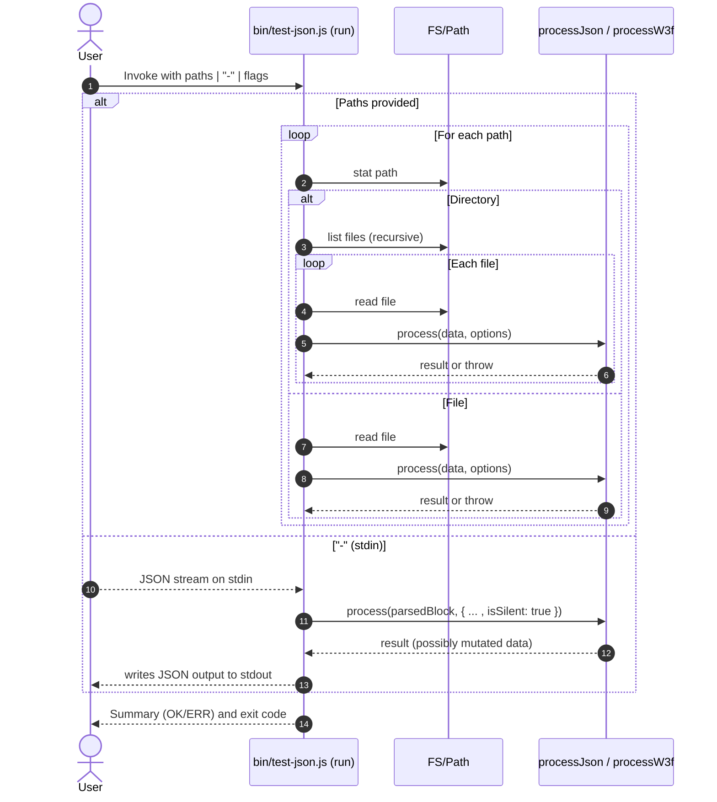
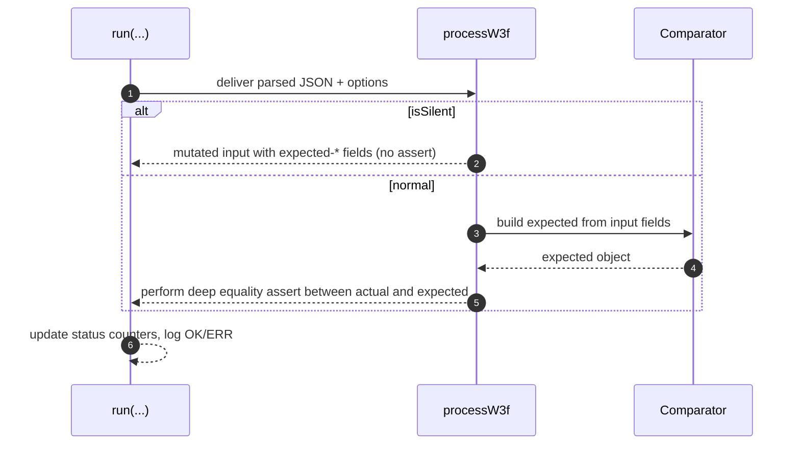

# refactor running json vectors

## Pull Request by @tomusdrw


<!-- This is an auto-generated comment: release notes by coderabbit.ai -->
## Summary by CodeRabbit

- New Features
  - Added a JSON testing CLI that processes files, directories, or stdin, supports flags (e.g., debug, gas), prints per-item results, and shows a green/red summary with non-zero exit on failures.

- Refactor
  - Unified test runner for consistent behavior and reporting across tools.
  - W3F CLI now supports a silent mode to auto-populate expected fields and expects file/directory inputs (no stdin/traversal).
<!-- end of auto-generated comment: release notes by coderabbit.ai -->


## Comment by @coderabbitai[bot]

<!-- This is an auto-generated comment: summarize by coderabbit.ai -->
<!-- walkthrough_start -->

## Walkthrough
Adds a new shared CLI runner `bin/test-json.js` that processes JSON from files, directories, or stdin and exports `OK`, `ERR`, and `run(processJson, options)`. Refactors `bin/test-w3f.js` to call `run(processW3f, options)`, adds a silent mode to populate expected fields, and removes bespoke I/O/traversal logic.

## Changes
| Cohort / File(s) | Summary |
| --- | --- |
| **Shared JSON test runner**<br>`bin/test-json.js` | New CLI that parses args (`--debug`, `--sbrk-gas`), reads JSON from files/dirs/stdin (supports `-` for stdin), invokes a provided processor, tracks total/pass/fail, prints a summary with `OK`/`ERR` icons, and exits non-zero on failures. Exports `OK`, `ERR`, and `run(processJson, options)`. |
| **W3F test refactor to shared runner**<br>`bin/test-w3f.js` | Replaces custom CLI and traversal with `run(processW3f, options)` imported from the new runner. Renames processor to `processW3f`, adds `isSilent` mode that writes `expected-*` fields into the input and returns early, retains non-silent comparison/assertion logic, and removes prior stdin/traversal helpers. |

## Sequence Diagram(s)




## Estimated code review effort
🎯 3 (Moderate) | ⏱️ ~25 minutes

## Possibly related PRs
- tomusdrw/anan-as#83 — Modifies `bin/test-w3f.js` test orchestration; closely related to extracting/aligning runner behavior.

## Poem
> I thump my paw on JSON ground,  
> Green circles bob, red dots I’ve found.  
> From files and streams I hop and see,  
> Expected fields set quietly.  
> A rabbit’s run: tests pass with glee. 🐇✅

<!-- walkthrough_end -->


<!-- pre_merge_checks_walkthrough_start -->

## Pre-merge checks and finishing touches
<details>
<summary>❌ Failed checks (1 warning)</summary>

|     Check name     | Status     | Explanation                                                                           | Resolution                                                                     |
| :----------------: | :--------- | :------------------------------------------------------------------------------------ | :----------------------------------------------------------------------------- |
| Docstring Coverage | ⚠️ Warning | Docstring coverage is 33.33% which is insufficient. The required threshold is 80.00%. | You can run `@coderabbitai generate docstrings` to improve docstring coverage. |

</details>
<details>
<summary>✅ Passed checks (2 passed)</summary>

|     Check name    | Status   | Explanation                                                                                                                                                                                                                                |
| :---------------: | :------- | :----------------------------------------------------------------------------------------------------------------------------------------------------------------------------------------------------------------------------------------- |
| Description Check | ✅ Passed | Check skipped - CodeRabbit’s high-level summary is enabled.                                                                                                                                                                                |
|    Title Check    | ✅ Passed | The title accurately summarizes the main change, namely refactoring the mechanism for running JSON test vectors via a unified runner. It is concise, focused on the core update, and clearly communicates the primary intent to teammates. |

</details>

<!-- pre_merge_checks_walkthrough_end -->

<!-- finishing_touch_checkbox_start -->

<details>
<summary>✨ Finishing touches</summary>

- [ ] <!-- {"checkboxId": "7962f53c-55bc-4827-bfbf-6a18da830691"} --> 📝 Generate docstrings
<details>
<summary>🧪 Generate unit tests (beta)</summary>

- [ ] <!-- {"checkboxId": "f47ac10b-58cc-4372-a567-0e02b2c3d479", "radioGroupId": "utg-output-choice-group-unknown_comment_id"} -->   Create PR with unit tests
- [ ] <!-- {"checkboxId": "07f1e7d6-8a8e-4e23-9900-8731c2c87f58", "radioGroupId": "utg-output-choice-group-unknown_comment_id"} -->   Post copyable unit tests in a comment
- [ ] <!-- {"checkboxId": "6ba7b810-9dad-11d1-80b4-00c04fd430c8", "radioGroupId": "utg-output-choice-group-unknown_comment_id"} -->   Commit unit tests in branch `td-gas-cost`

</details>

</details>

<!-- finishing_touch_checkbox_end -->


---

<details>
<summary>📜 Recent review details</summary>

**Configuration used**: CodeRabbit UI

**Review profile**: CHILL

**Plan**: Pro

<details>
<summary>📥 Commits</summary>

Reviewing files that changed from the base of the PR and between 3531d55607ad43a8f868a085890eeee121e28341 and 8e92b4ff48921c092276546ced91b515bd62125b.

</details>

<details>
<summary>📒 Files selected for processing (1)</summary>

* `bin/test-json.js` (1 hunks)

</details>

<details>
<summary>🚧 Files skipped from review as they are similar to previous changes (1)</summary>

* bin/test-json.js

</details>

</details>

<!-- tips_start -->

---

Thanks for using CodeRabbit! It's free for OSS, and your support helps us grow. If you like it, consider giving us a shout-out.

<details>
<summary>❤️ Share</summary>

- [X](https://twitter.com/intent/tweet?text=I%20just%20used%20%40coderabbitai%20for%20my%20code%20review%2C%20and%20it%27s%20fantastic%21%20It%27s%20free%20for%20OSS%20and%20offers%20a%20free%20trial%20for%20the%20proprietary%20code.%20Check%20it%20out%3A&url=https%3A//coderabbit.ai)
- [Mastodon](https://mastodon.social/share?text=I%20just%20used%20%40coderabbitai%20for%20my%20code%20review%2C%20and%20it%27s%20fantastic%21%20It%27s%20free%20for%20OSS%20and%20offers%20a%20free%20trial%20for%20the%20proprietary%20code.%20Check%20it%20out%3A%20https%3A%2F%2Fcoderabbit.ai)
- [Reddit](https://www.reddit.com/submit?title=Great%20tool%20for%20code%20review%20-%20CodeRabbit&text=I%20just%20used%20CodeRabbit%20for%20my%20code%20review%2C%20and%20it%27s%20fantastic%21%20It%27s%20free%20for%20OSS%20and%20offers%20a%20free%20trial%20for%20proprietary%20code.%20Check%20it%20out%3A%20https%3A//coderabbit.ai)
- [LinkedIn](https://www.linkedin.com/sharing/share-offsite/?url=https%3A%2F%2Fcoderabbit.ai&mini=true&title=Great%20tool%20for%20code%20review%20-%20CodeRabbit&summary=I%20just%20used%20CodeRabbit%20for%20my%20code%20review%2C%20and%20it%27s%20fantastic%21%20It%27s%20free%20for%20OSS%20and%20offers%20a%20free%20trial%20for%20proprietary%20code)

</details>

<sub>Comment `@coderabbitai help` to get the list of available commands and usage tips.</sub>

<!-- tips_end -->

<!-- internal state start -->


<!-- DwQgtGAEAqAWCWBnSTIEMB26CuAXA9mAOYCmGJATmriQCaQDG+Ats2bgFyQAOFk+AIwBWJBrngA3EsgEBPRvlqU0AgfFwA6NPEgQAfACgjoCEejqANiS4USAMzRj8fCtgwZ4GIpCGJ8WKScKRAMAOWxmAUouAA4AFgMAVQAlABkuWFxcbkQOAHo8onVYbAENJmY8gmZsRFoKAHc8zEwwNEQ87mwLCzz4pMRoyGra+oaDAGV8bAoGEkgBKgwGWC5cWmJ2sCZEXANoNApSXAWlla5mbQxJ3GparnxuMgNkkgl4EgbKXMgDVJUSBYfgYAMK2ah0dCcSAAJgADDCAKxgACMcLAcIAnNAUSiOHFMRxEQBmABaRn0xnAUDI9HwdhwBGIZGUNHoFTYGGhvH4wlE4ikMnkTCUVFU6i0OkpJigcFQqEwjMIpHIVDZClY7BsaAakEQEUuFHkcgUopUak02l0YEMVNMBjUGCq0lwYF8/g0vg4BgARH6DABiAOQACCAElmaqIfR9axDvJ6YxYJhSCEDCHaLRkGhIORdSDUmHhvh8BYFp5nbs3X4MJ7kLhkydePg5ohBsgAFITADyoUgdngVmQzkgtHgtiCH0QABpIA1inrsNxuM4TnYR3YLGgiNmMDH1p4UBguppIABRAAeK/bwwa+B4pQs8AYCgwu0wuGQ3YA0ug9+fkmSP96BzS5D3YI1+zcMR4H8SBXAwAAKZtW0QDsa1nR5xH8RAAEoNBgWB5gQqDlmwrBuEOG8CyLQ4iAidhkEQiAlAEbBvEwegIEQRYAGtNjw2cJDQJ9aAhZBPBPWdOMXZdV3rWBbHmZhFGkLgUOkRBPG8GoLHEbgrB4ahYCYgch34PgxwnAgKCnXDZ3BMcvEgLte37CgWD1A8MEwvhKA8lwSBXChxC8AiADERxIRxYCMhtZ3UKEaGYbhP2LeDopA7NR3HflnHkGSJxmLSpAseQNLbaRX1uTxITM6RfJ4DzUKqnMtK8Qz6oIsMTkc5B6uQRBZGWRT/GmRAytnSjgiq1zQmk/9PAkfBeKqht5mbd4lHoCq/D4ZDms09D/FwucF0VLDYLfXkRDEbqTjArkrmy99cFqG7+WGKgGF47Ti1uMt1BIZgZ0XBhULsbphhdUGZIcQcZga4Cms8NK2oNeMzobP9+CkKgehQJgsEQoglKwEdbFofDIG7LB4YsRHQcS3hUeypQaqsegn12fgGXpv6gZB5GSAvdRkHnbGRXmVECJDSAiIsJ5ArQWhwo85gJm8+XOPM3ZwWYP65qPE93M83YnNnQYsj+rSrC5SAVKUZGWa5P71qaltNJHaZsjwdBOx7PsGiIrAKgMkgaAWCwW147NbAyuZJDoWX5cBJWPdQ8LB2IzLdx2qjWpcwP+2z2d1tDkSgWGIiM69vgZOTPdzP85whUgJcxNC7xXvemTgfULvIBbvg2DbbdpAIuBlMUbp5hF4K0p/Wcz0Ahb6AQ2dg+zjKVbVlhNac53DrbLPDNsR6jxoCgMBE1PFe+Sea8QBhbNS9ub3dDAwDUIouTASjcArH7COI2jdaBPmcoVQEU5+BYFCKpOs/Y85xViiGAACmGRA91ZIL2QI5P6dh1aQAAORgGIZAd4bUtYyRdmlWo49ID0XgGJZY8xg5kFzPeAa6B46bWYcnIwQZQx6VZFdes953ZKAYFuNUYjeZDyvKuSEI4ugCCfC+dg6gpwUlDJmSE89Vyvh5j+SAABeEhgBeDcAEf75DDyOkrK6T+dYDBQAzNtBRC8jEnBXkBcxxCLGABZd2xWB7E0CrE43wLjdHuIMSFUiME4IIQOp7Nsx0fL8FSmI06diKxhMcTWZxBgzy7HgJcdUUsMrvE+EPOw64QpcAALJ0HgBEX0/oXH2lCS6MADRiR2DrN6P0PpAzBnDJGVkkJYyGgTAyFYKZpA6NeAZRwVUaI8PopyJsVE/oyUuBgbAt88kWRWC6WRcEJaxTatpM+bhkmoQAOp9MwpknCp0GCVw0FEsMXIPK0GwK2FAKVDGJiXgBZIDk3Cm2YOgXM1S8nVjgo7WeABuDKKlBTawoBsKW9Afx5B8V4j8WComvBvqPauG1KBgHqrXNsG4iG7TSelXajy7CovnLYCSJxUYSJrnmeCbhv7tDqtHBonyoCvHRVVc2nghWDHoJJP2YCIEcX/FZPKRo8g0twFQPGiBb7RyKAwVF0CDY3zCTvVW6sD6HhocfRAp95j0NIOK6Jw4XnXU3NuCSWB3YX03PgBo3pIC6BQIgAAIiQNiRAbDA2esAvgeMBD4EGPwPAJ5PkhqgEgCY2cuRcDICocyoFVJziIvHTl3Q0bxwaLZLIHCeUUuNn7TuOZ2geP5HVD4FgsxY1gD7BRV8b5ljDocJAHovkUXtay6SmZBp5oeqW5Vbt7wri6FuSO89O0bG4AwWcW6xB0AEvuq826wA91BgetkYBbA7jXh2w9O7x7UrQFWtomZOXDl9TXVtH0xDI1sG9a+Q9DhlVdd+EgQVkAiyQIPUdtkayQENc+MtHCMD4G5VgW27AHaqVRWxQcvbFRXuUXyf9hDPK/oHICIj/52iDBCsgJQQUh4AEcDlPlwPIC5TbHBvVvpWvSrqGlXBqtdC9GUF5/UoUY0s8xDVfuhjzSibYtXaDLFAhsHkGjQYoAFRT9NEaupBP4PGaUJMEBhSUPZN7MpFvmHraT8AqF3EQCGRAmtbKQJkPYZwJBN4LnQ0meZ4im2XGXH9ZDDBXWSvwBiqwRBHDyAVunKLCaFjYEI39Ej9AqNELakFQ4EJZwcnYEegdaiY7Iy0ilJ81HdMBW1k3AhI4DZtgId23tMnFQd2jJa+J5FPlGBGcIq+1A5GWckaIGR42cLyNieqFRj4UOaPEAsqJ8DyBGGKeIMpkIKm2CqbqewdToRNLHK0oZFIbR2hpP+RMr6mQqgmeyFgmztS6imZjE0UsxQWklNaQwMoNQG1wAAfWYYgMHh2PhfFoGD98cTKQGGB8SEkKJaCIkRAANjhAAdhVnEYkaAYh2BiNjmIaA4QxERDETEcJIOQZRDCFEJAYQxGJHEFEgOUfUkgDEEgmIYQCDiLUuIdOWcMCxDCGEePseIjiNjuYtBMQogEIiFEiIBC0GxyzpEAgee84gCD9QEOszQ7eLDugYPaQ8+B7wEgYO2BHEdycn6UPEcnGRwAbwMCGn0SA0HJAAELRx+nQEzmouRoJTWyH0XAHBAn837yAPpED9u6LQUPMcg/x/7CJQY04U8B8QN2PGtk9EYDz4nwvxexy0GSG4cNLZPPaUQCCIiP0886uwMn/39fG8YHMLgKwHfRC8W764PvqeB9N+kC/eAHqx9d4TwX6fPoIGrVoJg/U0hPN579EX/3W5djL94q8fUelEB54ANop5Db7kNT/U9u94qENAbAD+Rufq/cikAz8+hH7P6p4XqT695AHP4+jzxbjmpXQH5n56i/TLiQhQAmZKDJDmjqCACYBMgAgEQLAGAFYKVIuHGJBKgIWmosnIAffk/j6I7CQAfg0IcB4F4NQcAans4PAL/CJGfu/p/lwD6EoD/ovuRMMs/gAL4QGQCP7AE+iv58EMECHD6GQAFSH+6gFrBT5qGp7QEtCiFKE1ziAj7zCOAMAzAQhlQkGGjwAABea0NcF8cyXg/muYH+gI8gtgDgk4zkfqogjcSA0KdSAq7ghsxcRygQNkyA3W7cHg1G68bgqo2CqARMDASALh64Zh8qsCTaTA8cvWNA960i0UFAlhHIbgz44kTaLM0yl8OGk20UcYYSGgbBshnKpYeAcBBh8wRhhkJ2/IScpRpmJAsgCkOcXhNkf0iY7sRsERFMCRlAqKQWThpAYasKqE8YzR2hdBqkjBzB2kLRkBE4/gA49Etg1ea+WxnB3BFgvBbhB+PRDBNBkhNBMhkB8hdxAhzeDAjmzkJmeM48BxtBGh+eSeWxuhsB/gX+LYPx3gTA/xKxqAxIxIGgSJAApGWs+LFPKG+NgLUs+B8FyI/DnOxrlPQFptIP2j2qsTEHCBoHCHCKiZsTQf7m0QzPoangAJrTCMCKgkQAAGAAAr9pgTVIwiyGqPMLQNCTqm3nyelKUptJKdKV5rCXFsoC6oCf7vQbsdfPsZcbZNcbcfwTPsqW3mIU/uISngALpAEb7tC4BB7KGKGp4CB2Cc6YiYg4665xBiR9Lq544K7C6IhwiqB2B44MAoh44oiYhS7hn06YiqAwh0CYiZhc404CBwi0B2C0Dgxa4MC0BxDDKWlG5QAO5O6UCkBg6v5Q6276BAA= -->

<!-- internal state end -->


## Comment by @coderabbitai[bot]

_⚠️ Potential issue_ | _🟡 Minor_

**Update the usage message to reflect the actual script name.**

The usage message hardcodes "index.js", which doesn't match the actual filename. Consider using a more generic message or extracting the script name from `process.argv[1]`.


Apply this diff:

```diff
-    console.error("Usage: index.js [--debug] <file1.json> [file2.json ...]");
-    console.error("read from stdin: index.js [--debug] -");
+    console.error("Usage: <script> [--debug] [--sbrk-gas] <file1.json> [file2.json ...]");
+    console.error("read from stdin: <script> [--debug] [--sbrk-gas] -");
```


> Committable suggestion skipped: line range outside the PR's diff.

<details>
<summary>🤖 Prompt for AI Agents</summary>

```
In bin/test-json.js around lines 34 to 39 the usage message hardcodes "index.js"
which is incorrect; update the usage text to reflect the actual script name by
either using a generic placeholder (e.g. "<script>") or deriving the real name
from process.argv[1] (use path.basename(process.argv[1]) to get just the
filename) and insert that into the three usage lines so the printed usage
matches the running script.
```

</details>

<!-- This is an auto-generated comment by CodeRabbit -->


## Comment by @coderabbitai[bot]

_⚠️ Potential issue_ | _🟡 Minor_

**Empty catch block silently suppresses errors.**

The empty catch block at lines 61-62 swallows all errors from `readdirSync`, including genuine errors like permission issues. While this pattern works for detecting non-directories, it's a code smell.


Consider being more explicit:

```diff
     // try whole directory
-    let dir = null;
-    try {
-      dir = readdirSync(filePath);
-    } catch (e) {
-    }
+    let dir = null;
+    try {
+      dir = readdirSync(filePath);
+    } catch (e) {
+      // Not a directory or inaccessible, will try as file
+    }
```

Or better yet, use `statSync` to explicitly check if it's a directory:

```diff
+    import { statSync } from 'node:fs';
+
     // try whole directory
-    let dir = null;
-    try {
-      dir = readdirSync(filePath);
-    } catch (e) {
-    }
-
-    if (dir !== null) {
+    let isDir = false;
+    try {
+      isDir = statSync(filePath).isDirectory();
+    } catch (e) {
+      // File doesn't exist, will be handled by processFile
+    }
+
+    if (isDir) {
+      const dir = readdirSync(filePath);
       status.all += dir.length;
       dir.forEach((file) => processFile(processJson, options, status, join(filePath, file)));
```


> Committable suggestion skipped: line range outside the PR's diff.

<details>
<summary>🤖 Prompt for AI Agents</summary>

```
In bin/test-json.js around lines 56 to 73, do not silently swallow errors from
readdirSync; instead use fs.statSync to explicitly detect if filePath is a
directory and only call readdirSync for directories. Replace the try-empty-catch
pattern with a statSync call and an isDirectory() check, and handle stat errors
explicitly (e.g., skip non-existent paths with a logged warning and rethrow or
log unexpected errors) so permission/other real errors are not silently ignored.
```

</details>

<!-- This is an auto-generated comment by CodeRabbit -->


## Comment by @coderabbitai[bot]

_⚠️ Potential issue_ | _🟡 Minor_

**Use standard exit code for failures.**

Line 82 uses `process.exit(-1)`, which is unconventional. Standard practice is to use exit code `1` for general errors.


Apply this diff:

```diff
-    process.exit(-1)
+    process.exit(1)
```

<!-- suggestion_start -->

<details>
<summary>📝 Committable suggestion</summary>

> ‼️ **IMPORTANT**
> Carefully review the code before committing. Ensure that it accurately replaces the highlighted code, contains no missing lines, and has no issues with indentation. Thoroughly test & benchmark the code to ensure it meets the requirements.

```suggestion
  const icon = status.ok.length === status.all ? OK : ERR;
  console.log(`${icon} Tests status: ${status.ok.length}/${status.all}`);
  if (status.fail.length) {
    console.error('Failures:');
    for (const e of status.fail) {
      console.error(`❗ ${e.filePath} (${e.name})`);
    }
    process.exit(1)
  }
}
```

</details>

<!-- suggestion_end -->

<details>
<summary>🤖 Prompt for AI Agents</summary>

```
In bin/test-json.js around lines 75 to 84, the script currently calls
process.exit(-1) on test failures which is non-standard; change the exit code to
process.exit(1) so the process returns the conventional general error status on
failures.
```

</details>

<!-- This is an auto-generated comment by CodeRabbit -->

✅ Addressed in commit 8e92b4f


## Comment by @coderabbitai[bot]

_⚠️ Potential issue_ | _🟠 Major_

**Add error handling for JSON parsing and avoid mutating the options object.**

Two issues:

1. **Line 89**: Directly mutating `options.isSilent` can cause unexpected behavior if the options object is reused by the caller.

2. **Line 96**: No error handling for `JSON.parse()`. Invalid JSON from stdin will crash the process.


Apply this diff:

```diff
 function readFromStdin(processJson, options) {
   process.stdin.setEncoding('utf8');
   process.stderr.write('awaiting input\n');
-  options.isSilent = true;
+  const stdinOptions = { ...options, isSilent: true };

   // Read from stdin
   let buffer = '';
   process.stdin.on('data', (data) => {
     buffer += data;
     if (buffer.endsWith("\n\n")) {
-      const json = JSON.parse(buffer);
-      const out = processJson(json, options);
-      // clear previous buffer
-      buffer = '';
-
-      console.log(JSON.stringify(out));
-      console.log();
+      try {
+        const json = JSON.parse(buffer);
+        const out = processJson(json, stdinOptions);
+        // clear previous buffer
+        buffer = '';
+
+        console.log(JSON.stringify(out));
+        console.log();
+      } catch (error) {
+        console.error('Error parsing JSON from stdin:', error.message);
+        buffer = '';
+      }
     }
   });
 }
```

<!-- suggestion_start -->

<details>
<summary>📝 Committable suggestion</summary>

> ‼️ **IMPORTANT**
> Carefully review the code before committing. Ensure that it accurately replaces the highlighted code, contains no missing lines, and has no issues with indentation. Thoroughly test & benchmark the code to ensure it meets the requirements.

```suggestion
function readFromStdin(processJson, options) {
  process.stdin.setEncoding('utf8');
  process.stderr.write('awaiting input\n');
  const stdinOptions = { ...options, isSilent: true };

  // Read from stdin
  let buffer = '';
  process.stdin.on('data', (data) => {
    buffer += data;
    if (buffer.endsWith("\n\n")) {
      try {
        const json = JSON.parse(buffer);
        const out = processJson(json, stdinOptions);
        // clear previous buffer
        buffer = '';

        console.log(JSON.stringify(out));
        console.log();
      } catch (error) {
        console.error('Error parsing JSON from stdin:', error.message);
        buffer = '';
      }
    }
  });
}
```

</details>

<!-- suggestion_end -->

<details>
<summary>🤖 Prompt for AI Agents</summary>

```
In bin/test-json.js around lines 86 to 105, avoid mutating the incoming options
and add JSON parse error handling: do not set options.isSilent directly — create
a local copy or local flag (e.g., const isSilent = options?.isSilent || true)
and use that instead; wrap JSON.parse(buffer) in a try/catch block, on parse
error write a clear error to stderr (including the error.message), reset/clear
the buffer to recover and continue listening instead of letting the process
crash, and only call processJson and write output when parsing succeeds.
```

</details>

<!-- This is an auto-generated comment by CodeRabbit -->
