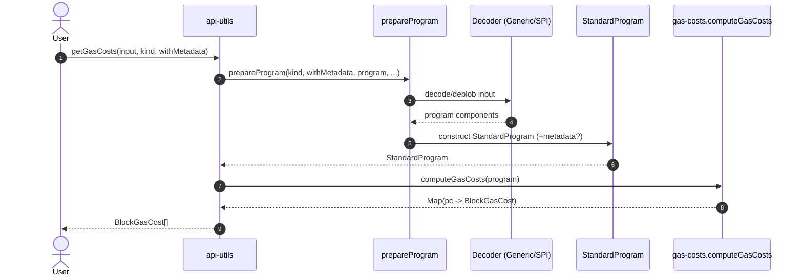
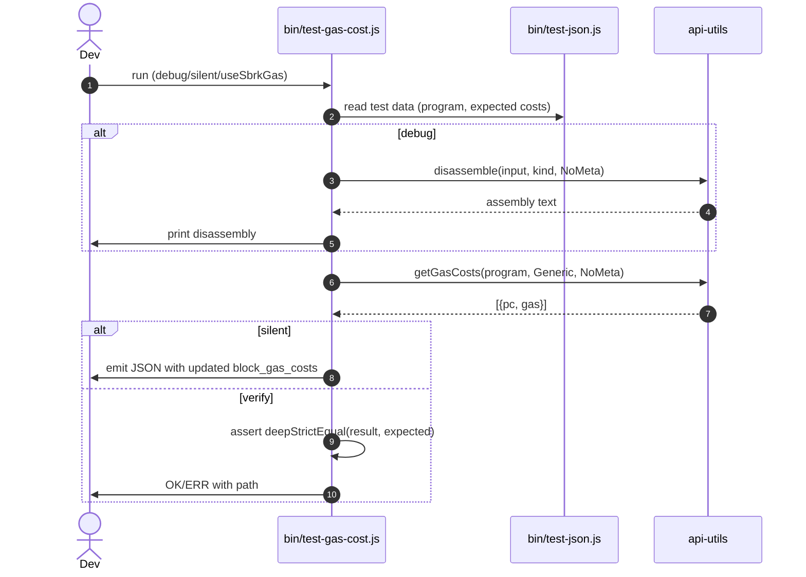

# Gas costs tests preparation

## Pull Request by @tomusdrw


<!-- This is an auto-generated comment: release notes by coderabbit.ai -->
## Summary by CodeRabbit

- New Features
  - Gas-cost analysis for basic blocks with accessible results.
  - High-level utilities to prepare, disassemble, and run programs.
  - New wrapAsProgram export.

- CLI/Tools
  - Added gas-cost test harness with debug/silent modes.
  - Shared JSON helper for reading test data.

- Changes
  - Package now uses ES modules (type: module).
  - Added pretest:gas-cost to build before tests.

- Chores
  - Expanded .gitignore entries.

- Tests
  - Consolidated JSON read utility across test scripts.
<!-- end of auto-generated comment: release notes by coderabbit.ai -->


## Comment by @coderabbitai[bot]

<!-- This is an auto-generated comment: summarize by coderabbit.ai -->
<!-- walkthrough_start -->

## Walkthrough
Adds gas-cost computation and tooling plus high-level assembly utilities, adjusts assembly public exports and debugger imports, updates test JSON utilities and test harnesses, adds a CLI for gas-cost tests, updates package.json to ESM, and extends .gitignore.

## Changes
| Cohort / File(s) | Summary |
|---|---|
| **Repo housekeeping**<br>`/.gitignore` | Added ignore patterns `crash-*` and `/gas-cost-tests`. |
| **API import adjustment**<br>`assembly/api-debugger.ts` | Switched imports of `buildMemory`, `InitialChunk`, `InitialPage` from `./api-generic` to `./api-internal`. |
| **High-level assembly utils**<br>`assembly/api-utils.ts` | New module exposing enums `InputKind`, `HasMetadata` and functions `getGasCosts`, `disassemble`, `prepareProgram`, `runProgram`. |
| **Gas-cost analysis**<br>`assembly/gas-costs.ts` | New `BlockGasCost` class and `computeGasCosts(p: Program)` to aggregate gas per basic block and return Map<pc, BlockGasCost>. |
| **Public API surface**<br>`assembly/index.ts` | Reworked barrel exports: re-exported `api-debugger`, `api-utils`, `api-internal`; added `wrapAsProgram`; moved `getAssembly` source; removed prior direct exports of `InputKind`, `HasMetadata`, `disassemble`, `prepareProgram`, `runProgram` from the barrel. |
| **CLI: gas-cost tests**<br>`bin/test-gas-cost.js` | New CLI harness computing/verifying block gas costs via `getGasCosts`, supports debug and silent modes, and outputs/validates JSON. |
| **Test JSON utilities**<br>`bin/test-json.js` | Guarded logging by `!options.isSilent`; `processJson` now receives a path identifier; added exported `read(data, field, defaultValue = undefined)`. |
| **W3F test harness**<br>`bin/test-w3f.js` | Replaced local `read` with import from `bin/test-json.js`; no behavior changes beyond import. |
| **Package configuration**<br>`/package.json` | Added npm scripts `pretest:gas-cost` and `test:gas-cost`; set top-level `"type": "module"` (ESM). |

## Sequence Diagram(s)




## Estimated code review effort
🎯 4 (Complex) | ⏱️ ~45 minutes

## Possibly related PRs
- tomusdrw/anan-as#84 — shared changes to test runner utilities and adjustments to `bin/test-json.js` / `bin/test-w3f.js`.
- tomusdrw/anan-as#83 — related public API export rework around assembly surface and runtime helpers (prepare/run).
- tomusdrw/anan-as#78 — overlaps around SPI decoding and StandardProgram construction used by `prepareProgram`/run flow.

## Poem
> I hop through bytes and tally the cost,  
> Each block of PC not left uncrossed.  
> I drum little paws on the CLI’s rim,  
> Print maps and green OKs when tests aren’t slim.  
> Carrots for code, a joyful rabbit’s boast—🥕🐇

<!-- walkthrough_end -->


<!-- pre_merge_checks_walkthrough_start -->

## Pre-merge checks and finishing touches
<details>
<summary>❌ Failed checks (1 warning, 1 inconclusive)</summary>

|     Check name     | Status         | Explanation                                                                                                                                                                                                                                                                      | Resolution                                                                                                                                                                                              |
| :----------------: | :------------- | :------------------------------------------------------------------------------------------------------------------------------------------------------------------------------------------------------------------------------------------------------------------------------- | :------------------------------------------------------------------------------------------------------------------------------------------------------------------------------------------------------ |
| Docstring Coverage | ⚠️ Warning     | Docstring coverage is 33.33% which is insufficient. The required threshold is 80.00%.                                                                                                                                                                                            | You can run `@coderabbitai generate docstrings` to improve docstring coverage.                                                                                                                          |
|     Title Check    | ❓ Inconclusive | The title “Gas costs tests preparation” is generic and does not clearly convey the significant new functionality added such as the computeGasCosts implementation, API-utils module, and CLI test harness for gas cost analysis. It hints at tests but omits these core changes. | Rename the pull request to more precisely reflect the main changes, for example “Add gas cost computation module and CLI test harness,” so that reviewers immediately understand the new functionality. |

</details>
<details>
<summary>✅ Passed checks (1 passed)</summary>

|     Check name    | Status   | Explanation                                                 |
| :---------------: | :------- | :---------------------------------------------------------- |
| Description Check | ✅ Passed | Check skipped - CodeRabbit’s high-level summary is enabled. |

</details>

<!-- pre_merge_checks_walkthrough_end -->

<!-- finishing_touch_checkbox_start -->

<details>
<summary>✨ Finishing touches</summary>

- [ ] <!-- {"checkboxId": "7962f53c-55bc-4827-bfbf-6a18da830691"} --> 📝 Generate docstrings
<details>
<summary>🧪 Generate unit tests (beta)</summary>

- [ ] <!-- {"checkboxId": "f47ac10b-58cc-4372-a567-0e02b2c3d479", "radioGroupId": "utg-output-choice-group-unknown_comment_id"} -->   Create PR with unit tests
- [ ] <!-- {"checkboxId": "07f1e7d6-8a8e-4e23-9900-8731c2c87f58", "radioGroupId": "utg-output-choice-group-unknown_comment_id"} -->   Post copyable unit tests in a comment
- [ ] <!-- {"checkboxId": "6ba7b810-9dad-11d1-80b4-00c04fd430c8", "radioGroupId": "utg-output-choice-group-unknown_comment_id"} -->   Commit unit tests in branch `td-gas-cost`

</details>

</details>

<!-- finishing_touch_checkbox_end -->


---

<details>
<summary>📜 Recent review details</summary>

**Configuration used**: CodeRabbit UI

**Review profile**: CHILL

**Plan**: Pro

<details>
<summary>📥 Commits</summary>

Reviewing files that changed from the base of the PR and between b2b99622f37ed7419c4755ac0ef635b218ef938e and 300f635d4f191e793f8afd675bcbd3c362246bdf.

</details>

<details>
<summary>📒 Files selected for processing (1)</summary>

* `bin/test-gas-cost.js` (1 hunks)

</details>

<details>
<summary>🧰 Additional context used</summary>

<details>
<summary>🧬 Code graph analysis (1)</summary>

<details>
<summary>bin/test-gas-cost.js (2)</summary><blockquote>

<details>
<summary>bin/test-json.js (7)</summary>

* `run` (11-87)
* `read` (141-149)
* `result` (130-130)
* `OK` (7-7)
* `OK` (7-7)
* `ERR` (8-8)
* `ERR` (8-8)

</details>
<details>
<summary>assembly/api-utils.ts (2)</summary>

* `disassemble` (24-38)
* `getGasCosts` (18-22)

</details>

</blockquote></details>

</details>

</details>

<details>
<summary>🔇 Additional comments (4)</summary><blockquote>

<details>
<summary>bin/test-gas-cost.js (4)</summary><blockquote>

`3-3`: **Verify that global JSON patching is acceptable.**

`json-bigint-patch` patches the global `JSON.parse` and `JSON.stringify`, which affects all code in this process. If any dependencies or future code expect native IEEE-754 number behavior, this could cause subtle bugs.

Based on learnings.


Consider whether explicit parse/stringify functions (e.g., from `json-bigint`) would be safer to avoid global side effects, or document this decision if global patching is intentional.

---

`26-44`: **LGTM!**

The input reading, debug output, and gas cost computation logic are clear and correct. The integration with `getGasCosts` and `disassemble` from the WASM module is appropriate.

---

`54-61`: **LGTM!**

The assertion logic and error handling are appropriate for a test harness. Using `deepStrictEqual` ensures exact match of computed vs. expected gas costs, and throwing the error allows the caller to track failures.

---

`63-69`: **Verify gas values fit in safe integer range**  
Converting `gas` (BigInt) to `Number` on line 66 of `bin/test-gas-cost.js` may lose precision if values or cumulative block sums exceed `Number.MAX_SAFE_INTEGER` (2^53−1). Ensure current static gas costs and block totals remain below this limit, or preserve BigInt output if needed.

</blockquote></details>

</blockquote></details>

</details>

<!-- tips_start -->

---

Thanks for using CodeRabbit! It's free for OSS, and your support helps us grow. If you like it, consider giving us a shout-out.

<details>
<summary>❤️ Share</summary>

- [X](https://twitter.com/intent/tweet?text=I%20just%20used%20%40coderabbitai%20for%20my%20code%20review%2C%20and%20it%27s%20fantastic%21%20It%27s%20free%20for%20OSS%20and%20offers%20a%20free%20trial%20for%20the%20proprietary%20code.%20Check%20it%20out%3A&url=https%3A//coderabbit.ai)
- [Mastodon](https://mastodon.social/share?text=I%20just%20used%20%40coderabbitai%20for%20my%20code%20review%2C%20and%20it%27s%20fantastic%21%20It%27s%20free%20for%20OSS%20and%20offers%20a%20free%20trial%20for%20the%20proprietary%20code.%20Check%20it%20out%3A%20https%3A%2F%2Fcoderabbit.ai)
- [Reddit](https://www.reddit.com/submit?title=Great%20tool%20for%20code%20review%20-%20CodeRabbit&text=I%20just%20used%20CodeRabbit%20for%20my%20code%20review%2C%20and%20it%27s%20fantastic%21%20It%27s%20free%20for%20OSS%20and%20offers%20a%20free%20trial%20for%20proprietary%20code.%20Check%20it%20out%3A%20https%3A//coderabbit.ai)
- [LinkedIn](https://www.linkedin.com/sharing/share-offsite/?url=https%3A%2F%2Fcoderabbit.ai&mini=true&title=Great%20tool%20for%20code%20review%20-%20CodeRabbit&summary=I%20just%20used%20CodeRabbit%20for%20my%20code%20review%2C%20and%20it%27s%20fantastic%21%20It%27s%20free%20for%20OSS%20and%20offers%20a%20free%20trial%20for%20proprietary%20code)

</details>

<sub>Comment `@coderabbitai help` to get the list of available commands and usage tips.</sub>

<!-- tips_end -->

<!-- internal state start -->


<!-- DwQgtGAEAqAWCWBnSTIEMB26CuAXA9mAOYCmGJATmriQCaQDG+Ats2bgFyQAOFk+AIwBWJBrngA3EsgEBPRvlqU0AgfFwA6NPEgQAfACgjoCEejqANiS4BxNMiaJcyGk+S8S3NFXH4MBgDlsZgFKLgAOAFYDAFUAJQAZLlhcXG5EDgB6TKJ1WGwBDSZmTIJmbERaCgB3TMxMMHtM7mwLC0yo2MQwyDKKquqDAGV8bAoGEkgBKgwGWC5cWmJ7MEdcA2hvUlwpmbmuZm1/IdxqCq58bjIDOJIJeBJqygzIAwSVEgsXgwBhChJqHR0JxIAAmAAMoMiYAAjOCwOCAJzQGEAZg4oIA7BwACzhABaRn0xnAUDI9HwADMcARiGRlDR6MU2BgQbx+MJROIpDJ5EwlFRVOotDpiSYoHBUKhMDTCKRyD4gcz2FwqNVIIhgocKPI5AoBSo1JptLowIYSaYDBpcuIiBh8P8OAYAESugwAYndkAAggBJOkKwH0TWsbzyKmMWCYUiIIk+2hKejwO0OyZeVKUDAufCQa3qZP2x0GSC6RhURCwMAAKmLpZyKzWYFczgMUAAogAPJDiDBEFAp/7IAAU9qUAH1mIpWtIADS9aTOTJVgCUkH+h3gWGwsyjvboGiMbac8EOjP1k3+90ekBIlMpDpBCXwg1dzqJlvs3RCFlkdW48DAJQBGwIhSAoDRnCdV8PS9P0AwZIEQ21cNqTmaNpDjGJuFoQEXFgSZEFGcZJgjXBYH+SYMDQNh6BIDtuAfF5gPgCxaAAWRIScdTnX0MHzNALB+fIMAAaznTB6F4/iLAABTQUh0H+SB7XVE8GIoM9KQoFhcz/ADNxoCgqIsFAsxoNAKWpDQ9Pgih4AYDQYAQBxdxjXp8MgSdaGnKZRgwHCdUge8+DI6QCNkEJ8C+SBqjyUYdgEwzNz7UL4D4Ki2GQB1IAqeSSHEu8uWS9zJjUh8eGoWB0H8nh8BoVl4AEn8YqjHYDMzASUGYbgrBZU5fCwUK+RYSYtJYA8jBgn0LEM6h4D8bMSsgJQGAsbw5oW/hqTo9Sz2yloBAseybwa8QMNbQ9j1PJVFAvO4HnVW9gsfZ8XTdVsP0QL9Dt/NB/zAPAWMQCCMjet9PR9f15QQ4MtTDLbI3Q2MDF43BtO8iZkDQZTry8nzP04n6bMBr4Qfc6gb3o/BumQBAiErKwpBMkn82kILsoJ79krnWgkE5w7ueq2iO1EQHex4bSiCoZhgcgABpEh5EpAFcDGaQnSgGSCiOhgTuCZBeJaXA5c3eghxsek7IYOchhk31VwkyAAAl7A404cNOSAhwATVnSAAnwVcCA1T4uVMo3elkK4sZqth3eobHQije4HQPKBtjsRAfmp5wh03I25xE0251isi3YshPly4YojbZx3/lVozkCIewFCcKYLHwBgROQYL0AlzxvCBXh8Cl6i0+WvmvsJqw84wAvICL/yS7ycuPbQKvJ8QfmrCxiXR+l3ocxlHf5CcOzeznS4Bqa+RN1W7BefFuOK89/CO2W4JuAnjwvH+GTJbSyHEvWgc4oyIDXgnOcI8x7MDnJuaStxchOGePAvi4gBJyVIGxP6aDpIcS4rIcSFAiCIE3sxVie8TgSW8LQABB9qJTHkCQPIlBlokEOoINQ4toZW3PPwPgK1FDFVtr6cOeBxLcB6rIYqI97iJk8pxB0v5/jIMMogcSNVqCnDmMVF+68WpkDXCQAAjtgBc+5Wxrm3PQ2BQ4YHSzwRgiwmdoGAOotnbchk5yd1IXOCoJAhjTBEpnTedFRauH7tQ/ytDbGH3uNjUKkAABqbE5wNzGHxcW2NknMAAPJ4AXqXKqCDnGQBbjHegMkfgKAwJSZMYwNpYEdtfeaxlIC+NyNkmqQSKAiXKa3XKpAJ6ow6iZB0cwFw+DaR0u4yg3ISG8PNCoChup+HYC8NghCpjYBYk/Igc4Kltx2DXPATSbZ23YfyQWjtsbRICnQ9xzAYpUCkWw4pij46e3amPAajk2wUG0nwXctAjri3vhYR+bMyLaViuLPwOVRIqSwIbPAJt/ITQht6GaDI2mLSSStNa0zNoRh2g+IE+1tbHXYKzZGUAAjXjIMELgqLjam1Mp5KcVh0DT2/L9f6JNgYtnpYyjAzLnauxIF87Gm5OXeW5afYm4hSbCv9teSk24xBtK4Bnew2c3BzyNlwbA4QADaABdQupsWXzzRcXGKq8pWvzQFwF2ECnXr03gAIU7t3TO+rcAWqsQy9UGrZgDS4LzbevLDokENXgY1ZrLWL2tZAVl6LQEOrLh6hOrrJXSs3ufZKwb1WaojQPP+JA4nUSHLWEBNqjYZpnLWcBkDTh5vddK5tJYHHUUTRa7tplEEkDUc8Y1AA2HEA7aylMarJPKODuA2uklgkg06SyzoEgQ5Ry7nFCW3CJddilSH9stQYTe9zYlPJLaGst2rrEYGrcwWtPanlcEvRQR5DC4EzvQXOzOXB4CTsgAAXkgOCQdvbmCeNZD0bAqJQSgfA4O3xTF8BRQBFgMDlIBLdEHQE3pIT7BcAEOhqwMpsO4fyuerguSClpDwJdcQ10mS3WMVeR6d4HxcA4rzYIYN3xgCMIqipqwc5CtBtBLFUNLZBg1HDQKEY0J7mRqjdG2BMYDMQGJ9u9QfyIFQH3fkkxOHd1lt6BMe8fVdyI1nHOjA1pfSzVVA6OsgoPEoTwXWQ54OggdjVI5PnJ3LkchZ2gDgWC139eJ+xXAn2rmqAgfYVjfSzUifgKQfAoOmXPhpgaGjICLKOh7YqAI5i1QMwNQrjUeAaEOIgESGgkC8Vy1qvwecQtWIACJSsoMwTcbNNytaqwYsazzfQBCGNAOIMQfjQF9HkybAjIBsV9EMIYE2bBjgm1Nmbc2FsBAntQjSe9yDqms36vV9nEtGO/gIew9kLs9ya4gY7uAOtzkpJCisxUkkeBTis0z/Tg7Y0ON/Kx3oGAMGCK0XCWn2Z8DKyUsyFA8szIMjmJJ0PAXsA7jZieFnFmzGhR5TulxTJKA/nqBr8BuBetkK4aA+AGUdlwC1tGaP2vwFXGNpa2X6uNYh5SQyS0yfcE+99/CeFRqbk6kD0ywcklg6FsYxuWZ+6LuAL5ucT3otOD0IvRWQI9RJPl04bwOxuAORuJ8B4WUsDtSMp1J9PFJvTdm/NxbQxNH0FW+tzb223d7c9wEOV05Za8QfkoZAlAgWGKwGQJgXjKDFXtBgMAQ2OdtawAxSreLP4Xz7OoXFfgJpGCxTi4l6vFceUJetfLCMyUaQpVlqlusaVnTpZAH4jmsYJjoFwAABrrq7ThB8csHyJhs4mQaD9rJrNv7nPjhaH1b41CHB9zkHxUidOI59WIAGJ3oRRZRMQ/Tk0D17nJdkB4s8b+lrhDOvfW2YDXocfsrJ8xp/PWbTawJP75HjMZybGbsYPQ3hcYaQ8Z0DwD8bQQfRCYGCKqmx0QgxQRujSa2RyZITwxKauTnRQC3A9RoATD0B/aXjLLuCL7eiXKagUA4YTCUy7TIAfLYxnaKQzCkB9SqhKJSDCzMFBTaTPJ/Q6C3L/S8L2Q+7oD970D/BgBN7OCCE6QiGAQcIgRgSSIASCpSEqGO7GTiSdziysE4yPT0Q6zqBMHlTVCvLeiIBPpKHPJQZgAUK0ATy3CTh8E8CL4d524Np2o1RMpwISqdrOp6xBFRo7yjTH4YBuKDz/xPJBTRFSGo6PoJFhrZ4TwKzcA7AKEIzWF/S2Eu4U72RzTZJeECy6zpFVYqTyb0EkFAgJL7ywLOG7KsQTxsQZZAjbC2HfTNS5G84qESG6wg7/R6GdQjg5iCDdAUCLKxqIx7hHxLSIARSkYWCACYBMgAZnaGcP8FfBgM1OoMgHjNyr6k0p1lAGFkCOwa5sdHIQoYtNMPgBZEYn9ovnQQwdYOgG0JYSdg4egP9EBOoWwmIVocqsDJNFNNimlvnjXpMHXlXllNtFTM3hSK3hUSdOIJ3nGJ2LtECB3vIOuJ0bQEPumqbOPkOIETzkIZAF/r0b+CgR2LPlYjieSrRKdASbwQPjSW6m2mgOSZSX8bSTPPSf5Kgc4HPu2MiWePicYh4VyYPhEd/nGvnAmjlEmlav5H4WysvM5ryR2ryYWmjMlOPrzkKXypkAyUyZKbiWyZiRyXKcSTSb/EPE+kOBoO6cuOSVsVRI3HdGrsVIPh+l+rAoPlSTpGaUTJaeKcyVKXieybKUSUPika6e6RoJ6V7N6TsX6ZkgGXRoUngKGYKcgaKYydGdaayRieoPIA6ZkP8BlPKd0d/rIOPgoUCKaYMZbPZOPoAEmEykz4Pxmk1Jk+oxsGTuFgH+WAEZP+UZiAEpkALJKJlZuA8gp+8p+R3AhRTyJpQ51kThLh5J1x3hUpy4MZNpS5K5MhPB8hUpXxJkpp1kKhgJoElAB514Nxus7x9RJ55Zi5Mpq5jpdxN5TUgpD5AqYJr56o75tRHxJ5BgQBJ4IBbGFBjKkBIITsyYsAAmCBRg3CpQC4ywf+OcGgQgkmGBsEMmgYZ4OBimqE+BqmrI6mmm2MPwCQYizYkAUYRk0gmxDAdk2RUwm4eFTgBFOmmgJF5MOwRW8AHsbMRyawqyRsTSEenAcYckFANM847cBiTArIRwxU2M2WjshxeO3c8O/+1WiS+FJFpeJFIyGAEg+AIkslUqV+iA8amgUGPEtq2prhFsCokhwRvJGgAc/mrG9llAihSSg4rQPYfY3gVAd8rIx8nkf0/48K1I2WSeo5XsVuQcOYgWQQIQlAq4FQ+lECf0R22AUijE7CwEfYXkkwwcvABkS0ipvRw8TyUhBmVgrIcqjVkx+ZCUkAAAUkMIthVLIJ3BZM5jlNhHJkDmOBUmOOZX3HRIZO0jXEsoRBgHZX2ent1bjg1eJNPL8WRBTFjpFngF0dPu3MrqeJMtLkwVyECCqZoEDq5SrqhvJlDtxctjhixGrDlAZuLHknLJkG2HEHEClX0s8BPC7P5LvDeICg6LyB0qPF0n2BDVDfXFKuRM+L9h5HRBMNkW0hPCyRpaDkcBiYFGdTsCkY9exY0SkfYtpJjIgFflfCTQtJ1r8H4GjFFEFJ3NUBrClbKmaA+izV3NxRzfwFzVmAlnkLUvUkQGrBSHLcOEgD1nVfAq9ixOwP4t0IRqEj/KzdLaPipSWFAF6q0eFuIjsLzgYpLbAnOAtUtf/p1pbZAHknLbfFvJEZUhLAZFjE2fHigIgFrSBGHSdCoFYK4fPt3pdZEtFTNEhq7H9EOLqnZgaq9RoJ5Wmt5RmhoH5SntbIFTmqcMFYHB7aWL6NSEgEMHrayDwcQYwevBoK7fYMteJjNcnbgFfINSNWNaHj5vsb9fUlYHJGRFHQAORgDT3LjJFSqZLLQJwHie1thfCfEEwaTsKeAnBWy4BthmICRDi91oJGzt0v6uXLgADc/AWAmoP1TmviXtcsKu6YsAexQU2gkKSkL9WNKuDceN1QE8ad3AQ47t1cfgmWihpqAA3lbocvYAAL7mqLFwOQCmpW7mpcCFWhAUAZ32CrjIOYqwSV5KWLEEqiBEoUOkqxmonlFuY+EEH+zrJMYIVnigHIWcbPQ8abgOjl7uhYUQCIG4XNhgDWU7UkXoHgzkVYFUUKYoTzExhxg2DYC0JAjsXm6qzICdLFRJzsrwDUhDggCtILQvYN09W4DnGQBYQyVMhNSLQjxs3DXbWLFeBOYnwJj5h+CdRbDBAqjx28TGIWQH5CEnBPxuJS1fSuPtaSOc35Zziz3z05bmSWS9DVDHwkLgme3BPOPcUH561RMuPbVDiSNdZQKy2JPuYT2VSriZ4AjpO4CZPHrgkXEyH9yHkVGZCtn0BVEzL/AWRDjryfYeaZpKA4YxXJICTmJIbbgTMDa0BBytSq6ZKPX1LL4oAZWDj62rNNz9wTNoAxVbP7zyJ0BXwhTAMxxI1x5GP9z/BmJpRtljNR39ZfTJRl6QnkMN6wlXI0MN50NnmUronMNd5uywCKDSFn40n9HREhO0DDOVMbOsQ8y3hHMzTTOQqTBgbzO3iLPpmf5iNWXbXEWznsMsb8LcMQG8MrYwFwHvQiM4WCXiPVCoiUiksyOQkUUwzyahg0XKMsNEFrSaanHMzKpVmJHhoDONMzUyhlSLmDN9PUniOSOktMKzUlbixJLysgi86pmQDT3WQqskskXT2LEQpQrwuOSSgx5HT9Y+kk6lTp7j1wl4t/oIoRiKuAO25swIpJJrVjJdQ9ScTsBNLWseSDg7CkSk6jzHS007J7LICvUr2nDpLbiPV52OybWDjGKagzTIDrhHBJu6ViCOTZwMUC1fb9moCar4H0APZKB/FRWcn0CivwuSvZ7HWMCOOLGKuIupu5gel9nqj/DKx1mMHatrKLnLGRQWCOQBz8ChR8BJxoApxUAmTKZuRTGUB8GfMV7QmbS/Pwm0NIlAtolMOnR25xgLubvQo5jHsAunsVnAsXuYl24TTwUUtcP3QoU0u8awHMDCOWheDdx5Skt+CcuYG8LYGKMIy3td6XFkEtPsHzzPKIC8W045EMW+Hx0eDNgcCiZrBcCocPoJusTx34eEc5zEdsbWREvCVUdOCksQ4dMEDcBgCMyfBh7crLlXBOie28efHHEkBWJwBhQCsx6s7khLQuFCU7CZN9JVvqiOyIClzlZ/YkEiR5SLFthDDcd3SESQp/LkuIWNtUtPTca0t8aAfwHEgGDignTpNHO0jQecMsDcFrhoDqjUW6jDQGhCjGiihmj2ekirL9a4BjjSWIBjjcN0Bjjm4712cOcCCggCCIiIjjqgigiUioiYh0CYg4gwiIgMA4iYiRCRAkHgi3jjqoiRApcwjhC3iIioiNemiGAOeojgjgiUg1eRC0A4iUhFcwgkCYjNeUjhBoCUi0DjplcCAMACC0CogMCoiZegg4jjoLfUhJehfMjqCRfhYxc/tPC0BjjSdiihceATiUCkDLX4RmbxenCJfBcGBwO1jOhIAyRxBPZ0DZysDsAyQ5x0DOhcA4ab2DrOgVijCsRPaffA/f1g9vdIB5KZZ2T94YBw+g94Zve8y0BxDbhdZdz73JRZx3ciRw8c7UYljOg4948YDmC4BWBCSiBk8LCo6U+QDU/SW089bod8UDRM/dwY9Ubg9gpOW0C+hfTmKvZoxw+ugi/2C4AC8iS3B5vOBw+mq1glivclg68c+TLdwBDUQkCy888Ydy3d6k/OiDq68Q/9QVDk9s/W86/Og7RrQ+ltKy9K8ahFxvL0BQDZxKBxCGjqAbEcUYUcdzImQ+dR1kAx37hW+a/O8NWy/VDeBZJEAJ+69U8OjJiy6CSk+G9sCy/R5m8DRvi6/INO/a9Z/Oj68iSF/G9cDOj0/cpK+Z81/aP28g/C+J9U+u/1Bl9N9ie9CWCTCAA4BJnMci4AuO4P8H/E0oALgEUdQxKutA+AbM9oJy5GFAzUOlUg8gSS3pRjJRvV7B/TvjR0y5ULiEGmVUrcF13UV1H1akvUobA0c4NB/ogq+nUhLFbFC4HFNPmPWyhyV7MemWQAZmUph9WQWMHYM2BkB4B+A4XaXN0AUBKR4OGgdvjb0HBRRAYfgWXrcHrJ85WgJkB5lLzgE5guIaYf4AwCQCfAOSX2MOEriprwdPs2UOiNRGDaQAx+YWMyvZgvxNJ9OKuP/ppR2CcVyAX0GcEv0IgSUwCjwZ4F1BoiNQaAzUXFupVOA1QkkZ/aIgJCrKYCneVPZPk31T5GRkoWA53jQL8DK01YDvcxAYI5458ukAkJXg31l6YkrA5fHXpX0T7V8bedfVwU3wJ4MAi04sbOJljyjmCqenfRAELwR5Z8Oe/fd3vgMCFdwQhfYJgOEIUioBUQqIDQDkIACkLUeyCUmLaag7w9kB4KyHDZ3RHm/wMguRGkAQtWIUdcIOCA0Bdd8h+g3vhzxwFGcPeTfb2KMG7ZYAUiNJAAALGZBQRoE0K5zhKpCjSvYWcua26jaQpAy0eYYXgUCZCSAXQ+Ic6CMEc8TB6fSIQ4LshOD8+zPAIRzzX7BCFhpCTwSWGQa1gz0VPRzLgE+4t9G+CQpQJECy7TcGA4IBgDlxhCggSAOIObuCDQA4gcQkIykJEDoACBMQaANAKN1BCIhKQDANADVwhACBx0aICrqVwYCYhx0y3WgJSERCAjEQxvAwE8JC4QAB4V3EhCQFu7M9ouZ3M0EAA= -->

<!-- internal state end -->


## Comment by @coderabbitai[bot]

_⚠️ Potential issue_ | _🟠 Major_

**Avoid double JSON writes in silent mode**

`run()` already serializes the object returned by `processGasCost`. Printing inside the silent-mode branch results in two JSON payloads for a single run (pretty + minified), which breaks JSON-in/JSON-out workflows. Let the wrapper handle output and only return the data.

```diff
   if (options.isSilent) {
     data['block_gas_costs'] = result;
-    console.log(JSON.stringify(data, null, 2));
     return data;
   }
```

<!-- suggestion_start -->

<details>
<summary>📝 Committable suggestion</summary>

> ‼️ **IMPORTANT**
> Carefully review the code before committing. Ensure that it accurately replaces the highlighted code, contains no missing lines, and has no issues with indentation. Thoroughly test & benchmark the code to ensure it meets the requirements.

```suggestion
  if (options.isSilent) {
    data['block_gas_costs'] = result;
    return data;
  }
```

</details>

<!-- suggestion_end -->

<details>
<summary>🤖 Prompt for AI Agents</summary>

```
In bin/test-gas-cost.js around lines 46 to 49, the silent-mode branch sets
data['block_gas_costs'] but also prints a pretty-printed JSON, causing duplicate
JSON outputs; remove the console.log(JSON.stringify(...)) call so the function
only sets data['block_gas_costs']=result and returns the data, allowing the
caller/wrapper to handle serialization/output.
```

</details>

<!-- fingerprinting:phantom:medusa:sabertoothed -->

<!-- This is an auto-generated comment by CodeRabbit -->
