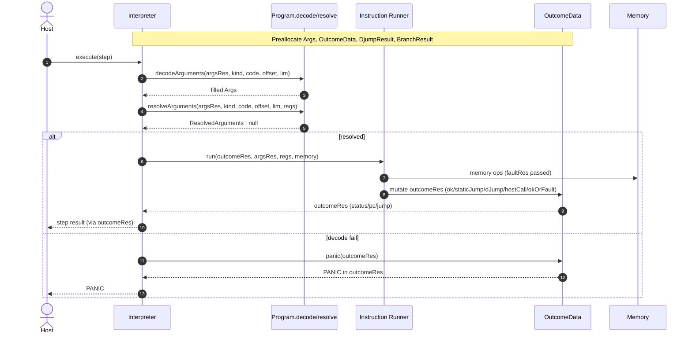
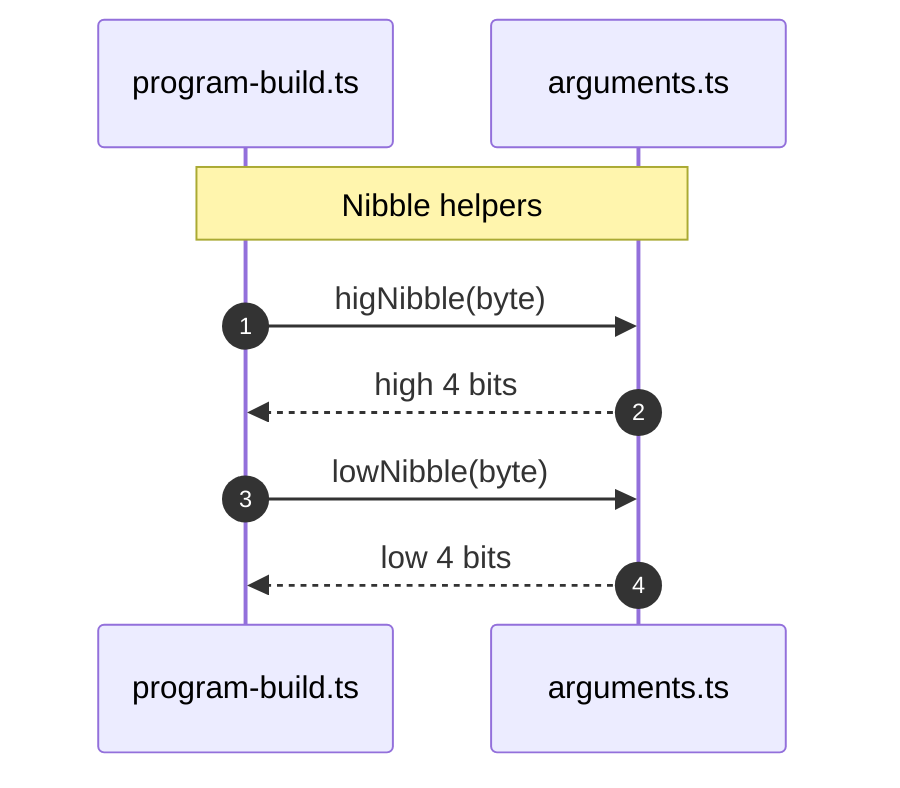

# Reduce GC pressure

## Pull Request by @tomusdrw


<!-- This is an auto-generated comment: release notes by coderabbit.ai -->
## Summary by CodeRabbit

* **Refactor**
  * Execution now threads a shared runtime context and reuses pre-allocated result/argument objects for in-place updates.
  * Argument decoding uses instance-based filling with explicit low/high nibble helpers.
  * Memory APIs now use an explicit fault receiver to centralize page-fault reporting.

* **Bug Fixes**
  * Safer 32-bit signed-division edge-case handling.
  * More consistent branch/jump and memory outcome propagation.

* **Tests**
  * Tests updated to exercise the shared runtime context and fault-reporting behavior.
<!-- end of auto-generated comment: release notes by coderabbit.ai -->


## Comment by @coderabbitai[bot]

<!-- This is an auto-generated comment: summarize by coderabbit.ai -->
<!-- walkthrough_start -->

## Walkthrough
Threaded reusable Args and OutcomeData instances through decoding and execution, converted memory API to fault-driven MaybePageFault calls, replaced nibble utilities with lowNibble/higNibble, and updated many instruction handlers to accept and mutate a provided OutcomeData. Tests and interpreter updated to the new signatures.

## Changes
| Cohort / File(s) | Summary |
| --- | --- |
| **Outcome & result plumbing**<br>`assembly/instructions/outcome.ts` | InstructionRun type now takes `OutcomeData` as first param; helpers (`status`,`staticJump`,`dJump`,`ok`,`panic`,`hostCall`,`okOrFault`) accept and mutate a provided `OutcomeData` and return it. |
| **Interpreter state & invocation**<br>`assembly/interpreter.ts` | Interpreter preallocates `Args`, `OutcomeData`, `DjumpResult`, `BranchResult` and uses them for decode/resolve/branch/dJump/instruction calls; `nextStep` → `nextSteps`; branch/dJump mutate provided result objects. |
| **Args decoders & nibble utils**<br>`assembly/arguments.ts` | Replaced `Args.from(...)` with `Args.fill(...)`; decoders now take `(args, code, offset, end)` and fill the instance; added/exported `lowNibble` and `higNibble`; removed `Nibbles`, `nibbles`, and `encodeI32`. |
| **Program decode/resolve propagation**<br>`assembly/program.ts`, `assembly/program-build.ts`, `assembly/api-internal.ts`, `assembly/program.test.ts` | `decodeArguments` and `resolveArguments` now accept a reusable `Args` and explicit offset/limit; call-sites updated to pass shared `Args`; program-build switched `nibbles(...)` → `lowNibble`/`higNibble`. |
| **Outcome threading across instructions**<br>`assembly/instructions/*.ts` (jump, branch, load, store, logic, bit, math, rot, shift, mov, set, misc, ...) | Instruction handlers now accept leading `r: OutcomeData` and return `ok(r)`; calls to `okOrFault`, `staticJump`, `dJump`, `panic`, `hostCall` updated to forward `r`. |
| **Memory fault-driven API**<br>`assembly/memory.ts`, `assembly/api-debugger.ts`, `assembly/memory.test.ts` | Memory methods now take `faultRes: MaybePageFault` first and report faults by mutating it; read/write/bytes helpers refactored; tests and debugger updated to use/check `MaybePageFault`. |
| **Tests and call-sites updated**<br>`assembly/instructions/*.test.ts`, `assembly/program.test.ts`, `assembly/memory.test.ts` | Tests create `OutcomeData` (`r`) and pass it as first arg; `Args.from(...)` replaced with `new Args().fill(...)`; decode calls updated to new signature `(args, kind, code, offset, lim)`. |
| **Build / config**<br>`package.json` | Release build script adds `--uncheckedBehavior=always` to asc invocation. |

## Sequence Diagram(s)




## Estimated code review effort
🎯 4 (Complex) | ⏱️ ~60 minutes

## Possibly related PRs
- tomusdrw/anan-as#49 — touches program decoding and mask APIs (nibbles/skipBytes/deblob), likely related to the decode/Program API changes.

## Suggested reviewers
- mateuszsikora
- DrEverr

## Poem
> I hop through bytes with careful cheer,  
> My Args held snug and Outcome near;  
> I pass the r, I catch the fault,  
> Low nibs, high nibs — no bytes exalt.  
> A tiny hop, a tidy run — hooray! 🐇

<!-- walkthrough_end -->


<!-- pre_merge_checks_walkthrough_start -->

## Pre-merge checks and finishing touches
<details>
<summary>❌ Failed checks (1 warning)</summary>

|     Check name     | Status     | Explanation                                                                          | Resolution                                                                     |
| :----------------: | :--------- | :----------------------------------------------------------------------------------- | :----------------------------------------------------------------------------- |
| Docstring Coverage | ⚠️ Warning | Docstring coverage is 0.00% which is insufficient. The required threshold is 80.00%. | You can run `@coderabbitai generate docstrings` to improve docstring coverage. |

</details>
<details>
<summary>✅ Passed checks (2 passed)</summary>

|     Check name    | Status   | Explanation                                                                                                                                                                                                 |
| :---------------: | :------- | :---------------------------------------------------------------------------------------------------------------------------------------------------------------------------------------------------------- |
| Description Check | ✅ Passed | Check skipped - CodeRabbit’s high-level summary is enabled.                                                                                                                                                 |
|    Title Check    | ✅ Passed | The title “Reduce GC pressure” succinctly identifies the core change—eliminating per-instruction allocations by reusing pre-allocated objects—to alleviate garbage collection overhead across the codebase. |

</details>

<!-- pre_merge_checks_walkthrough_end -->

<!-- finishing_touch_checkbox_start -->

<details>
<summary>✨ Finishing touches</summary>

- [ ] <!-- {"checkboxId": "7962f53c-55bc-4827-bfbf-6a18da830691"} --> 📝 Generate docstrings
<details>
<summary>🧪 Generate unit tests (beta)</summary>

- [ ] <!-- {"checkboxId": "f47ac10b-58cc-4372-a567-0e02b2c3d479", "radioGroupId": "utg-output-choice-group-unknown_comment_id"} -->   Create PR with unit tests
- [ ] <!-- {"checkboxId": "07f1e7d6-8a8e-4e23-9900-8731c2c87f58", "radioGroupId": "utg-output-choice-group-unknown_comment_id"} -->   Post copyable unit tests in a comment
- [ ] <!-- {"checkboxId": "6ba7b810-9dad-11d1-80b4-00c04fd430c8", "radioGroupId": "utg-output-choice-group-unknown_comment_id"} -->   Commit unit tests in branch `td-opt`

</details>

</details>

<!-- finishing_touch_checkbox_end -->

<!-- tips_start -->

---

Thanks for using [CodeRabbit](https://coderabbit.ai?utm_source=oss&utm_medium=github&utm_campaign=tomusdrw/anan-as&utm_content=88)! It's free for OSS, and your support helps us grow. If you like it, consider giving us a shout-out.

<details>
<summary>❤️ Share</summary>

- [X](https://twitter.com/intent/tweet?text=I%20just%20used%20%40coderabbitai%20for%20my%20code%20review%2C%20and%20it%27s%20fantastic%21%20It%27s%20free%20for%20OSS%20and%20offers%20a%20free%20trial%20for%20the%20proprietary%20code.%20Check%20it%20out%3A&url=https%3A//coderabbit.ai)
- [Mastodon](https://mastodon.social/share?text=I%20just%20used%20%40coderabbitai%20for%20my%20code%20review%2C%20and%20it%27s%20fantastic%21%20It%27s%20free%20for%20OSS%20and%20offers%20a%20free%20trial%20for%20the%20proprietary%20code.%20Check%20it%20out%3A%20https%3A%2F%2Fcoderabbit.ai)
- [Reddit](https://www.reddit.com/submit?title=Great%20tool%20for%20code%20review%20-%20CodeRabbit&text=I%20just%20used%20CodeRabbit%20for%20my%20code%20review%2C%20and%20it%27s%20fantastic%21%20It%27s%20free%20for%20OSS%20and%20offers%20a%20free%20trial%20for%20proprietary%20code.%20Check%20it%20out%3A%20https%3A//coderabbit.ai)
- [LinkedIn](https://www.linkedin.com/sharing/share-offsite/?url=https%3A%2F%2Fcoderabbit.ai&mini=true&title=Great%20tool%20for%20code%20review%20-%20CodeRabbit&summary=I%20just%20used%20CodeRabbit%20for%20my%20code%20review%2C%20and%20it%27s%20fantastic%21%20It%27s%20free%20for%20OSS%20and%20offers%20a%20free%20trial%20for%20proprietary%20code)

</details>

<sub>Comment `@coderabbitai help` to get the list of available commands and usage tips.</sub>

<!-- tips_end -->

<!-- internal state start -->


<!-- DwQgtGAEAqAWCWBnSTIEMB26CuAXA9mAOYCmGJATmriQCaQDG+Ats2bgFyQAOFk+AIwBWJBrngA3EsgEBPRvlqU0AgfFwA6NPEgQAfACgjoCEejqANiS4AlOtgYlIAcQDCPCtMTZPBgHLYzAKUXAAcoQYAqjYAMlywuLjciBwA9KlE6rDYAhpMzKkEzNiItBQA7qmYmGBoiKnc2BYWqeFRiCGQRSVl5QYAyvg+jpACVBgMsFy4tGD43LgG0GgUpLij45NczNoYA7jUJVzzZAZ2EvAk5ZQpkAYxKiQWtwauntR06JyQAEwADD8AKxgACMf1BABZoP8OIDQhw/hCAFpGfTGcBQMj0fAAMxwBGIZGUNHo+TYGG+vH4wlE4ikMnkTCUVFU6i0OjRJigcFQqEw+MIpHIVBJClY7C4VHKkG8rBW8jkCmZKjUmm0ujAhnRpgMdQ6QQssiq3HgYHgFMoGDQFg0uBSBgARE6DABiF2QACCAElCcKPvRZTsKPJcYxYJhSIhUZAvcxuPgKHauGhaLRkB7VsgCF1YE5GgILPAGIaUHGE6L1CRmMgcRQWJAHRoqqtAuxEI2DFA1h7EPqC7IuAx3jRkGgZeHPPQM0RkObEAcJk4ABQrGd2RAASnQGHoJWkKHWdW36Bb5PW2aUTJI09bFMQABpIJ5uBY0AxzUQc3nPBchshaPAnhiJAADW5q0Kk3gCCsVCyGA0EdKS1o2p2kDdr2Vb9lw3B6vuuC5uOKyfKuiDrigFL4JAl6KNep5thoqEkAAHqIeAkAACnWRBUMwg7DvuY6IBOnzTrOGDzpgIwrpm65bpgu4dLO6zlLmWAMMhH5PtI+AWFIN5nv+PiaVIFACPgHSQBY+BEJkGCfvJ5HzhQDjiPgWC8Pgji9h+j7Pq+752V+HgkL+JRUYBtKMMhkDlFkQzngRok8CsaBsDQFAMVAniIDpel0XeUXNFw2DcLQ/pdJRb6OAskDSWu0iPhoTVyTukAYPg0pASQkh4QRQlEVOmaOQuIzmqM+D4W1CY7BYkDMaxrlYA5Vk2ZpOH4YgmVzSxDBsZx1k8QoFJ1rNOJWeUxWlR8WaUXubXMbg/Q0MkS5bnONApvweLkExj3Pa9DGuu6HoWOl1DwG5N1BZer4ihD4lfdt8aJp8CY8DkhYMHNFLqJcUYGO15BGG6jrOp2Oq4QaRqrredq2vaToOkDno+kKxKfIG8qI5MEbSNGdgvm+HMHOIWM4m+BDBmA86yFYR1OS5aOiRotYsEuTUaFusWTe9klOGlsCKJ6mYq/AzTq81j7WulmmG9KSW64uo6eMFOGTtu9CeLgPjkLQW2RFdoqiQAIqINF8LgsjcE4iDwEQVrey7qvMLVZUHFwkTmrgoQZrBj7wKwMQF+oxUAMw/FuAC8ejGzOFW1SRXCiY+V7FaEADaAC6j64jiHTfNg5ePliZcV5A1e15tqEC/5ny4OU+CxswS5p2gGdZznFB55ZBej1rWRdAvS91bczdKtYkDYB33dfX3JAD0P2O0HvHvoLQQglKKGDwKoVipL3/dIDhh3IWQKVUEwATsoaLawcACirgADycCbD9GxrgCgeNL6BznpRfCThyD20zKHK8Eco5OActmO6JFTbmw1huDgBhIC6EgEiSg+BHwIPIEvR80Aj6sA4eQBBOIcQCJIHYIgnCSBL0kUIkRMAF7iJ4QokgEiuH8PkfgcRMjhFKM0So3hi91FwE8GIlRU1pRVRIDVE+j5V490fIWZgLV6A4jNrNcBFBIFEGgYw5hkitHkFgb9bhkB/H6L4cwURASpGsG0XIgx0SQkJJUXE3R4iDFLywWnHBYpGg0EgK4p4aZIAXDHOdPwP8CwkFSAgIgFTf7kNaq45oJT4BjmVs0lCUAZ5C3oN/Bp6AGBeWQHgM2uNpAMKYVAD0qZPjMWRqKcplSrBLjkDQNuzigFx3qVU1Zsh1mX1CBuXx3Sqz4CkPQHZVhkDFj1K/fpVTEB7IOVfLcJQ0CkAANxtWWU4B6VAxDw3Ma0sceD7rSlzBYaOFAp6nOYOcuZEwaJenLkjcsr9PDwoufwCwg065MHEuglyQL1qwG+dRLxllrJFiyeVbM7V1ieBLG5bGV4UU/C2uxDGNKPTsS9DKHw4sRg8zshMk5kA7BYuFuDLGHS6zLzofLIlYgEzipmUoeg+ZMYFLcRbTWkADZGxZUlBymKEX0DBQIbAZtmQNGoLAHM1BGD8T6VcYaesoxTMgFygsRYSzzPLJ8JZAyHK1KuSQVCMyP7zk+BSzSK0aXZgJbHGNFISx3TBQQoBTxoWjlamCjpurFXrXSktIc5lRwtIpZQDYklcxRigMQxQmlRmFnEPuEq2Tn7iureymUccE4+CcCK0gFrKJLnNHktuXdHwSUTKPYeO4X4T0Hj8GKB8zLYB3FzSYogQKeuYdWyIqLY7x0OC7EdOSV7UDXocmdt9+7Lprqu1CABZc0aMs6WmtFpIVktNLZmtAO5KPF741qtMwTSNiqI3p7v/YR/cHEF1SFiOS5bexUTDsyfGxNgag2JPDKGYKYYpUWsgUMAaUbYj4Fqml7Bxn4ygK+++ht6Apg1VwAABp0lcC7Rij3HpAP4LcBOVyE7Y0TQn6GT04+RRgr4MOcdErJsanHKb9mbEQWmm07SybuExljRtT2Dpdp2/0XHI7R0nk25kgnr3p0gJnCkm9t4F2YEXSDD8x4T2U5AQASYSQE45ZpwIcsM1rEyfJumYW40XXs53OaBZA9wQ/fPjI9L7lyrjXXz+nIAADEt2ApZcZ89TgzMki4ziQri1D6GOXqvOL2cEtJZ3rxDLFcoszlkwF7j1WgXzzq5FyeMWlDTpvgA1L7XF3P3a9JnLqEgkLLnmQ+oJXE4duwfQMacDEHIP6FwEgb4HXsGDMCvcyBONDbPg1xzG9ms9z444p9MnhqHexHiS7djWtZZe7lxbgbdziDbfIKrEwyNvw44Fyj6xQdFawMG3ZayL6vLbrJhynHocFL6yysNvznnI6Oajph08znYtowwVIJG4ZSDRYmW4tzFPhsQLJlcrV1DIDYEEG4G5Hyw5q5xh51z8cbK4EzzjVsmnY6wBjpFSh2UTowFOlAmWxss7wRZIiU0qWir4NDugW5csBy7b+ygZAvL114CFCGJR02IR+QMhNWNKEWU4wjqwaPWqcdxw0lThK3uIzBTpegAvfnM/QNwDyR3idQCN+VPnQK1tDrzVti0FArSzXUs0KGngzqRSzW7VKYG+AQJraGnNNb3mkGj45zbmGmS23LzCrjvby4K6V1fe9c6vPTb3uLwLR7W83Y7+NlLXmNycdJkzcmYAjDqcNKkd6zk4f1FVLaaQmgkyT+Zt6X07MAyBCDCGPEl7GMxmOooBwxFwU6phesAvaUa1LgoFuUMwXQl4HyCQYON767RVVGAHYb+RoV8GrEcdYc0CQTycGSGV+JgLeaQeMHcTSePFlTPZ4FuYBWyT8QPAQDoCgbFNA/tM9dbGseVBuaLLSGcR8TnfALcbMJ/K2CgzwKgg1M5DcLadVT4IcQ7GrUMMcLNBBD/FgL/H/R2KSZ/L4IKLvRGQ7SYLodfKKCyYIHEBMJwCA/AMCQKMFOA7KRAylVULHMHeGf2WvMFAuBZOTMFMAnVOWbMMYTSMaQQ3AT/b/A4ApMgwPIQtgA1C/KwCXC1bIZAMgFQOWHCbyQKPgI8MFVxW/E8LTM8LaOAJwMA5AdqaUZNZVQ8VqMI5ASIrMAiGI+cOI2mX/Fpf/JlOPKXB8GKBAWwgiTFXYTSGmAycglg5g6omgrcCSeQMaQWRwLaPwSiE/euL9NPH9R3fgPIvAmrfUTAUWGQEgWQNyAI8hMqBYT4FAtSaKRPbKV+MFdjT4Jwlwn/e/IvQGXDT0fDOGGA7MYjUQWGaAhGCjJiJbajdGX1LGejdtU/ArIw4rAdUrWlCrQLJgLdXAAAfX7nBNVEQHBIADYIRfcfDaAmgnA1MMIqYF9CUl8yNUhV9dN/NgVONQSKRIT75oT2d4SIQGC4jqj2jqC2CJ8oBfi4ciCTMytNsuMSSISoSYTwTy4kT4UUS5Z0S+x59F9iVIY8S2QCSAs0iQShhSTeTKTW8KBGC2iVEOjGTUIWSZiAT1sgS6AuMrAUwPxwSAAvNhCku0KkwU3wtEufI0CU5faUjfMPOUjqQLE0rxC0q0vkhEmkkiXyTUhk+FcfHUqXNkwE8rI0r0t7M0y0usa02EgUuTIU1EwLR0rEhWF0/E90ok70hMv0lUn4QMpgkM1gsMpk/LSMnYjkrtCzKgMZOyX0pM/0xEtM+0zMjEjTZ03EvM7rIk9BbQUBIgVs/AZMqkssjUlgzo6s3UhPfUodQ0mbILJs0c8cyc1MsadMkUrMvswjV0+mQc+Utckcostsks6cukisuciMv4rAOslcrjYzcEh6LEcE0IO04Uh0ns8U7EyU8SI82Uok1898ncT8684M2c7U5k2spc0zTkwLMC36D8kEOE78jM0UzCf8nM/smU/M08lCmgCC9CqCygrUqs+81kp8mM1cxMic8C2gcE9CzCvcv8p0gC3Mgik8z0zjBit81C0iuE8i+kys2g+c+C4g5cuirjH8G4EgaE/ZaQNi38sUzivCw8gcwk08+SmFRSpHJ5NU2k6CyiiS1CH1bVL4+QPXVco44Q1wtANHWZMdUYP5F4gHdw+sXctSnCjSzIw8+KT/FnUpUsCwsaMA45AwWBecAucqK8LSC4N1EgYRcsLgZjACQILfafWfDi7MgKqUvMhhRmbfVmIkEUDmA/LmUME/MwAiS9CHPNCHXGNyH9Qou/FKB/PgJ/Og3BAoqS9k8jPEYoUGeAF8dy14s/TStyGwLdIBeSKwGFOTPM1+FMaNO0L8QCciUtH9NA7Pe+H2TSDQi3O5fCVAfPTqs4yAfoaOd8VxNAlrWQh1TY4KUKRAEsJQVxX2dAZAaDdorceU87WqYyoMiinnPY+og6tPGUEWKsNscceAHEGHMgjQ16euVG5/DQGABAUcYRWkfI4dNydBHSApc6UYeQfCd4Slfkf5Mce/HMOsbAIgB1MFYBWgRa5PbGbwDBLQyG7wUGFAZADyFExwegbWFmgiOio6GgX6c47fK4x4ojAiKnRWmQjyqjSY94qynGb46MZjfCIzBC+s8zKHdW9YDIhQMEskiE9srgL0LixaWarACLUG/68eGuAAb0HIxzNqVUtqVPJNtqmoKowCdrsxBvLJnB+y9rfUMwDCNufNNosItu5Otq3J+DtodvhjDpdsjs3HdsgC9sJJ9uTshnNsVJ5MDpLMzumtDrmoiwjpnPzonhjoMwNvjuksQobKTvRQtsLJbIEqDvttrpztaJvKjoLqLp60xz7vjIHuLJtIRJrpDtHtEs1OjurP1tYyjINNkp7sTD9v7rHMHuruDpxOzvrrHtMo3uLpnrLssjnuPoXpTIzrPsAtXsbvHubs9s3rjp3pkqQpLt7vvuHObKfsvMXohGXvPpmsvr+vXsnu9rvsJS6HXIvInKHqztgeduBvVK/o3tjvbv/q7pNqAYPottAY3JPptPLmgffrgddoQZbqQd9oobQfnogZfrobhw/rwevsQcIe3tosAeQaKOIo/PhDfp4YYbzpvuntYfvvEYgskeHpXrgc/v4eYcEcNs7uNuBLIfLpQaUeYvQu4cdpkabrkf3sMbEYHUEpIpMbhLMYvpwbXonq0bbqEYTr3oMb9oEqYpYqcakfMdccYfcZ/tvoUZQf8aEscecewfDr4bBoEc8Z0fZMTt8Ytr0o6CUpHHibrtCdkcQcidLpQeyYMuUtuFUZgYKcSZMuSa0eitip2FFASp/EuGlBSpUPnUgAyvgCypKpyt1DyoPMKs2FgDX3nHpmKudDdBZl3wqv3zlFOxqswL5lQljAWWQHsrYEcq8pTjBSskz34C8P1i7Icm4OunQGvx2ZELcLEOXAkIioIjAKxqSJvyKOaPYHrjGDrTfIAEdwS3NBbgUwVbm9mHnZ0EAkaANIadhzQmj8oNr4GYKwzBk4CvESxnnh1kI3mcawxeYCbCoLBpZKwQNC90pJjbMHJLdo4dxRxr9BA8CJAQi1DFc8AfnxmAWgXWAsbBj+A8E+Bghwxfw+BhjNcrclAKQ5a5mQYwZwdbjlb7jSNCM1bJq0Zyc0EGNoxOD6BocuBwWf9k5kSMz9ysGgKgrhD6YjAYrxAWmuCaJEqOm5pUqem+mBmyYIAZ9hn1L8qamV9xnpmt9ZWyq/RRROYVnj81mfiBrSsaw0Y/9xnhoamwqrAzxVbrgSHRRjWUWkB0p876CNHKC83ucsaQYM8ExdDliHDU909iWoYJJRYAApQIbgV+Y6zNvRnJHIj2f+PgL2H2BmoYZmoKLNdq8lrqp8WqeADQEgDQWdEWIsFtuME+PILcTUGGmVZd7ga8td9tkCNGjdjGjcdg1Cfl4VtAUV3a6NtypY1qa2U3TVS6ylnIpo7IusHCIgR475AlACRacY6lLGU1aQJodYFliwbAfcBo7FmUQvHuDAEsfYjBSOWA7YysZATtt+danJcBVgRQD4IKdjFqut8dr56VowC4uVgjG4vqpwFW8HZ49VmjblT4nWvGPWv+4R7uzjX5iYWAbltzJE7CzE0ZoC3jyYY84utxktmFcM1Jju9Jnx8T/j8gHl5gITs12ugNutSTnraTmNWT3+ohrj0h5T8E0GcE7ANTjTkZ817Tvj3TwLfT/NuT3pzj7xwBszqwSz6zuTYT3suzvEwNkCy7It5gmTzcIzrx3RjJsz0gHzwTvzzTkO+ziTkL5z7nKLtJ6MzzrlogCEqzxL1TZL/1oLnT9LsLlRCL1zre7L3e3Lv5iz2Eor6XErwC1LiZirpJ8LgzyL7RhTnL7jrzxS5r1gGz310Tjrxz0L7rqr3rmr9zmLpTvLkb3z4r2zrTsrhzrr+pnrlzrLgb+robvLnktb1rjblLrbtL/Mmb3bub/b/r4hrt1cszkgf58bvyv19rq7zrm7jLwzx7kz/Rsz8gD7kTwL5T6b/7vr+Tp72Lrliz7AMHgLzbyHnbsJ6rg7uH5bxrnk5H3Cy7tHv7yrzIebrHoH2Mnjlbyz/H/y0ron726Hhb4zjz47v5+LsPdbibiH4L4n2b0nh72Hinl7k7mnpLi7+n3nxnknzHwH1n0z0Xzn877n1HqXqTmXsnm15p+Kx19p5K1174d15gbKr13KlXy7j+OMINkqkNhZ8qCNo/Al0VU/dVBlsdwCIo04yliOSqFpTV0T+akBG4V+bp8oFYYpdQeuMFLdZkQ0BvKFGtParGoJPNzSMyACXqJ1S3N623T4Pb4PgCICXAEseU5kHqe6YZLmcDyDkZWOCImo03LSf561ScDAiMTSQg2OEcfZzd5t1t1d5qSAVIKibdlcVMbKAtyiRtpd/vz+xVYf2gUfkG8frwdg7GvkPGsQGsWNkgxGS37gR8ffoFncBxfAFMNT8E/f/wqlc/tzS/1t4/2ga/jyT9q5zNN1AlGWhKRmkdxV7qPgUYnWxODXFxIgMKAPv2BSWIFgv1T+psj2q98Z+K7OfmgDeh+5PooYafgwFH7UIUBYAyAEf3AiQChkViZFhrxc6wEWAeSASCvwwxHhlCqhUYBywHZp5/wS/K2DQPzrvR/coYRfv33YwT9T2qEKyLf1YD384wRA6qKQP57VdUOWeBAVgNn54M92XA9AXiEwHYCTYDAQQVAGEHMU7+BA1qPKSgFSC7uAvbnBiihoIxeBSA9gWUFX7rpJoYKRAIXghwT9Cou0EAkCjoEpVVCMrPDPK1VZ/868DxBjniFsqa1NWXxdjnLyW4iMomRRffvk1XokQfs6gvgSbBQGfJaeX3F0vv2m6iN1giQ4Ji4zqYpCC6aQmwbSS0AbgshHHFnrEO44FD8BD/cCEkIsbj0ZBLdSABrEgAABfbIZN1SB5CQuTQgwTNmqb0NXGZA8wV0J6H9C6h0XRTnENKZFFdBF/IoRMOkaFMZynQz2t0Kah9CBhgXYYTdyaFrD9BrbNoVMOkHzdJ6+wrGvMJiFLDGh8Q9YOcNEFjCrhdmDHrcNmEHD+h4vc3qVxOEsMVhbws/noI+EtCl0xQhJg3RuHkC/hDwifEDC152sdeSgJ1vr26bfAAAEnHFgAm8KYEvb7roOt6zNgYobPfAKmWaO9aqkaFytcyzT9R3Y4sUDoH3Zo1sJIi4LgGyNBhkRX8ZCXpolmCDsQPkJAPLGgFA7X9zCnlV9CKI4jijJRoHPFqgGCKPJGAJ2IDJaRcRSiBaw5BgJoU/DdNxKp2XQbChrzG5ooMQBBB6GDjgkAAVMm0AociOav+YgTVH4Jupx2XvGtCDSaRox4URRdSIpAlzNV/2s0GglLDI4dV8IYfAcE9xuRrMXEZBXNrcLRhpj82oZBMLIF6q4NTBMgjMdMJhTZjgwp7U5AvAoAgRiILSKMfIF0HJQNo9cRmvkj5HrA2ao5IdkzWep6jcA64R8K+0ChtiyI2YOseiy8D1taoc7IgPO1NGyANAawSIKEFLHzi1gXoZcXNGcL6oKElEDQgggoDKiBa4tUdt6N7G98L42UUDqkU9KyBLguKYtr10NLkYEO8gFSGQAKRnjzqE0YKB0ApDX9KAdYPgB2JbSKR+AIEfcYeNwA0lhx0gVATGlUGvVrcuREDqDHgh1ANiZ4l/h8keJbRX0zaQpPQBtF2jwSXoV9K+ipKvwiJ9o0ia+mbGWCwJPVV7AhNRrg0sJX7cQLzWe4PjKWjbJwKFQygk4+iNY2aNCjACEEWJWkROAjGPHHsLcH7bCfkmj614I4sAH/hLScDMD3I9qLaD0lFo8BKAYk6KHuIPG9in8KEzQG2P3iTRjJkE6Cb2NkiPhKaj9E8dKDbETsi8XYkdgBLRjAS7IW0BBCZGiif8TopNT0iaLHHmjgUyaEtmmnkBA0YJ8bPgG5KUA0BWSNLeSexPhiPhxa8UdAFcVhbkIxA2AH9GOMsQYZM8HgxWoDFlYK0FWtHYISqxgKMdPKGrFjlq11pPDBupDd4cwFtKAjPugwskej0jqY8e+l2H4YLzc71Dnh3UiEWd27JAjSREIqHsWMi5jTMxmXTqUd1mnn8r4RwzbkNL54FjeuK48fOtImk3BTp5PeXvo3OFfl+p4PA6ctOGk7CTpc4s6ca3GkjS3pdY5nosK6m3S5p2AVig9JR6XdDp0vBEZdPemyZPpG0ksTDK2kANuO5wkGVzwGmBcIZ6vKGQjN+mwyyCX016VmMRlC8bplPNYaun2ngznpR0i6bjLORlj8Z9YQmR0J+kMzcx10hoTtL0HblleGMp6SmBWk4yzKjM86d9OJl4ykZWbcmUDIRJUzSuWMvTqtKuliyiZ0MyWaTK5mAzb+EFPaaDIJ4KyaZkM46RLPZkfSCZ8MkWRzKlnPdjSc08CEC3unozHp1MwWS9NZmmz4UosuGXTKtl/S6uyM7mY/0s5oy+ZLsw2W7Npniz1ZZspmSnBZnQUIuV0m2Rk3OEQV4AochafzNdl+x3ZictmV7I5mqyPZMcwuf7MO6BztZeg3WbzKznhylpkc42b7JVk+zo59MsuZzJmlVzg58AWuf5wNkNzc5UctWe3JzHmzmZls5OZrK7kyydZzFbAHLP1l09B5Qsk2aXLHlxynOzcxGYM1N4+ts5hszIAwEmZukZmTMW3mzEWY0jD83MaNtGHtrE0RaAkVqEDS9HShDWbhX0XkSCikckWUfAiBMRSKABMAlGDmhqq0KKqdjWSIKF5Slzbvm/PfzOEHKohQlHrGBqbIci+4SPlEQKIe8OqoGSloBnTkYAJAPcCgMf1IWvwmI7UAAWgPezEtNIMkl8VfQorZi1+C2WJkS395lgD63NIVBfA/ljgvx0oWURrWNaeEkF3hHypYReYKFmky4Nri6Udwnz6Y4Na0G5BnDwBMRtzPwZcQCE0doYyrEAUNVpyihWpHxdqdEOnkAzKe8kChapTrlgzD5RYRzvKQODViLsS4S1mwANanNHKeDTrF/VsD3d156VWOUxPoUszAlplYJWYNHlhKO5uExbjPNXIJh7FnZH8o4oHlKLAOriz0u4v3CXZvFAivxbBlpLRKKKsSpOeJQSUbyIliMKJcNkqUSoQl8StzokpTk+NqFCYBxf3OXk5Kj5eS6UAUs8XFLfFkiu5mgACVNL2iVSgufgFqWiyVBkSq7HnTmWeyFl7SjeZyjakz1kxXGJsMUtkzSL5S0OC7IIpZyiLwCWAFIiuRGITAIOmIzjBcsEG2s4qrTXXlbmxFpU3OmVY3rvOJGLSBlLizfDb0pF29w2VVSNk70jD8wrgCYasSnlrqujg+gGD0VkXDHww2qeC9yZS0YkOQpa0UTSeeJaLZge2Z1IWs+xrTZhj2WNfoFWDmJ0ZN+3wXiQAXwm3jAowA1WrAshgxTi+FNVSf7n5BS18+fAXiZ5IdQaF/xUeF6k+XNDFhsASgJqrTWKJnh0FjqZSEeGz5ITmUnmEkHi0JouwVgWQNKDSgciqhYoFkLleDmg5YBCsyY75G5EQ4EQv5VLUvPmgIio1FUnfdDieFWLYc2MQyCBB+GgSXFZo38cgOgGZWfBJuZ2CyEzwsFSSGJmNCjp0sAZ2KWuNhXyvXOBXHyQKp5JoRmtYBfD4Ra82TncLmGdybFq5JiGkszXyKsl/S3EsovzV8Umhta8hW5hLX5jfZ0de4YcLTXcc61Y3OTA2r6U5Dm1uS1tdKEyb31h1bWTYSE1KFtzv6hdftfMOsXbT9G8kJEmOsUWTrBl066xn7XkjdqE1SIgdZusrmU8O1u6s2NmqcVLTD1hFNta8MgAdqz1q0vtZWsHWkMelo6+9Y2onWHkW1L6mdU0ITCfrhZ36/4VWq3W2LiFEgO9exSBUHqQVYG49RbQzUkKoNZa1dR7XXVwbr1qSztSQuQ0PrslaGvNRhtnUoM61OG2EbU1LW9qK1sG39fo26UUByNQGwaVOpo3tqaFuGljReseE1T9FCMIIfR1VbNSNa5i7WuIA6lXrpZq5ItepyXnAapSoG0EcAxQaqahNK6mDciNqjaq/wXGS2YZsOHHIlNtswLB2vmnjreNz67TeQ3vp2au1jG3hnhos0AilwJmo4FvIM2sbkRVmqaf9Pg0kb7N+6kDXxuc02N1g86/TSPPw2EbjN7TUzQFqS3ebOMIW2rhXOU1cYd16mxzehti0nqYRi6kocxsC0iaWcfm24AnO4kzC9hlanLckurVcZb1RWzGTFpKY6aiiH6jzeo2g1BbDhqWq3Oloa2irktLW9jZT3/XOzH1ua/IW+sg2DbrhXmkbT5rq1mbhNzW2Da1umntbMyiG+WU+pK29aXNumxDYlpLnlqatY2t6jtuq17bgts2iLRAVO1LaRhK20jRIBu35zERL20bb5rS3+bJtrS6bftre0daaFn2qjctrBHvrBNa25dZls221bQd9W8zejqipvL7WpIT5UlU6YG8wlfyokd6yi1SkWmnXdfOSPPngrL59vKFXSLvkbNz8T8+gIIp+rHhbKDQXZTrRBwo1Tmq1RkZHyCHcKLChYIohOh4XrACNtzDhKUrcK9Ce+jYf+KcwdDsLuQ6+a8ekX4hMi3UXOh5rVCyaCYBCSutAK9AwV3JsFRLX+fEW+ajj7UhhZfDpKsSzw8Um0ZOHqiskOos0okAGDxkVRjRooKREwsbngFBDqdLu8HEuB2BMRqCaAJiJZ2oLmhU9GAFPRDn5Jjxsw8qx5ckQIjm6JlezV1TgqcD26SiS4acbOOp0aB49bjMyie0SL4sumtIHqCWGGJgpNWsqo2iYrBTR7IUuad0ZIOPBc7S9RLLNEfVVXsBdFVHYxf/Lo5GLVaMmsxcxwsVRD1mUASyjSiuWQQja2wLsmruKUOhgUZyxBccTcIy7wqNyuRYBsvRjouAVytdQrvP3ILldquw5RrpC3b6xYO/JPLyKqJyZKdQFWvci3j2J7k92AdPensz3sZs9W4L9uaCvyT7nJrqwUVZi51V6Fxs4nNmE0b31wG9bC3Hdrw+WYi9exOnEVwHxHM1ydZvA+d91AMMwKR8zRnZCtpG3zCWOrFpBVoSbmE027AVWiHpJEulGDMURvlLVuJoBqxx4BFuIB/QqrXVPVNvnZE0h1lSC9YbHYW2g1Y1I0LSYlbxJaKYcpaxrCSTSoPYSEyVGUgju/1cl4Lagf8z/g9C2j0rAp7iZDrAFNVAdWoY461aq3lI55Tci4FyT2sC1PlopqaflYMjrAYZoi96jgoyIwDFTFw9AACBcFjitVZodAUgIZIsi+TPwY0VI5CWz2Sh74uwIWpjrcoisIYSUtGH8HChpGvB97VMAy0QC3U2kJLEMeXoTbjxK4YmUEK/AEA9GxMvcjlK+i9B+BwSAANQ9AxBIgsCLaK4CJohSzonpByN5KFYkAqjaMW1S6xxBt6pAzqmOHB0YEJR8E3ouwzGNxU1pUATklMHPFUnDtjsJkEMBAsWhWx8pgUO2EFEvEC1UAwtS/GxlaiaS6As+2qYEPqlSampYQs2qjDX3ybtW0OnjYF0YPe04Dd/VMq3My2yZswt3XtURvy1InNuKJ4uiNQv4YmLZeJ+uLiYM34mbNDm5E9pJC7kAxyaJ0QeSYnmUmcTTPWkxk2AP1BiTPWVk2psxO3a1pXJr9TyZ8Z8nUgApwLKScS4imAdmXKk9ycRP0miTjJm7syfBJCnN54OuJWKcojUmsTap6U7KbUyphs9ep8zdiaNOqnrNvJ4Q7iXNNQQrTxcpU4ZxVMSnTTTpw8uadJPsn45Npr09BslPprfTVOzU97UKNWdAzGW0U2dPFOhmfTqGv01GeLqFGX61pzk3ae9MOmpTEZkA+mZ6yYofOcZ/U6NKTNeawz3HM08WcCylmsz7pxrZ6arN4mUz9BkQ/WYtPMVF5ipls4aac55nQtAcgk+qcu4umcg2ZmkyGerMdmc1zp7syNWnNYnZz7Z/M+GdTORn8I03GMyuYTO2mhzyZjc7WcLP8nuzmZ/cx6cHPGmDz85xbYuZ3MhdSzSPZs1NsTO5njzI5vLXSbrNPmbujZq8wOY/NHm5zJ50hn+d+7e1STJUaFEUbDz9n3zh5289efLnY9NznZx81BZJNNBLOEeSgD51fOIWIdIFlC8BZrMQWzzMppc7hdgsEXYSRFikzObbM0n7zlGtM/+egtJ6gLSFtc6xfAvbqqL/ppPWL2IsGnSL9p78+hdPNbmiznFkk+aB4skXkLkl3LdJcouyXzz8lnrJBgz2MWOTzFz83OaabojSDGkr5RQZ+XUHCRAKinUJaQDUaz5pVCFZVXYOrNODDIjVGFXRShh5RsgUUUqLPEOQs4dYDndcwSnuogjtxAFCBGShV42xFo2PKKHGPTGYgXoYOI5KoAH8Q+yESmo8eH0kCnwYJAuITQtC/R1VDkUPuHwPAL6tquhfY3mEwBFh/4sVpPqhCStzI0COgNFSPuvKbIqrniKdtmENjzhXA0UMvR83wUUtKA4e+3mMFitPktDeG06d8kBqgSIrO5dmRoEQDzXiWbuoSZqgqNuS8jDgnsaB3XDHAsAbYnuOBJMnsj/DogbqPSHzEJSah/AR8g4GGTBlZwo4byPHByRTb92ILNAp8GPECTpk78T+A60xErHhllENiQR2cg4xvCjh8q3le7F5T3E0ap9k2IJW15gpJNWG/XFbTwBLSwR46wtSOo0gxA1U/wdRwk0Qml9oQ0xbCa1p0Y2Om+qS8Ly4wpWZj6VuHX6YcuSdPpPBpjbVB+w4Rv4DAV6MhdFsf0JbTV6W8/gov6Nhy3AAW1TqFsEkRb5rVegralsy2qTct9RvraLA9UVblPcWM0HRvM0NbIBrWwhYJnG3XGP2FibLd1sm2C6x7C26uVEAaQ7b/Jh23qedvfDMwpFkO1Vqjo+2Xy81gOzKaDtjSI7LCqbSrJxNJ3oeyc2y3QYXN+nzkdO5y6wdcs3z3LzvaMB1bYwtJwhAfDsaisqjorjwRHCMZNauPdUU1MeUwrmDqv0SDD8NEwwezzG0rUIix8/KdDJq2qiWzgtgN8gmJA0bDk1+w5+FdVvisAmkgqVpH5qaBIAY1lpF333DFAii8pbwBHkOPbRhy0+8jhRwEuU8pU4JZgnHaxSOcxLlZoy+ua5tkzVyDALFEC3NKRahLedkCk/bJ58WTTV9j+1/YwA/3M1450rg/YAdMXVzLFkB2/a1mU9P75yb+/ff/v5lAH+3YB3edAdclwH5pTBxIEfvwODzeD1CyiLx0YjzLRO3Yz8qN60H95OdqUsUvzsXzyqTOty1Gw8vt3jcIdt/IBlTAyHv4ch2aGPqpXGUdgRon+ZGWKCw1E1g7GmkxFT6BQjddC7mGXXPpgJGW5ABY25BMiihoof6HMWAELDSHB9wfJcI2xKALst2rbWxNuxusDjFbj4Ea7gG3sWAbrEE3sXmIKU87VHsVdRxbu52xHYilxhyAo4I7qBgyUkhwrgGDJ9E1oGCDVtQFLTcxhwTRG5qE7nBaK52DIgNWBItzzAmgBHQpLimfFBQPIFwLy5gf7jkZhd2YBBLFeA4NOR+rbeuH8DgkfR6Fq93R7WGkAOoHm8Rop5LcTSUQlAVgdickSn4iwwox4rvXWFqeHFQnDkdcCqPYgeg/AXoVwL5HtTUrgEzqHgtk+ZHzPkJG90Z1DfoAeOvH6NV404BZR01ln+TznRbtnT3wOJn4DZwLTWOqPPHjrDxJi3nGFPrnYE3x+yJpUPP3r1zGp689f27Mb03yL2GUcqOXtqjiMcrMgTvHFJl7sL8UR+PZF/Hso3zYDlJInsuC4XXlwQCIBpupqxN9NpWovtuTz6V9rNyIRzdPxqXubx6t/OncbgzKId6y9ecGEWW5iC6girIRdvPBCj07mywRdMrPhTbhXo80V1srLESuLdUrsaA2ulPsO7Q1FPUig99u+1ZV5zsyRveCUb3pMkr0rWa8OBGVxlF+qZevdA5WvQONrrV9xr1enNrWcFB8upf0aY57XffFdhNm+AjHPXxepF3a9rKLsFBSAp12/pdfhvH9KuBF5Mu1dXXANPriZX65rIBueXvjF6tYJ3b8CvAe8JN4i4OBSv5GFhEt0vyreTLbBE/Stxm8cpZus1P1TS+rrzcGv/XNFd+1xmDeRkWJTbjt7G4DcY1x3N6KN8687e6uqL+rhtAW8HfGvh3pryMuM+ltzvk3tb49S9W3dP4Z3BwXd9W7QALuc3S731/29XdGuUlG7+t5GVufIQJ0M2VdGe8zeTvWSL782BQBPcuutFbb21wBrli5vP8+bhcv8XXcHvR3t12yZ+wlG9j0qCosUaQEgmfuJ30rmPUChsmmT/37bspYh8gkof/Lio9D344A+XuwP17vt/jBodmWsRllt1nQH6b/LPWgKzC4eTrCnzg2DOrh2weLu8PS77V2vNFBsAIJoAzon9wtVrvjjPRS0VMMR2xWxFXV3VEdMgVTF4G8xDepvaJ6tF6Hu7sNFon3bRpmHGJlh+YApIL1nHOo5k6Wk4dQjvNABu1SgXgEeJUoj5WkeFhJr6iF5HVzC6In/t2IXNK2CBatpyv7uTjMOa1MFz1ZYBClrDhet1Ggc8QzWLiqIHUAx+ht0PnWXTKywSOYfSn+4HD/j2GyLvVVhPsKw14uV0aJTMb0nmrDXaWpCGe3JXjaph3mTyQckeexVY0kxUZHm7ihzGpAFgQyrIya1/cAmuWWIxzNOh6ZIZ6TU92CoRh0wvDdOrJf0iRNB6C3fRogRlDWBHvqYd3HmHyxUC7at+lmgTF8geSNe7+2I4Q0Y4OQDoM32+aiqYoyHcyz5+34PlkIAqo41Pfesn3uajNJAoFFdUnWyXg7eATF8hsxo/Y9Lum/Psk1M3pN0JpjmzdY4KarFyDh98hXJKI95pi7tr/fHpiEkcHypxB/g9x9HbOMUJJrkT6vck+3S5P8h1Q8ofkW1TUJfLglxHU6umfXHqUu1+QABYKfrZl+/xZp/haXy5JHn6NzU38+aPzPsn6L7Z/kWOfSFrnwT4K7euqLwv1nwZYQcS+kH3Lod/j4hJNddfyvjaqr8N8UOqfVDtEe8py9MeGHLHsnVnZYcPnDyQkRGrx7BUsGBPFX6FfSPLaNegUzX5AIge+oqOz7PoqRxVcMGeliVc9n42BzaTJqen3AvECxINUXexiV3wDiCwmi5gKgSANQlK1FjWhspB8Ex4AaxecStqBwVYPfBbOjB0J2IG5X1GhbhshgFAEYNXznbr8kxhLIKO+QL9w83w0RytJkZhP0AQ7fBuGhSFVq4HAtS1ljelKs8zPciEqqQp9YnGko5aBDzDYo1gBWRzOZJ1+vy+e2F1StFtISOf4sCX//twFlJlL+I2Pu+t6wB/xOU7Vsmr/HttsIJmxTHW5f+44Of5/+vUrQwo6kdsAEeM7/mOZNCLIrfbP+MAcnYkWIASf5GME4CgHomAASPRDaG2vAGm+MHrRpiMZ/hORP+d/NbDFGaAdjrMM2Hvf4UBF/tQEWc0AenZfqb/iQF4+ZAd/7MBkATqZsB+AWoxABqFpgG8B4Ab/4X8NAewGABqOnAE/0apkgE4BAgTIHCBNTMkI3+U9FgHkBKwLgGiCagS/7vmXAW1rS+OgXwGP+anGeq7at/owGn+lge5ocBw2sQGmBH/uYGSB+gQupyBudGjoMBoAZdrkBEAVYF0BnAS4GHaZgRIHIBkAdYFaBd/qf56B0QSEHOBigcf6RBzAVQEGBoMDEG+BETP4FxaHgRkG9S1sEYEYBYQWFpuBaQUEGsB3wNf45BtgXkF+0P/p4GCBNQd4EhGdQa3QIBdJsoEJB0gVkF0BNgdoFpBvQdUElB4liYHhBFQcoGWBsgQQGiBr/n4HuBTQU/6zBIgfIFiBZQaObdBb6k0HkKqwRoHtCGwbkFLB/AbQFOBRASkFdBGTD0HkKeweoGTCodh0FxB2Ab0H7BDwbAFHBt/koE7B6QdkEKB9QScGP+YwbsJfBqQdMG/+fwZ8FDB4IbfbAhvwpcHcBtPjcGwhAwbEF2BLwbcFwhgOl8Ek4S3sZ7fMPjMSosS+7pxhEhp3p24hQlAPIBoA2Njh5uQtNnoqMuC+g1Ksu6Pi1Jwm7Ntj6c2iIREEwhhQWcFtB9AccGVBlAagHnBgwdHaAhUgXgGQhCwcKEwhAgW8FbC6wXKGghVwT4zIhiofcHKhPgf8HQhPwSMH/+WIU1pqhPIVME/BDgZkEQkSoUuq6hUIc8GBBoodUEChcwSqHGBmwT+bXBFodKFWhLoWsF2hqofqGI6uwX0HWh2obaHtBeoZKHDBtwaGF+hBwfMHuh8oQaGxhzoTaGVakYfaHfBwYekHBBtQVGHohjoSwHFqSQRcGmhrgYgHehngbKFJhAISKHVhpYRKHZhYAVEF5hgoRKGFhfAYaFeBroR8GBh0YXyGhhNYaUHJhOYZaFFB/QeKGxBzYQEEWBPoROGtBvYegHjBiwfWGqBk4YKGhBCIRWHbBOYd2EtBw4SuGjhLYSoFDhjYdOFghVYSsHhhGYUKF1hg4emFwimYf2Ezh+QSGGPhYtneFBhJ4UEEfhnmk2GXhe4bGF/hhwf2GdhhEMBE3hT4eerbhkwZWFjhlAYeEgh34bOEFBxoXdqwR5QfBE/hEIaiFPB4EbsHoR+GgOEphKIfmH2hBESoFERBDCZbO+BOmQYWWbvobyseHrFPh7yxXpLBzsoKswY74hdksxCeMKpzZh+/QNAAIINgLAjh+OOLJ5LU0fgbq2Gqngn7+i++LgRvckHBSAt2yAL75I0T4ASKHgQap4ghq8gFgYzij4NBi32EOqdKEk5FOZEGmp0md5h+iHmADCIvYgJAuw8pDXb0AoVIJDCQuouyJdQPUAR4IKflgFYUeRLqgpBGS4K9Ygse4LQDfIdYttb3wAABqTi8pD2wRWE1hXpng1/Hh5EuYkJASIqp1i9b2SsEvUp8E4UEXxxWSHuyKD++1h7pUoxzMR5niJ1seKF8kUPFH9wiUZFHFR1RIqh42xuJpJQwOUaDB2S51iVFT+FaA140hexmIDCwqhBaKbM6KAcQzYwUeR5VRvxrOCy6GxGQRNQMpuzLfIoKPMDmOlIadDdRSqHMQgsIVhfii0AxEMQ3slCDuCUAcfIFA+GrxtJqRE7hp4YBeJ9hQBgAtxtTStQ6xmADlAWViaCBQsxDjAMAzsM9wDiJLvgTIEUuD+gXsorAyFz6qtCj4suy+myGyaHIVj4ImqQfOCqEF/HrKK+FGk2o++nEWQ52+j4DZHVKeMhz40x8yozJc+nEUTGZye6nr4UxcDlTGQADMRsqiyDvjzEp2JMuqGAMBMZ4BExtcuzFtenMdg5q+vMSK5FyAsfLGqu1svjEsxd/AvIdkJMYSaXcYsVxGyx3McrF+yKlkWxGxU8iLHccesZZxOy2bihqC+QFHrGUxQZtvJ0xAsULEayFsaQxWxwMhhSgepMRpoOxMsYORi+xsRr4WRwsWaFjm3sZLGAa0Dt9yOxXMc7Erqqdsb6im5sZHF0m3sYvLaxccS6QJxBsUnFJaKcaBYuxscszGExd/A7LExtsf7GDC+ccHFq+7seEpux4cR7EZxGTFbGVxusmzGxxHEb4KJx8ZtebFxZFk3Edy5ceLFdx88jHF2xrDoHH9xBcYPEDmw8RnYRxO4R3HqxoglXHZxNcTrGlc9cQb6FxacTDJhxtkavFwRmcerG6yNsV265xuJPvG2+h8UPHHxLcafFtxa8T4ydx3cb7E5xfcZ4BOxi8aPF1KL8bTFlxasRXE1yPwNxq3x5MfPENx3MYAn8xqcU/Fvx58evHgJ88tvE3xv8frFwJj8UvHPxSCfgmSyZ7BNAXwurCzYQQVyhzCyAQQDpCkeIUWtHgEuupfB24XkRBEYSo0YgDfIHLgpryAahr+hWAwED9F/RH4Hyy7igrJj6egfKIJFTwnvmazpQluOlClegfuV78RlXjIk6szRuRAAE7MsFC1AzQFAThsijjS7402EBggss+SJDZxg/YrSQ2JxSjYnmq4zGRBjQD8pQCKJlAPtGtQOhOF5g+i9m1JXK9XiaitQgiltALRdOInSXRT8umBDQxrGroxi7YN8hc6S0SMSy6H+gHH1Ax+ltBBIC0EChE2OeBLCraiANrC7oUMCUApOJAPolHM5UGn7UgtLsiwUqGgFYncANiQ0kkQLSTjQaA9iQ1A5gSABoDKcskMlAYQARGpJ14zaGAgAxO0KMhuQ3yAHzqE6kDViTejThMpkQDkPEnr2uUDGoUQeichCGJwsDiRJ4AxA9DSwz0KwQioSACnCeAEGMRBNGAalwA/Qf0FYho0lyYXiuU9yU9BWITyBgDvJyQIJgggvunlLpQDrCPaNiz1IGKgcpoDGhtsKYCyyLgaqqGjmQ7YpTZ+SbOsirzQu0DVgn4JRkJI3IWTkOLZQwznsyVW+Kefbxa1Nh14HwVNA4R7MxrOMYiRNgJECuA0AF6AIIfgP0DX8QNJbiVJuyWxhDQoVNWj6QbYCfA2JdCFjQPyoVpfhC0BkpCloQR4LuiGiWYJcCuU8AI5QLidQDAiyAEGM1aYCzQuIInWe9KW4SCJAgyycpOyfMmfAwcPvw/Oh4Hbo4qX8t8jKc/AK9EwE8pNaqPOS0NskGJZqfQAAAQk4nmS+0TvbPeqkd8y2O9QAQjsQWMAjY1YsNvkQjJ6uN+AVJpqfbyZEByRZQIpZoOazS0yxudAH6z1sNZIpn4MUq/UwcBqmpQiAtlZPQDjnGCPgVqRwggQW4KFRLOiaZ6nlQXSZzRZoynJTgQCaftUQN+i9hTj3JEaeizBqUCLID7RouhgBgAQkgajueMxM9Cjg3/icnSEJom2lbQ27D9yuuAtHkYAGhbr3p3KPVoVYmpLaaKA1JJiVvwzJtbK55xgs6aqwSGlENE75Im/q/yKSDxhjbxptSfjSlReIP06fgWaG5DSAoSWI7tGpNo8SpAJLubTRsmdAolew4GJ6SyGwGZaSc0TKJggso5oGJIKY5Rs2lVJRiQRxnpdoD+zaOisP2ylGc4ORC4w2oo8TX80qUTaz2Lqp4BcpXqZul0wb6B+hiqKaVQAtABwFUgyJ2wKxlYcn8KSq3QFkDsCIA+6BQIMRexpcnm4Ntg6hVJs0CywYIrLEES/QAKNmxkEHkNxCpQ3yFLQBJdErnjAQ+eCxwNA5iQRziqeGVPDy04mky4shmMRQkRC/OlyGn4YSYeAuUXGL5ixJTYPEkn6C2v+TQZZxLpgbMqST4wXKEODkhmEqSR5npJvbp/gn6S4KeTy6pzIrrRuBwDWn2e/QiFquAGGWfh+Z6UHckpeJmfkic4wQDCjionGLwCSABHE0kXWkABamtsVqWbpuotWdYnmSr0LUJeoZWQVnkIMkBMiTwDWYQgzgrWRPjtZ5WRYmPOpzNVlc6YmEXrOug2aVkjZBHP0k9ZvqXWj1ZU2W6jLZfHFamzZA7ve60+ynLJil8KVEgZsYF2C9TKcx7pAAbZkwLWnt+scAwDepRzPuhcA3qXUBFgD2Z5D7oA4gwB8YqbsrgdYl2X6kb2klLumkBpbgdmekn1Mdnc6vWAG6luF2U1nNJ5kofytsywFUhcA27Kjl+ErghW6zYXAAjlWpKIiTByJeVBpk8Q8ENai4oyibxFB+aiSH6s6pyNineWB9KGCC4+4MeLe43GctAdQ4aD3xIcDugVA+UtUULC18BLizmh4PukxkYcB8PMiYwkfG7gkAEuaGjbIeON6rIQFolGifwyAApltI3GVcmjg+kcC53JGgGTTBAn+MgDy5EuTUl6gA6DkjnQq1hoC1IblGblbIdSCrmD8VuX9bfUw1nHCzW3fCNTiA41IoRYKj5GBDcA3qZUz1wN3mxAygL4JHxlJnEgoDwEBmb8jZoCfEtRLg8uQUhowGSOogc5csCaJhIRADnkpwDkIXmSI0iIIg6Ir8JnkmiySEXkRIZ3vywNUSaEsaE2ZNHJo8ofKPambG6LtsYMqpGZsR/ec0M3wVZVgOpFWo5dEnmigzuDHBtG91PbjcZVjjChy0uhlZn1wkJk8RYxq+pIkb6jGE774658K775e7vmx5FeJOVxA8QVOVSJXyDvBwYieUAEoAFgggJKBoA5QIsaYiwitSAHAUOYqDnQlAOHkjgK8GFgZQhlEuBXgMQGQD5csACexfpPAK+AFGwBX0mVMYBTRAQFdkPhBne8oqJkaASAKLaP6D0UxDjiGGIsmXwfHHuh0AS4A0mGU0APgD9Aoee3CroCuEoBMQG4J3BbgJojd7GqOUDcqUQfwLhJ1AIENtah5ABdIA0FfgA9B4F90L9DHJViEQW18HaGQWGiFBVQWVMNBXQVjU7cDoAAA1JAAggbBbAWtRwEGVIWiL2XdnvZ8qUqg4kaMGEb7KUUoRkqoFACgWjYd6DfAiZIECh6iZWfghIZEVhY4Wtwt2PFhbwiWInqiZHhfWmcoF+alDyYeoIOCOsFThahCi9+j3xOYTWEEUU0t0NfAyKpVnhQJgW0PylIstwMyIJ0I7rDlhYAqXeCrKLBJoQzY5RXaAjYBOPei/ZIxkhhtYH7oErT2RfnemTIh6EXi6WT3sIhFglwBMBxSdfJ+BXgxuZAWTQwAA+it+OheJEAAipEBeg4kfaLepAAJrQAsCP0Dtw1RZ3DioVqDain2WIMRBNUMEIliYuoQK/DxgwBOU5kECVF3hNE8WqPjiohBDthIIsCCgiFR0GExR0Aj4MJjfYDfFgCrwF0eJDYAAxe+DsA4qHi7eA4JUMWJOxLDVnwI7xZ8XHi0GFeDJYd8PCXhukADoWOIIWtlAbJtRbcBS0i1pRAlFrJASW6QtEPzl2gQqT1lnw1RZ1jaY9RWNgYlj6FNitYfGMq4tK4lla4bJtAESWQAAAD5tQTQBYAXpO1Bnih6kzmUUFF+6TKVXgRJXSXVE1RfUVsl98C0VneXjqSx5MDXm8V7Y5EJATzJqrA5D5FNJTchq58pYMkT6bqPEn5wDyoqqwslKbzRxpBEPBk/oSUMqWCCDLsj6M2GMczbhCHebjGKansUG6bupRYqUFFS4IyW1wzJTBgOYKRS5jBFnJbjkvYDQSW6yl5pZUUqlrQrGUGQLJS4XqlEbo/BPYqZb5g/x5+QdCpQx5K+F0hK9tpBUlSpTGVEltiDeiNYSZS1illq6NeYqum4HyVUlApXKUiliRs0DfuNWJSV5QWZW0n0lFBM2UFFBZYmX3YMxd3gpl3ZQOa9l0mOuD8lgpcOVilUCVmSk51ZQFlb6bUgzg3I9hZLCBulPPtCaZamj4VEZu3sSSxYARakWwQ3tP4XD4+5ZWW3lNZSeUWKZ5ZYUPlRbqYVvZj2WHj3lDhY+X+Fi5WkXvlz5Z+V+xQGoeXMANZcTm+saACaBgAj+UzSkAGUNxH06KidSK35JdtV5QAzmYaRNwjIitFoejCcyFjiT+uop2QscJiLMYhct6kU5zIM4bPQoMZ+CO4eWb9DfJwKFM4qIb/JRCuJFAO4kZQbyfOmtZbUN8nMJwldv71w4lZJUaA0lR8k2O86V4X0KlYHDCBQx4upXcASSoXIfeZLKShQZ4qebhjgbklVCBAZTpeVdRnCZshA0WcHXpbW/cEuKOV/It0l0IMyXiAJSOBYgCQSILESgkAjkg8YWIWAOsaFR0RGeLYZxhJ6BmQ4SSyiIehLgLQokPNJ+BjiwMZWAoxYJgYp3E/pWj52ZQZZYqc2/2BrSIANCWZDuIrmcKJkeNFcFWf54QuIoEQY4tIorg5GCpH4EnwIqDs4TOesCV4bLN26fcGFaaDYVNkDNZ2g4NOqKdijkW2K1AYfC7DZVn3hZnZe9Ebl7fKJ+axGZedlj248eKivhUF2NOdfLqJ9IhDZ1OoTuLr+JEWdtHRZwhPaWXMoxWP5z+kibyhegvufcbl6kZD6p1eWef2wTQKAQiRqcvkIDXkKwNdUGg1FvlSTX8PHhf6ooB6Z6LX48fgQqP4EhOgZOACrjCqaeGhngZsKBBiTyN6qopWj5sWaW3mekioCInjJhHm4R4Zu/kSrfiKROynYIWYAoQJUueuFFyGj6dkQbeqAJERWQTFfk7bQajp+BKu4cQ5CsVOYgxDE4FHD6VoxfpSELFVgZTjFlVTmakk8uxrE/oJZEyn0JpJx+t8i56qSdrWf4SWc6661kWcfoWUbUj3owecNeDUQganBLluKUhlN4EeWNQK5i1M4L2XZiYrtpWzeHtWso8lICfCi+1GSqaxUWB1be4/6dZVeUzYdtVSShhTtfkou1MAgB6KugdeIjB1mypLUauM3qGDZlMSkHXzKodTuTnMEdRND5u0dTbV4+cNU/4BkiqM7UeKwNGnXlKgrl7VF1GyiXWaO+dQHVN03tTUrqu4rqXWZK0ppHUruVdcF42atddnpJ1wyinXN1NNS6691QSh3WhKg9X7U91mYBUqzKq9W0o51Q9VgDSKo9RXUGutEQfltMjEcfnMRHvhx57Vn3PFGvMR1Zw6qJp1XTl8O2WZZWfA1FYFbsiQ1dzp00CfqOK6JxhY6mMufLG6jf1oUb8bhRVlReguoVxbhAnZP8jiqXG2YGuIbii4giSPgi4huIeVG4hQgEQhlHYApgeJJUwAA6p96p5uaEk7+Qa9nVosJBLvhBZ8iDUD7UhHAgBmG4+NpaVANJlSA2GoxSIjWHgaVbgC/RMVlTZ1JYTrgoKRqNcZRaRXzsLXBO9kBwKU4JxFI765GLIZHxGXljLmDF1qdMSqsARlJlr2WaGgCQSeJGY33wWMOZmJquwJ8D0Ng/mGB7o9Xmn7GQ1oDXyLo3NMgRni4qpVZBW7DeUZb+SXnGn1SYehwoWEfCkLBIw3XstGoeP9etHAoVCSmLeUwDQLWaKLFezLsVNqJQCLoIRGvYLVBorI6uqdhGVh24lNTroNwrUIqAg25ajSrdVNOG5JIx1RokRs16EspmS2Xli3kmQM6aNSB5+TWI2BQDzL9SmNvYo+ACAkEi3DjNVEJM2MJaGNP7hQeNJcnxaTqQjBmSKYNlKfe1/OhiIAU6QS6dGm4I9WPKLaCzW/4GEImAJ47GbM4m4UmTZ7CNH6VvzlRtICWAigpfo6hYA5APD63N8RVU49poJmvnoxitVCYlVKtbvnRgFVdvk8J6gGw2Q4kDbRUAVxrNIpjiceltbTVapvvWZNuKJQAug6DUwXMQdyYEDFZZ0j1hotHFZi3YtbYvQmrRkzeBC4topVzjK2qLRk0ktFAFi33wkQAGTUtTEHi10thLYFjEtWTcy2YN1JOS31VDCVS0EFXLQS3RhfLRi0CtrLaEA4tnLbS2StxdNK3MgLLbgCeVwrTC1itzBRK2UAaFkW6qtmLXg0KtercZSD+ZrTy2cYRrcy0mtWrbE1QN8JRy1mtj4Ba1Kt+rVK2Mt/LS6CGUFDZWCmt7rcZQ3YMFbBBWtNrT63kNn3l5WG8DrYwn2lurYG2tlCZXdhpFRZQAD8lrZ61sVTLRG0jgxDbQABtiRnS09weAO2XNYYbV60ytubdID5t0bRS2NVIzeRAJtRbcVklt3wCG3Jl4bhm2BtaFn/V701hAlQ8qDtJzSYKHOOCmB52rZ+IwNU3sM3SiowJM0MAkzbQDTNGHpHlherRhF5ZVwDcQLlSauYDDrVh+eQZMRVBoV5oV99ci1MGBFdTkv1xFVV6c2uklfias9WW/h/1x4tZW9iWFeYnvi71VwDa5f4HOJaQJDTlX5Ivhs6nJ10hmOCTt7IkU2UQz4OigJWr8LQCUQDKJJLKOLSpc5b267XoTYuRSFDF3KhhZEYsosVeyJ01edcfi4pRAGBmWC2Th0AF4+SGn6AZj8gCbX4LnrNDiqhsDK2/UNFfVkOQrgNkAYA+6HAJYdm7TDQJgBLmND71w+nZUgEjVlXjAlFzPx0FR8nVs2gNxisGRYo5SW9T6SP0YQREhZKRaI7WVYqtS1i27cMisE7dL9Q4NGQKy3oU1nRq3lwdnWy0Qg2DffDridnV6C2da4o/B4NkEDZ1wkvnfZ0/AAXU52jNlTPm2kNI4H600AXRHulyNOHPXYqOsee+Aw4Z4v5FdN0bdVlQdoMJsjZgxKuVmeY5fIP7kYfAJARaKuRAc4qS/IDd7mQZLPVnmZCxlqKFgOorc3NRtfsjVni1dYCTRtgZBwIwFfzg4wcJAtOKqAE4omqoToQVY21IAHoDu350RHXRnnI8Lm5J4ZjHZd5UNwfJhyeAlYoipcAawDRVnYxzc84LdXltx32evjeyKhp3yGsB8dW6GJnyknSMakvOXltd0CdXVRI195WzMI1cJ1+GsAiFpEJSH6UgJgGD3wv3ZfBA4DGKygYV/NARw3eVgIQVU0qQMB2FSczalWbo26BggAZVtRYrvVAqBQD8K/1YPVgAFRNmyAGXXg9EQQKhLtB24LKAtVlAPUHarOCpADX6TQZqOBxUdDRiygYC/3T+i1IsAEdEHGqHWnhzAzCiWiWgYkB+KQExeHiBoZ06W5JwdZzcimy1SPvLWGKRVYC3K1O+Zy4cchctta7WNhbzAzYn0oZ0HsqUBXRtuBOcXRG9GXT1lZd8JSb1gkbbprG/02vTg1w89+ryIEyODWPx2CvYGb3mS3tJ70JS9bXE229HAg71yysdM71+drvbYWfSi4mRTluPvamXm9PWHH0iUgfSK2UtjbQn3El6bo70R9UtYuInoCdG71jShfaWTZ9vvUDnF0ZfVb23ANvS2445bRZfDh9BmJH0atCJNH3697vczKCtXva25J9fvdX2stAZOn3192OYn1N9efa30F9rnZcV69oqAb0e9s/X32N96bsn2BYZLd1FB9jrQ30T9ufS32D1C4q53oUnfQv3d98cmuLx9ofQP1V9Kfcf1p9W/Rn0Ntc7RX2plU/Yf1eda6PP2jo5/Rv2udreK/1N96/Zxif9tfdv1xt4/Tn3/Z7/fvUJRGrXP3F9MfQTImtgA4/ButKOE/3B93tHa2P9Y/agM/ArrW40E40mKV20ATvVLUeVJ/d/2xkhvX50r9e/QQMlIRA8VDoU0mDb3YDdA6P2xtkzfgOEDEHMjisDv7fgBaK5A8GBwDx6F/2IDXfWNIeVAA9f1rl6A+m7sDFvay2t4XAw1XB9u/VAN8DkHG26kDog/OIeVHfdQOL9zMkYPUkvA0wP8DxUAiRsD3A72IcD7fUK24D9gy/3yDaA8wPN9EICQPCDZA/n1iDRDf7gmDv/Txxhdb2PQPaDmGME6PEZbWkV2DGg463e0gQymBgDmAzv2QDfGEqocSMQy+UdltiOvhgKi0LIjslTffoP+D84r62UNwQ2NKVD/rZYM5QwwBfAdtuYuAOQSSQ5G3+t6g6K1Z97g4wMND/fk0Mpt28P0OOAxQ5NilDvg9WTiFIipemzQS+VxjzZ+SLt3iiqQ2P2IejlFwAndG9lbAzdTcDN1aDeg5MNnsbqKx1rdBHh1kVZSw/fDPd+6KsOuDoMBgQ3dtwDcPVExhXsNfWGQxyWGUIuCUhHDUANMP5+dbPMOBYiw04A/dYQyZCIQdwwkMQDbw56D7Dnw2uXfDhyNJjv9AI6cPAjFw6NkygwPcgVdDmfW4Pe9kQ+gNYN5NLqUYDZQ/8MnDsw2cOVYkZG2IXZeA70M+DIg/vm0OR+STqQA1lmfm+syFYdWXtx1Te3M6d+aRUxgqSaAgTU0TSkkWEJqKk3MVIWHKXGsnmQUXNN84MwlwK5CNfgB6PTmgo0sNutanIN0jdNY+8oyUoAtlWkMk4J59DSL1p4eRZmXaYCJcLzr59owZA0kRJRoDl56iF9j/F3g3JhMoIUOdFM121JZVvsZGeI69ZpevexRVLxLLmLpKwE8WYlHBC0hTRtILGguj8NPAJ3pLCTc3u8t+Ds0yNvWcbrBWDpZiKJdsY5uzM5o+M4bCEO8GDAVsmIk/kWFsXh83GRs4trmssXQFHAfg9XglSmlZSlD7Q0pKIjDzAV4HmK4ciXi+m2evWUNWpABKJCOEYeVX80K1jUpvlAtGvY5nRg0dZjhLRgSmHVywcSQUVMwZFeKNIGESUtDfll+Y/XVEWtU0qClKupFleZnyGyOMeR7VfWk6p+Z744QhouKIaAQgNwVOWz9URXCjJFZzbl2o7NwApwiAEOBjUMOAmw7WHFRwD+j6EvcoKqmItHyKFiKt6k95orJXDWg8YjWCvgRAAd5r2SE0oQcVhpYYm5JZBA6B1AQHLZzMFZPhADN+awFpAmkHQCfrZgNE1BMjV4PAxMbUEAParkFtAFhNbGFALhMWA+ExqDMTrfqRMkAjYMP4ApqKoQ3kTjTWjAZVmkLJM5NvqIFCCTShdiDLNhkJlWegHFP0DQTNUDd5mwOEpAD8sJfjWhQTGCDVBowRNsMSYcOwEoBH+oZbGSEwEaLDw7jU0ETBQAkxsaodjzyWwAzY3k8+Mu+r45yNMOAKlqBcgT8IjBSiBIHxFigZ4C/nSgt+VU3hwKoGyDqgnIBiBpT6gECxpg5kUTp0AkJM37rAaIAYAJTDADiCAgAAOwggjUziBwkOIKEACAAAJwkAgIKXBwkaACCAQgEIKXAkAoQGgA/A4sCmA/AXU81O0AIIKECAgAgAwAggGoIYAJTEIAwCAgPwKEClwtAHCQggPwMNMCAEIHCSdTjU41MMAAgBdMqAIIL1OHYPwLQBtTpcGgClwXU0MhrTtU4VMjTfwC9MggOIAIA/Ak0wIAggtABdO0A5cKEAjTPwI1OPTiIBCA/AIIF1NPToQH8B/A403iAFTEAJAClwpcICD/TfwKIA4gfwI4DozcJI1MCA5cH8BoA40/1N9TKYHCQnTJAKNMwzaAHCRroWM1ACAgEIGgCNTYM4CA4gsM2zPvTOIKXAQgqM6XB8zXU+1MkAiM11OizyM7tMpUN059MJTKVONONTi0ziA/AYs6dNbTaAINNwgIM4CCOAwQHdO0AoQJNOhA+0wwChAQ06rOFTNIQtNwkyM6zMWzAgALPEzXUydO/TXU4CAHTwQKEBdToQCQDIzy0y7NdTq0zVN1TCXsVNldZUx0wVTWIA7PYzluOCRsALfuCRyp+6JVPxjn0wYAe0viA6BIA7EDYDmFiKosbigFIOxAIpdAA6C8i1oB0D3gRc0JBDAuKOXOlz9cx+LPAYVUXNIAAUgBJaKUrF3NW2Tc0XMAQtAE7TBwnkE9CZViAHx17oXc6FXNzTCA6ATzTtOYDF8JAAvOGiS885C9zq8+vNboocPZMwT8MDvMgQI843MHzDYKAiIqXoL2A18s813NOgK87fN1AnjrmCGiVqe2BcA7cL4hMIhc0wjALDYNnN+AheC/MnzZkzVgXzDoG/MgLDoKGl7zkHPAvALDoDLnVAi0C/MXzMoKHnRw9AFADv5YiLlO4AQCsgA89fPU8Cv1PREERWgVSH7BwLAC2gtCkck1wAOgS1RGpEAjCyAurzCYHHBgKFgBfPgLbAC/NKq0C/DBMwIC70KoLQCzwsOgYCxAtsLm83LCwLqC6vNIL0wPvNqLDYBgsJwEi0osvMlgE4CAAOAR2AT8i4DuAluI/OeAgALgEAqEMjyqkRvk44whSESxwEw6GsyAAKARPAxcHovg+BkgHxJp4OIqCeA8eYvb0ZQS6jD6dni4BjNAVuARxfspkLs06QgibwQmQuYJ9DjRMRvVQ0QCEHOzcLci5SVTJGAC/NN5azPdB0AdAAbWGLW8/JiHYFACWCheEwOX5PNKVKktcKGCDfJfo6ka/j1U0bBoAFLCCywsvzHCx+CDLaC0BBuQriFpieAV8z3PaLDoHwu2Q1oEIuKLDYAppWAki8AvSLTC7IsILCiyItsL085DHoImkIsaBSpAOMvqL5znMtjzPCzosxjmC/osNgxy05Ad8CKFQBV4qAHwVozAAKQ1ERYMM5iQMJfdRwlefp4Aj57sE5Ktz94qgCozGgH8sDLCy0UtYLbC2sVDAUUCvZzUnGAAACJCCQvqghdlRCeQby0xWHm5hMs50cJK6cuBQTABcv5LCy8MtsLoy3ZBXLDYEssCLqy4csNgSHSctzzWy0wi9CviN3BFzCmLgClzyi6wsNg5M37OAgJACQBwkEM3tOTTm09bNbTfwP7M6zoQI1OlwW041N9TzM31NDIXU2zO0AEIP9MggoM8jMLTjU2zNggfwGDMezckwYBCrX06nPixGc/FzZzsJMnP6AQAA=== -->

<!-- internal state end -->


## Comment by @coderabbitai[bot]

_⚠️ Potential issue_ | _🔴 Critical_

**InstructionRun arity mismatch: add the `memory` parameter to all handlers.**

Handlers accept only 3 params, but `InstructionRun` and call‑sites pass 4. Align signatures to prevent AS call/indirect call mismatches.

Apply this diff:

```diff
-export const move_reg: InstructionRun = (r, args, registers) => {
+export const move_reg: InstructionRun = (r, args, registers, _mem) => {
   registers[reg(args.b)] = registers[reg(args.a)];
   return ok(r);
 };

-export const cmov_iz_imm: InstructionRun = (r, args, registers) => {
+export const cmov_iz_imm: InstructionRun = (r, args, registers, _mem) => {
   if (registers[reg(args.a)] === 0) {
     registers[reg(args.b)] = u32SignExtend(args.c);
   }
   return ok(r);
 };

-export const cmov_nz_imm: InstructionRun = (r, args, registers) => {
+export const cmov_nz_imm: InstructionRun = (r, args, registers, _mem) => {
   if (registers[reg(args.a)] !== 0) {
     registers[reg(args.b)] = u32SignExtend(args.c);
   }
   return ok(r);
 };

-export const cmov_iz: InstructionRun = (r, args, registers) => {
+export const cmov_iz: InstructionRun = (r, args, registers, _mem) => {
   if (registers[reg(args.a)] === 0) {
     registers[reg(args.c)] = registers[reg(args.b)];
   }
   return ok(r);
 };

-export const cmov_nz: InstructionRun = (r, args, registers) => {
+export const cmov_nz: InstructionRun = (r, args, registers, _mem) => {
   if (registers[reg(args.a)] !== 0) {
     registers[reg(args.c)] = registers[reg(args.b)];
   }
   return ok(r);
 };
```

<!-- suggestion_start -->

<details>
<summary>📝 Committable suggestion</summary>

> ‼️ **IMPORTANT**
> Carefully review the code before committing. Ensure that it accurately replaces the highlighted code, contains no missing lines, and has no issues with indentation. Thoroughly test & benchmark the code to ensure it meets the requirements.

```suggestion
export const move_reg: InstructionRun = (r, args, registers, _mem) => {
  registers[reg(args.b)] = registers[reg(args.a)];
  return ok(r);
};

// CMOV_IZ_IMM
export const cmov_iz_imm: InstructionRun = (r, args, registers, _mem) => {
  if (registers[reg(args.a)] === 0) {
    registers[reg(args.b)] = u32SignExtend(args.c);
  }
  return ok(r);
};

// CMOV_NZ_IMM
export const cmov_nz_imm: InstructionRun = (r, args, registers, _mem) => {
  if (registers[reg(args.a)] !== 0) {
    registers[reg(args.b)] = u32SignExtend(args.c);
  }
  return ok(r);
};

// CMOV_IZ
export const cmov_iz: InstructionRun = (r, args, registers, _mem) => {
  if (registers[reg(args.a)] === 0) {
    registers[reg(args.c)] = registers[reg(args.b)];
  }
  return ok(r);
};

// CMOV_NZ
export const cmov_nz: InstructionRun = (r, args, registers, _mem) => {
  if (registers[reg(args.a)] !== 0) {
    registers[reg(args.c)] = registers[reg(args.b)];
  }
  return ok(r);
};
```

</details>

<!-- suggestion_end -->

<details>
<summary>🤖 Prompt for AI Agents</summary>

```
In assembly/instructions/mov.ts around lines 5 to 40, the InstructionRun
handlers currently accept three parameters (r, args, registers) but
InstructionRun and call-sites expect four (including memory), causing
ABI/indirect-call mismatches; update every exported handler in this file to
include the fourth parameter named memory (e.g., (r, args, registers, memory) =>
{ ... }) and ensure you do not change handler logic otherwise — just add the
memory parameter to the signature for move_reg, cmov_iz_imm, cmov_nz_imm,
cmov_iz, cmov_nz so their arity matches the type and callers.
```

</details>

<!-- fingerprinting:phantom:medusa:chinchilla -->

<!-- This is an auto-generated comment by CodeRabbit -->


## Comment by @coderabbitai[bot]

_⚠️ Potential issue_ | _🔴 Critical_

<details>
<summary>🧩 Analysis chain</summary>

**InstructionRun arity mismatch: add the `memory` parameter to all handlers.**

`InstructionRun` expects 4 args `(r, args, registers, memory)`. These handlers take only 3, while tests and the interpreter pass 4. This will misalign in AssemblyScript and can fail at compile or indirect call time.

Apply this diff to align signatures and avoid unused warnings:

```diff
-export const rot_r_64_imm: InstructionRun = (r, args, regs) => {
+export const rot_r_64_imm: InstructionRun = (r, args, regs, _mem) => {
   regs[reg(args.b)] = math.rot_r(regs[reg(args.a)], u32SignExtend(args.c));
   return ok(r);
 };

-export const rot_r_64_imm_alt: InstructionRun = (r, args, regs) => {
+export const rot_r_64_imm_alt: InstructionRun = (r, args, regs, _mem) => {
   regs[reg(args.b)] = math.rot_r(u32SignExtend(args.c), regs[reg(args.a)]);
   return ok(r);
 };

-export const rot_r_32_imm: InstructionRun = (r, args, regs) => {
+export const rot_r_32_imm: InstructionRun = (r, args, regs, _mem) => {
   regs[reg(args.b)] = u32SignExtend(math.rot_r_32(u32(regs[reg(args.a)]), u32(args.c)));
   return ok(r);
 };

-export const rot_r_32_imm_alt: InstructionRun = (r, args, regs) => {
+export const rot_r_32_imm_alt: InstructionRun = (r, args, regs, _mem) => {
   regs[reg(args.b)] = u32SignExtend(math.rot_r_32(u32(args.c), u32(regs[reg(args.a)])));
   return ok(r);
 };

-export const rot_l_64: InstructionRun = (r, args, regs) => {
+export const rot_l_64: InstructionRun = (r, args, regs, _mem) => {
   regs[reg(args.c)] = math.rot_l(regs[reg(args.b)], regs[reg(args.a)]);
   return ok(r);
 };

-export const rot_l_32: InstructionRun = (r, args, regs) => {
+export const rot_l_32: InstructionRun = (r, args, regs, _mem) => {
   regs[reg(args.c)] = u32SignExtend(math.rot_l_32(u32(regs[reg(args.b)]), u32(regs[reg(args.a)])));
   return ok(r);
 };

-export const rot_r_64: InstructionRun = (r, args, regs) => {
+export const rot_r_64: InstructionRun = (r, args, regs, _mem) => {
   regs[reg(args.c)] = math.rot_r(regs[reg(args.b)], regs[reg(args.a)]);
   return ok(r);
 };

-export const rot_r_32: InstructionRun = (r, args, regs) => {
+export const rot_r_32: InstructionRun = (r, args, regs, _mem) => {
   regs[reg(args.c)] = u32SignExtend(math.rot_r_32(u32(regs[reg(args.b)]), u32(regs[reg(args.a)])));
   return ok(r);
 };
```


Run this to catch any remaining 3‑arg InstructionRun handlers:

---

🏁 Script executed:

```shell
#!/bin/bash
# Find InstructionRun handlers missing the 4th parameter
ast-grep --pattern $'export const $_: InstructionRun = ($_, $_, $_) => { $$$ }' --lang ts -n -C3 || true
rg -nP -C2 '\b:?\s*InstructionRun\s*=\s*\(\s*[^,()]+\s*,\s*[^,()]+\s*,\s*[^,()]+\s*\)\s*=>'
```

Length of output: 36214

---

<!-- [scratchpad]
[tasks review_comment_verification]
Observations:
- The script output shows **all** InstructionRun handlers across multiple files (jump.ts, set.ts, mov.ts, rot.ts, shift.ts, branch.ts, logic.ts, bit.ts, load.ts, math.ts) use only 3 parameters.
- Original comment only targeted `rot.ts`, but the issue is widespread.
Analysis:
- We need to confirm the true arity of `InstructionRun` to ensure handlers require a 4th `memory` parameter.
Pending:
- Locate the definition of `InstructionRun` to verify its signature.
Actions:
- Run a search for `InstructionRun` in the codebase.
[/scratchpad]

---

🏁 Script executed:

```shell
#!/bin/bash
grep -R "type InstructionRun" -n .
grep -R "interface InstructionRun" -n .
```

Length of output: 148

---


</details>

**Include the missing `memory` parameter in all `InstructionRun` handlers**  
`InstructionRun` is defined as `(o: OutcomeData, args: Args, registers: Registers, memory: Memory) => OutcomeData`, but every handler in `assembly/instructions/*.ts` currently only takes three parameters. Update all exports (e.g. in `rot.ts`, `jump.ts`, `set.ts`, etc.) to include the fourth argument—e.g.  
```ts
export const rot_r_64_imm: InstructionRun = (r, args, regs, _mem) => {
  …
  return ok(r);
};
```

<details>
<summary>🤖 Prompt for AI Agents</summary>

```
In assembly/instructions/rot.ts around lines 5 to 50 the exported InstructionRun
handlers only declare three parameters (r, args, regs) but the InstructionRun
type requires a fourth memory parameter; update every handler in this file to
include the fourth parameter (e.g. add ", memory" or ", _mem" as the last
parameter) and use the underscore prefix if the memory argument is unused so
TypeScript linting won’t complain; ensure all exported functions’ signatures
match InstructionRun (r, args, regs, memory) and leave bodies unchanged aside
from the added parameter.
```

</details>

<!-- fingerprinting:phantom:medusa:chinchilla -->

<!-- This is an auto-generated comment by CodeRabbit -->


## Comment by @coderabbitai[bot]

_🛠️ Refactor suggestion_ | _🟠 Major_

**Per-step allocations defeat GC reduction target; hoist and reuse state**

You allocate DjumpResult, Args, OutcomeData, BranchResult on every step. Hoist them to Interpreter fields and reuse to actually reduce GC.


Apply this diff in nextStep to use reusable fields:

```diff
-    const r = new DjumpResult();
-    const argsRes = new Args();
-    const outcomeRes = new OutcomeData();
-    const branchRes = new BranchResult();
+    const r = this.djumpRes; r.status = DjumpStatus.OK; r.newPc = 0;
+    const argsRes = this.argsRes;
+    const outcomeRes = this.outcomeRes;
+    const branchRes = this.branchRes; branchRes.isOkay = false; branchRes.newPc = 0;
```

Add these fields to the class (outside this hunk):

```ts
// Inside class Interpreter
private readonly djumpRes: DjumpResult = new DjumpResult();
private readonly argsRes: Args = new Args();
private readonly outcomeRes: OutcomeData = new OutcomeData();
private readonly branchRes: BranchResult = new BranchResult();
```

<details>
<summary>🤖 Prompt for AI Agents</summary>

```
In assembly/interpreter.ts around lines 46 to 50, the code currently creates new
DjumpResult, Args, OutcomeData, and BranchResult on every step which prevents GC
reduction; hoist these allocations to persistent fields on the Interpreter class
and reuse them. Add private readonly djumpRes: DjumpResult = new DjumpResult();
private readonly argsRes: Args = new Args(); private readonly outcomeRes:
OutcomeData = new OutcomeData(); private readonly branchRes: BranchResult = new
BranchResult(); to the class body, then update nextStep to use these fields
instead of creating new instances each call (and reset/clear any per-use state
on those objects before reuse if they have reset/clear methods).
```

</details>

<!-- fingerprinting:phantom:medusa:chinchilla -->

<!-- This is an auto-generated comment by CodeRabbit -->

✅ Addressed in commit 4c5283d


## Comment by @coderabbitai[bot]

_⚠️ Potential issue_ | _🔴 Critical_

**Critical: State objects require explicit reset to prevent stale data contamination.**

Pre-allocating these objects is correct for GC reduction, but without explicit reset, stale state from one `nextStep()` call will leak into the next:

- If `branch()` sets `branchRes.isOkay = true` on call N, and call N+1 fails the `isStart()` check, `isOkay` remains true → incorrect control flow
- If `dJump()` sets `djumpRes.status = PANIC` on call N, and call N+1 succeeds, `status` remains PANIC → incorrect status interpretation


The past review comment anticipated this and suggested resetting in `nextStep()`. However, resetting in the helper functions themselves is cleaner because it makes them self-contained. See the follow-up comments on `branch()` and `dJump()` for specific fixes.

<!-- This is an auto-generated comment by CodeRabbit -->

✅ Addressed in commit 4303a1f


## Comment by @coderabbitai[bot]

_⚠️ Potential issue_ | _🔴 Critical_

<details>
<summary>🧩 Analysis chain</summary>

**Verify that instruction implementations fully initialize `OutcomeData`.**

Since `outcomeRes` is reused across calls, any fields not explicitly set by an instruction implementation will retain stale values from previous instructions. For example, if instruction N sets `exitCode` but instruction N+1 doesn't, the stale `exitCode` persists.

The current code switches on `outcome.outcome` and only reads fields relevant to each case (e.g., `dJump` for `Outcome.DynamicJump`, `staticJump` for `Outcome.StaticJump`), which may be sufficient. However, ensure that all instruction implementations in `RUN[]` properly set:
- `outcome` field (always)
- Case-specific fields (`dJump`, `staticJump`, `result`, `exitCode`) used by the interpreter


Run this script to identify which fields each instruction implementation sets:

---

🏁 Script executed:

```shell
#!/bin/bash
# Description: Analyze instruction implementations to verify they properly initialize OutcomeData fields

# Find all instruction implementation files
echo "=== Checking instruction implementations for OutcomeData field usage ==="

# Look for files that implement instruction execution
fd -e ts -p 'assembly/instructions.*\.ts$' -x echo "File: {}"
echo ""

# Search for patterns that set OutcomeData fields
echo "=== Searching for OutcomeData field assignments ==="
rg -n --type ts -C 3 'r\.(outcome|staticJump|dJump|result|exitCode)\s*=' assembly/instructions/

echo ""
echo "=== Searching for helper functions that return OutcomeData ==="
rg -n --type ts -A 5 'function.*OutcomeData.*:.*OutcomeData' assembly/instructions/

echo ""
echo "Verify that each instruction implementation sets all fields it expects the interpreter to read."
```

Length of output: 6454

---

🏁 Script executed:

```shell
#!/bin/bash
echo "Return r occurrences excluding outcome.ts"
rg -n 'return r;' -C 1 assembly/instructions/ | grep -v 'assembly/instructions/outcome.ts'
```

Length of output: 56

---

🏁 Script executed:

```shell
#!/bin/bash
echo "=== okOrFault usage in instruction implementations ==="
rg -n 'okOrFault' -C3 assembly/instructions
```

Length of output: 14236

---

🏁 Script executed:

```shell
#!/bin/bash
echo "=== Interpreter outcome handling (lines 90–140) ==="
sed -n '90,140p' assembly/interpreter.ts
```

Length of output: 1797

---


</details>

**Ensure `okOrFault` always sets `OutcomeData.outcome`**  
In `assembly/instructions/outcome.ts`, `okOrFault` only assigns `r.outcome` when `pageFault.isFault` is true, so on success it leaves the previous outcome value intact. This causes stale outcomes (e.g. jumps) to be re-interpreted. Add `r.outcome = Outcome.Ok` on the non-fault path (e.g. before or after the `if`) so every instruction call fully initializes `OutcomeData.outcome`.

<details>
<summary>🤖 Prompt for AI Agents</summary>

```
In assembly/interpreter.ts around line 116, the call to exe(this.outcomeRes,
...) relies on OutcomeData.outcome being initialized; update the okOrFault
function in assembly/instructions/outcome.ts so it always sets r.outcome: when
pageFault.isFault is true keep assigning the fault outcome, and on the non-fault
branch explicitly assign r.outcome = Outcome.Ok (before or after the existing
if). Ensure Outcome is imported/accessible and no code path leaves r.outcome
unchanged so every instruction call fully initializes OutcomeData.outcome.
```

</details>

<!-- This is an auto-generated comment by CodeRabbit -->

✅ Addressed in commit 4303a1f


## Comment by @coderabbitai[bot]

_⚠️ Potential issue_ | _🔴 Critical_

**Critical: Incomplete state reset allows contamination across steps.**

The TODO and partial reset confirm incomplete state management. While `outcomeRes.result` and `outcomeRes.outcome` are reset, the other result objects (`djumpRes`, `branchRes`) are not reset at all, and `outcomeRes` is missing resets for `staticJump`, `dJump`, and `exitCode`. This allows stale values from step N to leak into step N+1, causing incorrect control flow and status interpretation (see the follow-up comments on `branch()` and `dJump()` for specific contamination scenarios).


Apply this diff to add complete resets:

```diff
-    // TODO [ToDr] Something is not setting this stuff correctly.
-    this.outcomeRes.result = Result.PANIC;
-    this.outcomeRes.outcome = Outcome.Ok;
+    // Reset all reusable state objects to prevent contamination
+    this.outcomeRes.result = Result.PANIC;
+    this.outcomeRes.outcome = Outcome.Ok;
+    this.outcomeRes.staticJump = 0;
+    this.outcomeRes.dJump = 0;
+    this.outcomeRes.exitCode = 0;
+    this.branchRes.isOkay = false;
+    this.branchRes.newPc = 0;
+    this.djumpRes.status = DjumpStatus.OK;
+    this.djumpRes.newPc = 0;
```

<details>
<summary>🤖 Prompt for AI Agents</summary>

```
In assembly/interpreter.ts around lines 51 to 53, the reset is incomplete:
outcomeRes only has result and outcome reset while other per-step state
(outcomeRes.staticJump, outcomeRes.dJump, outcomeRes.exitCode) and the other
result objects (djumpRes, branchRes) remain stale; update the step-reset logic
to fully clear outcomeRes by resetting staticJump, dJump, and exitCode (to their
neutral defaults) and also reset/clear djumpRes and branchRes to their
neutral/empty states before each new step so no values from the previous step
can leak into the next.
```

</details>

<!-- This is an auto-generated comment by CodeRabbit -->


## Comment by @coderabbitai[bot]

_⚠️ Potential issue_ | _🟠 Major_

**bytesWrite is not atomic; prior bytes can be modified before a later fault**

If a fault occurs mid-write (e.g., second page missing/RO), earlier pages remain modified. We previously agreed writes should be atomic across the requested span.


Apply a preflight pass to validate all touched pages before writing:

```diff
   bytesWrite(faultRes: MaybePageFault, address: u32, source: Uint8Array, sourceOffset: u32): void {
-    let nextAddress = address;
-    let sourceIndex = i32(sourceOffset);
+    // Preflight: validate access for the whole span
+    let nextAddress = address;
+    let sourceIndex = i32(sourceOffset);
+    while (sourceIndex < source.length) {
+      const bytesLeft = source.length - sourceIndex;
+      const pageData = this.pageResult;
+      this.getPage(faultRes, pageData, Access.Write, nextAddress);
+      if (faultRes.isFault) {
+        return; // nothing written
+      }
+      const relAddress = pageData.relativeAddress;
+      const bytesToWrite = relAddress + bytesLeft < PAGE_SIZE ? bytesLeft : PAGE_SIZE - pageData.relativeAddress;
+      nextAddress += bytesToWrite;
+      sourceIndex += bytesToWrite;
+    }
+
+    // Commit: perform writes now that access is guaranteed
+    nextAddress = address;
+    sourceIndex = i32(sourceOffset);
     while (sourceIndex < source.length) {
       const bytesLeft = source.length - sourceIndex;
       const pageData = this.pageResult;
       this.getPage(faultRes, pageData, Access.Write, nextAddress);
       if (faultRes.isFault) {
-        return;
+        return; // should not happen after preflight; keep for safety
       }
       const relAddress = pageData.relativeAddress;
       const bytesToWrite = relAddress + bytesLeft < PAGE_SIZE ? bytesLeft : PAGE_SIZE - pageData.relativeAddress;
-      // actually copy the bytes
-      const pageEnd = relAddress + bytesToWrite;
-      const data = pageData.page.raw.data;
-      for (let i = relAddress; i < pageEnd; i++) {
-        data[i] = source[sourceIndex];
-        sourceIndex++;
-      }
+      // copy the bytes
+      const data = pageData.page.raw.data;
+      data.set(source.subarray(sourceIndex, sourceIndex + bytesToWrite), relAddress);
+      sourceIndex += bytesToWrite;
       // move the pointers
       nextAddress += bytesToWrite;
     }
 
     return;
   }
```

Based on learnings

<!-- suggestion_start -->

<details>
<summary>📝 Committable suggestion</summary>

> ‼️ **IMPORTANT**
> Carefully review the code before committing. Ensure that it accurately replaces the highlighted code, contains no missing lines, and has no issues with indentation. Thoroughly test & benchmark the code to ensure it meets the requirements.

```suggestion
  bytesWrite(faultRes: MaybePageFault, address: u32, source: Uint8Array, sourceOffset: u32): void {
    // Preflight: validate access for the whole span
    let nextAddress = address;
    let sourceIndex = i32(sourceOffset);
    while (sourceIndex < source.length) {
      const bytesLeft = source.length - sourceIndex;
      const pageData = this.pageResult;
      this.getPage(faultRes, pageData, Access.Write, nextAddress);
      if (faultRes.isFault) {
        return; // nothing written
      }
      const relAddress = pageData.relativeAddress;
      const bytesToWrite = relAddress + bytesLeft < PAGE_SIZE
        ? bytesLeft
        : PAGE_SIZE - relAddress;
      nextAddress += bytesToWrite;
      sourceIndex += bytesToWrite;
    }

    // Commit: perform writes now that access is guaranteed
    nextAddress = address;
    sourceIndex = i32(sourceOffset);
    while (sourceIndex < source.length) {
      const bytesLeft = source.length - sourceIndex;
      const pageData = this.pageResult;
      this.getPage(faultRes, pageData, Access.Write, nextAddress);
      if (faultRes.isFault) {
        return; // should not happen after preflight; keep for safety
      }
      const relAddress = pageData.relativeAddress;
      const bytesToWrite = relAddress + bytesLeft < PAGE_SIZE
        ? bytesLeft
        : PAGE_SIZE - relAddress;
      // copy the bytes
      const data = pageData.page.raw.data;
      data.set(source.subarray(sourceIndex, sourceIndex + bytesToWrite), relAddress);
      sourceIndex += bytesToWrite;
      // move the pointers
      nextAddress += bytesToWrite;
    }

    return;
  }
```

</details>

<!-- suggestion_end -->

<!-- fingerprinting:phantom:medusa:chinchilla -->

<!-- This is an auto-generated reply by CodeRabbit -->


## Comment by @tomusdrw

Already logged at #51 


## Comment by @coderabbitai[bot]

@tomusdrw, thank you for the confirmation. Since this is already tracked in #51, would you like me to resolve this review comment? I can also look up the details of #51 if you'd like me to verify what's documented there.

---

<details>
<summary>🧠 Learnings used</summary>

```
Learnt from: tomusdrw
PR: tomusdrw/anan-as#49
File: assembly/memory.ts:335-335
Timestamp: 2025-04-22T15:58:24.284Z
Learning: In the bytesWrite method, memory writes should be atomic. If a page fault occurs during a multi-page write, no memory should be altered (current implementation allows partial writes).
```

---

```
Learnt from: tomusdrw
PR: tomusdrw/anan-as#49
File: assembly/memory.ts:335-335
Timestamp: 2025-04-22T15:58:24.284Z
Learning: In the bytesWrite method, memory writes should be atomic. If a page fault occurs during a multi-page write, no memory should be altered (current implementation allows partial writes).
```

</details>


<!-- This is an auto-generated reply by CodeRabbit -->


## Comment by @coderabbitai[bot]

_⚠️ Potential issue_ | _🔴 Critical_

**Critical: Incomplete reset allows stale data contamination.**

The reset logic only clears `result` and `outcome`, but `OutcomeData` also contains `staticJump`, `dJump`, and `exitCode` fields that are read during outcome handling (lines 148, 130, 160, 168, 172, 184). If an instruction doesn't explicitly set these fields, stale values from the previous iteration will be used, causing incorrect jumps or exit codes.


Apply this diff to reset all fields:

```diff
     for (let i: u32 = 0; i < nSteps; i++) {
       // reset some stuff at start
       this.exitCode = 0;
       outcomeRes.result = Result.PANIC;
       outcomeRes.outcome = Outcome.Ok;
+      outcomeRes.staticJump = 0;
+      outcomeRes.dJump = 0;
+      outcomeRes.exitCode = 0;
```

<!-- suggestion_start -->

<details>
<summary>📝 Committable suggestion</summary>

> ‼️ **IMPORTANT**
> Carefully review the code before committing. Ensure that it accurately replaces the highlighted code, contains no missing lines, and has no issues with indentation. Thoroughly test & benchmark the code to ensure it meets the requirements.

```suggestion
    for (let i: u32 = 0; i < nSteps; i++) {
      // reset some stuff at start
      this.exitCode = 0;
      outcomeRes.result = Result.PANIC;
      outcomeRes.outcome = Outcome.Ok;
      outcomeRes.staticJump = 0;
      outcomeRes.dJump = 0;
      outcomeRes.exitCode = 0;
      // …rest of loop body…
```

</details>

<!-- suggestion_end -->

<details>
<summary>🤖 Prompt for AI Agents</summary>

```
In assembly/interpreter.ts around lines 78 to 82, the loop reset currently only
clears result and outcome (and partially exitCode) which allows stale
OutcomeData fields to leak between iterations; reset all OutcomeData fields at
the start of each step — explicitly set outcomeRes.result, outcomeRes.outcome,
outcomeRes.staticJump, outcomeRes.dJump, and this.exitCode to their safe
defaults so no previous staticJump/dJump/exitCode values are reused.
```

</details>

<!-- This is an auto-generated comment by CodeRabbit -->
