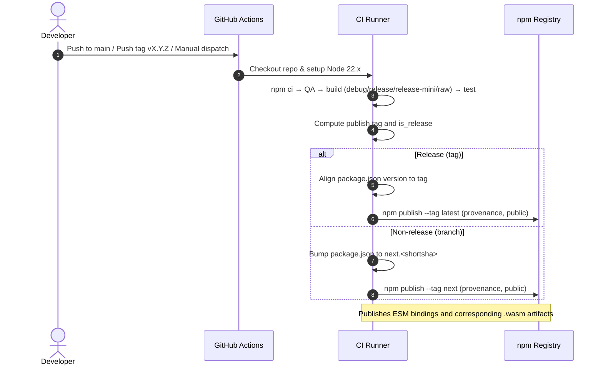

# Publish to NPM

## Pull Request by @tomusdrw


<!-- This is an auto-generated comment: release notes by coderabbit.ai -->
## Summary by CodeRabbit

* **New Features**
  * Multiple distributed builds/entry points added: debug, release, release-mini (minimal runtime), and raw; ESM and raw bindings supported.

* **Documentation**
  * Expanded installation and usage guides, ESM/raw examples, GC notes, and guidance for stable vs next version tags.

* **Chores**
  * Package renamed to @fluffylabs/anan-as.
  * Automated publish workflow to NPM (pushes, tags, manual).
  * Updated ignore rules and packaging metadata for published artifacts.
<!-- end of auto-generated comment: release notes by coderabbit.ai -->


## Comment by @coderabbitai[bot]

<!-- This is an auto-generated comment: summarize by coderabbit.ai -->
<!-- This is an auto-generated comment: failure by coderabbit.ai -->

> [!CAUTION]
> ## Review failed
> 
> The pull request is closed.

<!-- end of auto-generated comment: failure by coderabbit.ai -->

<!-- walkthrough_start -->

## Walkthrough
Adds a GitHub Actions workflow to publish the package to npm, expands README, introduces new AssemblyScript build targets and binding/options changes in asconfig.json, updates package.json name/exports/scripts/files, and adjusts .gitignore/.npmignore and build/.gitignore handling.

## Changes
| Cohort / File(s) | Summary |
| --- | --- |
| **CI: NPM Publish Workflow**<br>` .github/workflows/npm-publish.yml` | New GitHub Actions workflow that runs on pushes to main, version tags, and manual dispatch; sets up Node 22, installs deps, runs QA/build/tests, computes publish tag/is_release, aligns or bumps package.json version, and publishes to npm with provenance and public access. |
| **Docs: README Updates**<br>`README.md` | Added installation and usage instructions (ESM & raw bindings), build/test commands, version tag guidance, and notes for browser/GC usage. |
| **Build Config: AssemblyScript Targets**<br>`asconfig.json` | Added `raw` and `release-mini` targets; set `bindings: "esm"` on debug/release/test targets; enabled `converge` and `noAssert` on release; cleared top-level `options`. |
| **Package Metadata & Exports**<br>`package.json` | Renamed package to `@fluffylabs/anan-as`, added description, added `files` array, updated `asbuild` to include `raw` and `release-mini`, added `asbuild:release-mini` and `asbuild:raw` scripts, and expanded `exports` (./debug, ./release, ./release-mini, ./raw) and corresponding `.wasm` entries. |
| **Ignore Files**<br>`.gitignore`, `.npmignore`, `build/.gitignore` | Added `build/` to `.gitignore`; added `.npmignore` ignoring `./assembly`, `./bin`, `./web`; removed blanket ignore lines from `build/.gitignore` so build artifacts may be tracked. |

## Sequence Diagram(s)


## Estimated code review effort
🎯 3 (Moderate) | ⏱️ ~25 minutes

## Possibly related PRs
- tomusdrw/anan-as#89 — Modifies the same npm-publish workflow and related packaging/build files (package.json, asconfig.json, README); likely a directly related or preceding change.

## Poem
> I thump my paws on fresh release,  
> New tags hop forth with silky ease;  
> WASM and ESM in tidy rows,  
> Tiny builds and debug shows.  
> Carrots cached — publish, please! 🥕

<!-- walkthrough_end -->

<!-- pre_merge_checks_walkthrough_start -->

## Pre-merge checks and finishing touches
<details>
<summary>✅ Passed checks (3 passed)</summary>

|     Check name     | Status   | Explanation                                                                                                                                                                                                                                                                             |
| :----------------: | :------- | :-------------------------------------------------------------------------------------------------------------------------------------------------------------------------------------------------------------------------------------------------------------------------------------- |
|  Description Check | ✅ Passed | Check skipped - CodeRabbit’s high-level summary is enabled.                                                                                                                                                                                                                             |
|     Title Check    | ✅ Passed | The title “Publish to NPM” succinctly captures the primary purpose of the changeset, which centers on adding the GitHub Actions workflow and related updates to enable publishing the package to the NPM registry. It is concise, specific, and directly reflects the main enhancement. |
| Docstring Coverage | ✅ Passed | No functions found in the changes. Docstring coverage check skipped.                                                                                                                                                                                                                    |

</details>

<!-- pre_merge_checks_walkthrough_end -->


---

<details>
<summary>📜 Recent review details</summary>

**Configuration used**: CodeRabbit UI

**Review profile**: CHILL

**Plan**: Pro

<details>
<summary>📥 Commits</summary>

Reviewing files that changed from the base of the PR and between 1533b506d14d854f4e80d4eb59294b57c0876ef9 and 846786c7fc1c925dff9dcc33cae16c8b8e8a532b.

</details>

<details>
<summary>📒 Files selected for processing (6)</summary>

* `.github/workflows/npm-publish.yml` (1 hunks)
* `.gitignore` (1 hunks)
* `.npmignore` (1 hunks)
* `README.md` (2 hunks)
* `build/.gitignore` (0 hunks)
* `package.json` (2 hunks)

</details>

</details>

<!-- tips_start -->

---

Thanks for using [CodeRabbit](https://coderabbit.ai?utm_source=oss&utm_medium=github&utm_campaign=tomusdrw/anan-as&utm_content=89)! It's free for OSS, and your support helps us grow. If you like it, consider giving us a shout-out.

<details>
<summary>❤️ Share</summary>

- [X](https://twitter.com/intent/tweet?text=I%20just%20used%20%40coderabbitai%20for%20my%20code%20review%2C%20and%20it%27s%20fantastic%21%20It%27s%20free%20for%20OSS%20and%20offers%20a%20free%20trial%20for%20the%20proprietary%20code.%20Check%20it%20out%3A&url=https%3A//coderabbit.ai)
- [Mastodon](https://mastodon.social/share?text=I%20just%20used%20%40coderabbitai%20for%20my%20code%20review%2C%20and%20it%27s%20fantastic%21%20It%27s%20free%20for%20OSS%20and%20offers%20a%20free%20trial%20for%20the%20proprietary%20code.%20Check%20it%20out%3A%20https%3A%2F%2Fcoderabbit.ai)
- [Reddit](https://www.reddit.com/submit?title=Great%20tool%20for%20code%20review%20-%20CodeRabbit&text=I%20just%20used%20CodeRabbit%20for%20my%20code%20review%2C%20and%20it%27s%20fantastic%21%20It%27s%20free%20for%20OSS%20and%20offers%20a%20free%20trial%20for%20proprietary%20code.%20Check%20it%20out%3A%20https%3A//coderabbit.ai)
- [LinkedIn](https://www.linkedin.com/sharing/share-offsite/?url=https%3A%2F%2Fcoderabbit.ai&mini=true&title=Great%20tool%20for%20code%20review%20-%20CodeRabbit&summary=I%20just%20used%20CodeRabbit%20for%20my%20code%20review%2C%20and%20it%27s%20fantastic%21%20It%27s%20free%20for%20OSS%20and%20offers%20a%20free%20trial%20for%20proprietary%20code)

</details>

<sub>Comment `@coderabbitai help` to get the list of available commands and usage tips.</sub>

<!-- tips_end -->

<!-- internal state start -->


<!-- DwQgtGAEAqAWCWBnSTIEMB26CuAXA9mAOYCmGJATmriQCaQDG+Ats2bgFyQAOFk+AIwBWJBrngA3EsgEBPRvlqU0AgfFwA6NPEgQAfACgjoCEejqANiS4AFbAItJYkApAByNgLIG32ZgMouAA4ATgMAVQAlABkuWFxcbkQOAHoUonVYew0mZhSCZmxEWgoAdxTMTDA0RBTubAsLFNCIxECXFiKS0oMAZXxsCgYSSAEqDAZYLlxaMAxuZgNoNApSXFHxya5mbQw+3GoirnxuMgNIkgl4ElLKZMgDaJUSC3uDAGEKEmo6dE5IABMAAYAQBWMAARiBkNB0AhIQ4AGYghwARCAFpGfTGcBQMj0fAAMxwBGIZGUNHouTYGH+vH4wlE4ikMnkTCUVFU6i0OmxJigcFQqEwJMIpHIVEpClY7C4VFKkEQfh2FHkcgUHJUak02l0YEMONMBg0GVwWQEKVK+AoAGtCRZ8KVavNmGB6g4nBpZMwLBwDAAiQMGADEwcgAEEAJJkiU/ehK1greRExiwTCkRBGcO0WjINCQADi6gAEvYI2J4PgMMgrbb7Y7IBg0Gx6P67B7EM5XB5PP6OqKdjQePZHJ34BgiOgsD2eGgGDa0KQNDBYCNa3aHQrcBR4ERSBRkFXh53pP2duOADSQKQHytYA5EZCDybjycSABUGk/76vmHoOwwbA0AsSBaCQbhqEmZdI3WIpTzcRQSA0IRkABAENAADyvMgVCsZAXUYOdV1/DB6FOChCWtZhkEmUQbQGXAr3HRADkaK8AEVwyvARsHgCxaBI+gaBYxBoPWJQaAoZhx1Pd1Ry7Rcp3oL4rBqEYWMOe54GJM0Ri+YlhRcRcrwfABeCwfhYpSUEQAB9FTvjaUzt2wEgAG5+F0sokBGMzyAw9Y/xs+yXkckhTMJYC2mXAAxa1IActTECYwLHCIatZ3nRckJQo8b0QO9+10oy3zuO9YvijAqzARK2mSlB1h45gkhcVdrzKo9XHzfz1gfFAJmtbhrWoV9WpGBhBi+WlpWk9ZO2tdY007SAAApdB6jRgHmihcD0SAAEprOwbhaEszKFyXXKsDnJgKDAicLHkUpMgYxgvhGid0EgU0Sti8dgMelLhw7VdkG7LxIGes0eAofApCbCYRiCuT4AYdAGGGRBkCKUbityeopQfDQjAAbQfABdIxQwjCxJJGqswfwMbQNECzJTvQ9iRIDChp2354pRtH2HUa5MwMMAAyDcWjUiABRcMABFPFljRmFoP1A39EMwyjGMKV+BMVWTYlJnTaQsxzX58a+Vdq0kEZmNYizxCPIKimy0D8AmmkDhd+8mblxXldVgSWYOPjRtl3pPGsyI0AVNRSNfer8sKvqiF407EcEr6eL4qkWAAqk0wnEZCVh5hGwWUZeP4/sCIobAsDz/jl3DV4mfHBgLGwJR6BWB3qxcisGcgSi+EbjAMFG8dmbGR02j4IKcI9T6C3efqEtCtSwGk6flwQ1MzcZ4HHDR9kRiUbuVnp6tiYMdu6b9k/iqvtnb85yBud5qUBZHVGv60hFubHwVYSBGFlixeAg4raIS3lcG4X9CTj3+NER0kstbSwlgYGoTAMCEl3MhRAVYNZBmprrcU+t4zKiTPwE2JcMxYgjJbfujZEEHFWCQdYTYWyQH9PKPsTcORGU4bgGsmR+B4BinxEgJlua4GkVYK8xDBjDE8GgbgV4lA8SIDnRO91HyKi4f2fh8d/TEygHFPgxVuZIHEJ9f02jsBED7BwtYv4WGjHHAY+4/ppDMHMeLSAVjmb8O3m0VxKx3GANwrAjAN5SDTEbrIxs+BwxY0oP8FyKSgpoE8fo5OXA/GIACRYyAkZaSw1oNgYYrDyBbiicYsJqk2i73HPAPsUNnAMUUSkmgAVenKIGEMEg6jNH8G4OIaSAAvEg0RLgvGUbAHcGAbTzKkBYK8eCEnWBcMkq8VV0mLyyfshKTcpm7P9HvaBwF/TYR5gtSI5zoG7OyXo7xhS+H+MCZY+KxV/TCVwJE0RHi+5eKThOXx3yynQBOGAKwGyJnPyPqXeg5cWCQAAN7+gKZC/0RTvkAF9+wihIM1XAyZGRiCxYS++TDH4Ug5kVNqb8b7IpTN/Ba/M+CC0AeIcQICoDZjBbytxXCuAAAN5QSs3rgqsBCiBEKrAAcmQBKsVYiJVBPCCdOMp8AEaslU4ogMrXBdx7koMe1w64StxY+AlJT/RaqgDq06UpRWNP+FK8JJBTWdwmBasu1rcyQAldsygiS9muQlVeCVhyMk7SSdGnOtqPmQodQE51zCRX/zRoa0NtUSBtOnjK2e6rPWIBlV0q1LxcySp6TImNob+kKMbbGlRIyxlNolScKZ8BZnrJeN2zsKy1kLIsN28NnDu3xuOd2yeFzu2cp2k8oBbBu12srdq3V7rc0iLWJKwFfr+rd17kG2tobN0Zqddut1vxRVwoRS8Pl6hZD1smRzGV6LK4SuxZu/FXzHWEuPb+4DECoEwILpar4CCFQkGQQtLgng6DwD8BgrERoIJZUusQjApCtbkOjJQyUBsaGqjoSixhQSbBzguiMNgBw3VoC4Dw8aDDfjfr4ZUDA1RECuKZv6AAAvabAyDZAWQELUbjvG+xBSUIgBgO4P2u08f6I5ZKHCyF6Ip+AkzIA2AAGox3HJJXgXDKAaB+ZAbTSmxFcBqC3egVU4NNgcKePJYE/bAX3Vw5As91A0TTLPFa8prKFuLfAQ66oNGnAhZOVwNiMJ2NGqbccHl6mKh05MvMLD7OIEcxwcL1zrIOdrureUZSFbSCy37LgZmrgDEQI9L+5L5DyZq4VNovUBPqf8I9Gzun1iGeM7SSgZnJKWbKb0+4GWCF4XQBQKg8gPO/FHPYycjnJGJDwHmUikAGN5OoPmOb0gymyweTte438/z3r3cusR/ZzVnr4RoFIxq7kvZSIWj75ivs+oiz917AjIYSNul8RAQ04soGagtfIshTjIHYDuaQOcVv0FKDUSuSPRZj3isaq8hac5FfaWU9sZ9FSDEisMaYoM2PHwUI0Jk9tmvXb28VZgigGgkEAJgEyBeVKgonOJGe3NsrHEFTh7nKBcjCuPme7u20UyKfFww7Bx77kNpoy0eCWWWszZUyjlF3f48ru0AgVYsoA0ewyMXgJxMnLdyyzBTtnCqzyw3RpVWBABJhHw3rmmBt6eG/1UzXwJta0t7Rj2tvyIUso3QFjzZB7nWyp7yAPuhMibExJqTCMZOrXq5WIozX/TSZqP6faQSA9zV3E2XAgw6eoqKaV/OfZneDdSQqJ78n0A5hFlWbzGrkArVMaUWTe3mlhQB4dfzD3qRBVSxgMpbhEFt709j6Q9nVPN/4oV/71yx+tm3+Vsx/Z3cp6ulNpXMM7c7Qd33FjiD/Qnb4wtpbm8z84aPGt0aOKyspHfO+P/hoBjo6leL/vnP/oAZ+ChD9o5pAUAbQBoGIj9oHErCrGrD9tEJGO8LLG4L0LLFZudj/MgKyuzEeMdHeurO/pHp/hgPchBKRL8GagGs9r9u9mAUDj6oDn9i0kWvvhwV9iftWrpPABPNIKcBWFINDsQdZBSgjqjp4iAVjpUjjmwSQDosAZjtwYWpoaAZ9sTvvEoYEprBhtgiaCLOlNaNYOhoRnrCRtQomORimKbKXBbpAK6nquYeIJYV8KMHfqNN1IgnAXyuRvPlWDeOti4NIGIv/tZIpjULAGAO+CSpJvgD3EOBBGaEPvkNEbUMkUFCkPEZ2EkYdKUAgJMEgoSEzhsvIF8NUDmGDKuMwB5EQDUGAEwCxGAICsgF8OeBlE3C4aQIgUYFTDrJrmQRlDrpfHrhMZ/PdtyvqkLGbqLEwghOQOBlMnqhfPAtcHBghompAMhmBGhiYVgkYBoC6DXlYfhtrBGERuSPYRTo4cbHHmLBUtuJzpjF9BlpcT4UGlYAoLSLsLjMsiQA7H8bOAkJQNWFwK9jUG0H1rIFeK9onDnK9rcAIAfEzPMbQHUHuuGDYJGK8XSrcQyrMcytMdfOSYbj/AsbysLObkYFVOsQYJApsVKNsTBrsZUYhpAGgj0KcRANgnAV4VcV8DcbYcRnqobLQs4exmLBcBzlIEJFaJAI4OQMgJxiKaaGKdYVAO+EEiAKKX8RAsgkyFwHACMA4JgDaMYrqRRgDFavNrPMVJtmBF8GINaPIKgL0XDHQDnIltwGfOoF/BhMMMpv7CeoGpAMaVVL4cKB3FvEqXQMuDYFyY1s1rqfQKLjtNpHOA9jsPIM5qML5FQPOL8OqEWIxBTlSt1lOMmF5CgBCY3HhOrmMU/EylMSzFSR/BRjifwCbh6EsfyisaAiyWyTchyXAlyYgvBiglwPyRsZObAtBpcNyXObyYuYKfqIaHiHtimGgHgGKA8VsYXLKAlPHE8UbH4RqMoFyDqLyDufyDNOoLZPALmCFLBnQLZBpDtHqAaM+RCKCIiIiAIKCECAAGy0AQgAAstAQQoIMFhIMFJAQQQItAKFYFIQAIIQMFYFAA7AwECEEPhRBfBiEP+buS+bgG+R+TObcLQLZPiP+UAA== -->

<!-- internal state end -->


## Comment by @coderabbitai[bot]

_🛠️ Refactor suggestion_ | _🟠 Major_

**Ensure package.json version matches the Git tag on releases.**

On tag builds you don’t sync package.json to the tag. If the version is stale, npm will publish the wrong version under the latest dist-tag.

Add a step (conditioned on releases) to align the version:


```diff
       - name: Determine publish tag and version
         id: publish-info
         run: |
           if [[ "${{ github.ref }}" == refs/tags/v* ]]; then
             echo "tag=latest" >> $GITHUB_OUTPUT
             echo "is_release=true" >> $GITHUB_OUTPUT
           else
             echo "tag=next" >> $GITHUB_OUTPUT
             echo "is_release=false" >> $GITHUB_OUTPUT
           fi
+
+      - name: Sync version from tag
+        if: steps.publish-info.outputs.is_release == 'true'
+        run: |
+          TAG_VERSION="${GITHUB_REF#refs/tags/v}"
+          CURRENT_VERSION=$(node -p "require('./package.json').version")
+          if [ "$CURRENT_VERSION" != "$TAG_VERSION" ]; then
+            echo "Aligning package.json version ($CURRENT_VERSION) -> $TAG_VERSION"
+            npm version "$TAG_VERSION" --no-git-tag-version
+          fi
```

<!-- suggestion_start -->

<details>
<summary>📝 Committable suggestion</summary>

> ‼️ **IMPORTANT**
> Carefully review the code before committing. Ensure that it accurately replaces the highlighted code, contains no missing lines, and has no issues with indentation. Thoroughly test & benchmark the code to ensure it meets the requirements.

```suggestion
      - name: Determine publish tag and version
        id: publish-info
        run: |
          if [[ "${{ github.ref }}" == refs/tags/v* ]]; then
            echo "tag=latest" >> $GITHUB_OUTPUT
            echo "is_release=true" >> $GITHUB_OUTPUT
          else
            echo "tag=next" >> $GITHUB_OUTPUT
            echo "is_release=false" >> $GITHUB_OUTPUT
          fi

      - name: Sync version from tag
        if: steps.publish-info.outputs.is_release == 'true'
        run: |
          TAG_VERSION="${GITHUB_REF#refs/tags/v}"
          CURRENT_VERSION=$(node -p "require('./package.json').version")
          if [ "$CURRENT_VERSION" != "$TAG_VERSION" ]; then
            echo "Aligning package.json version ($CURRENT_VERSION) -> $TAG_VERSION"
            npm version "$TAG_VERSION" --no-git-tag-version
          fi
```

</details>

<!-- suggestion_end -->

<details>
<summary>🤖 Prompt for AI Agents</summary>

```
.github/workflows/npm-publish.yml around lines 43-53: on tag builds the workflow
currently sets tag=is_release but does not update package.json to match the Git
tag; add a new conditional step (run only when is_release=true or when
github.ref matches refs/tags/v*) that extracts the tag version (strip leading
"v"), and updates package.json to that version (e.g., run npm version <version>
--no-git-tag-version or use jq to set .version), ensuring this step runs before
the npm publish step so the published package version matches the Git tag.
```

</details>

<!-- fingerprinting:phantom:triton:chinchilla -->

<!-- This is an auto-generated comment by CodeRabbit -->


## Comment by @coderabbitai[bot]

_⚠️ Potential issue_ | _🔴 Critical_

**Incorrect export for `./release-mini` (points to release build).**

This will import the wrong build. Map to the release-mini artifacts.


```diff
-    "./release-mini": {
-      "import": "./build/release.js",
-      "types": "./build/release.d.ts"
-    },
+    "./release-mini": {
+      "import": "./build/release-mini.js",
+      "types": "./build/release-mini.d.ts"
+    },
```

<!-- suggestion_start -->

<details>
<summary>📝 Committable suggestion</summary>

> ‼️ **IMPORTANT**
> Carefully review the code before committing. Ensure that it accurately replaces the highlighted code, contains no missing lines, and has no issues with indentation. Thoroughly test & benchmark the code to ensure it meets the requirements.

```suggestion
		"./release-mini": {
			"import": "./build/release-mini.js",
			"types": "./build/release-mini.d.ts"
		},
```

</details>

<!-- suggestion_end -->

<details>
<summary>🤖 Prompt for AI Agents</summary>

```
In package.json around lines 52 to 55, the "./release-mini" export currently
points to the full release build; update the export to point to the release-mini
artifacts instead — change "import" to "./build/release-mini.js" and "types" to
"./build/release-mini.d.ts" so imports of "./release-mini" load the correct mini
build and its type definitions.
```

</details>

<!-- fingerprinting:phantom:triton:chinchilla -->

<!-- This is an auto-generated comment by CodeRabbit -->
