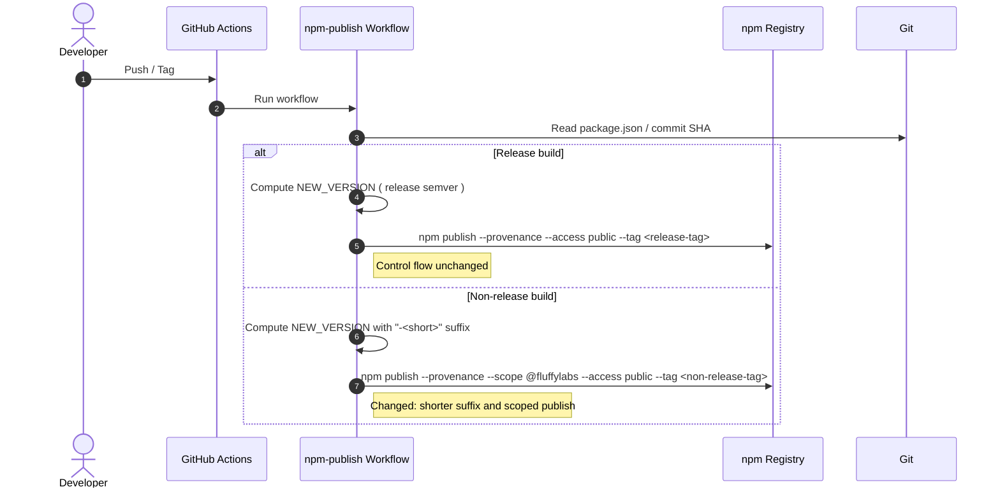

# Fix npm deploy

## Pull Request by @tomusdrw


<!-- This is an auto-generated comment: release notes by coderabbit.ai -->

## Summary by CodeRabbit

* **Chores**
  * Updated npm publishing to use a scoped package namespace for releases.
  * Streamlined non-release versioning to a shorter commit-based suffix for clearer pre-release identification.
  * Maintains existing release vs. non-release behavior with no impact on runtime features.

<!-- end of auto-generated comment: release notes by coderabbit.ai -->


## Comment by @coderabbitai[bot]

<!-- This is an auto-generated comment: summarize by coderabbit.ai -->
<!-- walkthrough_start -->

## Walkthrough
Adjusts npm publish workflow: changes non-release version suffix from "-next.<short>" to "-<short>", and adds the --scope @fluffylabs flag to the npm publish command. Release/non-release control flow remains unchanged.

## Changes
| Cohort / File(s) | Summary of edits |
| --- | --- |
| **CI: npm publish workflow**<br>`.github/workflows/npm-publish.yml` | - Non-release NEW_VERSION now uses "-<short>" instead of "-next.<short>"<br>- Adds `--scope @fluffylabs` to `npm publish` command<br>- Maintains existing release vs non-release branching |

## Sequence Diagram(s)


## Estimated code review effort
🎯 2 (Simple) | ⏱️ ~10 minutes

## Possibly related PRs
- tomusdrw/anan-as#89 — Earlier workflow introducing npm publish; this PR adjusts its non-release versioning and adds scoped publish.

## Poem
> A whisk of tags, a suffix light,  
> I hop through builds by day and night.  
> Scoped and snug, our package flies,  
> Shorter tails, no next surprise.  
> Thump-thump! to npm we ascend—  
> A fluffy publish, signed and send. 🐇📦✨

<!-- walkthrough_end -->


<!-- pre_merge_checks_walkthrough_start -->

## Pre-merge checks and finishing touches
<details>
<summary>❌ Failed checks (1 inconclusive)</summary>

|  Check name | Status         | Explanation                                                                                                                                                                                                                                                                                                                                                                                                                                                                                                        | Resolution                                                                                                                                                                                                                                                                                                         |
| :---------: | :------------- | :----------------------------------------------------------------------------------------------------------------------------------------------------------------------------------------------------------------------------------------------------------------------------------------------------------------------------------------------------------------------------------------------------------------------------------------------------------------------------------------------------------------- | :----------------------------------------------------------------------------------------------------------------------------------------------------------------------------------------------------------------------------------------------------------------------------------------------------------------- |
| Title Check | ❓ Inconclusive | The pull request title "Fix npm deploy" is related to the changeset since the PR does modify npm publishing behavior in the GitHub workflow. However, the title is vague and generic, failing to convey specific information about what was actually fixed or changed. A reviewer scanning the repository history would not understand that this PR specifically adds a scope flag and modifies version suffix logic for non-release builds—the title provides no meaningful detail about the actual changes made. | Consider revising the title to be more specific about the actual changes, such as "Add @fluffylabs scope and update version suffix for npm publishing" or "Update npm publish workflow with scope and version bump logic". This would help future readers understand the specific nature of the fixes at a glance. |

</details>
<details>
<summary>✅ Passed checks (2 passed)</summary>

|     Check name     | Status   | Explanation                                                          |
| :----------------: | :------- | :------------------------------------------------------------------- |
|  Description Check | ✅ Passed | Check skipped - CodeRabbit’s high-level summary is enabled.          |
| Docstring Coverage | ✅ Passed | No functions found in the changes. Docstring coverage check skipped. |

</details>

<!-- pre_merge_checks_walkthrough_end -->

<!-- finishing_touch_checkbox_start -->

<details>
<summary>✨ Finishing touches</summary>

<details>
<summary>🧪 Generate unit tests (beta)</summary>

- [ ] <!-- {"checkboxId": "f47ac10b-58cc-4372-a567-0e02b2c3d479", "radioGroupId": "utg-output-choice-group-unknown_comment_id"} -->   Create PR with unit tests
- [ ] <!-- {"checkboxId": "07f1e7d6-8a8e-4e23-9900-8731c2c87f58", "radioGroupId": "utg-output-choice-group-unknown_comment_id"} -->   Post copyable unit tests in a comment
- [ ] <!-- {"checkboxId": "6ba7b810-9dad-11d1-80b4-00c04fd430c8", "radioGroupId": "utg-output-choice-group-unknown_comment_id"} -->   Commit unit tests in branch `td-scope`

</details>

</details>

<!-- finishing_touch_checkbox_end -->

<!-- tips_start -->

---

Thanks for using [CodeRabbit](https://coderabbit.ai?utm_source=oss&utm_medium=github&utm_campaign=tomusdrw/anan-as&utm_content=90)! It's free for OSS, and your support helps us grow. If you like it, consider giving us a shout-out.

<details>
<summary>❤️ Share</summary>

- [X](https://twitter.com/intent/tweet?text=I%20just%20used%20%40coderabbitai%20for%20my%20code%20review%2C%20and%20it%27s%20fantastic%21%20It%27s%20free%20for%20OSS%20and%20offers%20a%20free%20trial%20for%20the%20proprietary%20code.%20Check%20it%20out%3A&url=https%3A//coderabbit.ai)
- [Mastodon](https://mastodon.social/share?text=I%20just%20used%20%40coderabbitai%20for%20my%20code%20review%2C%20and%20it%27s%20fantastic%21%20It%27s%20free%20for%20OSS%20and%20offers%20a%20free%20trial%20for%20the%20proprietary%20code.%20Check%20it%20out%3A%20https%3A%2F%2Fcoderabbit.ai)
- [Reddit](https://www.reddit.com/submit?title=Great%20tool%20for%20code%20review%20-%20CodeRabbit&text=I%20just%20used%20CodeRabbit%20for%20my%20code%20review%2C%20and%20it%27s%20fantastic%21%20It%27s%20free%20for%20OSS%20and%20offers%20a%20free%20trial%20for%20proprietary%20code.%20Check%20it%20out%3A%20https%3A//coderabbit.ai)
- [LinkedIn](https://www.linkedin.com/sharing/share-offsite/?url=https%3A%2F%2Fcoderabbit.ai&mini=true&title=Great%20tool%20for%20code%20review%20-%20CodeRabbit&summary=I%20just%20used%20CodeRabbit%20for%20my%20code%20review%2C%20and%20it%27s%20fantastic%21%20It%27s%20free%20for%20OSS%20and%20offers%20a%20free%20trial%20for%20proprietary%20code)

</details>

<sub>Comment `@coderabbitai help` to get the list of available commands and usage tips.</sub>

<!-- tips_end -->

<!-- internal state start -->


<!-- DwQgtGAEAqAWCWBnSTIEMB26CuAXA9mAOYCmGJATmriQCaQDG+Ats2bgFyQAOFk+AIwBWJBrngA3EsgEBPRvlqU0AgfFwA6NPEgQAfACgjoCEejqANiS4AxeAA9IGbs0hLuF/LIMA5bMwFKLgBOAAYDAFUAJQAZLlhcXG5EDgB6VKJ1WGwBDSZmVIJmbERaCgB3VMxMMDREVO5sCwtUsMjEIMgikrLygwBlfGwKBhJIASoMBlguXFowRCZuEgNoNApSXHHJ6a5mbQwB3GoSrnxlw6iSCXgScsoUyAMYlRILR4MAYQoSajp0TiQABMoSBAFYwABGUJQsHQEEcIGQjgAZkhAC0jPpjOAoGR6PgAGY4AjEMjKGj0fJsDCA3j8YSicRSGTyJhKKiqdRaHTYkxQOCoVCYEmEUjkKiUhSsdhcKjlSCIfz7CjyOQKDkqNSabS6MCGHGmAwaTK4bICVLlfAUADWhM85XqzmYYEaAgsSFgGlkzAsHAMACIgwYAMQhyAAQQAkmSJX96ErWOt5ETGLBMKREFjIAAhfzcSCeTIMLhXDxoUbIM1jXjXeBDZBSCiIetYJWEwkOSABsDkeyaYCIWDW3B6AOQcpZbtgQfDiij8flWBkaWNcQYIiQHwAUQA6gB9ABq26i/SjAHkfJBCdanPgMGAflY6mMBNh4BZaIgNAYoAAFHIPSHRUaG4LgI1oL90EVJYxntNBNwIJwXB4QDPQAGjTDN4A3a8KBYbtnVQ91PT1Xh8CkDBMFGPUK0rZA3Q9Bg9WOTcNHY8ckIDIjGNIiByMo6ixggRZzjGAABe1sA7WQLBUZAIDo6QGLQ5iIFYyB2I0AMfygT571wfCLGvB1IB+fYcKrZdFTQNhr1vJ9fg6SAJGQDB70fN4nJrahYEQABuO8H0cl8eF8u8FWwbhaD+RsHlbLp8GgocR0oaVmHUMABBfBNpM7RxMHoXih2kSBsAwDkumsxBlgYeBO3+UTlh/IwDAjCwaElVsqyS6s3FEOSuvvZBUxIexuFSgk+F45j2HUW4s18e8VgMbdEHEfYpXZMYfhuO5IBIDsRy4ABZOh4H8QNg1/fVDTxCr+GJNA8DFclJX+alZTMtAFUTFU1TZRRlC5HVeVu/l0vUfd4C/fddtue5aH3db1i2bEDAhgA2YIABYAA4AHYUTQHGGBRPGYuCSEgUxvHMchTG0FCWgCZITH2chQk8bQYnCQYBgWb1A0IepKGYcQOG6zuOh93xIWMdxHgfn3NgNhIfdplEG0JZR+d5YMABvAxIG7JA/yiHNPAYG06H0mVaT/fB1roAMuEJNB3hIdDje7FKmloS38Gt83XevD2Om9k2AyQc8mwoGGlAwUP3c9yPu1oGGonKgARIP+kMnCiEQT5l2t0PDOwL2fYDDPaCzjBzFwKwS618uKErtOa8znPpAYePuHEe8W7Lt3w6rqOPQwG3aCjRAlWkfOKFDoNO7k9bh5tK4lQ6xBQ4AbR9k2jZNk/u0162fFskhl+z3v+8HrAN4DNPT4DFHcBKNuO8Pk+AzG8sqIP2XhvRUNp4DcGWPQPSQMohanUIATAJkAICILAMAVgpDGT+smFAyAyAqCsLQbSL9f7MCBsvco6wMCF2fj/KO1p4CZCohYDel82DLyUIse+rYAw/wAL7EOPqfM+pcbSsOvlwAMjcrCQCfsQqO79P6j1TrQ7s/85KAO4RIuANYmjGR+AAR0rutLolgxgAB0Ax2EcERdwnhZAWJwWZN48ZEpVTGNMDM0gSBbBbFMMYfVzZuHwKVUhGdCTyB4mhIchdxgkHTDcW8OE3GQAAOLqAABI5AnNaO0DoNCQHSfge4TZMJ9XEE3MYqAJAIUrugB64pKDwAYJhd2H4YlISYBgKQ8gaqiHqk0lAGAbwUE2glFQQwthLmoBOOo6AxDYA9hYeQ+V/i3g8RuOg+SIxOL2vcPgixMBUNwn1H4E0WwEFVJABA61rTyCtP7O8WxyochRg9M00yzSoECb0uqnYGCLPkGgSCyA0AwTEiZBCdT6ChP6aVJsLZ7yKjyl2IsAzhlBU8s+Zyb4PxfkACgEZTTFKwojDUq7lIBsEwIXQkTR+rHA/OgAQEzkkVg/h7LCGzkD7CUEQlRAYfiIHwBYPAmjuz6QwC2Sq8NfGIWsuU6RSFAgUutGMH5/TmLjLwCy+Z7L1mZkwkqaY6BkAWIgvQSSwqZJyQEMgJqYxCplWin8Fy8VEXtnyvZPgkSSLRI3A428FiIhOpoMhVwxVYDZNtPaIpE4px2qhS65sCU3zMALKihgFj8mCmQPcz8Vy3gFhpR/H4TigUPDKhVB4xw3nVVquqpwJwS2pj6iskFWxQVEHUaMXlQjuyhPEd2ChFAjlEBob2/loh7ydiIMMAdFdx5CIDPQxhHsWFX2XvK6+fCBF8vPqI9dEjc4MHWvHXC+kmwIWvnI32xwP671mO3Bdr81HVCARInwSUaVTAfsgG8zzBnJL1dIfJR6T0xKYBe0gaYtagPAZAnti7+3kModQ69S744ruYSIsR7Cg5gY3LvPhPsAC6q86i4HNlIgdAY0B42JmCPGhIUQMC5jFPGowSDBBRMEOgYICbBDpmCLm4ImNgjQJjQkpNCSQk4wTHGbMcZAh45zUIkI0A8aBAIHGOMCY8N4XdJW6tVakA1iIiWct9BAA== -->

<!-- internal state end -->


## Comment by @coderabbitai[bot]

_⚠️ Potential issue_ | _🔴 Critical_

**`npm publish` does not support `--scope`; publish will fail**

Scope is derived from `package.json` name (e.g., "@fluffylabs/pkg") or npm config, not a `publish` flag. Remove `--scope` and optionally validate the package is scoped before publishing.

Apply this diff to fix and harden the publish step (also skips if version already exists):

```diff
-      - name: Publish to NPM
-        run: npm publish --provenance --scope @fluffylabs --access public --tag ${{ steps.publish-info.outputs.tag }}
+      - name: Publish to NPM
+        run: |
+          NAME=$(node -p "require('./package.json').name")
+          VERSION=$(node -p "require('./package.json').version")
+          # Optional safety: ensure the package is scoped as expected
+          if [[ "$NAME" != @fluffylabs/* ]]; then
+            echo "Package name '$NAME' is not scoped under @fluffylabs; aborting."
+            exit 1
+          fi
+          # Idempotency: skip if this version is already published
+          if npm view "$NAME@$VERSION" version >/dev/null 2>&1; then
+            echo "Version $NAME@$VERSION already exists on npm; skipping publish."
+            exit 0
+          fi
+          npm publish --provenance --access public --tag ${{ steps.publish-info.outputs.tag }}
```

Tip: You can also move stable flags into package.json: "publishConfig": { "access": "public", "provenance": true }.

<!-- suggestion_start -->

<details>
<summary>📝 Committable suggestion</summary>

> ‼️ **IMPORTANT**
> Carefully review the code before committing. Ensure that it accurately replaces the highlighted code, contains no missing lines, and has no issues with indentation. Thoroughly test & benchmark the code to ensure it meets the requirements.

```suggestion
      - name: Publish to NPM
        run: |
          NAME=$(node -p "require('./package.json').name")
          VERSION=$(node -p "require('./package.json').version")
          # Optional safety: ensure the package is scoped as expected
          if [[ "$NAME" != @fluffylabs/* ]]; then
            echo "Package name '$NAME' is not scoped under @fluffylabs; aborting."
            exit 1
          fi
          # Idempotency: skip if this version is already published
          if npm view "$NAME@$VERSION" version >/dev/null 2>&1; then
            echo "Version $NAME@$VERSION already exists on npm; skipping publish."
            exit 0
          fi
          npm publish --provenance --access public --tag ${{ steps.publish-info.outputs.tag }}
```

</details>

<!-- suggestion_end -->

<details>
<summary>🤖 Prompt for AI Agents</summary>

```
.github/workflows/npm-publish.yml around lines 77-78: the publish step uses the
invalid --scope flag which npm publish does not accept; remove the --scope
argument from the npm publish command, add a pre-publish check that queries npm
(e.g., npm view <package>@${{ steps.publish-info.outputs.version }} --json) and
skips publishing if the version already exists, and optionally validate that the
package name in package.json is scoped to @fluffylabs before attempting publish;
consider moving stable flags to package.json publishConfig (access: public,
provenance: true) instead of passing them on the CLI.
```

</details>

<!-- fingerprinting:phantom:triton:chinchilla -->

<!-- This is an auto-generated comment by CodeRabbit -->
