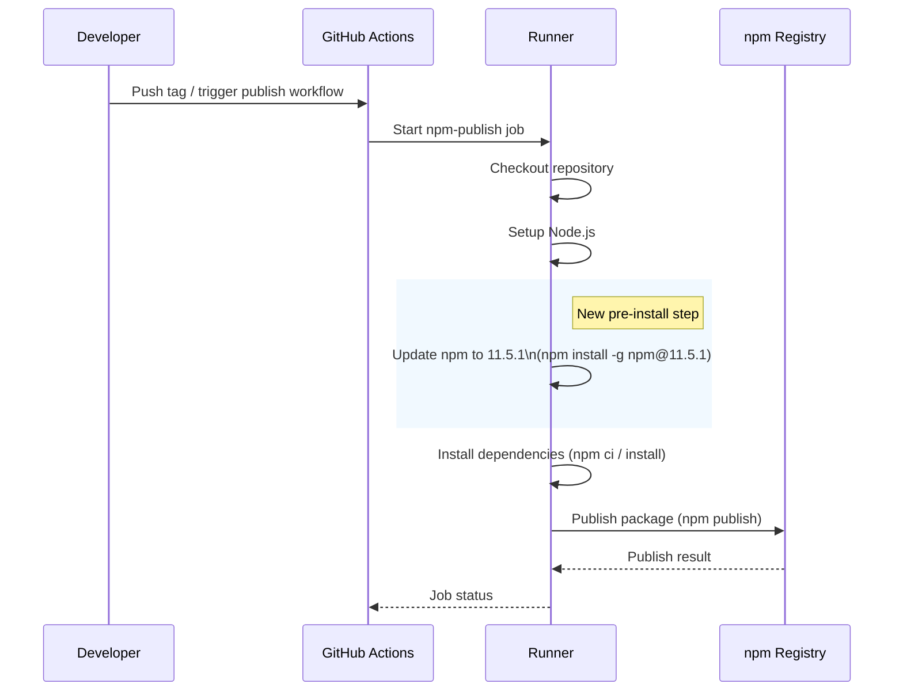

# Update NPM to support trusted publishing

## Pull Request by @tomusdrw

<!-- This is an auto-generated comment: release notes by coderabbit.ai -->
## Summary by CodeRabbit

* **Chores**
  * Publishing workflow updated to standardize the npm version used prior to dependency installation, improving consistency of publish runs.
  * Repository metadata added to package manifest, providing a canonical project URL; no runtime or feature changes expected.
<!-- end of auto-generated comment: release notes by coderabbit.ai -->

## Comment by @coderabbitai[bot]

<!-- This is an auto-generated comment: summarize by coderabbit.ai -->
<!-- walkthrough_start -->

## Walkthrough
Added a global npm update step to the npm publish GitHub Actions workflow and added a `repository` metadata field to `package.json`. No runtime code, exports, or behavior changed.

## Changes
| Cohort / File(s) | Summary |
|---|---|
| **CI workflow: npm publish** `.github/workflows/npm-publish.yml` | Inserted a pre-install step: `npm install -g npm@11.5.1` labeled "Update npm to 11.5.1", executed before the existing "Install dependencies" step. |
| **Metadata: package.json** `package.json` | Added a top-level `repository` field pointing to the project's GitHub URL; no changes to scripts, dependencies, or runtime behavior. |

## Sequence Diagram(s)

## Estimated code review effort
🎯 2 (Simple) | ⏱️ ~10 minutes

## Possibly related PRs
- tomusdrw/anan-as#89 — Modifies `.github/workflows/npm-publish.yml` to add the same global npm update step, indicating overlapping workflow changes.

## Poem
> Thump, thump—my whiskers twitch with cheer,  
> I hop to update npm right here.  
> Before deps install and packages flight,  
> 11.5.1 makes the publish bright.  
> Carrots await after the CI night. 🥕🐇

<!-- walkthrough_end -->

<!-- pre_merge_checks_walkthrough_start -->

## Pre-merge checks and finishing touches

✅ Passed checks (3 passed)

|     Check name     | Status   | Explanation                                                                                                                                                                                                     |
| :----------------: | :------- | :-------------------------------------------------------------------------------------------------------------------------------------------------------------------------------------------------------------- |
|  Description Check | ✅ Passed | Check skipped - CodeRabbit’s high-level summary is enabled.                                                                                                                                                     |
|     Title Check    | ✅ Passed | The title succinctly describes the primary change of updating NPM to enable trusted publishing support, which directly matches the added npm update step; it is clear, specific, and avoids unnecessary detail. |
| Docstring Coverage | ✅ Passed | No functions found in the changes. Docstring coverage check skipped.                                                                                                                                            |

<!-- pre_merge_checks_walkthrough_end -->

<!-- finishing_touch_checkbox_start -->

✨ Finishing touches

🧪 Generate unit tests (beta)

- [ ] <!-- {"checkboxId": "f47ac10b-58cc-4372-a567-0e02b2c3d479", "radioGroupId": "utg-output-choice-group-unknown_comment_id"} -->   Create PR with unit tests
- [ ] <!-- {"checkboxId": "07f1e7d6-8a8e-4e23-9900-8731c2c87f58", "radioGroupId": "utg-output-choice-group-unknown_comment_id"} -->   Post copyable unit tests in a comment
- [ ] <!-- {"checkboxId": "6ba7b810-9dad-11d1-80b4-00c04fd430c8", "radioGroupId": "utg-output-choice-group-unknown_comment_id"} -->   Commit unit tests in branch `td-npm`

<!-- finishing_touch_checkbox_end -->

---

📜 Recent review details

**Configuration used**: CodeRabbit UI

**Review profile**: CHILL

**Plan**: Pro

📥 Commits

Reviewing files that changed from the base of the PR and between 9006f00b2a5a7e759e719b7b1caab3b4f8a12018 and 031e7282a0c1317cb86e8054a1c34ab6e4005090.

📒 Files selected for processing (1)

* `package.json` (1 hunks)

✅ Files skipped from review due to trivial changes (1)

* package.json

<!-- tips_start -->

---

Thanks for using [CodeRabbit](https://coderabbit.ai?utm_source=oss&utm_medium=github&utm_campaign=tomusdrw/anan-as&utm_content=91)! It's free for OSS, and your support helps us grow. If you like it, consider giving us a shout-out.

❤️ Share

- [X](https://twitter.com/intent/tweet?text=I%20just%20used%20%40coderabbitai%20for%20my%20code%20review%2C%20and%20it%27s%20fantastic%21%20It%27s%20free%20for%20OSS%20and%20offers%20a%20free%20trial%20for%20the%20proprietary%20code.%20Check%20it%20out%3A&url=https%3A//coderabbit.ai)
- [Mastodon](https://mastodon.social/share?text=I%20just%20used%20%40coderabbitai%20for%20my%20code%20review%2C%20and%20it%27s%20fantastic%21%20It%27s%20free%20for%20OSS%20and%20offers%20a%20free%20trial%20for%20the%20proprietary%20code.%20Check%20it%20out%3A%20https%3A%2F%2Fcoderabbit.ai)
- [Reddit](https://www.reddit.com/submit?title=Great%20tool%20for%20code%20review%20-%20CodeRabbit&text=I%20just%20used%20CodeRabbit%20for%20my%20code%20review%2C%20and%20it%27s%20fantastic%21%20It%27s%20free%20for%20OSS%20and%20offers%20a%20free%20trial%20for%20proprietary%20code.%20Check%20it%20out%3A%20https%3A//coderabbit.ai)
- [LinkedIn](https://www.linkedin.com/sharing/share-offsite/?url=https%3A%2F%2Fcoderabbit.ai&mini=true&title=Great%20tool%20for%20code%20review%20-%20CodeRabbit&summary=I%20just%20used%20CodeRabbit%20for%20my%20code%20review%2C%20and%20it%27s%20fantastic%21%20It%27s%20free%20for%20OSS%20and%20offers%20a%20free%20trial%20for%20proprietary%20code)

Comment `@coderabbitai help` to get the list of available commands and usage tips.

<!-- tips_end -->

<!-- internal state start -->

<!-- DwQgtGAEAqAWCWBnSTIEMB26CuAXA9mAOYCmGJATmriQCaQDG+Ats2bgFyQAOFk+AIwBWJBrngA3EsgEBPRvlqU0AgfFwA6NPEgQAfACgjoCEejqANiS4BVbrWolIAOQAKAWUgFIibN274FLheFNiINPTc2AIWSAgYRAbO2MwClFwAnACMBjYASgAyXLC4uNyIHAD0lUTqsNEaTMyVBMxhtBQA7pWYmGBoiJVRFhaV2bmI6V4s7V0GAMr42BQMTgJUGAywXLi0YBjczAbQaBSkweuYW1zM2hgLuNRhXPjcZAZ5JBLwJJ2UFZADAUVCQLACDABhCgkRz0ahcABMAAYEQBWMBZJEY1HQZEcADMABYOEiMgAtIz6YzgKBkej4ABmOAIxDIygiClY7C4vH4wlE4ikMnkTCUVFU6i0OipJigcFQqEwzMIpHIVA5TTYGE4kConR8KVuFHkcgUYpUak02l0YEM1NMBg0tVw9QElU6gQA1gyLPhOoMDswwFEYnENLJmBYOAYAERxgwAYgTkAAggBJVlq2EG1ineSMxiwTCkRCU1O0JRwyDkfXhEjcSAxuwOGjVw7TSBZLIaVEaLIxrxF4KhDDIQMoUePEa6Iht5gAAS7Pb7kDSDMCThdThjacnaGnSjeGCUmx+iAHde4ABpIH4W/AEnPIERfQJ9xZ5Lx4IEO4e6WQGHkB9wnfahvwwDQjCMJNUwsGh1XA5BvC3SAlAYCxTjA/BR34JkSAADwCII6H4PgQ1iBhIHYdQzzLZxsJIIwAFFwngW4NUUJxoW+X4qIZdcgi4dw6HgFJY3jAwIDAIxuDQBhPTQUgNCERBsOjOMY0TZN00zdkSN8XNjVwwti2kIwUwrZA0F1et8EQdRAnkNhHhbayGR+Cx6G8WT5MUkhlNUjAbwfXAKEUbAGAfWdrJrHhogongwreIJ5GoQdN1eSArCkCxBzS6EGUoADpHSxL8BEMQAHJkAAcXUAAJaJIHyAoNBcfATISErvBHcQ2B8BgKHgbhcEQG8/2PACzxvAiiNGm8f16ti1hIItvkCNqIWw0L8Fyn0/XQY8qIoMK+CLY9YkfaFbgfW9NnO0haEgqCYJTOD2UQjsULQjCEOw5AC1mwIOR/cj4Eo6jxDMyT2vIZjWPYkjRS4r4fn1Eh+OBrgCj9cTNMk217VpI6CzQPAVTZdUkZYLUdT1HMjRNEVOPFS0pRtQxZU5Zh1AAfXgWhEF57i0boXmQKCDmicgDIkSRAA2Bk5YEBE0FRNAAHYSA11EMm1rIMgEDWBCyBg0BUfEBEJBkAA40CyZEshtqWuaRfEsm1hEbdVpEGCyd2NYYAQbflkgbaRVFCXthgiRUUPCTl1FSSRKWDC5zU+YFoWRd+MW6RdmlEpIXm2DOYutlET0hYl4IqQMABvAxIEbJBXDyAAhX15LoLauW1Vw7IiGMuAZfdJivJvG0QWAlk8zv8Hktvh8gUewRICfm5jJAAHkpBOgWT2X1fx8nmNaAFvJsAwAARBf5lCqLEAhWBK+X0LsHX0/z9oS+MHMXArDP1fjsUIn9N7f1/tfaQg1hriGwkA+SR8x5gMbJdT0dA0yIF8NIe+FBl5xg3qggYuAEGek+L4OC54uAAG1J7N0bs3RhjYK7yWcGgNg+CoGIBgSNcCkBSExkIUwmMIFcBhDfqAoRjCYyzQwhgLCGB8GkJ8J6Yabx6BQC2koPIFp1CAEwCZACAiCwDANlUEDM8woGQGQFQVgnqCLodI5gnF8GdFOBgKKDimGb0CPAWo8iLCkLYRwrgZ9oFDV4dhTSTCAC+UiGHeJjCwz0wSSD4P/lYfhL9EFSM3qI8RICP65MbLI3ocDFGhLgJuSwThfAMEipsAB8glDcKGmkJCL9EpsUsVsUyxk7xgUfG4Tw3gbExE3KEOskR4pxCigafwwMbydAQFsVC8BoRiA/JAdiFcOlODQBWEi44BmtkvAAbhQMEVA6EYQUBvIgN4kV3IMBvJgOEEh8BZzuuQVYWDLFKEePACwGgvGJOhKpCweBwL4NBcI5xShXHuM8cUmMGzsLuSIMsNJI9kEot8f4/cQT2HYsbOIABaTHFxMcQk4RyTUmcIXuEIaj4tp7z8rC6R+SqEhCKY4zepT5HlPwfRFeV8xCfXXFfegt0UK9K6ogNqt8GBMrmUwNlpBCyVxUWougIKUXwpJTGNxFAPEJA5T4oaBLAnZJScS/BtBGUPwSOeSlk8AC6hCYwYXCG3DJhq/ZB3xAwQ2ht5YIiNlkJONsMiEgyKiDWSh8QawyPiVWhJaAa3xHLJQUdUSiAyLQQkqIHY21oAwWgqJS0ZBtgwBkGtCSEk0jE6WvBi6l1ILzZJQt876CAA= -->

<!-- internal state end -->
