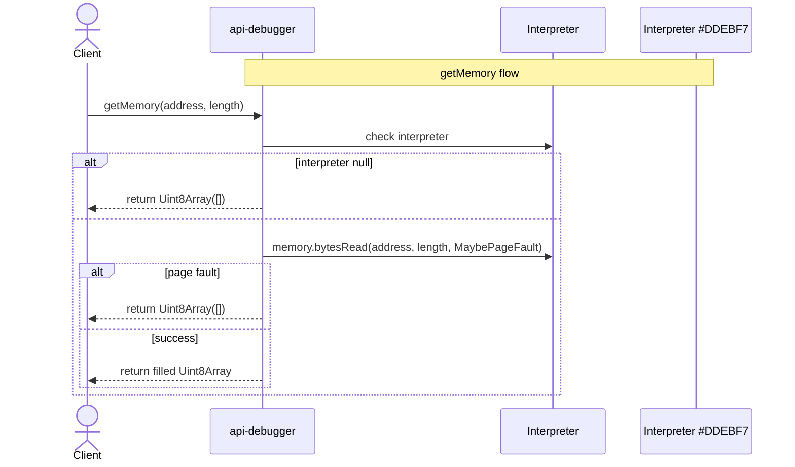
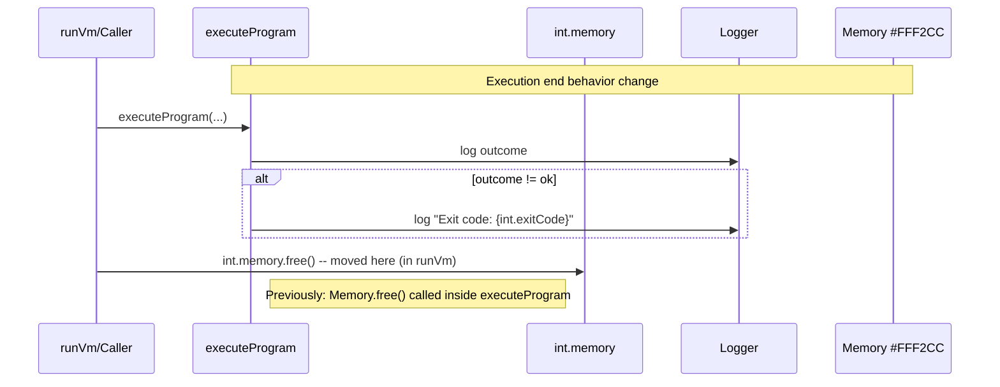

# Added `getMemory` to `api-debugger`

## Pull Request by @DrEverr

deleted `memory.free()` and logging `exit code`

<!-- This is an auto-generated comment: release notes by coderabbit.ai -->
## Summary by CodeRabbit

* **New Features**
  * Added a memory inspection tool to retrieve arbitrary memory ranges as byte arrays.

* **Improvements**
  * Enhanced error logging to include exit codes for failed runs.
  * Adjusted program execution resource handling to change when memory is released.

* **Documentation**
  * README updated to "JAM PVM (64-bit)" with reorganized sections, clearer installation/usage instructions, and updated examples.
<!-- end of auto-generated comment: release notes by coderabbit.ai -->


## Comment by @coderabbitai[bot]

<!-- This is an auto-generated comment: summarize by coderabbit.ai -->
<!-- walkthrough_start -->

## Walkthrough

Added a debugger memory-read API `getMemory(address: u32, length: u32): Uint8Array`. `executeProgram` now logs exit codes for non-ok outcomes and no longer calls explicit memory free at the end. README updated wording, headings, and installation/usage sections; project name changed to "JAM PVM (64-bit)".

## Changes

| Cohort / File(s) | Summary |
|---|---|
| **Debugger API Memory Access** <br> `assembly/api-debugger.ts` | Added exported `getMemory(address: u32, length: u32): Uint8Array`. Returns an empty array if `interpreter` is null or a memory read fault occurs; otherwise fills and returns a buffer via `interpreter.memory.bytesRead` with a `MaybePageFault`. |
| **Internal Execution Logging & Memory Management** <br> `assembly/api-internal.ts` | In `runVm`, memory pages are freed (`int.memory.free()`) after `executeProgram` returns. In `executeProgram`, added logging of the exit code when outcome is non-ok and removed the explicit `int.memory.free()` call at the end. |
| **Documentation / README** <br> `README.md` | Updated project header from "JAM PVM (32bit)" to "JAM PVM (64-bit)"; restructured headings (Todo, Why, Useful where), added Installation and Usage sections, corrected wording/typos, standardized command fence language specifiers, and applied minor formatting/reflow edits. |

## Sequence Diagram(s)





## Estimated code review effort

🎯 3 (Moderate) | ⏱️ ~20 minutes

## Possibly related PRs

- tomusdrw/anan-as#78 — Modifies VM execution flow and memory free placement similarly; likely related to memory free ordering changes.

## Suggested reviewers

- tomusdrw

## Poem

> 🐇 I nibble bytes behind the scenes,  
> I hop through pages, soft and keen.  
> If faults appear I leave a blank,  
> I log a sigh beside the bank.  
> New reads and logs — a tiny scene.

<!-- walkthrough_end -->


<!-- pre_merge_checks_walkthrough_start -->

## Pre-merge checks and finishing touches
<details>
<summary>❌ Failed checks (1 warning)</summary>

|     Check name     | Status     | Explanation                                                                          | Resolution                                                                     |
| :----------------: | :--------- | :----------------------------------------------------------------------------------- | :----------------------------------------------------------------------------- |
| Docstring Coverage | ⚠️ Warning | Docstring coverage is 0.00% which is insufficient. The required threshold is 80.00%. | You can run `@coderabbitai generate docstrings` to improve docstring coverage. |

</details>
<details>
<summary>✅ Passed checks (2 passed)</summary>

|     Check name    | Status   | Explanation                                                                                                                                                                                                                                                                                                                                                                                                                                                                                                                                                                                                                                                                                                                                                             |
| :---------------: | :------- | :---------------------------------------------------------------------------------------------------------------------------------------------------------------------------------------------------------------------------------------------------------------------------------------------------------------------------------------------------------------------------------------------------------------------------------------------------------------------------------------------------------------------------------------------------------------------------------------------------------------------------------------------------------------------------------------------------------------------------------------------------------------------- |
| Description Check | ✅ Passed | Check skipped - CodeRabbit’s high-level summary is enabled.                                                                                                                                                                                                                                                                                                                                                                                                                                                                                                                                                                                                                                                                                                             |
|    Title Check    | ✅ Passed | The title "Added `getMemory` to `api-debugger`" is specific and accurately describes a concrete change in the pull request: the addition of a new exported function `getMemory(address: u32, length: u32): Uint8Array` to `assembly/api-debugger.ts`. The title is clear and non-vague, directly referencing an actual modification present in the changeset. However, the pull request includes other significant changes beyond getMemory, notably memory management refactoring in `assembly/api-internal.ts` (moving `memory.free()` from `executeProgram` to `runVm`) and enhanced logging, along with substantial README documentation updates. The title captures one important aspect of the change but does not encompass the full scope of the modifications. |

</details>

<!-- pre_merge_checks_walkthrough_end -->

<!-- finishing_touch_checkbox_start -->

<details>
<summary>✨ Finishing touches</summary>

- [ ] <!-- {"checkboxId": "7962f53c-55bc-4827-bfbf-6a18da830691"} --> 📝 Generate docstrings
<details>
<summary>🧪 Generate unit tests (beta)</summary>

- [ ] <!-- {"checkboxId": "f47ac10b-58cc-4372-a567-0e02b2c3d479", "radioGroupId": "utg-output-choice-group-unknown_comment_id"} -->   Create PR with unit tests
- [ ] <!-- {"checkboxId": "07f1e7d6-8a8e-4e23-9900-8731c2c87f58", "radioGroupId": "utg-output-choice-group-unknown_comment_id"} -->   Post copyable unit tests in a comment

</details>

</details>

<!-- finishing_touch_checkbox_end -->


---

<details>
<summary>📜 Recent review details</summary>

**Configuration used**: CodeRabbit UI

**Review profile**: CHILL

**Plan**: Pro

<details>
<summary>📥 Commits</summary>

Reviewing files that changed from the base of the PR and between b0e2b2a0b2a62d8896f867752fc9382744bdbc89 and 3086b4396b11fd199e0e0fc2c1bc9ea14643a992.

</details>

<details>
<summary>📒 Files selected for processing (1)</summary>

* `assembly/api-internal.ts` (2 hunks)

</details>

<details>
<summary>🔇 Additional comments (2)</summary><blockquote>

<details>
<summary>assembly/api-internal.ts (2)</summary><blockquote>

`152-152`: **LGTM—useful debugging enhancement.**

Logging the exit code when execution fails provides valuable diagnostic information and is consistent with the other log statements in this block.

---

`78-81`: **Good fix—addresses previous reviewer feedback and is safe.**

Moving `memory.free()` to `runVm` correctly follows the ownership principle: `runVm` creates the `Interpreter`, so it should manage cleanup. The memory state is captured in `output.memory` via `getOutputChunks` (line 185) before the free call, ensuring no data loss. The only external call to `runVm` (in `api-utils.ts:95`) immediately returns the result without accessing memory afterward, so there's no risk of use-after-free.

</blockquote></details>

</blockquote></details>

</details>

<!-- tips_start -->

---

Thanks for using [CodeRabbit](https://coderabbit.ai?utm_source=oss&utm_medium=github&utm_campaign=tomusdrw/anan-as&utm_content=92)! It's free for OSS, and your support helps us grow. If you like it, consider giving us a shout-out.

<details>
<summary>❤️ Share</summary>

- [X](https://twitter.com/intent/tweet?text=I%20just%20used%20%40coderabbitai%20for%20my%20code%20review%2C%20and%20it%27s%20fantastic%21%20It%27s%20free%20for%20OSS%20and%20offers%20a%20free%20trial%20for%20the%20proprietary%20code.%20Check%20it%20out%3A&url=https%3A//coderabbit.ai)
- [Mastodon](https://mastodon.social/share?text=I%20just%20used%20%40coderabbitai%20for%20my%20code%20review%2C%20and%20it%27s%20fantastic%21%20It%27s%20free%20for%20OSS%20and%20offers%20a%20free%20trial%20for%20the%20proprietary%20code.%20Check%20it%20out%3A%20https%3A%2F%2Fcoderabbit.ai)
- [Reddit](https://www.reddit.com/submit?title=Great%20tool%20for%20code%20review%20-%20CodeRabbit&text=I%20just%20used%20CodeRabbit%20for%20my%20code%20review%2C%20and%20it%27s%20fantastic%21%20It%27s%20free%20for%20OSS%20and%20offers%20a%20free%20trial%20for%20proprietary%20code.%20Check%20it%20out%3A%20https%3A//coderabbit.ai)
- [LinkedIn](https://www.linkedin.com/sharing/share-offsite/?url=https%3A%2F%2Fcoderabbit.ai&mini=true&title=Great%20tool%20for%20code%20review%20-%20CodeRabbit&summary=I%20just%20used%20CodeRabbit%20for%20my%20code%20review%2C%20and%20it%27s%20fantastic%21%20It%27s%20free%20for%20OSS%20and%20offers%20a%20free%20trial%20for%20proprietary%20code)

</details>

<sub>Comment `@coderabbitai help` to get the list of available commands and usage tips.</sub>

<!-- tips_end -->

<!-- internal state start -->


<!-- DwQgtGAEAqAWCWBnSTIEMB26CuAXA9mAOYCmGJATmriQCaQDG+Ats2bgFyQAOFk+AIwBWJBrngA3EsgEBPRvlqU0AgfFwA6NPEgQAfACgjoCEYDEZyAAUASpETZWaCrI5Ho6gDYkuAQVpK9AAGpLgAsiTM+C5BkASQQWjc8GBKAthEpBSxkAYAco4ClFwAnABMkLkAqjYAMlywuLjciBwA9G1E6rDYAhpMzG0EzNiItBQA7m2YmGBoiG3c2J6ebeWVBlWIxZAAIhQAolIUfLkAyvjYFAwkkAJUGAywXMzaWLnQzqF3D08vbxszrhqKMuPhuGQNjYSBJ4CQJpRWpAABQYfDkSCeJA0WgASg2tRUJE8SNR6NuWMQOPxuQAwhQSNQ6OhOJAygAGMoAVjAAEZ2XyAGzQXm8jgAZi5HHZJQAWkZdtIGBR4NxxOi3FBFd4cQk2FEXBoAGYMkjI3GxTD0Tz4TLwDBEBIkAAe6gUSiCGiM+mM4CgZHo+CNOAIxDIyl1AzYGFZvH4wlE4ikMnkTCUVFU6i0Oh9JigcFQqEwIcIpHIVEjLGjrKoE3sjleLjuqcUykzmm0ujAhl9pgM822zAEnlk02SqRI6UylA0uFaBgAREuDBZIL4AJJh8tM+gOJxNoOMWCYUiIb1rgLMl3caK6o3YR7qrChCIG2TItABBmIJHYcVlAAaTEyCIXBnkgP8ylxLgqntXAAA5fBONBZA0SB11wSAGVwK4MGQYtIjVeRnCoeR4GDODKF4EgaD4VAMGWTx+D4NBIH1aJ5AZT9ICNNBlkw/AGAYK5EAAbn4MDKAmJBbjdI14BWfCMHobDcPwu5sCNI1KGbFAMAkfAAGt7UdSiKGo2iNHYw05BoRBoW46SwPQSAwhQoorDQUgADE+M8TQYFgW5yDre9H3gdEUHwy96DQI1aMgUJPNIXZHG4NDtnCSIOKwyI3mQB8nhPOgvSMFdLF8fyIwivC4nwOIgsgJQGE8ZxqBq5BD2vW9mWiHheixBhIHYdQ4TPAwoAiMDFHQGKuBCGjXw4j8v2kX9/yA7wHTArhIOgyBYJjRDkNkWJ7UYVqfzaKJaGWEg2nk7wEgHSJh1HJIUjSDIslnRAgiMA4qXgV5KyUXLYXhYatNvLgIloeBHEXZcJr7F6hxHMcUjMjA0E8X63CXBdyrXTcywjZk90beRDyKh1pHPdcsAoB8ADVmCAuKEpdUQ8BIKwKFtKhmAUZhuB1aQgJNEhbms+RuC86RdIYXGsQdPTNFl41TXNO4SCNaJblUigMBMhrDekfivSgRnhudHmaH5wW0HZyAJiCrBJOGk4+vuTAnii4aY0oZlkSQAB5QyA94kkSFxTbbXQLBP3hp9ccxe0fEgBcDldTC00zgBvOCNBddRaVbABfBcrfQrBueEh2BaIIWgM969BrdWXcu8eZblDmMrOyw0pbNXF8WoM3A8DYNPbCsQasgY8ZGlpnsqkWhSvMCqqorDq6sn5rWt39FOuDbqKF1PqlmHeAhpG8R6YmyA0XIAGgZB5l8/BuE6z1/WL9hnQBGzAkZExRmAIwNgDi+F2GEA4VlaAE2XKuDcW5ya7gbM4amwZaannPFUbgtAdw8AFiIMQTUlQqjVAvE0LBICABwCAAUr4MI1gWasORP+NQuBcSAFwCfeTCWFsI4YKAALGAbhfDE70DggLW6NxYpYEZlSFW7VIrbHnuiGu0IxZoAUfYGEygmIaKfIvRk8MHRInoRYVc0BFD4H4YAJMIGG2PsbwoC1jVwAHVYCyAAPxOJcZYHx/j3FBMsFsPWyxXZBQZAEyAzjPEHW2PeJibtg4BPEsnZk9CtgK34VaLOyjgQrDURgBcBjNF4RrgQohlYg4xldtECxjo9ECx/JUp8yBkQkA0EQDQHirAZySN4RA/CmAnETMyeI9ChnkCSGLaQvDxLK2SCU+AAAvMp0ieCwCoIgU2uAERoEMsgc6lI5w7KUIgZUqoum4m0XrDO9B0grBogVZSOk7G0HqoU0YCswAMlarqExe8nKwDYvaPqExmmm0/EIUYuBqxKWtPaU5jyjQ2gRIo3cYs3TbAaTcZA/9cqfhUApdQsggL2hatgFpuVuB7PmKbGwaA6wACF7QtOQNc251DIpwXqiMfyqonqq2kDXIEVpnDww2Z/VsPEyA3ExCebACt7AQgYOROEFBiUC2FmTFUQ0fbzFgGAKksgnrDkEqc/e7db5ugYMwF5NoGC2p6X0gZz9uDCy1UBDAPqsIPg0gpWg/rA3MywAiAQ4bhYqIvviEl2xjhpyjFaRANdGa4DkdgBRbRrxWgpomPeShgQUrVv80gQF0ihsQBzZSdwuVwu4LwfAeigrdIOGcVhnLlImTrZAVlHKm2WKAizREC9PhEEQPicFEFCHEJdM7RZKKUCi1vBmp+YQoV8H/iDcQasjmMltfEMgDgGQKDwtidgnSF4IGUNcXxOzqIEuBKY8Flw87HgdKbeueAF6DkwOIBgm6n6VVomU5A8RPaHzal0/gZ9nQ3gvr1Pg19BqB3EA/caeRyRbzXDvSD+8YOiCPkRrqSGeqBjQwNW+mHRqPygLh1+hNvTdl7P6Bth4+KhkNcQqM7AuC1nrPueQch3Rtm4dmLshg8wi2YOoAA+vAWgiBFMMghtixT8bMI+gMHJkoaB+QlHglpAA7IyXkXIzO8hIKI+CvJ4LshIOKNAaAzMCDM1yEoRpRElCEnZlz8EZP6b9GyEgvJ/MMCNCUQUYiShclEeycUJBDPWbMz5koojeQCAYIKWgqgyiiPFAwWg8EBAhbk3l7LZR4LwVK0af8JRxTOd4uyI0XJRRGlq3ZtrAhiu8U82Z0RlWwuiLKGgRLoi4vea5GUI0gptLsls3l5WLmSjsmW+yeC4peSiNoGUBgvJeKjYgHcZzZQBATfZFdtAgoyhlfgrFo08FBRma8/NhgzX4JlGG6IgQBWGBPdO1AFrr3+viliwILrtBIslBIM59rDBDs5a+5Z6bxW0AlHWHpqrVYlMqbUxpn+dBFMBhByQkgim2AUFIIpp4ohTnaeBBfELBgC4GEqAuJAth2WusMnQcurB2BWHwFSOgC4uDR22ABTnWdECwEuJ4WgfObW2ElzxXGMu5fc8QGHY4KpLzlKl1rkgsuufw1oDYB8uxBJAhVJY2kQU3Ua+zdgM3OvLfW4wB4XA3gneM9d8zD3FuVPe8VDcqhT4A8u5NzHc3WdVYC9oOuH87vED2410uBPC5Lq4Bj4ZaEDh/KIA1wAbTl5UDnlQa9ZwZ26vIzsSBZ4j3y0xBeFwJ9rwuFROFS9cDdyH2vWd24zCfFngv9hjItuZFAcuShWXtkAJgEyAEBEDNd4KQxjMFNlQGQFQ3gN6d8rzXhcN1m9cAXBMZwJsHTH+H1naI8Aug408AXxvbAs+8qjzVImteK5d6QDV7D4Lj16GQf4X5Zy+5PQd6AFc696jBB7u5wEj5IatQ4zj6X5wC3BYZPQAA6C4/ggQCQL4Q8p0+8iQ44X0042QBBAciAmq2qQ0hSeiwkFYxI8g3+8ARQ6kTAjw2EtwuCskHsjUSwKwuUAAjunqyJ7MnKNJFNxs/JDOfHeIVKYgtFlG+CtOMGtLtBtMBNtOBHtDBHBMdKRLEPEIkD+K9BjB9BOFOD9HOJ6IFDgV4LJMgC1IyCxA2i/GABIF5MgU1PAAyGICOLlNpAyI8HCknGIGqkxDdEwdsi+jeudJ7EIZlGhAABL4AIjHCtyiGMSSHSF6S0rXISSxL2DP4mzyTKyNLpG6yyDoj0CkFvj+r4DAhvRsRkFsQzCkDVjhF6IEAO6mRYBWGDhvSYxgDYy4y/SxDIhRCwhqxBCawjzmixC0LCxBB/qNxOzMAWH1RBCRpsxBDjwNpkDfr6I2h2gOgcw2hqxzoOACAqIxjwBpxQIwJwJNSCSODsDbLYALp2RoTYFxBuGMBJA4Tfj8AYjAzIbAiNLzCaoCQzyNRCEaSYQ/KKxoiYRKosDywdKzyFE3Lgi3CHiewJE1GQYaD34gHfj4CeD/rohZ7Am4G3B4nbDLzKyjCySYQMgRFQa/KkpMTyys6kkonfqng0Q7KoAMGiBMFXKUJ3KSBm7DRSAiGXDr4oDon4CYntFglqhXC3AqyVFEDVG3xAZsSKCJHwapGNS2BoTlxXrpgxI0QVGsQGiCG4kMjuwHJSAgl+63A4miwDiHKNRdyvA4x9E3q8mDFP5qzIiyEtrOA3q8DAxYLqw3oCC9yBgiG3C2AUKR6KnoizpK4vI0QJQMjJGNKez4ApriHpGSlEkQhUkoFn6thZ7X7GwmTUnd4hHojyREAGka7S5D7d5P4v64zv5N5Z4sl/414AEn7AHd5gEQEt6CRUjDGQDlwpqkDdmn4IH96a7x4n5c6j4YG/6X624gbZqmxMDbnuGQDsgaCbYACkMSt8EKhYeEmkNRcIA8LhRRwR0yey0giuyuAcTmT57Iz5zZx5WctJ9JmBWcAAmpcGCUzMGkEAAAL5wZjcKdh8Y0BfFXnDF/T7wwkCy+k/LEU3k1nKCkAwUP6tlKDtk35dktljn2gTnO7gFTmX5UXrn9qzmVAVxy4AC6OeeetgreP+jJl+X2tWE2gonIJApm/IXIy25Wys4o/2G2tAXI4oAQ+lZmbmZQgoAOoiDAFmb2ZQJQAg8O8EXI8EZm3WSlyOtASW1Jue8wuAtg0BkBC4E2ysCWJWQkaO3IZlkWpl4oZmyOaAoiFmPm8E42EW8EtASlcUpW1mRCZm7IiWtAzWdAJQtA7IZmgo0WRMIloWZ21E1OlAdOYBam5O+gQAA -->

<!-- internal state end -->


## Comment by @coderabbitai[bot]

_⚠️ Potential issue_ | _🔴 Critical_

**Critical bug: `bytesRead` receives 0 instead of `length`.**

Line 177 passes `0` as the 4th argument to `bytesRead`, meaning zero bytes will be read from memory. This leaves the `result` buffer uninitialized (all zeros), breaking the function's purpose entirely.


Apply this diff to fix the bug:

```diff
-  int.memory.bytesRead(faultRes, address, result, 0);
+  int.memory.bytesRead(faultRes, address, result, length);
```

<!-- suggestion_start -->

<details>
<summary>📝 Committable suggestion</summary>

> ‼️ **IMPORTANT**
> Carefully review the code before committing. Ensure that it accurately replaces the highlighted code, contains no missing lines, and has no issues with indentation. Thoroughly test & benchmark the code to ensure it meets the requirements.

```suggestion
export function getMemory(address: u32, length: u32): Uint8Array {
  if (interpreter === null) {
    return new Uint8Array(0);
  }
  const int = <Interpreter>interpreter;
  const result = new Uint8Array(length);
  const faultRes = new MaybePageFault();
  int.memory.bytesRead(faultRes, address, result, length);
  if (faultRes.isFault) {
    return new Uint8Array(0);
  }
  return result;
}
```

</details>

<!-- suggestion_end -->

<details>
<summary>🤖 Prompt for AI Agents</summary>

```
In assembly/api-debugger.ts around lines 170 to 182, getMemory calls
int.memory.bytesRead with a 4th argument of 0 which causes zero bytes to be
read; change that argument to length so bytesRead reads the requested number of
bytes into the result buffer (ensure the call becomes
int.memory.bytesRead(faultRes, address, result, length) and keep existing fault
handling).
```

</details>

<!-- This is an auto-generated reply by CodeRabbit -->


## Comment by @coderabbitai[bot]

_⚠️ Potential issue_ | _🟡 Minor_

**Typos: “AssemblyScript” and “64-bit”**

Use the canonical project name and hyphenation.

```diff
-Assembly Script implementation of the JAM PVM (64bit).
+AssemblyScript implementation of the JAM PVM (64-bit).
```

<!-- suggestion_start -->

<details>
<summary>📝 Committable suggestion</summary>

> ‼️ **IMPORTANT**
> Carefully review the code before committing. Ensure that it accurately replaces the highlighted code, contains no missing lines, and has no issues with indentation. Thoroughly test & benchmark the code to ensure it meets the requirements.

```suggestion
AssemblyScript implementation of the JAM PVM (64-bit).
```

</details>

<!-- suggestion_end -->

<details>
<summary>🧰 Tools</summary>

<details>
<summary>🪛 LanguageTool</summary>

[grammar] ~3-~3: Ensure spelling is correct
Context: ...y Script implementation of the JAM PVM (64bit).  [Demo](https://todr.me/anan-as)  ## ...

(QB_NEW_EN_ORTHOGRAPHY_ERROR_IDS_1)

</details>

</details>

<details>
<summary>🤖 Prompt for AI Agents</summary>

```
In README.md around line 3, the project description uses incorrect casing and
hyphenation ("Assembly Script" and "64bit"); update the text to the canonical
names by changing "Assembly Script" to "AssemblyScript" and "64bit" to "64-bit"
so the line reads something like "AssemblyScript implementation of the JAM PVM
(64-bit)."
```

</details>

<!-- fingerprinting:phantom:triton:chinchilla -->

<!-- This is an auto-generated comment by CodeRabbit -->

✅ Addressed in commit 9c9d19c


## Comment by @coderabbitai[bot]

_⚠️ Potential issue_ | _🟡 Minor_

**Fix spelling: “Pineapples”**

Minor typo in the bullet.

```diff
-- [Pineaples](https://en.wikipedia.org/wiki/Ananas) are cool.
+- [Pineapples](https://en.wikipedia.org/wiki/Ananas) are cool.
```

<!-- suggestion_start -->

<details>
<summary>📝 Committable suggestion</summary>

> ‼️ **IMPORTANT**
> Carefully review the code before committing. Ensure that it accurately replaces the highlighted code, contains no missing lines, and has no issues with indentation. Thoroughly test & benchmark the code to ensure it meets the requirements.

```suggestion
- [Pineapples](https://en.wikipedia.org/wiki/Ananas) are cool.
```

</details>

<!-- suggestion_end -->

<details>
<summary>🧰 Tools</summary>

<details>
<summary>🪛 LanguageTool</summary>

[grammar] ~16-~16: There might be a mistake here.
Context: .../en.wikipedia.org/wiki/Ananas) are cool. - [JAM](https://graypaper.com/) is promisin...

(QB_NEW_EN)

</details>

</details>

<details>
<summary>🤖 Prompt for AI Agents</summary>

```
In README.md around line 16, the bullet contains a misspelled word "Pineaples";
update the text to "Pineapples" (e.g., change
"[Pineaples](https://en.wikipedia.org/wiki/Ananas) are cool." to
"[Pineapples](https://en.wikipedia.org/wiki/Ananas) are cool.") so the spelling
is corrected while preserving the link and sentence.
```

</details>

<!-- fingerprinting:phantom:triton:chinchilla -->

<!-- This is an auto-generated comment by CodeRabbit -->


## Comment by @tomusdrw

That's incorrect. The last argument is `offset`.


## Comment by @coderabbitai[bot]

<details>
<summary>🧩 Analysis chain</summary>

🏁 Script executed:
```
#!/bin/bash
# Find the definition of the bytesRead method
ast-grep --pattern $'bytesRead($$$) {
  $$$
}'

# Also search for the method signature/declaration
rg -nP 'bytesRead\s*\(' -A 5 -B 2
```

Length of output: 2297

---


</details>

@tomusdrw, you're absolutely right, and I apologize for the incorrect review comment. 

I've now verified the `bytesRead` signature:
```typescript
bytesRead(faultRes: MaybePageFault, address: u32, destination: Uint8Array, destinationOffset: u32): void
```

The last parameter is indeed `destinationOffset`, which specifies where in the destination buffer to start writing. The method reads from memory until the destination buffer is filled (from `destinationOffset` to `destination.length`).

In your code, since `result` is already sized to `length` and you're passing `0` as the offset, the method will correctly read `length` bytes from memory starting at `address` and fill the entire buffer. The implementation is correct as written.

Thank you for the correction!

---

<details>
<summary>🧬 Code Graph Analysis Results</summary>

[assembly/spi.ts: lines 15-78]
```
export function decodeSpi(data: Uint8Array, args: Uint8Array): StandardProgram {
  const argsLength = <u32>args.length;
  if (argsLength > MAX_ARGS_LEN) {
    throw new Error(`Arguments length is too big. Got: ${argsLength}, max: ${MAX_ARGS_LEN}`);
  }

  const decoder = new Decoder(data);

  const roLength = decoder.u24();
  const rwLength = decoder.u24();
  const heapPages = decoder.u16();
  const stackSize = decoder.u24();

  const roMem = decoder.bytes(roLength);
  const rwMem = decoder.bytes(rwLength);

  const codeLength = decoder.u32();
  const code = decoder.bytes(codeLength);
  decoder.finish();

  const program = deblob(code);

  // building memory
  const builder = new MemoryBuilder();

  const heapStart = 2 * SEGMENT_SIZE + alignToSegmentSize(roLength);
  const heapZerosStart = heapStart + alignToPageSize(rwLength);
  const heapZerosLength = heapPages * PAGE_SIZE;
  const heapZerosEnd = heapZerosStart + heapZerosLength;

  const stackLength = alignToPageSize(stackSize);
  // stackLength is bounded to `2**24`, so there is no risk of underflow here.
  const stackStart = STACK_SEGMENT_END - stackLength;

  // readable memory
  if (roLength > 0) {
    builder.setData(Access.Read, SEGMENT_SIZE, roMem);
  }
  if (argsLength > 0) {
    builder.setData(Access.Read, ARGS_SEGMENT_START, args);
  }

  // writable memory
  if (rwLength > 0) {
    builder.setData(Access.Write, heapStart, rwMem);
  }
  if (heapZerosLength > 0) {
    builder.setEmpty(Access.Write, heapZerosStart, heapZerosLength);
  }
  if (stackLength > 0) {
    builder.setEmpty(Access.Write, stackStart, stackLength);
  }

  const memory = builder.build(heapZerosEnd);

  // build registers
  const registers: Registers = new StaticArray(NO_OF_REGISTERS);
  registers[0] = <u64>0xffff_0000;
  registers[1] = <u64>STACK_SEGMENT_END;
  registers[7] = <u64>ARGS_SEGMENT_START;
  registers[8] = <u64>argsLength;

  return new StandardProgram(program, memory, registers);
}
```

[assembly/program.ts: lines 19-25, 28-32, 44-68]
- Summary: Helper utilities for code and metadata extraction, and for reconstructing a Program from encoded form.

- extractCodeAndMetadata(data: Uint8Array): CodeAndMetadata
  - Parameters: data (Uint8Array) containing a blob with metadata length and code.
  - Returns: CodeAndMetadata(code: Uint8Array, metadata: Uint8Array)
  - Behavior: Uses a Decoder to read metadataLength (varU32), then metadata bytes, then the remaining bytes as code. Returns a CodeAndMetadata object.

- liftBytes(data: u8[]): Uint8Array
  - Parameters: data (u8[] or similar)
  - Returns: a new Uint8Array containing the same bytes (copy)
  - Behavior: Copies input into a new Uint8Array.

- deblob(program: Uint8Array): Program
  - Parameters: program (Uint8Array) containing a blob with jump table, mask, code, etc.
  - Returns: Program instance built from rawCode, mask, jumpTable, and basicBlocks.
  - Behavior: Constructs Mask, JumpTable, and BasicBlocks from the encoded form, then returns a new Program(rawCode, mask, jumpTable, basicBlocks).

[assembly/codec.ts: lines 42-47, 66-74]
- Summary: Decoding helpers used by the SPI/program processing.

- u8(): u8
  - Reads a single byte from source, advancing offset by 1.
  - Preconditions: ensureBytes(1)

- u32(): u32
  - Reads 4 bytes and composes a little-endian 32-bit unsigned integer, advancing offset by 4.
  - Preconditions: ensureBytes(4)

- remainingBytes(): Uint8Array
  - Returns the remaining unread bytes as a subarray and advances the offset to the end.

[assembly/api-internal.ts: lines 117-140]
- Summary: Memory construction from pages and chunks.

- buildMemory(builder: MemoryBuilder, pages: InitialPage[], chunks: InitialChunk[]): Memory
  - Parameters:
    - builder: MemoryBuilder
    - pages: InitialPage[]
    - chunks: InitialChunk[]
  - Returns: Memory
  - Behavior: Allocates pages and chunks into memory, tracks sbrkIndex (highest writeable page), then calls builder.build(sbrkIndex) to produce a Memory instance.

[assembly/memory.ts: lines 38-88]
- Summary: MemoryBuilder core page management and allocation.

- setEmpty(access: Access, address: u32, len: u32): MemoryBuilder
  - Parameters: access, address, len
  - Returns: this
  - Behavior: Allocates memory pages across the specified range with the given access, to be zero-initialized.

- setData(access: Access, address: u32, data: Uint8Array): MemoryBuilder
  - Parameters: access, address, data
  - Returns: this
  - Behavior: Writes data into memory across pages, handling page boundaries.

- getOrCreatePageForAddress(access: Access, address: u32): Page
  - Parameters: access, address
  - Returns: Page
  - Behavior: Returns the page for the given address, creating it if needed (allocates from arena); prevents allocation of reserved pages.

- build(sbrkAddress: u32 = RESERVED_MEMORY): Memory
  - Parameters: sbrkAddress
  - Returns: Memory
  - Behavior: Finalizes and returns a Memory instance using collected pages and arena.

</details>


---

<details>
<summary>✏️ Learnings added</summary>

```
Learnt from: tomusdrw
PR: tomusdrw/anan-as#92
File: assembly/api-debugger.ts:170-182
Timestamp: 2025-10-16T15:17:10.841Z
Learning: In assembly/memory.ts, the `bytesRead` method signature is: `bytesRead(faultRes: MaybePageFault, address: u32, destination: Uint8Array, destinationOffset: u32): void`. The last parameter is the offset within the destination buffer to start writing at, not the number of bytes to read. The method reads until the destination buffer is filled from destinationOffset to destination.length.
```

> Note: Learnings are effective only in the context of similar code segments. To apply general coding guidelines, please configure [review instructions](https://docs.coderabbit.ai/guides/review-instructions). You can manage existing learnings in the [app](https://app.coderabbit.ai/learnings).

</details>


<!-- This is an auto-generated reply by CodeRabbit -->


## Comment by @tomusdrw

Why is it removed? Why I agree it shouldn't really be here, since `interpreter` is created externally (so it should be managed externally as well). This function is used only in `runVm`, which creates the interpreter and returns immediately after calling `executeProgram`, so it should clear the memory after the execution.


## Comment by @DrEverr

ok


## Comment by @DrEverr

done. I was also considering adding this to api. but I remember that when we drop the instanciated wasm it will automatically free.
