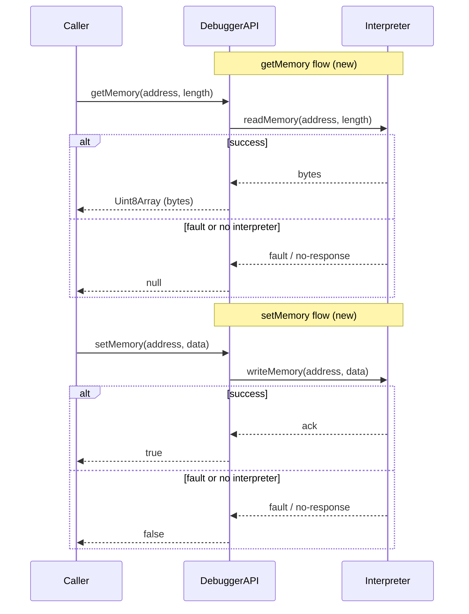

# Improved API - Memory manipulation

## Pull Request by @DrEverr

Added values for memory manipulation that could clearly indicate success or error.

<!-- This is an auto-generated comment: release notes by coderabbit.ai -->
## Summary by CodeRabbit

* **New Features**
  * Debug API now signals faults and missing interpreter state via return values instead of exceptions.

* **Breaking Changes**
  * getMemory(address, length) returns null on failure (missing interpreter or page fault) rather than throwing or returning empty.
  * setMemory(address, data) returns boolean indicating success (true) or failure (false) instead of void.

* **Documentation**
  * Minor inline docs added for getMemory and setMemory.
<!-- end of auto-generated comment: release notes by coderabbit.ai -->


## Comment by @coderabbitai[bot]

<!-- This is an auto-generated comment: summarize by coderabbit.ai -->
<!-- This is an auto-generated comment: review in progress by coderabbit.ai -->

> [!NOTE]
> Currently processing new changes in this PR. This may take a few minutes, please wait...
> 
> <details>
> <summary>📥 Commits</summary>
> 
> Reviewing files that changed from the base of the PR and between 0445a712e8be85e1df92dccce83b9bdf7eccf811 and 6467c05de367d2ace05d74371037e3b69f517784.
> 
> </details>
> 
> <details>
> <summary>📒 Files selected for processing (1)</summary>
> 
> * `assembly/api-debugger.ts` (1 hunks)
> 
> </details>
> 
> ```ascii
>  ________________________________
> < GPU-accelerated bug detection. >
>  --------------------------------
>   \
>    \   \
>         \ /\
>         ( )
>       .( o ).
> ```

<!-- end of auto-generated comment: review in progress by coderabbit.ai -->
<!-- usage_tips_start -->

> [!TIP]
> <details>
> <summary>CodeRabbit can suggest fixes for GitHub Check annotations.</summary>
> 
> Configure `reviews.tools.github-checks` in your project's settings in CodeRabbit to adjust the time to wait for GitHub Checks to complete.
> 
> </details>

<!-- usage_tips_end -->
<!-- walkthrough_start -->

## Walkthrough

The `getMemory` and `setMemory` functions in the debugger API now use explicit return values for fault/error signaling: `getMemory` returns `Uint8Array | null` and `setMemory` returns `boolean`, replacing prior exception/empty-array behavior.

## Changes

| Cohort / File(s) | Summary |
|---|---|
| **Debugger API return type updates** <br> `assembly/api-debugger.ts` | `getMemory(address, length)` return type changed from `Uint8Array` → `Uint8Array \| null`; returns `null` on missing interpreter or page fault. `setMemory(address, data)` return type changed from `void` → `boolean`; returns `false` on missing interpreter or page fault, `true` on success. Doc comments added and fault propagation moved to return values. |

## Sequence Diagram(s)



## Estimated code review effort

🎯 3 (Moderate) | ⏱️ ~20 minutes

- Pay attention to fault handling branches and documentation in `assembly/api-debugger.ts`.
- Verify callers of `getMemory`/`setMemory` handle `null`/`false` appropriately.

## Possibly related PRs

- tomusdrw/anan-as#92: Earlier change that introduced `getMemory` behavior; closely related to the updated return-type and fault semantics here.

## Suggested reviewers

- tomusdrw

## Poem

> 🐰 With quiet hops I test each byte,  
> If faults appear I show the light—  
> Nulls and falses, honest and clear,  
> No hidden empties, none to fear.  
> Debugger tuned, I leap with cheer! 🥕

<!-- walkthrough_end -->

<!-- pre_merge_checks_walkthrough_start -->

## Pre-merge checks and finishing touches
<details>
<summary>❌ Failed checks (1 warning)</summary>

|     Check name     | Status     | Explanation                                                                           | Resolution                                                                     |
| :----------------: | :--------- | :------------------------------------------------------------------------------------ | :----------------------------------------------------------------------------- |
| Docstring Coverage | ⚠️ Warning | Docstring coverage is 50.00% which is insufficient. The required threshold is 80.00%. | You can run `@coderabbitai generate docstrings` to improve docstring coverage. |

</details>
<details>
<summary>✅ Passed checks (2 passed)</summary>

|     Check name    | Status   | Explanation                                                                                                                                                                                                                                                                                                                                                                                                                                                                                                                                                                                                                                                                                                                                                    |
| :---------------: | :------- | :------------------------------------------------------------------------------------------------------------------------------------------------------------------------------------------------------------------------------------------------------------------------------------------------------------------------------------------------------------------------------------------------------------------------------------------------------------------------------------------------------------------------------------------------------------------------------------------------------------------------------------------------------------------------------------------------------------------------------------------------------------- |
| Description Check | ✅ Passed | Check skipped - CodeRabbit’s high-level summary is enabled.                                                                                                                                                                                                                                                                                                                                                                                                                                                                                                                                                                                                                                                                                                    |
|    Title Check    | ✅ Passed | The title "Improved API - Memory manipulation" is partially related to the changeset. It correctly identifies that the changes involve memory manipulation functions, specifically the `getMemory` and `setMemory` functions in the API. However, the title lacks specificity about the main improvement—that these functions now return values (null and boolean respectively) to clearly indicate success or error instead of throwing exceptions or returning empty arrays. While the title accurately points to the relevant feature area, it doesn't fully convey the nature of the improvement, which means someone quickly scanning the commit history would understand what area was changed but not understand the key improvement or why it matters. |

</details>

<!-- pre_merge_checks_walkthrough_end -->

<!-- tips_start -->

---

Thanks for using [CodeRabbit](https://coderabbit.ai?utm_source=oss&utm_medium=github&utm_campaign=tomusdrw/anan-as&utm_content=98)! It's free for OSS, and your support helps us grow. If you like it, consider giving us a shout-out.

<details>
<summary>❤️ Share</summary>

- [X](https://twitter.com/intent/tweet?text=I%20just%20used%20%40coderabbitai%20for%20my%20code%20review%2C%20and%20it%27s%20fantastic%21%20It%27s%20free%20for%20OSS%20and%20offers%20a%20free%20trial%20for%20the%20proprietary%20code.%20Check%20it%20out%3A&url=https%3A//coderabbit.ai)
- [Mastodon](https://mastodon.social/share?text=I%20just%20used%20%40coderabbitai%20for%20my%20code%20review%2C%20and%20it%27s%20fantastic%21%20It%27s%20free%20for%20OSS%20and%20offers%20a%20free%20trial%20for%20the%20proprietary%20code.%20Check%20it%20out%3A%20https%3A%2F%2Fcoderabbit.ai)
- [Reddit](https://www.reddit.com/submit?title=Great%20tool%20for%20code%20review%20-%20CodeRabbit&text=I%20just%20used%20CodeRabbit%20for%20my%20code%20review%2C%20and%20it%27s%20fantastic%21%20It%27s%20free%20for%20OSS%20and%20offers%20a%20free%20trial%20for%20proprietary%20code.%20Check%20it%20out%3A%20https%3A//coderabbit.ai)
- [LinkedIn](https://www.linkedin.com/sharing/share-offsite/?url=https%3A%2F%2Fcoderabbit.ai&mini=true&title=Great%20tool%20for%20code%20review%20-%20CodeRabbit&summary=I%20just%20used%20CodeRabbit%20for%20my%20code%20review%2C%20and%20it%27s%20fantastic%21%20It%27s%20free%20for%20OSS%20and%20offers%20a%20free%20trial%20for%20proprietary%20code)

</details>

<sub>Comment `@coderabbitai help` to get the list of available commands and usage tips.</sub>

<!-- tips_end -->

<!-- internal state start -->


<!-- DwQgtGAEAqAWCWBnSTIEMB26CuAXA9mAOYCmGJATmriQCaQDG+Ats2bgFyQAOFk+AIwBWJBrngA3EsgEBPRvlqU0AgfFwA6NPEgQAfACgjoCEYDEZyAAUASpETZWaCrKNRo6gDYkuASWa8+FL0AIJWvrqQALIkzPgukMyY8NzYntTw+FiQBlAAco4ClFwAnAAckDlQAKo2ADJcsLi43IgcAPTtROqw2AIaTMztBMzYiLQUAO7tmJhgaIjtqZ6e7eWVuZAheLDxXAAiFACiUhR8VZAAyvjYFAwkkAJUGAywXEnw2ZvQzqS4j89Xu9tF8oJdcNQxlx8NwyBsoDYSBJ4CRJpQ2pAABQYLIPTxIGi0ACU8MgdRUJE8GOxuMg+MQhJJFwAwhQSNQ6OhOJAAEwABh5AFYwABGPlgHkAZmgIoA7BwACzynklABaGwM+2kDAoKXEWS4cAetnQtFoyAkaE82GkkAAZvFErF4vIkhgUmkMllILhYNRGJhGN5nJ55J9aPAGBz7NgGPdEMhHZQKPENOZLMyWGwMLhkA4nC43JBDidk1wQogANacyaweS+ygPZwPN3yQbMdSJrAN6x2TEAIlgrAANJBa2HIH6pPZ8IlMG2s53IBwGP2iRpSSMxhNJlxEYhuFklPRff71OhuLDnMh20u0WzTcf+Fg0ADMK8fX7/pMFuhPGy0FoV1KFIWgN0ubAiFIBlOQIRhYGTWQwG4SNK0/B5yEmMA7WwF59QwK11AXVglyyODX0wt8XlgdAMHoB07hIZCxhouC2QIth0MYW52P+J531gUdHQZZx/go1FezTXIwEMAwTCgMh6HwO0cAIYgyGUQkFFYdguF4fhhFEcQpBkBclCoVR1C0HR9Dk8B3AQZBUEDNA8EIUhyCoLT210yAqEmGMC3kOQFHMlQ1E0bRdBkow7NMAwFkQWIBFDGYULAJQBEg0gKA0XMOAMfsioMCwtl8dTPI5eh8ySBJlPgzBoKLP4YjiBI2VwW5u1kWEx3gJRyHolNmEgapPlwMoQjONB61nMac0m6b5AAH0gDA0k8ABuPySE6igMGQdaVjHBCsHGyheF2ygUGQFQkpzfg+Ffbg0FIe1XM8f58DjW5EFHT4YMA/gVI6rrPiIWjIFibhcHkZwqFkNMoBa50EmTR0Xt9SdMFofEMAh7BuFoKq9LZZEbkQUMdr2wbIeh2HRvGxaEefd60lzbacQC0H9sOjakfsXbWpdamup9HqHleRrOTtYbIAkfB+p9WcBHwfBgwwbaeYO96qQeWs4XOihLpoPhnIEe7cCEvgDZfHhXoeO0Pq+n6KGQWhbnBsddRoLXdq65BcAoG10DtU2YzjaREBwzxvfUW1MUu8mxip89fTZALvSd9n102EIzU5EgAA9uHSAiCASWhvu07Nc3tR1VaxlG2rhujBdwYXK+1XU1Hxx4SCnTInrb7PPsFt1xAYRABczHMU1ju1PHwALAKEMYtLgwIXqIaNR/+Jg6PUTIdeRV9tflq0bScg6aCB+ri/uGHj+n9MLhiX1FHseAiHL24HkJ4mhIuAAANi6HgoP8HCeFj6QGbi6TEgEJhRy4NgSUPJRzeHxr6FBaCiRcHmhNKaCNgGQEAEmEkBQEl3iJA3CYgYFwJcAgs0bIEw4PQXSMgRBsGQFQTyPBjMFpEJmpAVaR1PAkM+PaeA3gKGJWSqlNA6VMrZUoHlRAwDNjv12NVb+v8HwAJJhQsB1D7S0Pwu3TusgmFINYTwtBo5AFoHwUzIRsh+EK36iQ8hlDwE0Ogd6JKHdUZWMQSwjEvCHHUCcQIwhS1+Gq3VuyDAEisB2mkQ8YBcjmApVkGleAGUSBZSgqo3MGiDBHAZPAJI3lFAPDJiiAKJA7QMW5DECMjhYolUsFqBgSBj6FWKtJWS8koZt3qq5NSHlNKch8jmLg/lAq1WCmZZQllIo2RiiM28uAAD6/VEA7PqaiOgOyRIQOisM+ykAABsJQBBoOuQqWgUYSh8jKFGBgJQ7TXIEGUPkgpZQ8jQAwHkAgSgkC+UCu0tBJT3IuXFKAfIFQKkFGgWUIoeQkDKEUMogoSAiloHaEoPJnmRzKLCu5hLZSiAYHaMoIoRTwoRTXdQezzSHKRA0k5il4UjMujstgFBSA7NeKISsByzn/FsgYAA3gYSo/YkC2AAEJLwYNWWgmYdI5isPgGCtB+xcCdnrYc8rID9kQLsNItBVXfUrLYQ1uskqmoVUgAA8qcXUBcMCOuNc6s1/YIy0BsLhfY31wS6nxogZkCF1WOqDjaF15qg0howB4XA3gY1ivjcHEgSbA39VTVqRAOo9THyzXGo1Vp/UKrxhq3wCYr4RsdUVfN6QGQVsrPudmiBHUAG0zWVDlZUEd5rRXqryGgNgLbi2lqft6Tt/Yk2jotRCTqvauAJrzYOkd/YwFly9D6rg/ZO32ErCkWE9AoCZiUDYcK6hACYBMgBARBYBgG8FIWONVnBhmQGQFQ3gwJLp3QquISgW0/n2uDYDo6FXxG/p8K0nbJ3TuPUoEtup50+p3QAX2XZAYdsH+zjsrChkgLb00yMXfhhVIl105sTSB81+7Zj4QowhH0XgHgAB1+z+ECMELY4RIiWLnO6ZYh7eM3XthA+AVoqZsnSBvWcPYpb42kLtDcvh97xDZGIVOA1xBpNtKef4qm/TqevgrTw042AtzEx6JTMCoF0KyH9ewsJelpKjCsesHHgEMNkCQnGFDAmWJIS5/C18uJhF8BuAAEsvJElBRw9nEBmvEwLxUedEPAbzRF0CqzwFxD4Z0AgpikLXQAKASmfQklUx/idZc1FvtC+1oE5iNovQBJGsdoHiMpISkbjlZBnZBQVOh8ow0AjvGRMfB0ZmxvuyJSKl07Ly9g/EgWG5stfdH3emcMlrT0gAAdQQDItLXH0Cuw5FTQ841A4qY44ppEmBIHsj2k2AC/1/hV2kBgAA5DQ3zCgMBSD8xhSED56o9iqQJ2I7BRy1kjDRNgmA8wsBILSAAjtgVCVMS2YD2xDVTi5/iOQrvISYNxPD0FwuZESbdaz+mbK+H8N4LOgUeMVnE/x6foghG3Hs1YwzlaCAjh6jpxwoH+NU0208YNEZYerPAx8KOzgZOxLhp0uLpe8KOA+iB+rXSSOevu542oPH615yMhWbhmY48CzqVoUBi8q4jiONFfy8fzvQc+lp2uPadPZ2L9d5tnEdOGSMkn+yPUgLx6oRNox2ZFm6Rzh6GuuZ1mxf2rWHCRwTO0BbKBJvUHiIgKTcEijNGuu2XC0fpu1fM9LaTKh7eu4ExtiPfALO4y9klCekZkBeQQnwU8WA14MlgRpKgsc4cVYl7mDQiuV1gfI8eyDxOV+7r01kNJRA/6+urdu2D5r4PdAIp4ZDU71/mr1+R3D+HCMrpI2Rmd31Nde0zKcB22/aNrrGCPxNSYz3RLgPTY2PTDSniDi9iYB/zelQEFD5A0D5D5AAFIToUdpMAZsBmlIwUQcwNwjQdpcd4A2QTxYAWFdhadpM/kUD0Dl8aNzVldrQIDzUABNG4AMLAYOLAYBAAASYDCjWSiimS8geCrmgMjSIHURG3n3F0gEkM/z7jgOUFIEYJALXwg2cC3yYP7HP0Qyv1jVIxvxbSUJgKjX7FwzNQAF020FhcBbBZ1MM2D+weQFRrkRRJQ0BXlVABA+Rmk0EUUygYVZRJQSgRQSB2QflrlZQFQ6VClUDZQ0AkCUjPlZQwU+QRQShJQ+RHksjVAGBCVFd+x21HCbBKNb9+xMjPk7QoU0U0A/lkiCjQU3laAvlaA+R7gVQ7lwUoxBQnkvkGBrlaBZQygVBUVJQxjaBrk6AIjGjJQSjzDpDv81CSBfAcxKBL9wQORHVn9zUskck8kCkikco1E9iQCCAIRPAAAxMxZ+R1BUPQyLZ+E7HoKA5QmQx1HkawyoHDAwf45lflQVYVEjA5HlfQIAA -->

<!-- internal state end -->


## Comment by @DrEverr

hmm, why i have so many commits :c


## Comment by @tomusdrw

> hmm, why i have so many commits :c

Seems that you've added some commits on a branch that was already merged. Please cherry-pick the commits that add new functionality onto a new branch and force push to rename this one or just start a new pr.


## Comment by @coderabbitai[bot]

_⚠️ Potential issue_ | _🔴 Critical_

<details>
<summary>🧩 Analysis chain</summary>

**Partial writes possible on page fault.**

The function now returns `false` on page fault, which is good for error signaling. However, the loop writes bytes sequentially and returns immediately on the first fault. This means some bytes before the fault may have been successfully written to memory, but the caller receives `false` with no indication of how many bytes were written.


Consider whether partial writes are acceptable for your use case. If atomicity or precise error recovery is needed, you may need to:
1. Return the number of bytes written instead of a boolean
2. Implement a transaction-like mechanism to rollback partial writes
3. Pre-validate all memory locations before writing

Please verify that all callers of `setMemory` are updated to handle the boolean return value:

---

🏁 Script executed:

```shell
#!/bin/bash
# Description: Find all callers of setMemory to verify they handle the new return value

# Search for setMemory calls
rg -nP --type=ts -C3 '\bsetMemory\s*\(' -g '!assembly/api-debugger.ts'
```

Length of output: 0

---

```

---

🏁 Script executed:

```shell
#!/bin/bash
# Verify setMemory exists and check its export status
rg -nP --type=ts 'export\s+function\s+setMemory' assembly/api-debugger.ts
```

Length of output: 72

---

🏁 Script executed:

```shell
#!/bin/bash
# Check for any references to setMemory (broader search, including comments/docs)
rg -nP --type=ts 'setMemory' | head -20
```

Length of output: 97

---

🏁 Script executed:

```shell
#!/bin/bash
# Look for similar debugger API functions to understand usage pattern
rg -nP --type=ts 'export\s+function\s+' assembly/api-debugger.ts | head -10
```

Length of output: 598

---

🏁 Script executed:

```shell
#!/bin/bash
# Check if api-debugger.ts is built/exported to JavaScript or WASM
fd -e ts -e js assembly | grep -E '(index|export|api)' | head -20
```

Length of output: 0

---

🏁 Script executed:

```shell
#!/bin/bash
# Find TypeScript configuration and build setup
fd -E node_modules -type f -name 'tsconfig*.json' -o -name 'package.json' -o -name 'webpack*.js' -o -name 'build*'
```

Length of output: 170

---

🏁 Script executed:

```shell
#!/bin/bash
# Search for JavaScript files that might call setMemory (potential test or binding)
fd -type f -name '*.js' | head -20
```

Length of output: 170

---

🏁 Script executed:

```shell
#!/bin/bash
# Look at the project structure
ls -la
```

Length of output: 1020

---

🏁 Script executed:

```shell
#!/bin/bash
# Check if there are memory-related tests or integration files
rg -nP '(test|spec|\.test|\.spec)' --type=ts -l | head -10
```

Length of output: 185

---

🏁 Script executed:

```shell
#!/bin/bash
# Look at memory.ts to understand bytesWrite and atomicity patterns
fd -name 'memory.ts' --exec cat {}
```

Length of output: 230

---

🏁 Script executed:

```shell
#!/bin/bash
# Find and examine memory.ts file
find . -name 'memory.ts' -type f
```

Length of output: 20

---

🏁 Script executed:

```shell
#!/bin/bash
# Look at memory.ts around line 335 (bytesWrite method)
cat assembly/memory.ts | head -350 | tail -50
```

Length of output: 1654

---

🏁 Script executed:

```shell
#!/bin/bash
# Check memory.test.ts for setMemory or atomicity tests
cat assembly/memory.test.ts
```

Length of output: 4464

---

🏁 Script executed:

```shell
#!/bin/bash
# Look for setMemory usage in bin tests
grep -rn 'setMemory' bin/
```

Length of output: 0

---

🏁 Script executed:

```shell
#!/bin/bash
# Search for setMemory in the entire project including JS
grep -rn 'setMemory' --include='*.ts' --include='*.js' .
```

Length of output: 99

---


</details>

**Ensure atomic memory writes; implement pre-validation or rollback to prevent partial writes on page fault.**

The function writes bytes one-by-one and returns `false` on first page fault. This allows partial writes before the fault is detected—earlier bytes are already modified in memory while the caller receives only `false` with no indication of how many bytes succeeded or failed.

For atomicity, implement one of:
1. Pre-validate all target memory pages before writing any bytes
2. Track bytes written and provide rollback mechanism
3. Collect all writes and apply atomically only after all pages validate

Current approach violates atomicity expectations and prevents proper error recovery.

<!-- This is an auto-generated reply by CodeRabbit -->


## Comment by @tomusdrw

```suggestion
/** 
  * Read a chunk of memory at `[address, address + length)`.
  *
  * Returns the requested memory chunk or `null` if reading triggered a page fault.
  */ 
export function getMemory(address: u32, length: u32): Uint8Array | null {
```


## Comment by @tomusdrw

```suggestion
/**
 * Write given `data` under memory indices `[address, address + data.length)`.
 * 
 * Returns `true` if the write was successful and `false` if page fault has been triggered.
 */ 
export function setMemory(address: u32, data: Uint8Array): boolean {
```


## Comment by @tomusdrw

Valid suggestion and it's logged at #51 already. However this get's more important since we want to integrate `anan-as` into `typeberry.


## Comment by @coderabbitai[bot]

<details>
<summary>🧩 Analysis chain</summary>

🏁 Script executed:
```
#!/bin/bash
# Fetch details of issue #51
gh issue view 51 --json title,body,url,state,labels
```

Length of output: 1563

---


</details>

@tomusdrw, thank you for the context! I can see that [issue #51](https://github.com/tomusdrw/anan-as/issues/51) tracks the atomic write concern comprehensively. It's good to know this is on your radar, and I appreciate the heads-up about the typeberry integration making this more critical.

The same atomicity consideration applies to both the `bytesWrite` method in `memory.ts` (tracked in #51) and this `setMemory` implementation in `api-debugger.ts`. If you need any assistance when tackling this for the typeberry integration, feel free to ping me!

---

<details>
<summary>🧠 Learnings used</summary>

```
Learnt from: tomusdrw
PR: tomusdrw/anan-as#92
File: assembly/api-debugger.ts:170-182
Timestamp: 2025-10-16T15:17:10.864Z
Learning: In assembly/memory.ts, the `bytesRead` method signature is: `bytesRead(faultRes: MaybePageFault, address: u32, destination: Uint8Array, destinationOffset: u32): void`. The last parameter is the offset within the destination buffer to start writing at, not the number of bytes to read. The method reads until the destination buffer is filled from destinationOffset to destination.length.
```

---

```
Learnt from: tomusdrw
PR: tomusdrw/anan-as#49
File: assembly/memory.ts:335-335
Timestamp: 2025-04-22T15:58:24.284Z
Learning: In the bytesWrite method, memory writes should be atomic. If a page fault occurs during a multi-page write, no memory should be altered (current implementation allows partial writes).
```

---

```
Learnt from: tomusdrw
PR: tomusdrw/anan-as#49
File: assembly/memory.ts:335-335
Timestamp: 2025-04-22T15:58:24.284Z
Learning: In the bytesWrite method, memory writes should be atomic. If a page fault occurs during a multi-page write, no memory should be altered (current implementation allows partial writes).
```

</details>


<!-- This is an auto-generated reply by CodeRabbit -->


## Comment by @coderabbitai[bot]

_⚠️ Potential issue_ | _🔴 Critical_

**Fix Prettier formatting to pass CI checks.**

The Prettier formatting check is failing on these lines. Run `prettier --write assembly/api-debugger.ts` (or your project's formatting command) to auto-fix the formatting issues.

<details>
<summary>🤖 Prompt for AI Agents</summary>

```
In assembly/api-debugger.ts around lines 170 to 175 the file header/comment and
function signature are misformatted causing Prettier CI failures; run your
project's formatter (e.g. prettier --write assembly/api-debugger.ts) or your
repo's formatting command to reformat the file, save the changes, verify no
lint/format errors remain, and commit the formatted file so CI passes.
```

</details>

<!-- This is an auto-generated comment by CodeRabbit -->

✅ Addressed in commit 6467c05
